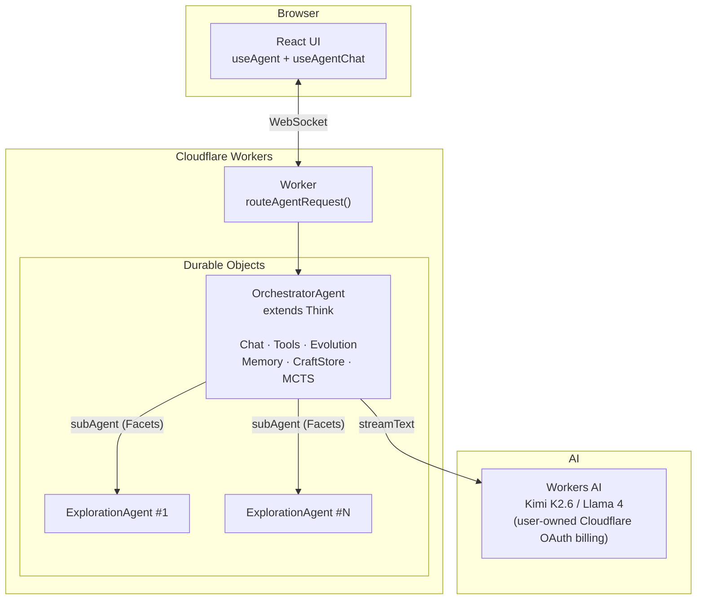

# Proteus

A self-evolving AI agent that improves itself through Monte Carlo Tree Search, learns reusable tool patterns, and rewrites its own execution logic. I built it on Cloudflare's [Think](https://github.com/cloudflare/agents) framework with Durable Objects for persistent state and formally verified safety properties in Lean 4.

> Docs in this repo are edited & maintained by Claude and presented as-is; verify against the code when precision matters.

**Live:** [proteus.ashishkumarsingh.com](https://proteus.ashishkumarsingh.com)

## Architecture



## Key Features

- **MCTS parallel exploration** — UCT selection, backpropagation, pruning, convergence. Each branch is an isolated Durable Object via Facets.
- **3-timescale evolution** — turn-level (quality → reflection), session-level (pattern consolidation → scaffold mutation), lifetime (full MCTS exploration)
- **CraftStore** — learns reusable tools from conversations. EMA scoring with time decay. FTS5-indexed for search.
- **Mutable scaffold** — the agent's agentic loop is code it can rewrite, validated through 4 structural gates
- **POSIX shell emulator** — 16 commands (ls, grep, find, sed, cat, etc.) over virtual filesystem. No real OS needed on Workers.
- **Web search & fetch** — `web_search` and `web_fetch` are built in and work with zero keys (DuckDuckGo search + Cloudflare's markdown service); add a Tavily key for ranked, answer-augmented search.
- **Formally verified** — 75 Lean 4 theorems across 6 categories (Safety, MCTS, Evolution, Agent, Storage, Execution) covering capability safety, storage isolation, budget termination, and backprop correctness
- **Portable** — same core runs on Cloudflare Workers (Think + DOs) or local CLI (bun:sqlite)

## Quick Start

### Web UI

```bash
bun install
cd packages/cf-backend
# Create .dev.vars with AI Gateway credentials (see docs/DEPLOYMENT.md)
CLOUDFLARE_ACCOUNT_ID=<your-id> npx vite dev --port 5173 --host 0.0.0.0
```

### CLI

```bash
curl -fsSL 'https://proteus.ashishkumarsingh.com/install.sh' | bash
proteus setup
proteus create jarvis --mode cloud --alias jarvis --purpose "A helpful coding assistant"
jarvis "summarize this repository"
```

`proteus setup` opens the browser OAuth flow, stores the app session locally,
and can also configure local provider keys for fully local agents.

### Headless / CI

`proteus exec` is the non-interactive face of the CLI: it runs one task and
exits 0 only when the turn completed cleanly (nonzero on errors or denied
device consents — it never prompts). Mint a scoped access token from an
interactive session (sign in within the last 5 minutes), store it as a CI
secret, and pipe the line-delimited JSON events wherever you need them:

```bash
proteus tokens create --name ci --scopes agent.exec,agent.read   # printed once
# in the pipeline:
export PROTEUS_TOKEN=pta_…                                       # from CI secrets
proteus exec --agent jarvis --json "triage the failing tests" | tee events.jsonl
```

Access tokens are scoped, not godmode: `agent.exec` runs tasks, `agent.read`
inspects state, and everything else (webhooks, device registration, agent
creation, consent decisions) stays interactive-only and is enforced
server-side. `proteus tokens list` shows last use; `proteus tokens revoke ci`
kills one immediately.

## Models & providers

I wanted model choice to be flexible without forcing anyone into a single vendor, so an agent can run on any of these:

- **Your own Cloudflare account** — one browser sign-in (`proteus auth`) attaches your Cloudflare account, and from that single login you get both **Workers AI** and your **AI Gateway**. Workers AI models resolve as `workers-ai/<model>` and your gateway as `my-gateway/{author}/{model}`. The OAuth consent needs the `aig.write` scope for AI Gateway; if you connected before that was added, run `proteus auth` again to re-grant it.
- **Signed-in local agents — free Workers AI** — if you're signed in, a *local* agent you create gets Workers AI through the `/api/user/ai/v1` proxy with **no key at all**. New local agents default to `workers-ai/@cf/moonshotai/kimi-k2.6`.
- **Bring your own keys** — OpenAI, Anthropic, OpenRouter, and your ChatGPT Codex subscription, plus any OpenAI-compatible endpoint (Ollama, vLLM, …). Connect with `proteus providers connect <name>`.
- **Local Claude subscription** — if you use Claude Code, `proteus create --model claude/claude-opus-4-x` (or `-sonnet-`/`-haiku-`) drives the official `claude` binary with your own Claude Code login. Proteus never reads your credentials or calls the API directly — the binary is the auth boundary, which is what keeps this compliant. It is **local only**: cloud agents must use an Anthropic API key (`proteus providers connect anthropic`), not the subscription.

`proteus providers list` shows what's connected and each provider's status inline. Pick a model per agent with `--model`, or switch mid-conversation from the `/model` picker.

## Documentation

| Document | Description |
|----------|-------------|
| [Architecture](docs/ARCHITECTURE.md) | System design, message flow, package structure, Think lifecycle |
| [Evolution](docs/EVOLUTION.md) | 3-timescale self-evolution, CraftStore lifecycle, scaffold mutation |
| [MCTS](docs/MCTS.md) | Monte Carlo Tree Search, UCT formula, branch isolation, convergence |
| [Tools](docs/TOOLS.md) | The builtin agent tools, shell emulator, code execution, crafted tools |
| [Storage](docs/STORAGE.md) | Data model, SqliteFS, MemoryStore FTS5, table schemas |
| [Deployment](docs/DEPLOYMENT.md) | Local dev, Cloudflare deploy, AI Gateway setup, secrets |
| [Formal Spec](docs/FORMAL-SPEC.md) | Lean 4 proofs, TSLean type bridge, verified properties |

## Packages

| Package | Description |
|---------|-------------|
| `core/` | Platform-independent: MCTS engine, EvolutionEngine, CraftStore, scaffold, tools, types |
| `agent-utils/` | SqliteFS (chunked VFS), MemoryStore (FTS5), CraftStore (FTS5), POSIX shell emulator |
| `cf-backend/` | Cloudflare Workers: OrchestratorAgent (Think), ExplorationAgent (Facets), React UI |
| `cli/` | CLI commands: create, chat, evolve, status, list, export, import |
| `cli-backend/` | Linux runtime: bun:sqlite, Node vm sandbox, child_process MCTS branches |

## Development

```bash
bun install
bun run check                    # type-check every package (+ pc-agent syntax)
bun test --cwd packages/core     # unit tests (also: cf-backend, cli, cli-backend, agent-utils)
```

## License

MIT
