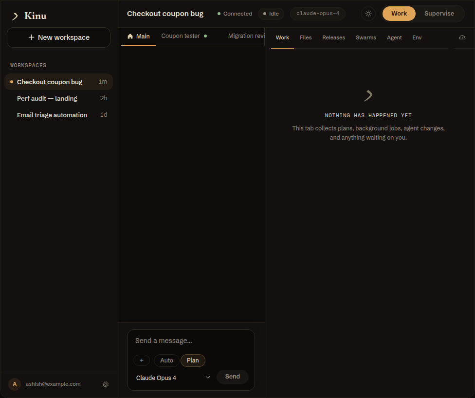

<p align="center">
  <picture>
    <source media="(prefers-color-scheme: dark)" srcset="docs/assets/banner-dark.svg">
    
  </picture>
</p>

<p align="center">
  <strong>Kinu gives AI agents a durable computer of their own.<br>
  It records lessons, runs locally or fully in the cloud, and tries multiple approaches<br>
  to hard tasks, letting executable checks choose the winner.</strong><br>
  <strong><a href="https://kinu.run">kinu.run</a></strong>
</p>

<p align="center">
  <a href="packages/cli/package.json"></a>
  <a href="LICENSE"></a>
  <a href="https://bun.sh"></a>
  <a href="https://workers.cloudflare.com"></a>
</p>

<p align="center">
  <a href="QUICKSTART.md">Quick start</a> &nbsp;·&nbsp;
  <a href="docs/USER-GUIDE.md">User guide</a> &nbsp;·&nbsp;
  <a href="docs/EXPLORATION.md">Swarms</a> &nbsp;·&nbsp;
  <a href="docs/CLI.md">CLI reference</a>
</p>

## Demo

<p align="center">
  
</p>

<p align="center"><em>The planning walkthrough, recorded from the product at build <code>89bb99e85</code> — a real workspace driven through its own controls, with a stand-in model. Try it at <a href="https://kinu.run">kinu.run</a>.</em></p>

## What Kinu is

I'm building Kinu as a general agent platform and software factory. You give a
workspace a mission: research a question, build a live app, fix a codebase, or
check something on a schedule. A cloud workspace keeps working while you are
away. You return to its conversation, files, and pending decisions.

You can use it for:

- Research. The `web` tool searches and fetches pages with no keys. A
  `research` swarm covers several angles of one question at once, and you
  can hire a `researcher` role for the long reads.
- Live apps. Ask for a dashboard and the agent writes a slate: a small Worker
  under `/home/user/slates/<id>/` that opens in its own tab on a preview URL.
  A slate reads live data through bindings you declare: workspace files, a
  workspace read model, or an MCP connection narrowed to named tools.
- Engineering. A real shell, git, package installs, a container for the heavy
  work, and a governed release lane with approvals. In Plan mode the agent
  reads and researches without changing project code, then submits a plan
  for you to review before a Build turn starts.
- Schedules and triggers. A cron timer, a one-shot timer, or a webhook wakes a
  cloud workspace when nobody sits at the keyboard.
- Work while you are away. Long commands and searches move to the background.
  They wake the agent when they settle. Anything that needs your decision, a
  shell approval or a release approval, appears under "Needs you". Plans open
  for review in the same Work tab. Settled work stays in its journal.
- Cloud or your own devices. A cloud workspace lives in a Durable Object on
  Cloudflare and keeps running when your device is closed. A local workspace
  runs on your machine over `bun:sqlite`. It is the same agent either way.
- Reach it from anywhere. The web app, the `kinu` CLI, a full-screen terminal
  UI, and editors over the Agent Client Protocol can open a cloud workspace.
  Connect a machine of yours and every cloud workspace you grant can use it.
- Bring your subscriptions. Connect your Cloudflare account for Workers AI. Connect your
  ChatGPT Codex subscription with a device code, or your OpenAI, Anthropic and
  OpenRouter keys, and cloud workspaces use them. On your machine a local
  workspace can also drive your Claude Code or opencode login.

The agent writes tools for itself and scores them with use. When you correct
it, it records a provisional lesson. For a hard task it runs a swarm: a
tree search whose nodes are whole agents, scored by a workspace verifier.

## Using it

### Hosted

Sign in at [kinu.run](https://kinu.run) and create a workspace in the browser.
Close the tab and the workspace keeps running. The home page lists your
workspaces with what is active and what is waiting on you.

### From your terminal

```bash
curl -fsSL 'https://kinu.run/install.sh' | bash
kinu setup                                  # browser sign-in, provider keys
kinu create triage --mode cloud
kinu run triage "find the slowest query"
```

`kinu chat` opens the terminal UI over the same workspace. `kinu exec` runs one
task, never prompts, and exits 0 only when the turn completed cleanly, so it
fits scripts and CI. `kinu acp` serves a workspace to Zed, JetBrains, neovim or
Marimo.

`--mode cloud` runs on Cloudflare. `--mode local` runs on your machine and needs
no account. `kinu export` archives either one, and `kinu import` restores it
locally. [QUICKSTART.md](QUICKSTART.md) is the short path.
[docs/USER-GUIDE.md](docs/USER-GUIDE.md) covers daily use.

### Lending your machine to a cloud workspace

```bash
kinu connect          # link this computer, with a consent prompt
kinu desktop status   # is it attached?
```

The daemon on your machine opens an outbound WebSocket to your Kinu account.
You do not need to expose an inbound port for that tunnel. One connected
device serves every workspace you grant. It works like this:

- A grant is per workspace and per machine. A workspace you have not granted
  is refused before anything reaches the device. Revoking a grant takes
  effect on the next call.
- Each machine mounts at `/pc/<name>` in the workspace file plane.
  Mounts extend the view and never copy it.
- The agent sees its own home plus the folders you named at connect time. The
  rest of your home is invisible by construction. On Linux the shell runs
  under bubblewrap, on macOS under sandbox-exec, and the file methods enforce
  the same view. Sandbox off is an explicit switch per device.
- Every shell command passes an approval gate before it runs. Housekeeping in
  the agent's own workspace or container runs without asking. The same
  recognized destructive command on your machine waits for you. Force-pushes
  and package publishing need approval on any executor. A standing approval
  is a rule you grant once. It stays listed in Settings, and you can revoke
  it there. The agent refuses known dangerous patterns, such as wiping the
  filesystem root.

The shell checks catch known command patterns. They guard against accidents.
They do not stop a hostile program. If the device cannot sandbox a
command, it refuses execution unless you explicitly turn Sandbox off.

[docs/EXECUTION-LAYER-SPEC.md](docs/EXECUTION-LAYER-SPEC.md) has the whole
model.

### Self-hosting

kinu.run is one deployment of this repository. Yours runs the same Worker,
containers and search code on your own Cloudflare account.

```bash
bun install
bun run infra:provision      # R2 buckets and Vectorize indexes
bun run deploy               # the Worker, DO namespaces, container, routes, cron
bun run infra:provision      # the secrets; wrangler needs the Worker to exist first
bun run gate:infra           # every declared resource exists and is bound
```

`bun run deploy` refuses to upload until its gate roster passes. You bring an
account on the Workers Paid plan, a zone with a wildcard DNS record for
previews, an AI Gateway, and OAuth applications for sign-in. Provisioning
prints that list every run. [docs/DEPLOYMENT.md](docs/DEPLOYMENT.md) lists each
prerequisite and every secret. [docs/SELF-HOSTING.md](docs/SELF-HOSTING.md)
walks an empty account end to end. I have not measured the monthly cost of a
fresh self-host as of 2026-09-13. Model use, storage, and containers affect it.

## Features

| | |
|---|---|
| One real filesystem | A durable POSIX filesystem with a shell, coreutils, and git, over the Nimbus WASM OS. Pick an executor that supports the runtime your project needs. |
| Four executors | The workspace, a Linux container, your own machine over a consented tunnel, or the workspace a fork came from. The prompt tells the model what each one does. |
| Container recovery | `@kinu.run/devbox` persists workspace files and records supervised processes and ports for restoration after a recycle. Storage uses an immutable base plus one cumulative delta and a read-only block layer. Preview addresses can change. Full live strategy admission remains refused. See the [decision log](docs/DEVBOX-DECISIONS.md). |
| Slates | Live apps the agent writes as small Workers, previewed on their own hostname, reading your data through declared bindings. |
| Plan mode | The agent reads and researches. Then it submits a Markdown plan. You annotate lines or approve. Only then does a Build turn start. |
| Swarms | A search whose nodes are whole tool-calling agents. Six named presets plus `custom`, six axes, and a workspace verifier that reports the number that picks the winner. The Swarms tab shows the tree as it grows. |
| Delegation | One `agents` tool: `swarm`, `hire`, `msg`, `list`, `dismiss`. A hire lasts or runs one task. It runs as `task`, `researcher`, `planner`, `auditor`, or `designer`. |
| Crafted tools | The agent writes tools, scores them with use, and finds them again over FTS5. |
| A mutable scaffold | The agent loop is code the agent can rewrite. Structural gates validate a mutation before it runs. |
| Evolution | Four timescales: step, turn, session, lifetime. An optional advisor reviews finished turns. `kinu evolve` searches over the scaffold itself. |
| Prompts as Markdown | Prompt prose lives under `packages/core/src/prompts/`. The builder selects sections and fills their slots. Indexed sections evolve on their own. |
| Triggers | Timers and webhooks wake cloud workspaces. Local timers need `kinu daemon` running. Email requires domain onboarding. The last recorded live check, 2026-08-20, found it incomplete on `kinu.run` ([email setup](docs/EMAIL-INGRESS.md)). |
| Web search | The `web` tool works with no keys. A Tavily key adds ranked search. |
| Model choice | Your Cloudflare account through one sign-in, or your keys: OpenAI, Anthropic, OpenRouter, a Codex subscription, any OpenAI-compatible endpoint. Locally it also drives a Claude Code or opencode login. |
| A control plane | Operators get `/control`: users, workspaces, incidents, feedback, fleet metrics, an audit log. |
| Headless | Scoped tokens keep webhooks and consent interactive-only. `kinu exec` fits scripts and CI. |
[docs/TOOLS.md](docs/TOOLS.md) covers the eight built-in tools.
[docs/EXPLORATION.md](docs/EXPLORATION.md) covers the axes, presets and records.
[docs/LIVE-UI.md](docs/LIVE-UI.md) covers slates.

## Roadmap

- Measure evolution's lift on the sealed bench and publish the number.
- Close the container storage decision with a full live acceptance on deployed Containers ([docs/DEVBOX-DECISIONS.md](docs/DEVBOX-DECISIONS.md), O1).
- Seed the hosted runtime catalog so a fresh self-host gets Python without a manual step.

## Packages

A Bun workspace. Platform-agnostic code lives in `core/`. The two backends are
adapters over it.

| Package | What it holds | On its own |
|---|---|---|
| `devbox/` | Container lifecycle, activity leases, supervised processes, ports, and snapshot-chain storage with the block layer | Yes, as a standalone SDK over `@cloudflare/sandbox`. It depends on no other package here |
| `agent-utils/` | MemoryStore and CraftStore over FTS5, shared VFS types, path addressing | Yes, as small libraries |
| `compaction/` | The default context transformer: the better-compact ladder and its codec | Yes |
| `agent-core/` | The vendored slate runtime, digest-pinned to its upstream | Private |
| `cf-backend/` | Cloudflare Workers: the workspace Durable Object and its logical actors, KinuSandbox, UserDO, the React UI | This is the deployment |
| `cli/` | The `kinu` commands | Yes, this is the CLI |
| `cli-backend/` | Local runtime over `bun:sqlite`, subprocess sandbox, child-process branches | Behind the CLI |
| `pc-agent/` | The device agent that lends your machine to a workspace | Yes |
| `test-utils/` | Shared fakes and fixtures | In this repo's suites |

## Extending

Kinu agents stay platform agnostic and live in `packages/core`. They
run on any backend through two interfaces.
`AgentRuntime` provides storage, memory, models, and scheduling. `BackendHost`
provides what a turn loop needs from its host. I implement the pair twice: on
Cloudflare Durable Objects built on [Think](https://github.com/cloudflare/agents),
and on POSIX over `bun:sqlite` and real processes.

<picture>
  <source media="(prefers-color-scheme: dark)" srcset="docs/diagrams/backend-dark.svg">
  
</picture>

To add a backend, implement those interfaces and connect its available services.
Keep the shared turn and tool logic in core. A turn arrives from a person, a
schedule, or a finished background job. Core assembles its context. Then it reads
live workspace state between model steps.

<picture>
  <source media="(prefers-color-scheme: dark)" srcset="docs/diagrams/turn-dark.svg">
  
</picture>

Three extension points live inside that loop: an actor kind, a `ModelProvider`,
and the inference loop itself.
[docs/EXTENSIBILITY.md](docs/EXTENSIBILITY.md) works each one through with a real
example. [docs/ARCHITECTURE.md](docs/ARCHITECTURE.md) holds the object model, message
flow, events, and ingress.

## Documentation

Start with [Quick start](QUICKSTART.md). Then read the
[User guide](docs/USER-GUIDE.md). [CLI reference](docs/CLI.md) comes generated from the
command registry. [Configuration](docs/CONFIG.md) documents every
`~/.kinu/config.json` field.

<details>
<summary>How it works, in depth</summary>

| Document | What is in it |
|---|---|
| [Workspaces](docs/WORKSPACES.md) | The object model: a workspace is the container, and agents are actors inside it |
| [Architecture](docs/ARCHITECTURE.md) | System design, message flow, package structure, Think lifecycle |
| [Product spec](docs/PRODUCT-SPEC.md) | The requested contract, current behaviour against it, and the product diagrams |
| [Exploration](docs/EXPLORATION.md) | The six axes, the node contract, the publication seal, settle and merge-back |
| [Extensibility](docs/EXTENSIBILITY.md) | The three extension points, worked through with real examples |
| [Evolution](docs/EVOLUTION.md) | The four timescales, CraftStore lifecycle, scaffold mutation |
| [MCTS](docs/MCTS.md) | UCT formula, branch isolation, convergence |
| [Tools](docs/TOOLS.md) | The eight built-ins, the file plane, the `agents` surface, the codemode sandbox |
| [Live UI](docs/LIVE-UI.md) | Slates: authoring, the one codemode operation, bindings, and the resident preview |
| [Execution layer](docs/EXECUTION-LAYER-SPEC.md) | The four executors, mounts, device consent, what runs where |
| [Context budget](docs/CONTEXT-BUDGET.md) | Where bulk spills, the turn-cumulative clamp, the trip counters |
| [Observability](docs/OBSERVABILITY.md) | Failure classification, the typed logger, what is wired and what is not |
| [Storage](docs/STORAGE.md) | Data model, workspace files over the Nimbus VFS, MemoryStore FTS5, table schemas |
| [Devbox decisions](docs/DEVBOX-DECISIONS.md) | Every container storage decision, with the measurement that settled it |
| [Deployment](docs/DEPLOYMENT.md) | Local dev, Cloudflare deploy, AI Gateway setup, secrets |
| [Self-hosting](docs/SELF-HOSTING.md) | An empty Cloudflare account to your own instance |
| [Formal spec](docs/FORMAL-SPEC.md) | Lean 4 models, assumptions, traceability, CI gates |
| [Bench](docs/BENCH.md) | The instrument for whether self-evolution helps: sealed split, paired stats |
| [Testing](docs/TESTING.md) | Conventions, what "all tests" runs, and the tier that calls a real model |
| [Changelog](CHANGELOG.md) | What changed in each version, and the release checklist |

</details>

## Development

```bash
bun install
bun run check                    # lint and type-check every package
bun test --cwd packages/core     # also: cf-backend, cli, cli-backend, agent-utils, devbox
```

Contributions are welcome. [AGENTS.md](AGENTS.md) carries the rules this repository
runs on, for people and for agents.

## License

MIT
