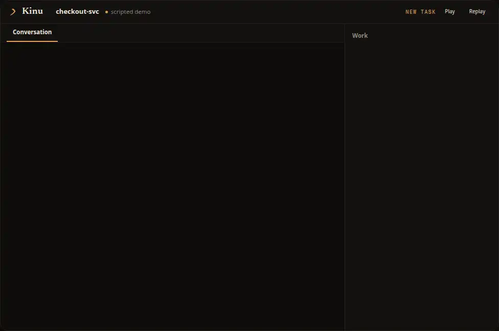

<p align="center">
  <picture>
    <source media="(prefers-color-scheme: dark)" srcset="docs/assets/banner-dark.svg">
    
  </picture>
</p>

<p align="center">
  <strong>Kinu gives AI agents a durable computer of their own.<br>
  It records outcomes, runs locally or fully in the cloud, and evaluates hard tasks<br>
  by exploring multiple approaches and letting executable checks choose the winner.</strong><br>
  <strong><a href="https://kinu.run">kinu.run</a></strong>
</p>

<p align="center">
  <a href="packages/cli/package.json"></a>
  <a href="LICENSE"></a>
  <a href="https://bun.sh"></a>
  <a href="https://workers.cloudflare.com"></a>
</p>

<p align="center">
  <b>6</b> named searches &nbsp;·&nbsp; <b>8</b> built-in tools &nbsp;·&nbsp;
  <b>2</b> backends, one core &nbsp;·&nbsp; <b>4</b> execution environments
</p>

<p align="center">
  <a href="QUICKSTART.md">Quick start</a> &nbsp;·&nbsp;
  <a href="docs/USER-GUIDE.md">User guide</a> &nbsp;·&nbsp;
  <a href="docs/EXPLORATION.md">Swarms</a> &nbsp;·&nbsp;
  <a href="docs/CLI.md">CLI reference</a>
</p>

## Demo

<p align="center">
  
</p>

<p align="center"><em>Recorded bug-fix flow: plan approval, three candidate patches, and a focused suite.</em></p>

## What you get

A workspace is a durable POSIX filesystem, a shell, execution environments, agent
conversations, memory and an event log. Close the laptop; a cloud workspace keeps
going. A schedule or a webhook starts the next turn with nobody at the
keyboard, and an email does too once the mail domain is onboarded.

The agent writes tools for itself, keeps the ones that score well, and starts the
next task from what the last one taught it.

For a hard task it runs a search whose nodes are whole agents. A verifier runs in
the workspace and reports a number. The number picks the winner.

## Ways to use it

**Hosted.** Sign in at [kinu.run](https://kinu.run) and create a workspace in the
browser. Close the tab; the workspace keeps running.

**From your terminal.**

```bash
curl -fsSL 'https://kinu.run/install.sh' | bash
kinu setup                                  # browser sign-in, provider keys
kinu create triage --mode cloud
kinu run triage "find the slowest query"
```

`kinu chat` opens a full-screen terminal UI over the same workspace. `kinu exec`
runs one task, never prompts, and exits 0 only when the turn completed cleanly.

**Cloud or your own machine.** `--mode cloud` runs on Cloudflare Durable Objects;
`--mode local` runs on your machine over `bun:sqlite`. The agent is the same either
way. `kinu export` archives either one; `kinu import` restores it locally. Editors
attach over `kinu acp`.

[QUICKSTART.md](QUICKSTART.md) is the short path.
[docs/USER-GUIDE.md](docs/USER-GUIDE.md) covers daily use.

## Deploy it yourself

kinu.run is one deployment of this repository. Yours runs the same Worker,
containers and search code on your Cloudflare account.

```bash
bun install
bun run infra:provision      # R2 buckets and Vectorize indexes
bun run deploy               # the Worker, DO namespaces, container, routes, cron
bun run infra:provision      # the secrets; wrangler needs the Worker to exist first
bun run gate:infra           # every declared resource exists and is bound
```

`bun run deploy` refuses to upload until 62 required gate invocations pass.
Preflight runs first, 58 gates run concurrently, and `gate:hammer`, `gate:infra`
and `gate:devbox-e2e` each run alone at the end, in that order.
You bring a Workers Paid account, a zone, and OAuth applications for sign-in.
[docs/DEPLOYMENT.md](docs/DEPLOYMENT.md) lists each prerequisite;
[docs/SELF-HOSTING.md](docs/SELF-HOSTING.md) walks an empty account end to end.

## Features

| | |
|---|---|
| One real filesystem | A durable POSIX filesystem with a real shell, ~95 coreutils, and language runtimes installed on demand. The same component runs on Workers and on your machine. |
| Four executors | The workspace, a Linux container, your own machine over a consented tunnel, or the workspace a fork came from. The prompt tells the model what each one can do. |
| Containers that stay | A Cloudflare container is spot capacity; the disk can come back blank between two calls. `@kinu.run/devbox` brings files, supervised processes and preview URLs back after a recycle. |
| Swarms | A search whose nodes are whole tool-calling agents. Seven presets, six axes, and a workspace verifier that reports the number that picks the winner. |
| Crafted tools | The agent writes tools, scores them with use, and finds them again over FTS5. |
| A mutable scaffold | The agent loop is code the agent can rewrite. Four structural gates validate a mutation before it runs. |
| Evolution | Four timescales: step, turn, session, lifetime. `kinu evolve` searches over the scaffold itself. |
| Triggers | Schedules and webhooks reach a workspace with nobody at the keyboard. Email does the same, on a domain that has completed the one-time Email Routing setup — `kinu.run` has not, so the inbox is code-complete and inert. |
| Web search | The `web` tool works with no keys. A Tavily key adds ranked search. |
| Model choice | Your Cloudflare account through one sign-in, or your keys: OpenAI, Anthropic, OpenRouter, a Codex subscription, any OpenAI-compatible endpoint, a local Claude Code login. |
| A control plane | Operators get `/control`: users, workspaces, incidents, feedback, fleet metrics, an audit log. |
| Headless | Scoped tokens keep webhooks and consent interactive-only; `kinu exec` fits scripts and CI. |

[docs/TOOLS.md](docs/TOOLS.md) covers the eight built-in tools.
[docs/EXPLORATION.md](docs/EXPLORATION.md) covers the axes, presets and records.

## Roadmap

- Measure evolution's lift on the sealed bench and publish the number.
- Settle the default container storage strategy from the deployed three-way benchmark.
- Add `advance:'pareto'` for multi-objective searches.
- Seed the hosted runtime catalog so a fresh self-host gets Python without a manual step.

## Packages

A Bun workspace. Platform-agnostic code lives in `core/`; the two backends are
adapters over it.

| Package | What it holds | On its own |
|---|---|---|
| `devbox/` | An ephemeral Cloudflare container presented as a machine that stays: lifecycle, activity lease, supervised processes, ports, three storage strategies | **Yes.** A standalone SDK over `@cloudflare/sandbox`. Extend the class, override the hooks. Depends on no other package here |
| `core/` | The turn pipeline, canonical VFS and execution router, swarm and MCTS engines, evolution, CraftStore, scaffold, the eight tools, the event log | Needs a backend to host it |
| `agent-utils/` | MemoryStore and CraftStore over FTS5, shared VFS types, path addressing | Yes, as small libraries |
| `compaction/` | The default context transformer: the better-compact ladder and its codec | Yes |
| `cf-backend/` | Cloudflare Workers: orchestrator, exploration and subordinate facets, KinuSandbox, UserDO, the React UI | This is the deployment |
| `cli/` | The `kinu` commands | Yes, this is the CLI |
| `cli-backend/` | Local runtime over `bun:sqlite`, subprocess sandbox, child-process branches | Behind the CLI |
| `pc-agent/` | The device agent that lends your machine to a workspace | Yes |
| `test-utils/` | Shared fakes and fixtures | In this repo's suites |

## Extending

`packages/core` knows nothing about where it runs. Two interfaces carry the
platform: `AgentRuntime` provides storage, memory, models and scheduling;
`BackendHost` provides what a turn loop needs from its host. I implement the pair
twice: on Cloudflare Durable Objects built on
[Think](https://github.com/cloudflare/agents), and on POSIX over `bun:sqlite` and
real processes.

<picture>
  <source media="(prefers-color-scheme: dark)" srcset="docs/diagrams/backend-dark.svg">
  
</picture>

A third backend implements that pair and nothing else. Core owns the turn: it
arrives from a person, a schedule or a finished background job, gets assembled once,
and runs a step loop where the agent re-reads live workspace state between steps.

<picture>
  <source media="(prefers-color-scheme: dark)" srcset="docs/diagrams/turn-dark.svg">
  
</picture>

Three extension points live inside that loop: an actor kind, a `ModelProvider`,
and the inference loop itself.
[docs/EXTENSIBILITY.md](docs/EXTENSIBILITY.md) works each one through with a real
example. [docs/ARCHITECTURE.md](docs/ARCHITECTURE.md) has the object model, message
flow, events and ingress.

## Documentation

Start with [Quick start](QUICKSTART.md), then the
[User guide](docs/USER-GUIDE.md). [CLI reference](docs/CLI.md) is generated from the
command registry, and [Configuration](docs/CONFIG.md) documents every
`~/.kinu/config.json` field.

<details>
<summary>How it works, in depth</summary>

| Document | What is in it |
|---|---|
| [Workspaces](docs/WORKSPACES.md) | The object model: a workspace is the container, agents are actors inside it |
| [Architecture](docs/ARCHITECTURE.md) | System design, message flow, package structure, Think lifecycle |
| [Exploration](docs/EXPLORATION.md) | The six axes, the node contract, the publication seal, settle and merge-back |
| [Extensibility](docs/EXTENSIBILITY.md) | The four extension points, worked through with real examples |
| [Evolution](docs/EVOLUTION.md) | The four timescales, CraftStore lifecycle, scaffold mutation |
| [MCTS](docs/MCTS.md) | UCT formula, branch isolation, convergence |
| [Tools](docs/TOOLS.md) | The eight built-ins, the file plane, the `agents` surface, the codemode sandbox |
| [Context budget](docs/CONTEXT-BUDGET.md) | Where bulk spills, the turn-cumulative clamp, the trip counters |
| [Observability](docs/OBSERVABILITY.md) | Failure classification, the typed logger, what is wired and what is not |
| [Storage](docs/STORAGE.md) | Data model, workspace files over the Nimbus VFS, MemoryStore FTS5, table schemas |
| [Deployment](docs/DEPLOYMENT.md) | Local dev, Cloudflare deploy, AI Gateway setup, secrets |
| [Self-hosting](docs/SELF-HOSTING.md) | An empty Cloudflare account to your own instance |
| [Formal spec](docs/FORMAL-SPEC.md) | Lean 4 models, assumptions, traceability, CI gates |
| [Bench](docs/BENCH.md) | The instrument for whether self-evolution helps: sealed split, paired stats |
| [Testing](docs/TESTING.md) | Conventions, what "all tests" runs, and the tier that calls a real model |
| [Changelog](CHANGELOG.md) | What changed in each version, and the release checklist |

</details>

## Development

```bash
bun install
bun run check                    # type-check every package
bun test --cwd packages/core     # also: cf-backend, cli, cli-backend, agent-utils, devbox
```

Contributions are welcome. [AGENTS.md](AGENTS.md) carries the rules this repository
runs on, for people and for agents.

## License

MIT
