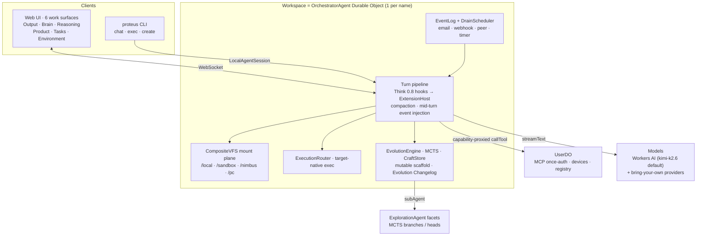

# Proteus

Self-evolving agent workspaces: you create a workspace — a durable container with its own filesystem, execution environments, and sessions — and its agent improves itself through Monte Carlo Tree Search, learns reusable tool patterns, and rewrites its own execution logic. I built it on Cloudflare's [Think](https://github.com/cloudflare/agents) framework with Durable Objects for persistent state, plus a CI-gated Lean 4 corpus over hand-maintained abstract models of selected core algorithms.

> Docs in this repo are edited & maintained by Claude and presented as-is; verify against the code when precision matters.

**Live:** [proteus.ashishkumarsingh.com](https://proteus.ashishkumarsingh.com)

## Architecture

A workspace is one `OrchestratorAgent` Durable Object (`cf-backend/src/orchestrator.ts`, a thin adapter over the shared brain in `packages/core`). The same core runs locally through `LocalAgentSession` (`cli-backend/src/local-session.ts`), so the CLI and the cloud share one turn pipeline. [docs/ARCHITECTURE.md](docs/ARCHITECTURE.md) has the detailed diagrams.



## Key Features

- **MCTS parallel exploration** — score-based selection, backpropagation, pruning, and winner selection. Each branch is an isolated Durable Object via Facets.
- **3-timescale evolution** — turn-level (quality → reflection), session-level (pattern consolidation → scaffold mutation), lifetime (full MCTS exploration)
- **CraftStore** — learns reusable tools from conversations. EMA scoring with time decay. FTS5-indexed for search.
- **Mutable scaffold** — the agent's agentic loop is code it can rewrite, validated through 4 structural gates
- **POSIX shell emulator** — 16 commands (ls, grep, find, sed, cat, etc.) over virtual filesystem. No real OS needed on Workers.
- **Web search & fetch** — `web_search` and `web_fetch` are built in and work with zero keys (DuckDuckGo search + Cloudflare's markdown service); add a Tavily key for ranked, answer-augmented search.
- **Lean-checked abstract models** — 84 theorems cover selected agent, evolution, execution, MCTS, safety, and storage properties. Their axiom reports use only Lean's kernel axioms; one separate SQLite FTS5 assumption is documented and enrolled. CI gates compilation, negative consistency, axiom closure, and requirement-to-proof-to-source traceability. The models are hand-maintained, and model-to-TypeScript differential fixtures are planned.
- **Portable** — same core runs on Cloudflare Workers (Think + DOs) or local CLI (bun:sqlite)

## Quick Start

### Web UI

```bash
bun install
cd packages/cf-backend
# Create .dev.vars with AI Gateway credentials (see docs/DEPLOYMENT.md)
CLOUDFLARE_ACCOUNT_ID=<your-id> npx vite dev --port 5173 --host 0.0.0.0
```

### CLI

```bash
curl -fsSL 'https://proteus.ashishkumarsingh.com/install.sh' | bash
proteus setup
proteus create jarvis --mode cloud --alias jarvis --purpose "A helpful coding assistant"
jarvis "summarize this repository"
```

`proteus setup` opens the browser OAuth flow, stores the app session locally,
and can also configure local provider keys for fully local workspaces.

### Headless / CI

`proteus exec` is the non-interactive face of the CLI: it runs one task and
exits 0 only when the turn completed cleanly (nonzero on errors or denied
device consents — it never prompts). Mint a scoped access token from an
interactive session (sign in within the last 5 minutes), store it as a CI
secret, and pipe the line-delimited JSON events wherever you need them:

```bash
proteus tokens create --name ci --scopes workspace.exec,workspace.read  # printed once
# in the pipeline:
export PROTEUS_TOKEN=pta_…                                       # from CI secrets
proteus exec --workspace jarvis --json "triage the failing tests" | tee events.jsonl
```

Access tokens are scoped, not godmode: `workspace.exec` runs tasks,
`workspace.read` inspects state, and everything else (webhooks, device
registration, workspace creation, consent decisions) stays interactive-only
and is enforced server-side. `proteus tokens list` shows last use; `proteus tokens revoke ci`
kills one immediately.

## Models & providers

I wanted model choice to be flexible without forcing anyone into a single vendor, so a workspace can run on any of these:

- **Your own Cloudflare account** — one browser sign-in (`proteus auth`) attaches your Cloudflare account, and from that single login you get both **Workers AI** and your **AI Gateway**. Workers AI models resolve as `workers-ai/<model>` and your gateway as `my-gateway/{author}/{model}`. The OAuth consent needs the `aig.write` scope for AI Gateway; if you connected before that was added, run `proteus auth` again to re-grant it.
- **Signed-in local workspaces — free Workers AI** — if you're signed in, a *local* workspace you create gets Workers AI through the `/api/user/ai/v1` proxy with **no key at all**. New local workspaces default to `workers-ai/@cf/moonshotai/kimi-k2.6`.
- **Bring your own keys** — OpenAI, Anthropic, OpenRouter, and your ChatGPT Codex subscription, plus any OpenAI-compatible endpoint (Ollama, vLLM, …). Connect with `proteus providers connect <name>`.
- **Local Claude subscription** — if you use Claude Code, `proteus create --model claude/claude-opus-4-x` (or `-sonnet-`/`-haiku-`) drives the official `claude` binary with your own Claude Code login. Proteus never reads your credentials or calls the API directly — the binary is the auth boundary, which is what keeps this compliant. It is **local only**: cloud workspaces must use an Anthropic API key (`proteus providers connect anthropic`), not the subscription.

`proteus providers list` shows what's connected and each provider's status inline. Pick a model per workspace with `--model`, or switch mid-conversation from the `/model` picker.

## Documentation

| Document | Description |
|----------|-------------|
| [Workspaces](docs/WORKSPACES.md) | The object model: workspace = container (mounts, identity, sessions), agents = actors inside it |
| [Architecture](docs/ARCHITECTURE.md) | System design, message flow, package structure, Think lifecycle |
| [Evolution](docs/EVOLUTION.md) | 3-timescale self-evolution, CraftStore lifecycle, scaffold mutation |
| [MCTS](docs/MCTS.md) | Monte Carlo Tree Search, UCT formula, branch isolation, convergence |
| [Tools](docs/TOOLS.md) | The builtin agent tools, shell emulator, code execution, crafted tools |
| [Storage](docs/STORAGE.md) | Data model, SqliteFS, MemoryStore FTS5, table schemas |
| [Deployment](docs/DEPLOYMENT.md) | Local dev, Cloudflare deploy, AI Gateway setup, secrets |
| [Formal Spec](docs/FORMAL-SPEC.md) | Lean 4 abstract models, assumptions, traceability, and CI gates |

## Packages

| Package | Description |
|---------|-------------|
| `core/` | The shared brain (platform-independent): turn pipeline + `ExtensionHost`, CompositeVFS + ExecutionRouter, MCTS engine, EvolutionEngine, CraftStore, scaffold, the 10 builtin tools, EventLog, types |
| `agent-utils/` | SqliteFS (chunked VFS), MemoryStore (FTS5), CraftStore (FTS5), POSIX shell emulator |
| `compaction/` | The default `transformContext` extension: vendored better-compact ladder + the Proteus AI-SDK⇄ladder codec |
| `cf-backend/` | Cloudflare Workers: OrchestratorAgent (thin Think adapter), ExplorationAgent (Facets), UserDO, React UI |
| `cli/` | CLI commands: create, chat, exec, evolve, status, list, export, import |
| `cli-backend/` | Local runtime: `LocalAgentSession`, bun:sqlite, subprocess sandbox, child_process MCTS branches |
| `pc-agent/` | The device agent that mounts a user's own machine as `/pc` (connect + consent) |
| `test-utils/` | Shared test fakes and fixtures |

## Development

```bash
bun install
bun run check                    # type-check every package (+ pc-agent syntax)
bun test --cwd packages/core     # unit tests (also: cf-backend, cli, cli-backend, agent-utils)
```

## License

MIT
