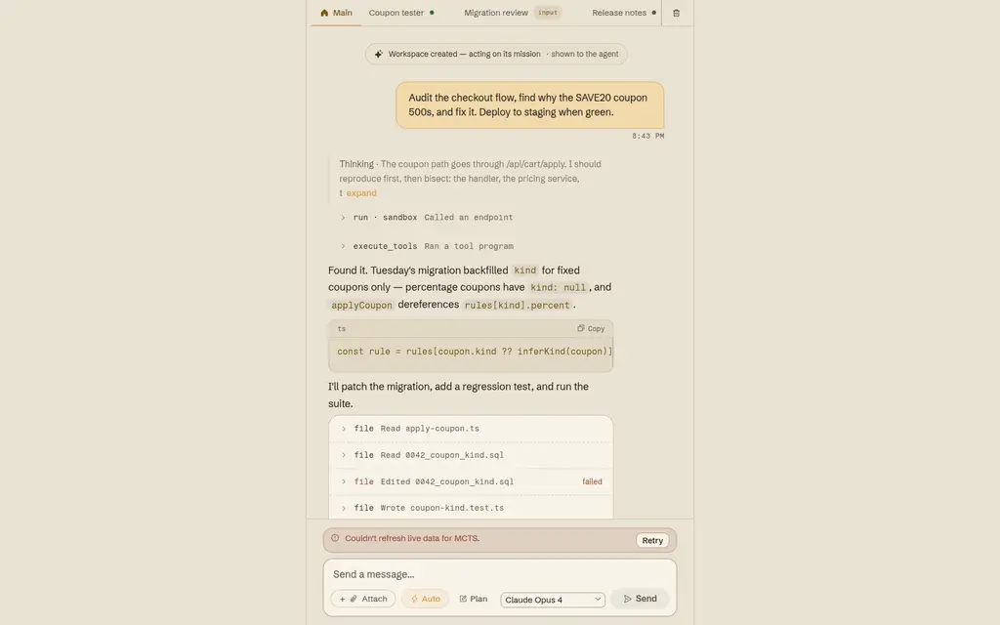

<p align="center">
  <picture>
    <source media="(prefers-color-scheme: dark)" srcset="docs/assets/banner-dark.svg">
    
  </picture>
</p>

<p align="center">
  <picture>
    <source media="(prefers-color-scheme: dark)" srcset="docs/assets/kinu-app-dark.webp">
    
  </picture>
</p>

<p align="center">
  <strong>Persistent agents for cloud and local workspaces.<br>
  Agents can delegate complex tasks across a DAG of subagents.</strong><br>
  <strong><a href="https://kinu.run">kinu.run</a></strong>
</p>

<p align="center">
  <a href="packages/cli/package.json"></a>
  <a href="LICENSE"></a>
  <a href="https://www.typescriptlang.org"></a>
  <a href="https://bun.sh"></a>
  <a href="https://workers.cloudflare.com"></a>
</p>

<p align="center">
  <b>6</b> named searches &nbsp;·&nbsp; <b>8</b> built-in tools &nbsp;·&nbsp;
  <b>2</b> backends, one core &nbsp;·&nbsp; <b>4</b> execution environments
</p>

<p align="center">
  <a href="QUICKSTART.md">Quick start</a> &nbsp;·&nbsp;
  <a href="docs/USER-GUIDE.md">User guide</a> &nbsp;·&nbsp;
  <a href="docs/EXPLORATION.md">Tree swarm</a> &nbsp;·&nbsp;
  <a href="docs/CLI.md">CLI reference</a>
</p>

## Install

```bash
curl -fsSL 'https://kinu.run/install.sh' | bash
kinu setup
kinu create triage --mode cloud
kinu run triage "find the slowest query"
```

`kinu setup` opens a browser sign-in and stores the session on this machine. It also
takes the provider keys a fully local workspace needs.

A workspace runs in the cloud on Cloudflare Durable Objects, or on your own machine
on `bun:sqlite`. Choose with `--mode cloud` or `--mode local`. The agent is the same
either way. `kinu export` backs either one up to a portable archive, and
`kinu import` restores that archive into a local workspace.

To serve the web UI yourself:

```bash
bun install
cd packages/cf-backend
# .dev.vars needs AI Gateway credentials; see docs/DEPLOYMENT.md
CLOUDFLARE_ACCOUNT_ID=<your-id> npx vite dev --port 5173 --host 0.0.0.0
```

## What a workspace is

Each workspace provides a durable POSIX filesystem, shell, execution
environments, sessions, memory and an event log.

Turns can produce scored tools, durable lessons and reversible versions of the
agent loop. Use a workspace from the terminal, browser, an ACP editor or email.

## The tree swarm

Hard tasks get more than one attempt, and code picks the winner. When the agent
judges a task worth a search, it calls `agents({action:'swarm', …})` with the
task and an objective it derives from your ask, and the search builds a tree whose
nodes are agents.

The objective names a metric, a unit, a direction and a target, and it names the
verifier that measures a candidate. A verifier is code. It runs in this workspace
and reports a raw number, and that number picks the winner. Verifier kinds resolve
through a closed registry, so a name nobody registered fails the run. With
`score:'judge'` a model ensemble ranks candidates instead, and a judged run leaves
no measured record.

A `preset` fixes the shape of the search. `ideate` is flat by construction, at depth
1 and 5 branches, and hands back every candidate unranked. `optimise` climbs one measured
number with UCT selection, at depth 5 and 3 branches. `prove` searches deepest, at
depth 7, because a checker refutes a wrong branch early. `research`, `audit` and
`redteam` cover a grid of cells at depth 1 and 4 branches, ranked by the objective's
own instrument, so all three require `objective` and a coverage `key`. `custom` takes
the six axes, `unit` `context` `expand` `score` `advance` `carry`.
`expand:'aggregate'` fans a level in and
merges its members in dependency order. `advance:'archive'` keeps a grid of cells
and one elite per coordinate.

Every node is a whole tool-calling agent and can take several turns to answer.
Local nodes use `runChat` with a private home, credential, and `/tmp`. Hosted
nodes also use the Core node loop, but share the parent workspace home. Work
still running at 30 seconds detaches, and the node wakes when it settles.

What a measured run reaches persists in `exploration_records`, so the next search of
the same objective starts from it rather than rediscovering it.

The same tool has six more actions. `hire` creates a subordinate agent that outlives
the turn, with its own context and a share of this workspace's files. `ask`, `send`,
`reply`, `list` and `dismiss` address agents that already exist: subordinates here,
or your other workspaces as peers. Send to a busy agent and the message splices into
the turn it is already running, so the caller keeps working.

<picture>
  <source media="(prefers-color-scheme: dark)" srcset="docs/diagrams/delegation-dark.svg">
  
</picture>

[docs/EXPLORATION.md](docs/EXPLORATION.md) has the six axes, the seven presets and
their shapes, the rules a call must satisfy, the publication seal and the records
store in full.

## Architecture

Kinu agents are platform agnostic. They live in `packages/core` and can be extended
to run on any backend. Two small interfaces carry everything platform-specific:
`AgentRuntime` provides storage, memory, models and scheduling, and `BackendHost`
provides the few things a turn loop needs from its host. We implement the pair
twice: for Cloudflare Durable Objects, one per workspace, built on
[Think](https://github.com/cloudflare/agents), and for POSIX, on `bun:sqlite` and
real processes on your own machine. Both backends share Core orchestration.
Cloudflare Think and the local CLI own different turn transports and loops.

<picture>
  <source media="(prefers-color-scheme: dark)" srcset="docs/diagrams/backend-dark.svg">
  
</picture>

A turn arrives from a person, a schedule, or a finished background job. It is
assembled once: the system prompt, then the conversation history, compacted when
it outgrows the context window. After that it is a step loop. Between steps the
agent re-reads live workspace state, and everything asynchronous, from a finished
job to a message from another agent, joins the turn through one path.

<picture>
  <source media="(prefers-color-scheme: dark)" srcset="docs/diagrams/turn-dark.svg">
  
</picture>

[docs/ARCHITECTURE.md](docs/ARCHITECTURE.md) has what these leave out: the workspace
object model, message flow, events and ingress, and the Think lifecycle.

## What else is in the box

**One real filesystem.** The workspace file plane is Nimbus over the backend's own
SQLite. It is a durable POSIX filesystem with a real shell, ~95 coreutils, and
language runtimes installed on demand. The same component runs on Workers and on
your machine.

**Executors.** Work runs in the workspace, in a Linux container sandbox, on your own
laptop over a WebSocket tunnel behind consent, or in the workspace a fork came from.
The capability set of each one is rendered into the agent's own prompt, so the model
knows where to send a job.

**Crafted tools.** `CraftStore` keeps the tools an agent writes for itself, scores
them with a time-decayed EMA, and indexes them with FTS5 so the agent can find them
again.

**A mutable scaffold.** The agentic loop is code the agent can rewrite. Four structural
gates validate a mutation before it runs.

**Evolution on four timescales.** Per step, crafted-tool fitness scored inside one
long run, with no model call. Per turn, quality scoring then reflection. Per
session, pattern consolidation then scaffold mutation. Per lifetime, `kinu evolve`
runs a full tree search over the scaffold itself.

**Web search and fetch.** The `web` tool works with zero keys, over DuckDuckGo
search and Cloudflare's markdown service. A Tavily key adds ranked,
answer-augmented search.

**Triggers.** A schedule, a webhook or an email reaches a workspace with nobody at
the keyboard.

## Models and providers

Model choice is yours. A workspace runs on any of these:

- **Your own Cloudflare account.** One browser sign-in (`kinu auth`) attaches your
  Cloudflare account, and that single login gives you both Workers AI and your AI
  Gateway. Workers AI models resolve as `workers-ai/<model>` and your gateway as
  `my-gateway/{author}/{model}`. The OAuth consent needs the `aig.write` scope for AI
  Gateway; if you connected before that scope was added, run `kinu auth` again to
  re-grant it.
- **Workers AI in signed-in local workspaces.** If you are signed in, a *local*
  workspace you create gets Workers AI through the `/api/user/ai/v1` proxy with no
  separate API key. New local workspaces default to
  `workers-ai/@cf/deepseek-ai/deepseek-v4-pro-0813`, which needs paid Workers access
  or prepaid AI Gateway credits.
- **Bring your own keys.** OpenAI, Anthropic, OpenRouter, your ChatGPT Codex
  subscription, and any OpenAI-compatible endpoint (Ollama, vLLM, …). Connect with
  `kinu providers connect <name>`.
- **A local Claude subscription.** If you use Claude Code,
  `kinu create --model claude/claude-opus-4-x` (or `-sonnet-`/`-haiku-`) drives the
  official `claude` binary with your own Claude Code login. Kinu never reads your
  credentials and never calls the API directly. The binary is the auth boundary,
  which is what keeps this compliant. It is local only. A cloud workspace needs an
  Anthropic API key (`kinu providers connect anthropic`).

`kinu providers list` shows what is connected and each provider's status inline. Pick
a model per workspace with `--model`, or switch mid-conversation from the searchable
`/model` picker; a chosen model becomes your default for new workspaces. Set
reasoning effort (low, medium, high) with `/effort` or `kinu effort`, mapped to each
provider's native knob.

## Headless and CI

Put a workspace in your pipeline. `kinu exec` is the non-interactive face of the
CLI. It runs one task and exits 0 only when the turn completed cleanly, nonzero on
an error or a denied device consent, and it never prompts. Mint a scoped access
token from an interactive session (signed in within the last 5 minutes), store it
as a CI secret, and pipe the line-delimited JSON events wherever you need them:

```bash
kinu tokens create --name ci --scopes workspace.exec,workspace.read  # printed once
# in the pipeline:
export KINU_TOKEN=pta_…                                             # from CI secrets
kinu exec --workspace triage --json "triage the failing tests" | tee events.jsonl
```

Access tokens are scoped. `workspace.exec` runs tasks and `workspace.read` inspects
state. Webhooks, device registration, workspace creation and consent decisions stay
interactive-only, enforced server-side. `kinu tokens list` shows last use, and
`kinu tokens revoke ci` kills one immediately.

## Status

The CLI is at 0.2.0 (`packages/cli/package.json`, which is what `kinu --version`
reports). I use it daily and it is not finished. What I would want to know before
trying it:

- **The self-evolution machine has no measured effect yet.** Measured 2026-08-19:
  15,645 lines of non-test TypeScript across `core/src/evolution`, `core/src/mcts`,
  `core/src/scaffold` and `core/src/craft`, and no live-model run has scored any of
  it. [docs/BENCH.md](docs/BENCH.md) is the instrument built to produce that number:
  159 seeded-defect tasks scored by this repository's own checks, a held-out split,
  no model in the scoring path, and rejection by default. If the answer turns out to
  be that evolution does nothing, that is the answer I want.
- **`archive` coverage runs need a measurable objective.** `research`, `audit` and
  `redteam` keep a grid of cells and rank each cell by the objective's own
  instrument, so all three require `objective` and a coverage `key`. A search over
  something no instrument can measure is `ideate`, which is flat and says so.
- **`advance:'pareto'` is not implemented.** It needs a per-instance measurement path
  and a dominance comparison, and the error names both.
- **Hosted language runtimes require the seeded R2 catalog.** Production and
  staging bind `NIMBUS_RUNTIME_CACHE`. A fresh self-host must seed that bucket
  before Python, Bash, Ruby, or Clang can load. The container sandbox has git,
  npm, node, bun and jq, but no `python3`.

## Documentation

**Using it**

| Document | Description |
|----------|-------------|
| [Quick start](QUICKSTART.md) | Install, sign in, and create the first workspace |
| [User guide](docs/USER-GUIDE.md) | The path from install to daily use: talking to a workspace, giving it your machine, triggers, backup, troubleshooting |
| [CLI reference](docs/CLI.md) | Every command and flag, generated from the command registry |
| [Configuration](docs/CONFIG.md) | `~/.kinu/config.json` fields and environment variables |

**How it works**

| Document | Description |
|----------|-------------|
| [Workspaces](docs/WORKSPACES.md) | The object model: workspace = container (file plane, identity, sessions), agents = actors inside it |
| [Architecture](docs/ARCHITECTURE.md) | System design, message flow, package structure, Think lifecycle |
| [Exploration](docs/EXPLORATION.md) | The six search axes, the node contract, the publication seal, settle and merge-back |
| [Evolution](docs/EVOLUTION.md) | 4-timescale self-evolution, CraftStore lifecycle, scaffold mutation |
| [MCTS](docs/MCTS.md) | Monte Carlo Tree Search, UCT formula, branch isolation, convergence |
| [Tools](docs/TOOLS.md) | The eight builtin tools, the file plane, the `agents` delegation surface, the codemode sandbox and crafted tools |
| [Context budget](docs/CONTEXT-BUDGET.md) | The reference-plus-digest invariant: where bulk spills, the turn-cumulative clamp, and the trip counters |
| [Observability](docs/OBSERVABILITY.md) | The failure classification, the typed logger and its reserved-field ban, what is wired and what is not |
| [Storage](docs/STORAGE.md) | Data model, workspace files over the Nimbus VFS, MemoryStore FTS5, table schemas |
| [Deployment](docs/DEPLOYMENT.md) | Local dev, Cloudflare deploy, AI Gateway setup, secrets |
| [Formal spec](docs/FORMAL-SPEC.md) | Lean 4 abstract models, assumptions, traceability, and CI gates |
| [Bench](docs/BENCH.md) | Machine-scored harness for whether self-evolution helps: sealed split, paired stats, rejection by default |
| [Testing](docs/TESTING.md) | Conventions, what "all tests" actually runs, and the eval tier that calls a real model and bills the signed-in session |
| [Changelog](CHANGELOG.md) | What changed in each version, and the release checklist every user-visible change runs |

## Packages

| Package | Description |
|---------|-------------|
| `core/` | The shared brain, platform agnostic: turn pipeline and `ExtensionHost`, canonical VFS and `ExecutionRouter`, the swarm engine, MCTS engine, `EvolutionEngine`, `CraftStore`, scaffold, the eight builtin tools, `EventLog` and `SignalDelivery`, types |
| `agent-utils/` | MemoryStore (FTS5), CraftStore (FTS5), the shared VFS types, path addressing and small abort/encoding helpers |
| `compaction/` | The default `transformContext` extension: the vendored better-compact ladder and the Kinu AI-SDK codec for it |
| `cf-backend/` | Cloudflare Workers: OrchestratorAgent (a thin Think adapter), ExplorationAgent and SubordinateAgent (Facets), UserDO, React UI |
| `cli/` | CLI commands: create, chat, exec, evolve, status, list, export, import |
| `cli-backend/` | Local runtime: `LocalAgentSession`, bun:sqlite, subprocess sandbox, child_process MCTS branches |
| `pc-agent/` | The device agent that attaches your own machine as the `laptop` executor (connect and consent) |
| `test-utils/` | Shared test fakes and fixtures |

## Development

```bash
bun install
bun run check                    # type-check every package (+ pc-agent syntax)
bun test --cwd packages/core     # unit tests (also: cf-backend, cli, cli-backend, agent-utils)
```

Contributions are welcome. [AGENTS.md](AGENTS.md) carries the rules this repository
runs on, for people and for agents: the gate discipline, the worktree rules, the
commit vocabulary and how to write a doc here.

## License

MIT
