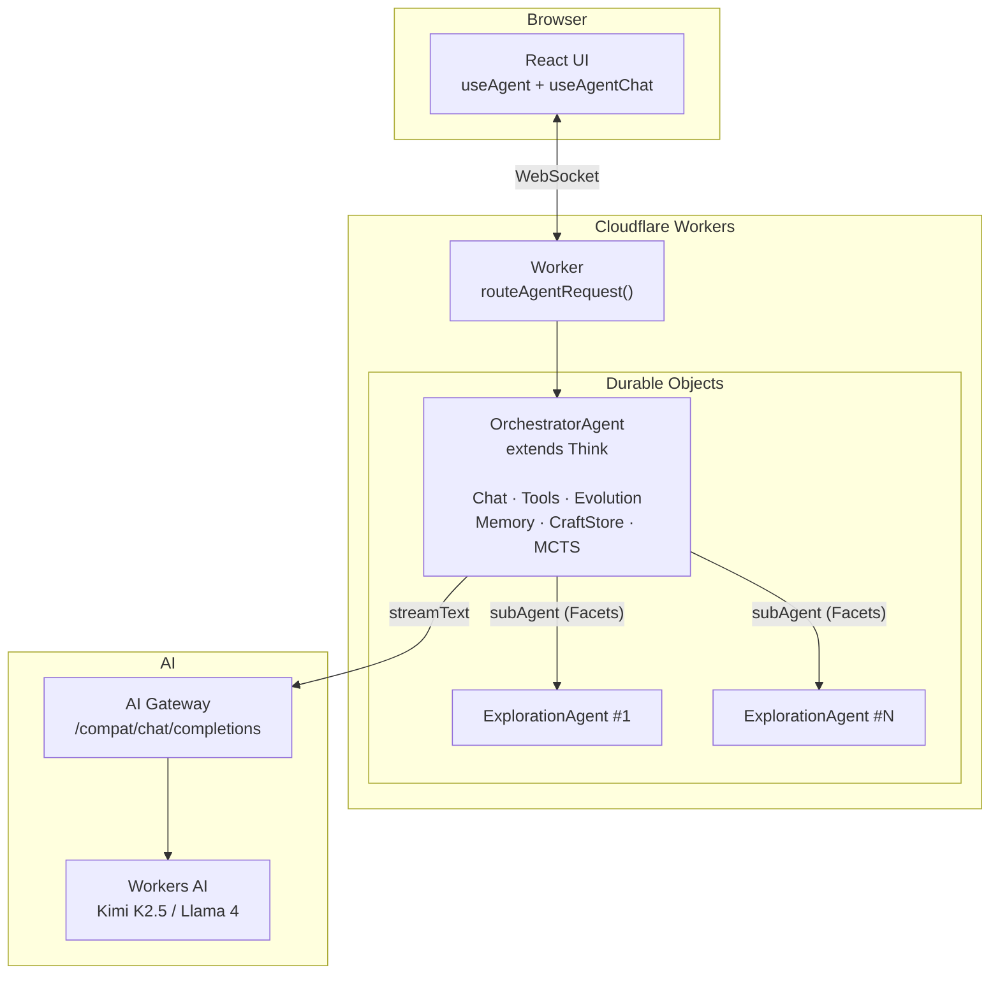

# Proteus

A self-evolving AI agent that improves itself through Monte Carlo Tree Search, learns reusable tool patterns, and rewrites its own execution logic. Built on Cloudflare's [Think](https://github.com/cloudflare/agents) framework with Durable Objects for persistent state and formally verified safety properties in Lean 4.

**Live:** [proteus.ashishkumarsingh.com](https://proteus.ashishkumarsingh.com)

## Architecture



## Key Features

- **MCTS parallel exploration** — UCT selection, backpropagation, pruning, convergence. Each branch is an isolated Durable Object via Facets.
- **3-timescale evolution** — turn-level (quality → reflection), session-level (pattern consolidation → scaffold mutation), lifetime (full MCTS exploration)
- **CraftStore** — learns reusable tools from conversations. EMA scoring with time decay. FTS5-indexed for search.
- **Mutable scaffold** — the agent's agentic loop is code it can rewrite, validated through 4 structural gates
- **POSIX shell emulator** — 16 commands (ls, grep, find, sed, cat, etc.) over virtual filesystem. No real OS needed on Workers.
- **Formally verified** — 75 Lean 4 theorems across 6 categories (Safety, MCTS, Evolution, Agent, Storage, Execution) covering capability safety, storage isolation, budget termination, and backprop correctness
- **Portable** — same core runs on Cloudflare Workers (Think + DOs) or local CLI (bun:sqlite)

## Quick Start

### Web UI

```bash
bun install
cd packages/cf-backend
# Create .dev.vars with AI Gateway credentials (see docs/DEPLOYMENT.md)
CLOUDFLARE_ACCOUNT_ID=<your-id> npx vite dev --port 5173 --host 0.0.0.0
```

### CLI

```bash
curl -fsSL 'https://proteus.ashishkumarsingh.com/install.sh' | bash
proteus setup
proteus create jarvis --mode cloud --alias jarvis --purpose "A helpful coding assistant"
jarvis "summarize this repository"
```

`proteus setup` opens the browser OAuth flow, stores the app session locally,
and can also configure local provider keys for fully local agents.

## Documentation

| Document | Description |
|----------|-------------|
| [Architecture](docs/ARCHITECTURE.md) | System design, message flow, package structure, Think lifecycle |
| [Evolution](docs/EVOLUTION.md) | 3-timescale self-evolution, CraftStore lifecycle, scaffold mutation |
| [MCTS](docs/MCTS.md) | Monte Carlo Tree Search, UCT formula, branch isolation, convergence |
| [Tools](docs/TOOLS.md) | All 15+ agent tools, shell emulator, code execution, crafted tools |
| [Storage](docs/STORAGE.md) | Data model, SqliteFS, MemoryStore FTS5, table schemas |
| [Deployment](docs/DEPLOYMENT.md) | Local dev, Cloudflare deploy, AI Gateway setup, secrets |
| [Formal Spec](docs/FORMAL-SPEC.md) | Lean 4 proofs, TSLean type bridge, verified properties |

## Packages

| Package | Description |
|---------|-------------|
| `core/` | Platform-independent: MCTS engine, EvolutionEngine, CraftStore, scaffold, tools, types |
| `agent-utils/` | SqliteFS (chunked VFS), MemoryStore (FTS5), CraftStore (FTS5), POSIX shell emulator |
| `cf-backend/` | Cloudflare Workers: OrchestratorAgent (Think), ExplorationAgent (Facets), React UI |
| `cli/` | CLI commands: create, chat, evolve, status, list, export, import |
| `cli-backend/` | Linux runtime: bun:sqlite, Node vm sandbox, child_process MCTS branches |

## Development

```bash
bun install
bun run check                    # TypeScript type-check (0 errors)
bun test --cwd packages/core     # 63 unit tests
```

## License

MIT
