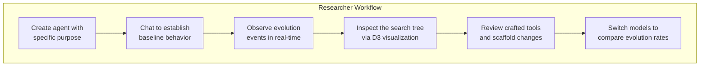

# Applications

## 1. What Kinu Is

Kinu is an agent platform with durable adaptation mechanisms. It:

- runs measured tree searches, judged searches, and unranked ideation swarms;
- builds reusable tools and updates their fitness from execution and later outcomes;
- evaluates reversible changes to its scaffold;
- keeps persistent notes and searchable conversation text.

Those four are independent. None feeds the next, and a workspace can use any one
of them without the others.

Adaptation runs at four timescales:

| Timescale | Frequency | What changes |
|-----------|-----------|--------------|
| **In-episode** | Each settled `execute_tools` call | Crafted-tool fitness |
| **Turn** | Classifiable feedback or execution evidence | Provisional lessons and outcome evidence |
| **Session** | Session close with negative signal | A focused reflection in workspace memory |
| **Lifetime** | Periodic or on demand | Search, tool retirement, and scaffold candidates |

## 2. Web Version Applications

The web version runs on Cloudflare Workers with Durable Objects, accessible at [kinu.run](https://kinu.run).

### Research Platform & Live Demo



The web UI exposes the agent's internal state across six surfaces: Output, Work, Releases, Exploration, Agent, and Environment. You can watch self-evolution as it happens.

### Personal AI Assistant That Learns

Each workspace is a Durable Object with its own SQLite database, hosting its default agent. Conversations persist across sessions. The agent builds up:

- **Long-term memory** (MEMORY.md): reflections, notes, learned facts
- **Crafted tools**: reusable code patterns extracted from successful problem-solving
- **Scaffold improvements**: the agent's own execution logic gets better over time

### Multi-Model Comparison

The model selector switches models mid-conversation, across every connected
provider. On Workers AI the usual spread is:

| Model | Description | Best For |
|-------|-------------|----------|
| DeepSeek V4 Pro 0813 | Reasoning + tools, 1,048k context. The paid-access default. | Complex problems, CTF challenges, algorithm design |
| Kimi K2.6 | Reasoning + tools + vision, 262k context | Long-context and vision-heavy work |
| Nemotron 3 Super 120B / GPT OSS 120B | Reasoning models, 256k / 128k context | Alternate reasoning trajectories |
| Llama 4 Scout | General-purpose instruction model | Quick tasks, simple questions, iteration |

Different models produce different evolution trajectories. A reasoning model
tends to extract more complex tool patterns than an instruction model. Reasoning
effort is a separate dial. `/effort low|medium|high` maps onto each provider
family's native knob, so the same model can be run cheap or deep.

### Hosted Development Environment

Hosted workspaces use one authoritative Nimbus session for files and shell
state. The `workspace` executor provides a real POSIX shell, on-demand language
runtimes, git and package tooling, long-running processes, and capability-hosted
HTTP/WebSocket previews. Sandbox containers and connected devices remain
separate, explicit environments; there is no second Nimbus executor or file
copy between two workspace stores.

## 3. CLI Version Applications

The CLI version runs locally on POSIX with bun:sqlite, and provides the same core capabilities.

### Local Development Agent

```bash
kinu create dev-helper --purpose "A TypeScript development assistant"
kinu chat dev-helper
# Agent has access to execute_tools, run, file, agents, memory, tasks, web, report
# Evolution happens locally; crafted tools persist in ~/.kinu/dev-helper/agent.db
```

The CLI agent can:
- Execute code in a sandboxed subprocess with a sanitized environment. A caller
  may pass a timeout. Nothing imposes one, so long work runs to completion
- Read/write files in its virtual filesystem
- Search memory with FTS5 full-text search
- Learn tool patterns that persist across sessions

### CI/CD Integration

```bash
# Night job: run evolution cycle
kinu evolve dev-helper --budget 5

# Export the workspace to a portable archive
kinu export dev-helper -o dev-helper-v2.kinu.jsonl

# Import on another machine
kinu import dev-helper-v2.kinu.jsonl --name dev-helper
```

A local workspace keeps its whole state in one SQLite file, and `kinu export`
writes that state as a `.kinu.jsonl` archive. Cloud and local workspaces produce
the same archive, and `import` restores either one as a local workspace. So you
can back a workspace up, put the archive in version control, and share it.

### Research Experimentation

The CLI keeps every round trip on your machine, so you can try evolution parameters quickly.

MCTS parameters are durable per-workspace state. `DEFAULT_CONFIG` is frozen and
read at import time, and the workspace's `agent_config` table carries the
overrides on top of it. A swarm takes its shape from the call instead, through
`preset` and the six axes.

```typescript
import { createAgentConfigStore } from '@kinu.run/core';

const config = createAgentConfigStore(sql);
config.setMctsOverrides({
  explorationWeight: 2.0,  // More exploration
  maxDepth: 15,            // Deeper search
});
```

`config.getMctsOverrides()` is what the search reads, so a change takes effect on
the next turn without a restart, and it survives one.

## 4. Design choices

1. **Shared Core policy.** Cloud and local backends share orchestration,
   storage contracts, tools, delegation, and adaptation policy.
2. **Versioned scaffold changes.** Candidate agent-loop changes pass the
   configured checks and retain a rollback version.
3. **Crafted tool lifecycle.** Crafted tools use an exponential moving score,
   relevance decay, and retirement rules.
4. **Facet-backed hosted nodes.** Hosted nodes run as facets with private shell
   and scaffold state over the workspace's canonical files.

## 5. Current Limitations

### Hiring is not measured

A workspace hires durable `SubordinateAgent` facets through the `agents` tool.
Each has its own turn loop and shares the workspace's files, and the same
surface reaches the owner's other workspaces. A swarm's candidates are measured,
because that is what `objective` and the verifier registry are for. A hire's
output is not. Nothing measures whether decomposition beats a single long turn,
how often subordinates duplicate each other's work, or what coordination costs
the orchestrator.

### Evolution is slow in practice

- **Turn-level** works well; pattern extraction fires reliably after an accepted turn that used tools
- **Session-level** needs 5 turns *and* a turn that errored or drew negative feedback; scaffold mutation additionally needs 3+ conversations
- **Lifetime** fires every 5 closed session windows (`lifetimeEvolutionInterval: 5`, `core/src/evolution/types.ts:154`), which is 25 turns; `kinu evolve` runs a search on demand
- The LLM's ability to generalize tool patterns into reusable code is inconsistent

### Evaluation exists; coverage is thin

`scripts/eval.ts` runs one A/B over `core/src/eval/`: one `generateText` call per
model per case, on the corpus cases a model with no tools can answer, scored by a
third model as judge, exiting non-zero below a committed floor. That is the whole
claim it makes. It does not measure the agent, because it uses no tools, no system
prompt and no loop, and it runs only when somebody asks for it. `docs/BENCH.md` is
the instrument that runs real agent solvers against this repository's own checks.

A replay eval (`runReplayEval`) re-runs labelled past turns through the live
scaffold and reports a loss curve. It is on demand only. It used to run on the
lifetime cadence and was removed from it, because it re-executed the same graded
turns GEPA's seed scoring already re-executes for a curve no decision reads. The
shadow-veto promotion decision does not read it either; that decision runs its own
shadow trials.

Breadth is still missing. The seed corpus is small, and these metrics remain
unmeasured:

- Task completion rate before vs after evolution
- Tool reuse frequency
- How much of stored memory a turn actually reads

### Scaffold mutation rarely triggers

The scaffold mutation pipeline is fully implemented, with four-gate validation,
version history and rollback. In practice it fires rarely:

- It needs 3 or more session reflections to trigger
- The LLM often writes scaffolds that fail structural validation, usually on a forbidden pattern such as `import`
- Most conversations do not produce enough data for a scaffold change worth keeping

### The search explorer

The engine broadcasts the latest node-bearing search tree on every changed
iteration. Embedded and full-page explorers share the same live run resource,
retain stale data with visible retryable errors, and resolve historical runs by
id rather than only through the recent-run window.

## 6. Future Roadmap

### Preview-site Isolation

Capability hosts already isolate preview origins and strip Kinu credentials.
Complete cookie-site isolation between sibling previews additionally requires a
preview suffix on a Public Suffix List boundary; that is a DNS/domain deployment
prerequisite rather than an application fallback.

### Multi-Agent Coordination

Delegation to specialist agents shipped through one `agents` surface:
in-workspace subordinates and cross-workspace handoff. What's left of the
original idea:
- Share crafted tools via a global CraftStore (using R2 for cross-DO storage)
- Coordinate search across agents, so one archive covers what several of them explored
- Measure whether hiring actually beats working linearly

### Evaluation Benchmarks

Broaden the existing harness beyond its seed corpus:
- **CryptoHack** (308 crypto challenges): CTF-style verification with known flags
- **SWE-bench**: software engineering tasks with automated verification
- **Custom evolution benchmarks**: measure tool extraction rate, scaffold improvement, and memory reads

### Lean-to-TypeScript Evidence

Extend the Lean pipeline:
- Add shared differential fixtures that execute Lean models and TypeScript on the same inputs
- Mirror proved properties as property-based tests over production functions and SQL paths
- Keep every theorem, trusted assumption, source reference, and missing evidence item enrolled in the CI traceability gate
- Add the missing FTS5 index-to-search and multi-chunk VFS integration coverage
