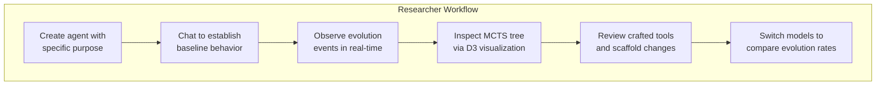
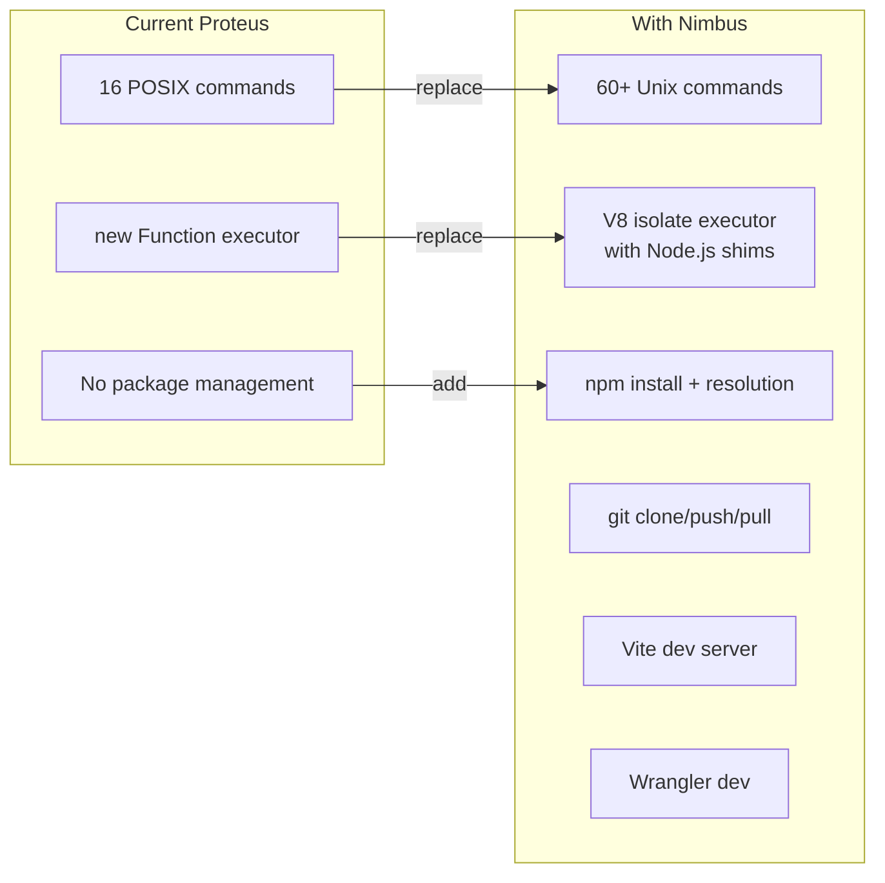

# Applications & Research Positioning

## 1. What Proteus Is

Proteus is a general-purpose AI agent that improves itself over time. Unlike stateless LLMs that forget everything between conversations, or fixed-tool agents that can only use pre-defined capabilities, Proteus:

- **Learns reusable tools** from successful conversations and applies them in future ones
- **Explores multiple strategies** in parallel via Monte Carlo Tree Search
- **Rewrites its own execution logic** (scaffold) based on observed performance patterns
- **Remembers everything** in a persistent, FTS5-searchable memory
- **Has formally verified safety bounds** — Lean 4 proofs guarantee the sandbox can't escalate privileges and MCTS branches can't corrupt shared state

```mermaid
graph LR
    subgraph "Traditional Agent"
        A1[Fixed Tools] --> A2[Stateless LLM]
        A2 --> A3[Single Strategy]
    end

    subgraph "Proteus"
        B1[Learned Tools<br/>CraftStore + EMA scoring] --> B2[Persistent Memory<br/>FTS5 search + reflections]
        B2 --> B3[MCTS Exploration<br/>Parallel strategies]
        B3 --> B4[Self-Modifying Scaffold<br/>4-gate validated]
        B4 --> B5[Formal Safety<br/>Lean 4 proofs]
    end

    style A3 fill:#533483
    style B5 fill:#0f3460
```



The key insight: evolution happens at three timescales simultaneously, each feeding into the next:

| Timescale | Frequency | What Evolves |
|-----------|-----------|-------------|
| **Turn** | Every response | Tool patterns extracted, quality reflected on |
| **Session** | Every 5 turns | Patterns consolidated, scaffold mutation proposed |
| **Lifetime** | Periodic / on-demand | Full MCTS exploration, tool retirement, strategic improvement |

## 2. Web Version Applications

The web version runs on Cloudflare Workers with Durable Objects, accessible at [proteus.ashishkumarsingh.com](https://proteus.ashishkumarsingh.com).

### Research Platform & Live Demo



The web UI exposes the agent's internal state across 6 tabs: Identity, Tools, Memory, MCTS Tree, Evolution timeline, and Logs. This makes Proteus a transparent research platform where you can observe self-evolution as it happens — not just the final output.

### Personal AI Assistant That Learns

Each agent is a Durable Object with its own SQLite database. Conversations persist across sessions. The agent builds up:

- **Long-term memory** (MEMORY.md) — reflections, notes, learned facts
- **Crafted tools** — reusable code patterns extracted from successful problem-solving
- **Scaffold improvements** — the agent's own execution logic gets better over time

Unlike ChatGPT or Claude (which start fresh each conversation), a Proteus agent that helped you debug TypeScript yesterday remembers the patterns it learned and applies them today.

### Multi-Model Comparison

The model selector supports switching between models mid-conversation:

| Model | Description | Best For |
|-------|-------------|----------|
| Kimi K2.5 | Advanced reasoning model with extended thinking | Complex problems, CTF challenges, algorithm design |
| Llama 4 Scout 17B | General-purpose instruction model | Quick tasks, simple questions, iteration |

Different models produce different evolution trajectories. Kimi K2.5 tends to extract more complex tool patterns; Llama 4 Scout produces different evolution patterns.

### With Nimbus: Full Development Environment

[Nimbus](https://github.com/AshishKumar4/Nimbus) is a companion project that provides a complete cloud-native development environment on Cloudflare Workers. Integration would give Proteus agents:

- `npm install` — real package resolution and installation
- `node` — execute JS/TS in isolated V8 isolates with Node.js API shims
- `git` — full git operations (clone, push, pull, merge)
- `vite` — serve web apps with HMR
- `wrangler dev` — run Cloudflare Workers on the actual runtime

This would transform Proteus from a tool-calling agent into a genuine software development agent that can build, test, and deploy real applications.

## 3. CLI Version Applications

The CLI version runs locally with bun:sqlite, providing the same core capabilities without Cloudflare infrastructure.

### Local Development Agent

```bash
proteus create dev-helper --purpose "A TypeScript development assistant"
proteus chat dev-helper
# Agent has access to execute_tools, run, explore, save_note, search_memory
# Evolution happens locally — crafted tools persist in ~/.proteus/dev-helper/agent.db
```

The CLI agent can:
- Execute code in a sandboxed subprocess (30s timeout, sanitized env)
- Read/write files in its virtual filesystem
- Search memory with FTS5 full-text search
- Learn tool patterns that persist across sessions

### CI/CD Integration

```bash
# Night job: run evolution cycle
proteus evolve dev-helper --budget 5

# Export agent state for sharing
proteus export dev-helper -o dev-helper-v2.agent.db

# Import on another machine
proteus import dev-helper-v2.agent.db --name dev-helper
```

Agent state is a single SQLite file. Export, backup, version control, and share agents like code artifacts.

### Research Experimentation

The CLI provides fast iteration on evolution parameters without network latency:

```typescript
import { mergeConfig } from '@proteus/core';

const config = mergeConfig({
  mcts: {
    explorationWeight: 2.0,  // More exploration
    maxDepth: 15,             // Deeper search
    pruneThreshold: 0.2,     // Aggressive pruning
  },
  craftStore: {
    halfLifeDays: 7,          // Faster tool retirement
    retirementThreshold: 0.15,
  },
});
```

## 4. Research Positioning

### Comparison with Existing Work


### Detailed Comparison

| System | Tool Learning | Parallel Search | Self-Modification | Formal Proofs | Persistent State |
|--------|:---:|:---:|:---:|:---:|:---:|
| **Voyager** (Wang 2023) | Skill library | No | No | No | In-game |
| **LATS** (Zhou 2023) | No | MCTS | No | No | No |
| **Toolformer** (Schick 2023) | From annotations | No | No | No | No |
| **CREATOR** (Qian 2023) | LLM creates tools | No | No | No | No |
| **Self-Refine** (Madaan 2023) | No | No | Iterative refinement | No | No |
| **OMNI** (Zhang 2024) | Tool creation | No | Yes | No | No |
| **Tree of Thoughts** (Yao 2023) | No | BFS/DFS | No | No | No |
| **Proteus** | CraftStore + EMA | MCTS + Facets | Scaffold mutation | 75 Lean 4 theorems (8 sorry) | DO SQLite |

### What's Genuinely Novel

1. **Three-timescale evolution with formal guarantees.** No other system combines turn/session/lifetime evolution with Lean 4 proofs. The formal verification isn't cosmetic — it proves that sandbox capabilities are bounded, MCTS branches are isolated, and budget terminates.

2. **Scaffold mutation with structural validation.** The agent rewrites its own agentic loop (the async generator that controls how it processes tasks). This is genuine self-modifying code, but guarded by 4 validation gates that prevent syntax errors, forbidden patterns, and data loss.

3. **CraftStore with automatic lifecycle management.** Tools aren't just learned — they're scored via exponential moving average, time-decayed for relevance, and automatically retired when they stop being useful. No other tool-learning system has this lifecycle.

4. **MCTS branches as isolated Durable Objects.** Each exploration branch is a separate DO with its own SQLite, proven isolated from the orchestrator via Lean 4's `StorageIsolated` invariant. This is stronger isolation than any other MCTS-for-LLM system, and it runs on commodity infrastructure (Cloudflare Workers).

5. **TypeScript ↔ Lean 4 correspondence via TSLean.** The formal spec's types are auto-generated from the TypeScript interfaces, ensuring the proofs operate on the same structures as the code. This level of formal-implementation correspondence is rare in AI agent research.

## 5. Current Limitations

### No Multi-Agent Collaboration

Each Proteus agent is an isolated DO. There's no mechanism for agents to communicate, share tools, or collaborate on tasks. The `ExplorationAgent` facets are MCTS branches, not independent collaborators.

### Evolution is Slow in Practice

- **Turn-level** works well — pattern extraction fires reliably after successful tool usage
- **Session-level** requires 5+ turns to trigger, and scaffold mutation requires 3+ sessions with clear patterns
- **Lifetime** MCTS requires explicit trigger (via `explore` tool or `triggerEvolution` RPC)
- The LLM's ability to generalize tool patterns into reusable code is inconsistent (~50% success rate with Kimi K2.5)

### No Evaluation Framework

There's no automated benchmark suite to measure whether evolution actually improves agent performance. The evolution-proof E2E test (CTF challenges) showed improvement, but this isn't a systematic evaluation. Key missing metrics:

- Task completion rate before vs after evolution
- Tool reuse frequency
- Scaffold mutation impact on quality scores
- Memory utilization efficiency

### Scaffold Mutation Rarely Triggers

The scaffold mutation pipeline exists and is fully implemented (4-gate validation, version history, rollback), but in practice:
- Requires 3+ session reflections to trigger
- The LLM often produces scaffolds that fail structural validation (forbidden patterns like `import`)
- Successful mutations are rare — most conversations don't generate enough data for meaningful scaffold improvements

### MCTS Exploration is Not Real-Time Visible

The MCTS tree visualization in the web UI is a static snapshot loaded once on page load. During active exploration, the UI shows a tool-call spinner with no intermediate tree state. The D3 visualization is fully capable of incremental rendering — it just never receives live updates.

## 6. Future Roadmap

### Nimbus Integration

Port Nimbus's shell emulator, npm client, and Node.js execution engine into Proteus's agent-utils layer. This would give agents real development capabilities:



### Multi-Agent Coordination

Using Cloudflare's Agents SDK, multiple Proteus agents could:
- Share crafted tools via a global CraftStore (using R2 for cross-DO storage)
- Delegate subtasks to specialized agents (code review agent, testing agent, deployment agent)
- Coordinate MCTS exploration across agents for larger search spaces

### Evaluation Benchmarks

Build a systematic evaluation framework:
- **CryptoHack** (308 crypto challenges) — CTF-style verification with known flags
- **SWE-bench** — software engineering tasks with automated verification
- **Custom evolution benchmarks** — measure tool extraction rate, scaffold improvement, memory utilization

### TSLean Continuous Verification

Extend the Lean pipeline:
- Add Mathlib dependency to replace Float axioms with proper real analysis proofs
- Generate Lean types from more TypeScript files (MCTS engine, evolution engine)
- Create a `TypeBridge.lean` that proves equivalence between generated and hand-written types
- CI rejects commits that break any formal property
