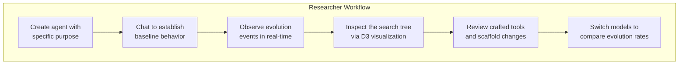

# Applications

## 1. What Kinu Is

Kinu is an agent platform with durable adaptation mechanisms. It:

- runs measured tree searches, judged searches, and unranked ideation swarms;
- builds reusable tools and updates their fitness from execution and later outcomes;
- evaluates reversible changes to its scaffold;
- keeps persistent notes and searchable conversation text.

These four are independent: none feeds the next, and a workspace can use any
one of them without the others.

Adaptation runs at four timescales:

| Timescale | Frequency | What changes |
|-----------|-----------|--------------|
| **In-episode** | Each settled `execute_tools` call | Crafted-tool fitness |
| **Turn** | Classifiable feedback or execution evidence | Provisional lessons and outcome evidence |
| **Session** | Session close with negative signal | A focused reflection in workspace memory |
| **Lifetime** | Periodic or on demand | Search, tool retirement, and scaffold candidates |

## 2. Web Version

The web version runs on Cloudflare Workers with Durable Objects, at
[kinu.run](https://kinu.run).

### Research platform and live demo



The web UI exposes the agent's internal state across six surfaces: Output,
Work, Releases, Exploration, Agent, and Environment.

### Personal assistant with durable memory

Each workspace is a Durable Object with its own SQLite database and default
agent. Conversations persist across sessions. The agent can write long-term
memory (`MEMORY.md`), extract crafted tools from problem-solving, and propose
changes to its scaffold. These are stored capabilities; this document does not
claim a benchmark result for them.

### Multi-model comparison

The model selector switches models mid-conversation across every connected
provider. On Workers AI the usual spread:

| Model | Description | Best For |
|-------|-------------|----------|
| DeepSeek V4 Pro 0813 | Reasoning + tools, 1,048k context. The paid-access default. | Complex problems, CTF challenges, algorithm design |
| Kimi K2.6 | Reasoning + tools + vision, 262k context | Long-context and vision-heavy work |
| Nemotron 3 Super 120B / GPT OSS 120B | Reasoning models, 256k / 128k context | Alternate reasoning trajectories |
| Llama 4 Scout | General-purpose instruction model | Quick tasks, simple questions, iteration |

`kinu` keeps evolution state per workspace. Compare models in separate
workspaces, then compare their records. Reasoning effort is a separate dial:
`/effort low|medium|high` maps onto each provider family's native knob.

### Hosted development environment

Hosted workspaces use one authoritative Nimbus session for files and shell
state: a real POSIX shell, on-demand language runtimes, git and package
tooling, long-running processes, capability-hosted HTTP/WebSocket previews.
Sandbox containers and connected devices stay separate, explicit environments;
there is no second Nimbus executor or file copy between two workspace stores.

## 3. CLI Version

The CLI version runs locally on POSIX with bun:sqlite and provides the same
core capabilities.

### Local development agent

```bash
kinu create dev-helper --purpose "A TypeScript development assistant"
kinu chat dev-helper
# Agent has access to execute_tools, run, file, agents, memory, tasks, web, report
# Evolution happens locally; crafted tools persist in ~/.kinu/dev-helper/agent.db
```

It executes code in a sandboxed subprocess with a sanitized environment, reads
and writes files in its virtual filesystem, searches memory with FTS5, and
keeps tool patterns across sessions. A caller may pass a timeout; nothing
imposes one, so long work runs to completion.

### CI/CD integration

```bash
# Night job: run evolution cycle
kinu evolve dev-helper --budget 5

# Export the workspace to a portable archive
kinu export dev-helper -o dev-helper-v2.kinu.jsonl

# Import on another machine
kinu import dev-helper-v2.kinu.jsonl --name dev-helper
```

A local workspace keeps its whole state in one SQLite file; `kinu export`
writes it as a `.kinu.jsonl` archive. Cloud and local workspaces produce the
same archive, and `import` restores either as a local workspace, so you can
back one up, version it, share it.

### Research experimentation

The CLI keeps every round trip on your machine, so evolution parameters are
cheap to try. MCTS parameters are durable per-workspace state: `DEFAULT_CONFIG`
is frozen and read at import time, the workspace's `agent_config` table carries
overrides on top of it, and a swarm takes its shape from the call instead,
through `preset` and the six axes.

```typescript
import { createAgentConfigStore } from '@kinu.run/core';

const config = createAgentConfigStore(sql);
config.setMctsOverrides({
  explorationWeight: 2.0,  // More exploration
  maxDepth: 15,            // Deeper search
});
```

`config.getMctsOverrides()` is what the search reads, so a change lands on the
next turn without a restart, and survives one.

## 4. Design choices

1. Shared Core policy. Cloud and local backends share orchestration, storage
   contracts, tools, delegation, and adaptation policy.
2. Versioned scaffold changes. Candidate agent-loop changes pass the configured
   checks and retain a rollback version.
3. Crafted tool lifecycle. Exponential moving score, relevance decay,
   retirement rules.
4. Facet-backed hosted nodes. Hosted nodes run as facets with private shell and
   scaffold state over the workspace's canonical files.

## 5. Current limitations

### Hiring is not measured

A workspace hires durable `SubordinateAgent` facets through the `agents` tool.
Each runs its own turn loop over shared files, and the same surface reaches
your other workspaces. Swarm candidates are measured (`objective`, the verifier
registry); hires are not. Nothing measures whether decomposition beats one long
turn, how often subordinates duplicate each other's work, or what coordination
costs.

### Evolution is slow in practice

- Turn-level pattern extraction fires reliably after an accepted turn that used tools
- Session-level needs 5 turns *and* a turn that errored or drew negative feedback; scaffold mutation additionally needs 3+ conversations
- Lifetime fires every 5 closed session windows (`lifetimeEvolutionInterval: 5`, `core/src/evolution/types.ts:154`), which is 25 turns; `kinu evolve` runs a search on demand
- Generalizing tool patterns into reusable code is inconsistent

### Evaluation exists; coverage is thin

`scripts/eval.ts` runs one A/B over `core/src/eval/`: one `generateText` call
per model per case, on corpus cases a model with no tools can answer, judged by
a third model, exiting non-zero below a committed floor. That is the whole
claim it makes. It uses no tools, no system prompt, no loop, so it does not
measure the agent, and it runs only on request. `docs/BENCH.md` runs real
agent solvers against this repository's own checks.

A replay eval (`runReplayEval`) re-runs labelled past turns through the live
scaffold for a loss curve, on demand only. I removed it from the lifetime
cadence because it re-executed the same graded turns GEPA's seed scoring
already re-executes, for a curve no decision reads; shadow-veto promotion runs
its own shadow trials instead.

Still unmeasured: task completion before vs after evolution, tool reuse
frequency, how much stored memory a turn reads. The seed corpus is small.

### Scaffold mutation rarely triggers

Fully implemented (four-gate validation, version history, rollback), rarely
fired:

- Needs 3 or more session reflections to trigger
- The LLM often writes scaffolds that fail structural validation, usually on a forbidden pattern such as `import`
- Most conversations do not produce enough data for a scaffold change worth keeping

### The search explorer

The engine broadcasts the latest node-bearing search tree on every changed
iteration. Embedded and full-page explorers share the same live run resource,
retain stale data with visible retryable errors, and resolve historical runs by
id rather than only through the recent-run window.

## 6. Future roadmap

### Preview-site isolation

Capability hosts already isolate preview origins and strip Kinu credentials.
Sibling-preview cookie isolation additionally needs a preview suffix on a
Public Suffix List boundary: a DNS/domain deployment prerequisite, not an
application fallback.

### Multi-agent coordination

Delegation shipped through one `agents` surface: in-workspace subordinates and
cross-workspace handoff. Remaining of the original idea:

- Share crafted tools via a global CraftStore (R2 for cross-DO storage)
- Coordinate search across agents, so one archive covers what several explored
- Measure whether hiring actually beats working linearly

### Evaluation benchmarks

Broaden the harness beyond its seed corpus:

- **CryptoHack** (308 crypto challenges): CTF-style verification with known flags
- **SWE-bench**: software engineering tasks with automated verification
- **Custom evolution benchmarks**: measure tool extraction rate, scaffold improvement, and memory reads

### Lean-to-TypeScript evidence

Extend the Lean pipeline:

- Shared differential fixtures executing Lean models and TypeScript on the same inputs
- Proved properties mirrored as property-based tests over production functions and SQL paths
- Every theorem, trusted assumption, source reference, and missing-evidence item kept enrolled in the CI traceability gate
- The missing FTS5 index-to-search and multi-chunk VFS integration coverage
