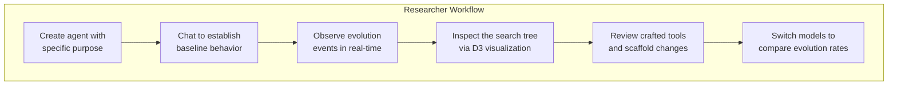

# Applications & Research Positioning

## 1. What Kinu Is

Kinu is a general-purpose AI agent that improves itself over time. It:

- **Searches a tree of agents** against an objective the caller declares, and scores every candidate by running that objective's verifier
- **Learns reusable tools** from successful conversations and applies them in future ones
- **Rewrites its own execution logic** (scaffold) based on observed performance patterns
- **Remembers everything** in a persistent, FTS5-searchable memory
- **Includes CI-gated Lean 4 models**: 330 theorems over 43 requirements check selected abstract invariants, with assumptions and implementation-evidence gaps tracked explicitly

```mermaid
graph LR
    subgraph "Kinu"
        B1[Learned Tools<br/>CraftStore + EMA scoring] --> B2[Persistent Memory<br/>FTS5 search + reflections]
        B2 --> B3[Tree swarm<br/>candidates measured by a verifier]
        B3 --> B4[Self-Modifying Scaffold<br/>4-gate validated]
        B4 --> B5[Lean 4 Models<br/>CI-gated traceability]
    end

    style B5 fill:#0f3460
```



Evolution happens at three timescales at once, and each one feeds the next:

| Timescale | Frequency | What Evolves |
|-----------|-----------|-------------|
| **Turn** | Every response | Tool patterns extracted, quality reflected on |
| **Session** | Every 5 turns | Patterns consolidated, scaffold mutation proposed |
| **Lifetime** | Periodic / on-demand | Full MCTS exploration, tool retirement, strategic improvement |

## 2. Web Version Applications

The web version runs on Cloudflare Workers with Durable Objects, accessible at [kinu.run](https://kinu.run).

### Research Platform & Live Demo



The web UI exposes the agent's internal state across six surfaces: Output, Work, Releases, Exploration, Agent, and Environment. You can watch self-evolution as it happens.

### Personal AI Assistant That Learns

Each workspace is a Durable Object with its own SQLite database, hosting its default agent. Conversations persist across sessions. The agent builds up:

- **Long-term memory** (MEMORY.md): reflections, notes, learned facts
- **Crafted tools**: reusable code patterns extracted from successful problem-solving
- **Scaffold improvements**: the agent's own execution logic gets better over time

### Multi-Model Comparison

The model selector switches models mid-conversation, across every connected
provider. On Workers AI the usual spread is:

| Model | Description | Best For |
|-------|-------------|----------|
| DeepSeek V4 Pro 0813 | Reasoning + tools, 1,048k context. The paid-access default. | Complex problems, CTF challenges, algorithm design |
| Kimi K2.6 | Reasoning + tools + vision, 262k context | Long-context and vision-heavy work |
| Nemotron 3 Super 120B / GPT OSS 120B | Reasoning models, 256k / 128k context | Alternate reasoning trajectories |
| Llama 4 Scout | General-purpose instruction model | Quick tasks, simple questions, iteration |

Different models produce different evolution trajectories. A reasoning model
tends to extract more complex tool patterns than an instruction model. Reasoning
effort is a separate dial. `/effort low|medium|high` maps onto each provider
family's native knob, so the same model can be run cheap or deep.

### Hosted Development Environment

Hosted workspaces use one authoritative Nimbus session for files and shell
state. The `workspace` executor provides a real POSIX shell, on-demand language
runtimes, git and package tooling, long-running processes, and capability-hosted
HTTP/WebSocket previews. Sandbox containers and connected devices remain
separate, explicit environments; there is no second Nimbus executor or file
copy between two workspace stores.

## 3. CLI Version Applications

The CLI version runs locally with bun:sqlite, providing the same core capabilities without Cloudflare infrastructure.

### Local Development Agent

```bash
kinu create dev-helper --purpose "A TypeScript development assistant"
kinu chat dev-helper
# Agent has access to execute_tools, run, file, agents, memory, tasks, web
# Evolution happens locally; crafted tools persist in ~/.kinu/dev-helper/agent.db
```

The CLI agent can:
- Execute code in a sandboxed subprocess (30s timeout, sanitized env)
- Read/write files in its virtual filesystem
- Search memory with FTS5 full-text search
- Learn tool patterns that persist across sessions

### CI/CD Integration

```bash
# Night job: run evolution cycle
kinu evolve dev-helper --budget 5

# Export agent state for sharing
kinu export dev-helper -o dev-helper-v2.agent.db

# Import on another machine
kinu import dev-helper-v2.agent.db --name dev-helper
```

Agent state is a single SQLite file, so you can export it, back it up, put it in version control, and share it.

### Research Experimentation

The CLI has no network latency, so you can try evolution parameters quickly.

MCTS parameters are durable per-workspace state. `DEFAULT_CONFIG` is frozen and
read at import time, and the workspace's `agent_config` table carries the
overrides on top of it. A swarm takes its shape from the call instead, through
`preset` and the six axes.

```typescript
import { createAgentConfigStore } from '@kinu/core';

const config = createAgentConfigStore(sql);
config.setMctsOverrides({
  explorationWeight: 2.0,  // More exploration
  maxDepth: 15,            // Deeper search
});
```

`config.getMctsOverrides()` is what the search reads, so a change takes effect on
the next turn without a restart, and it survives one.

## 4. Research Positioning

### Comparison with Existing Work


### Detailed Comparison

| System | Tool Learning | Parallel Search | Self-Modification | Formal Proofs | Persistent State |
|--------|:---:|:---:|:---:|:---:|:---:|
| **Voyager** (Wang 2023) | Skill library | No | No | No | In-game |
| **LATS** (Zhou 2023) | No | MCTS | No | No | No |
| **Toolformer** (Schick 2023) | From annotations | No | No | No | No |
| **CREATOR** (Qian 2023) | LLM creates tools | No | No | No | No |
| **Self-Refine** (Madaan 2023) | No | No | Iterative refinement | No | No |
| **OMNI** (Zhang 2024) | Tool creation | No | Yes | No | No |
| **Tree of Thoughts** (Yao 2023) | No | BFS/DFS | No | No | No |
| **Kinu** | CraftStore + EMA | Tree swarm + MCTS | Scaffold mutation | 330 theorems over 43 abstract-model requirements; 1 documented SQLite assumption | DO SQLite |

### Design choices

1. **Three-timescale evolution with machine-checked abstract models.** The Lean corpus checks selected properties of hand-maintained models; it does not prove the deployed TypeScript implementation. CI gates compilation, consistency, axiom closure, and traceability, while model-to-code differential fixtures remain planned.

2. **Scaffold mutation with structural validation.** The agent rewrites its own agentic loop (the async generator that controls how it processes tasks). This is self-modifying code, guarded by 4 validation gates that prevent syntax errors, forbidden patterns, and data loss.

3. **CraftStore with automatic lifecycle management.** Learned tools are scored via exponential moving average, time-decayed for relevance, and automatically retired when they stop being useful.

4. **Swarm nodes as isolated Durable Objects.** On Cloudflare a swarm node and an MCTS branch each run inside their own facet with their own SQLite storage. Lean proves a `StorageIsolated` invariant over an abstract transition model; implementation correspondence is tracked but still needs a covering branch-storage integration assertion.

5. **Traceable Lean and TypeScript models.** Each formal requirement records theorem names, modeled TypeScript source locations, classification, and remaining evidence. CI rejects missing theorems, undocumented axioms, and traceability mismatches. The models are hand-maintained rather than generated from TypeScript.

## 5. Current Limitations

### Hiring is not measured

A workspace hires durable `SubordinateAgent` facets through the `agents` tool.
Each has its own turn loop and shares the workspace's files, and the same
surface reaches the owner's other workspaces. A swarm's candidates are measured,
because that is what `objective` and the verifier registry are for. A hire's
output is not. Nothing measures whether decomposition beats a single long turn,
how often subordinates duplicate each other's work, or what coordination costs
the orchestrator.

### Evolution is Slow in Practice

- **Turn-level** works well; pattern extraction fires reliably after an accepted turn that used tools
- **Session-level** needs 5 turns *and* a turn that errored or drew negative feedback; scaffold mutation additionally needs 3+ conversations
- **Lifetime** fires every 5 closed session windows (`lifetimeEvolutionInterval: 5`), which is 25 turns; `kinu evolve` runs a search on demand
- The LLM's ability to generalize tool patterns into reusable code is inconsistent

### Evaluation exists; coverage is thin

There is now a runnable quality benchmark (`scripts/eval.ts` over
`core/src/eval/`) that scores a candidate model against a baseline with an LLM
judge and exits non-zero below a committed floor, plus a replay eval
(`runReplayEval`) that re-runs labeled past turns through the live scaffold to
produce a loss curve. That is a real measurable signal, and the shadow-veto
promotion decision leans on it. Breadth is still missing. The seed corpus is
small, and these metrics remain unmeasured:

- Task completion rate before vs after evolution
- Tool reuse frequency
- How much of stored memory a turn actually reads

### Scaffold Mutation Rarely Triggers

The scaffold mutation pipeline exists and is fully implemented (4-gate validation, version history, rollback), but in practice:
- Requires 3+ session reflections to trigger
- The LLM often produces scaffolds that fail structural validation (forbidden patterns like `import`)
- Successful mutations are rare; most conversations don't generate enough data for meaningful scaffold improvements

### The search explorer

The engine broadcasts the latest node-bearing search tree on every changed
iteration. Embedded and full-page explorers share the same live run resource,
retain stale data with visible retryable errors, and resolve historical runs by
id rather than only through the recent-run window.

## 6. Future Roadmap

### Preview-site Isolation

Capability hosts already isolate preview origins and strip Kinu credentials.
Complete cookie-site isolation between sibling previews additionally requires a
preview suffix on a Public Suffix List boundary; that is a DNS/domain deployment
prerequisite rather than an application fallback.

### Multi-Agent Coordination

Delegation to specialist agents shipped through one `agents` surface:
in-workspace subordinates and cross-workspace handoff. What's left of the
original idea:
- Share crafted tools via a global CraftStore (using R2 for cross-DO storage)
- Coordinate search across agents, so one archive covers what several of them explored
- Measure whether hiring actually beats working linearly

### Evaluation Benchmarks

Broaden the existing harness beyond its seed corpus:
- **CryptoHack** (308 crypto challenges): CTF-style verification with known flags
- **SWE-bench**: software engineering tasks with automated verification
- **Custom evolution benchmarks**: measure tool extraction rate, scaffold improvement, and memory reads

### Lean-to-TypeScript Evidence

Extend the Lean pipeline:
- Add shared differential fixtures that execute Lean models and TypeScript on the same inputs
- Mirror proved properties as property-based tests over production functions and SQL paths
- Keep every theorem, trusted assumption, source reference, and missing evidence item enrolled in the CI traceability gate
- Add the missing FTS5 index-to-search and multi-chunk VFS integration coverage
