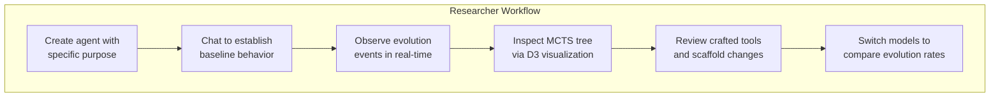
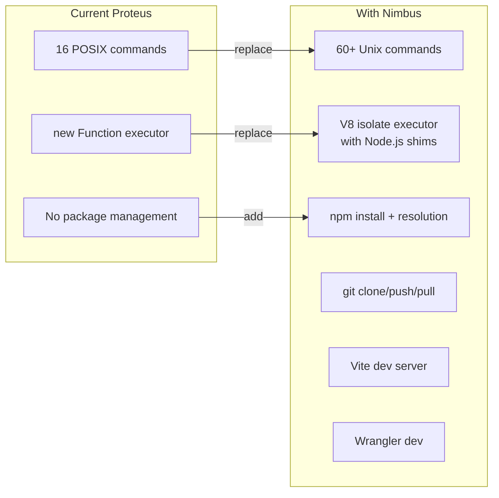

# Applications & Research Positioning

> Maintained by Claude (AI-edited documentation, presented as-is); verify against the code when precision matters.

## 1. What Proteus Is

Proteus is a general-purpose AI agent that improves itself over time. Unlike stateless LLMs that forget everything between conversations, or fixed-tool agents that can only use pre-defined capabilities, Proteus:

- **Learns reusable tools** from successful conversations and applies them in future ones
- **Explores multiple strategies** in parallel via Monte Carlo Tree Search
- **Rewrites its own execution logic** (scaffold) based on observed performance patterns
- **Remembers everything** in a persistent, FTS5-searchable memory
- **Includes CI-gated Lean 4 models** — 84 theorems check selected abstract invariants, with assumptions and implementation-evidence gaps tracked explicitly

```mermaid
graph LR
    subgraph "Traditional Agent"
        A1[Fixed Tools] --> A2[Stateless LLM]
        A2 --> A3[Single Strategy]
    end

    subgraph "Proteus"
        B1[Learned Tools<br/>CraftStore + EMA scoring] --> B2[Persistent Memory<br/>FTS5 search + reflections]
        B2 --> B3[MCTS Exploration<br/>Parallel strategies]
        B3 --> B4[Self-Modifying Scaffold<br/>4-gate validated]
        B4 --> B5[Lean 4 Models<br/>CI-gated traceability]
    end

    style A3 fill:#533483
    style B5 fill:#0f3460
```



The key insight: evolution happens at three timescales simultaneously, each feeding into the next:

| Timescale | Frequency | What Evolves |
|-----------|-----------|-------------|
| **Turn** | Every response | Tool patterns extracted, quality reflected on |
| **Session** | Every 5 turns | Patterns consolidated, scaffold mutation proposed |
| **Lifetime** | Periodic / on-demand | Full MCTS exploration, tool retirement, strategic improvement |

## 2. Web Version Applications

The web version runs on Cloudflare Workers with Durable Objects, accessible at [proteus.ashishkumarsingh.com](https://proteus.ashishkumarsingh.com).

### Research Platform & Live Demo



The web UI exposes the agent's internal state across 6 tabs: Identity, Tools, Memory, MCTS Tree, Evolution timeline, and Logs. This makes Proteus a transparent research platform where you can observe self-evolution as it happens — not just the final output.

### Personal AI Assistant That Learns

Each workspace is a Durable Object with its own SQLite database, hosting its default agent. Conversations persist across sessions. The agent builds up:

- **Long-term memory** (MEMORY.md) — reflections, notes, learned facts
- **Crafted tools** — reusable code patterns extracted from successful problem-solving
- **Scaffold improvements** — the agent's own execution logic gets better over time

Unlike ChatGPT or Claude (which start fresh each conversation), a Proteus agent that helped you debug TypeScript yesterday remembers the patterns it learned and applies them today.

### Multi-Model Comparison

The model selector supports switching between models mid-conversation, across
every connected provider — not just Workers AI. On Workers AI the usual spread is:

| Model | Description | Best For |
|-------|-------------|----------|
| Kimi K2.6 | Reasoning + tools + vision, 262k context. The default. | Complex problems, CTF challenges, algorithm design |
| Nemotron 3 Super 120B / GPT OSS 120B | Reasoning models, 256k / 128k context | Alternate reasoning trajectories |
| Llama 4 Scout | General-purpose instruction model | Quick tasks, simple questions, iteration |

Different models produce different evolution trajectories — a reasoning model
tends to extract more complex tool patterns than an instruction model. Reasoning
effort is a separate dial: `/effort low|medium|high` maps onto each provider
family's native knob, so the same model can be run cheap or deep.

### With Nimbus: Full Development Environment

[Nimbus](https://github.com/AshishKumar4/Nimbus) is a companion project that provides a complete cloud-native development environment on Cloudflare Workers. Integration would give Proteus agents:

- `npm install` — real package resolution and installation
- `node` — execute JS/TS in isolated V8 isolates with Node.js API shims
- `git` — full git operations (clone, push, pull, merge)
- `vite` — serve web apps with HMR
- `wrangler dev` — run Cloudflare Workers on the actual runtime

This would transform Proteus from a tool-calling agent into a genuine software development agent that can build, test, and deploy real applications.

## 3. CLI Version Applications

The CLI version runs locally with bun:sqlite, providing the same core capabilities without Cloudflare infrastructure.

### Local Development Agent

```bash
proteus create dev-helper --purpose "A TypeScript development assistant"
proteus chat dev-helper
# Agent has access to execute_tools, run, skills, agents, memory, web
# Evolution happens locally — crafted tools persist in ~/.proteus/dev-helper/agent.db
```

The CLI agent can:
- Execute code in a sandboxed subprocess (30s timeout, sanitized env)
- Read/write files in its virtual filesystem
- Search memory with FTS5 full-text search
- Learn tool patterns that persist across sessions

### CI/CD Integration

```bash
# Night job: run evolution cycle
proteus evolve dev-helper --budget 5

# Export agent state for sharing
proteus export dev-helper -o dev-helper-v2.agent.db

# Import on another machine
proteus import dev-helper-v2.agent.db --name dev-helper
```

Agent state is a single SQLite file. Export, backup, version control, and share agents like code artifacts.

### Research Experimentation

The CLI provides fast iteration on evolution parameters without network latency:

Search parameters are durable per-workspace state, not a config object passed at
construction: `DEFAULT_CONFIG` is frozen and read at import time, and the
workspace's `agent_config` table carries the overrides on top of it.

```typescript
import { createAgentConfigStore } from '@proteus/core';

const config = createAgentConfigStore(sql);
config.setMctsOverrides({
  explorationWeight: 2.0,  // More exploration
  maxDepth: 15,            // Deeper search
});
```

`config.getMctsOverrides()` is what the search reads, so a change takes effect on
the next turn without a restart, and it survives one.

## 4. Research Positioning

### Comparison with Existing Work

```mermaid
graph TB
    subgraph "Tool Learning"
        TF[Toolformer<br/>Schick 2023]
        CR[CREATOR<br/>Qian 2023]
        TB[ToolBench<br/>Qin 2023]
    end

    subgraph "Self-Evolution"
        VY[Voyager<br/>Wang 2023]
        SR[Self-Refine<br/>Madaan 2023]
        OM[OMNI<br/>Zhang 2024]
    end

    subgraph "MCTS + LLM"
        LATS[LATS<br/>Zhou 2023]
        TOT[Tree of Thoughts<br/>Yao 2023]
        AC[AlphaCode<br/>Li 2022]
    end

    subgraph "Proteus (this work)"
        P[Combines all three<br/>+ CI-gated Lean models<br/>+ persistent state<br/>+ scaffold mutation]
    end

    TF -.->|"tool discovery"| P
    VY -.->|"skill library"| P
    LATS -.->|"MCTS structure"| P
    SR -.->|"reflection"| P

    style P fill:#0f3460
```



### Detailed Comparison

| System | Tool Learning | Parallel Search | Self-Modification | Formal Proofs | Persistent State |
|--------|:---:|:---:|:---:|:---:|:---:|
| **Voyager** (Wang 2023) | Skill library | No | No | No | In-game |
| **LATS** (Zhou 2023) | No | MCTS | No | No | No |
| **Toolformer** (Schick 2023) | From annotations | No | No | No | No |
| **CREATOR** (Qian 2023) | LLM creates tools | No | No | No | No |
| **Self-Refine** (Madaan 2023) | No | No | Iterative refinement | No | No |
| **OMNI** (Zhang 2024) | Tool creation | No | Yes | No | No |
| **Tree of Thoughts** (Yao 2023) | No | BFS/DFS | No | No | No |
| **Proteus** | CraftStore + EMA | MCTS + Facets | Scaffold mutation | 84 theorems over abstract models; 1 documented SQLite assumption | DO SQLite |

### What's Genuinely Novel

1. **Three-timescale evolution with machine-checked abstract models.** The Lean corpus checks selected properties of hand-maintained models; it does not prove the deployed TypeScript implementation. CI gates compilation, consistency, axiom closure, and traceability, while model-to-code differential fixtures remain planned.

2. **Scaffold mutation with structural validation.** The agent rewrites its own agentic loop (the async generator that controls how it processes tasks). This is genuine self-modifying code, but guarded by 4 validation gates that prevent syntax errors, forbidden patterns, and data loss.

3. **CraftStore with automatic lifecycle management.** Tools aren't just learned — they're scored via exponential moving average, time-decayed for relevance, and automatically retired when they stop being useful. No other tool-learning system has this lifecycle.

4. **MCTS branches as isolated Durable Objects.** Each exploration branch has its own Durable Object and SQLite storage. Lean proves a `StorageIsolated` invariant over an abstract transition model; implementation correspondence is tracked but still needs a covering branch-storage integration assertion.

5. **Traceable Lean and TypeScript models.** Each formal requirement records theorem names, modeled TypeScript source locations, classification, and remaining evidence. CI rejects missing theorems, undocumented axioms, and traceability mismatches. The models are hand-maintained rather than generated from TypeScript.

## 5. Current Limitations

### Collaboration exists, but the coordination quality is unproven

This limitation used to read "no multi-agent collaboration at all," and that is
no longer true. A workspace can staff durable `SubordinateAgent` facets through
the `team` tool — each with its own turn loop, sharing the workspace's files —
and reach the owner's other workspaces through `peers`. What is *not* yet shown
is that delegating produces better results than working linearly: there is no
measurement of whether decomposition beats a single long turn, how often
subordinates duplicate each other's work, or how much coordination overhead the
orchestrator pays.

### Evolution is Slow in Practice

- **Turn-level** works well — pattern extraction fires reliably after an accepted turn that used tools
- **Session-level** needs 5 turns *and* a turn that errored or drew negative feedback; scaffold mutation additionally needs 3+ conversations
- **Lifetime** fires automatically every 5 conversations, or on the `triggerEvolution` RPC
- The LLM's ability to generalize tool patterns into reusable code is inconsistent

### Evaluation exists; coverage is thin

There is now a runnable quality benchmark (`scripts/eval.ts` over
`core/src/eval/`) that scores a candidate model against a baseline with an LLM
judge and exits non-zero below a committed floor, plus a replay eval
(`runReplayEval`) that re-runs labeled past turns through the live scaffold to
produce a loss curve. That is a real measurable signal, and it is what the
shadow-veto promotion decision leans on. What is still missing is breadth — the
seed corpus is small, and these metrics remain unmeasured:

- Task completion rate before vs after evolution
- Tool reuse frequency
- Memory utilization efficiency

### Scaffold Mutation Rarely Triggers

The scaffold mutation pipeline exists and is fully implemented (4-gate validation, version history, rollback), but in practice:
- Requires 3+ session reflections to trigger
- The LLM often produces scaffolds that fail structural validation (forbidden patterns like `import`)
- Successful mutations are rare — most conversations don't generate enough data for meaningful scaffold improvements

### MCTS Exploration is Only Coarsely Visible

The engine broadcasts per-iteration progress (`onMctsProgress` →
`broadcastMctsProgress`), so the UI is no longer a single static snapshot. But
what it receives is an iteration counter and remaining budget — not incremental
tree state, so the shape of the search still only resolves once it finishes.

## 6. Future Roadmap

### Nimbus Integration

Port Nimbus's shell emulator, npm client, and Node.js execution engine into Proteus's agent-utils layer. This would give agents real development capabilities:



### Multi-Agent Coordination

Delegation to specialist agents shipped — `team` for in-workspace subordinates,
`peers` for cross-workspace handoff. What's left of the original idea:
- Share crafted tools via a global CraftStore (using R2 for cross-DO storage)
- Coordinate MCTS exploration across agents for larger search spaces
- Measure whether staffing actually beats working linearly

### Evaluation Benchmarks

Broaden the existing harness beyond its seed corpus:
- **CryptoHack** (308 crypto challenges) — CTF-style verification with known flags
- **SWE-bench** — software engineering tasks with automated verification
- **Custom evolution benchmarks** — measure tool extraction rate, scaffold improvement, memory utilization

### Lean-to-TypeScript Evidence

Extend the Lean pipeline:
- Add shared differential fixtures that execute Lean models and TypeScript on the same inputs
- Mirror proved properties as property-based tests over production functions and SQL paths
- Keep every theorem, trusted assumption, source reference, and missing evidence item enrolled in the CI traceability gate
- Add the missing FTS5 index-to-search and multi-chunk VFS integration coverage
