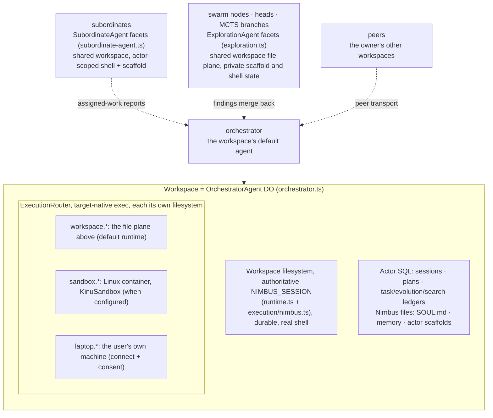
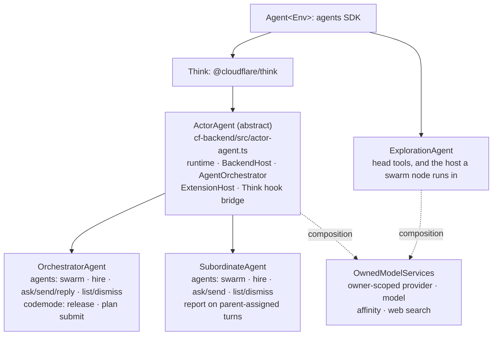
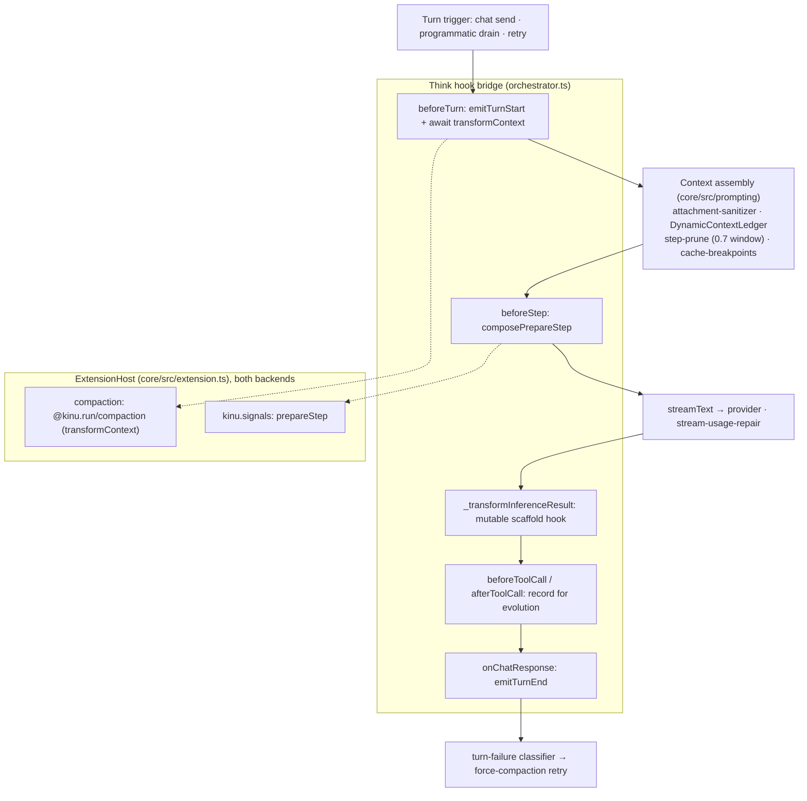
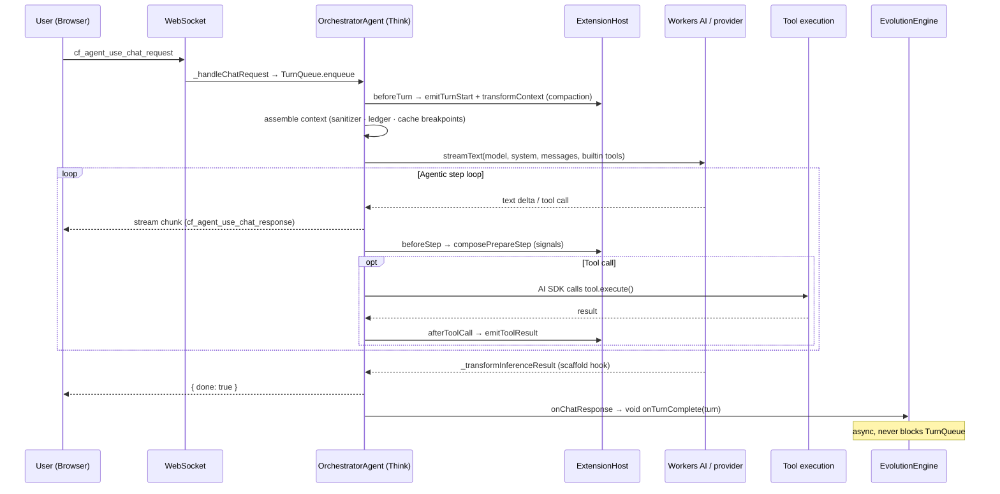
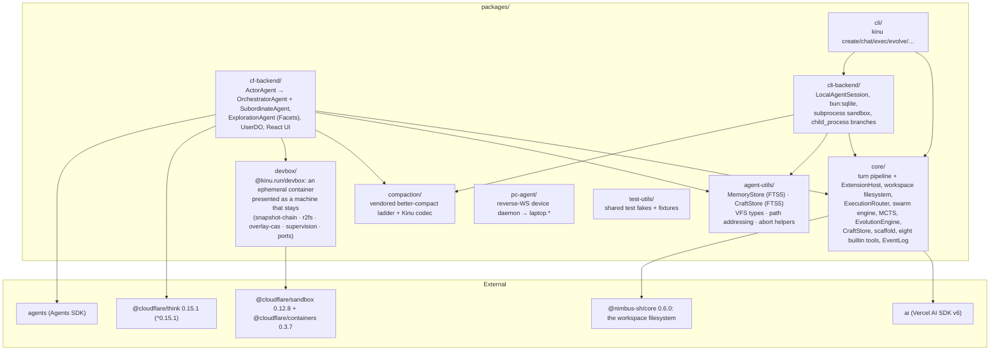

# Architecture

Kinu is an agent platform with durable adaptation mechanisms. You create a
workspace with its own filesystem, execution environments, and sessions. Its
agent answers chat, runs tools, can choose a tree search, builds reusable tools,
and evaluates changes to its own loop.

Platform-neutral policy lives in `packages/core`. The Cloudflare and local
backends supply storage, models, scheduling, and execution. They share Core
orchestration but use different turn transports: Cloudflare Think and the local
`runChat` loop. This document maps that structure to source modules.

## The workspace object model

A workspace is the container; agents are the actors inside it. The workspace is
1:1 with an `OrchestratorAgent` Durable Object on the cloud backend
(`cf-backend/src/orchestrator.ts`). Its file plane is the workspace filesystem
(`core/src/execution/nimbus.ts`), one authoritative `NIMBUS_SESSION` with a
real shell, runtimes, processes, and ports over the same bytes. Its execution plane is an
`ExecutionRouter` (`core/src/execution/router.ts`) that dispatches to whichever
OTHER environment is asked for, running commands target-native rather than
emulating them. There is no mount table. Every other environment is its own
filesystem in its own native paths, reached through its namespace.

The environment list is the source of truth. `listMounts()` (an orchestrator RPC
over `listEnvironments(executionRouter)`, `core/src/read-models/files.ts`)
returns one row per executor that has a filesystem, with its namespace prefix,
whether it is live, and its declared policy (`readOnly`, `rootPath`, and a
`durable | ephemeral | live-shared` consistency). The `laptop` environment is
served by the `pc-agent` reverse-WebSocket daemon (`packages/pc-agent`) running
on the user's machine. The `sandbox` environment is a Cloudflare container. A
container is spot capacity, so `@kinu.run/devbox` (`packages/devbox`) presents
one as a machine that stays: files survive, supervised processes come back, and a
preview URL keeps its hostname. `KinuSandbox`
(`cf-backend/src/kinu-sandbox.ts`) is a thin subclass. It supplies only the four
things that are Kinu's own: the backup bucket, the preview zone, the two
questions Devbox asks the owning workspace, and Kinu's egress interception. See
[WORKSPACES.md](./WORKSPACES.md) for the full noun model and
[EXECUTION-LAYER-SPEC.md](./EXECUTION-LAYER-SPEC.md) for the execution planes.

## The actor hierarchy

Three DO classes act inside a workspace, and their inheritance is the security
model:

`ActorAgent` owns everything a full-loop actor needs once: the CF runtime
assembly, the `BackendHost`, the shared `AgentOrchestrator`, `ExtensionHost` +
compaction, the dynamic-context ledger, the prompt/model/tool caches, and the Think
hook bridge. A subclass supplies ten abstract members (`getOwnerUserId`,
`actorKind`, `ensureSchema`, `actorToolDeps`, `engine`, `notifyOwner`,
`delegationBudget`, `subordinateFacet`, `ownMission` and `persistAutoTitle`)
plus three optional hooks (`workspaceName`, `extraCodemodeProviders`,
`isClientRpcMethodDenied`). `persistAutoTitle` is the backend half of the
auto-title seam: core decides a workspace needs a name, and the subclass stores
it where that backend keeps workspace state.

**Tool gating is structural.** A prompt never decides it. Every full-loop actor
gets the ordinary built-ins, and the `agents` schema is derived from the
capabilities its profile wires (`actorAgentsActions`,
`cf-backend/src/actor-agent.ts`). Every actor can `swarm`, because the search
substrate is wired unconditionally. `hire`, `ask`, `send` and `list` need a
subordinate roster or peer transport; `dismiss` needs the roster; `reply` needs
peers, and only the orchestrator wires those. At the delegation depth cap
`teamProfile()` returns nothing, so the roster and the hire rung disappear
together. `report` is present only for a subordinate's parent-assigned turn.
Release is a codemode provider only on the orchestrator and is omitted from
Plan-mode tool construction; `submit_plan` is present only for an orchestrator
Plan turn.

**`ExplorationAgent` deliberately stays on the bare `Agent`.** It has three
explicit modes. An MCTS rollout gets no tools and no runtime. A branching
head gets the hand-built head surface (evidence, decisions, `execute_tools`,
`run`, `file`, `web`, and depth-budgeted subheads) over the canonical parent
workspace. A swarm node arrives as a serialisable `NodeRunSpec` over RPC, and
`runAsNode` calls the same `runNodeLoop` an in-isolate node runs, so the facet
is a transport. Hosting buys a storage boundary and a teardown verb. It adds no
second runtime. A head and a node share the workspace's files, processes and
ports, while their SQL journal, scaffold path, and `shellId` are private.
Neither inherits the full actor tool surface. Recursion is bounded by
construction. `split_subheads` decrements `maxDepth` on every spawn and refuses
once the budget is exhausted.

All three share the owner/provider/model/web substrate by **composition** rather
than inheritance. `OwnedModelServices`
(`cf-backend/src/owned-model-services.ts`) resolves the owner's provider
registry, the model spec, the Workers-AI session-affinity key, and the web-search
provider. `ActorAgent` constructs it with `ownerRequired: true`;
`ExplorationAgent` constructs its own with `ownerRequired: false`, taking the
owner from the `facet_owner` row its parent seeds.

## Subordinates

`agents({action:'hire', ...})` calls `this.subAgent(subordinateFacet(), name)`
on the hiring actor (`cf-backend/src/actor-agent.ts`) and immediately seeds the
facet's identity. Any actor with a roster can hire, so a subordinate tree is
recursive down to the delegation depth cap. That identity is single-row and
immutable after seeding. Re-seeding with a different name, parent workspace, or
owner throws, and the seeding RPC is denied to client sockets, so only a
worker-held parent stub can create one.

A subordinate is a *durable* teammate. It has its own
SQLite turn/history state, full loop, and evolution engine, and survives
hibernation. Its runtime is keyed to the parent's workspace name, so it uses the
same authoritative Nimbus files, processes, ports, container, and device consent.
Its `shellId` and scaffold path are actor-private; its rendered identity comes
from `subordinate_identity` rather than overwriting the workspace `SOUL.md`.

Work arrives as an `ingress: 'subordinate'` event with variant
`subordinate_task`; results come back through `receiveSubordinateEvent` as
variant `subordinate_report`, which broadcasts to sockets and schedules a drain
on the parent. If a subordinate finishes an assigned turn without calling
`report`, its answer is relayed automatically. Owner-driven subordinate chat is
private and has no report tool. `dismiss` deletes the facet
unless `keep_history` is set, in which case only the roster row is marked
dismissed.

The local backend hires too, through `LocalAgentHost`
(`cli-backend/src/agent-host/host.ts`). The daemon holds one
`LocalAgentSession` per bound agent for its whole process lifetime: every root
agent it has a ref for, and every live subordinate beneath one. A root is not the
workspace. Several roots share one virtual workspace as equal peers, and the
workspace is the `{ cwd, workspaceId }` pair on their refs. The host installs
three dependency sets after construction, and each one decides whether a tool
exists. `setTeam` gives an agent a subordinate roster. `setPeers` gives a root
the peer transport that makes `reply` reachable. `setReport` gives a subordinate
the tool it reports to its parent with. The durable work stays in the
same `EventLog`, `background_jobs`, fiber and `outbox_peer` tables both backends
use. The host adds no second queue and no second turn loop.

The system prompt (`core/src/prompt.ts`) carries the matching doctrine. Its
delegation ladder steers the agent to decompose multi-part or multi-hour work,
hire one subordinate per independent workstream, and keep the coordination and
integration turn for itself.

## The turn pipeline

Every turn, cloud or local, flows through the same `ExtensionHost`
(`core/src/extension.ts`), the one extension point both backends fire. On the
cloud the `OrchestratorAgent` bridges Think's subclass hooks onto that host;
on the CLI, `LocalAgentSession` (`cli-backend/src/local-session.ts`) drives
`runChat` with the same host. There is deliberately no private callback path
running parallel to the plugin API.

Three kinds of agent run turns here, on two turn bodies. `runChat`
(`core/src/chat.ts`) is the body for a CLI session and for a
swarm node alike, because a node reaches it through `runHeadInference`, which
owns no loop of its own (`core/src/heads/head-inference.ts`). One implementation
therefore holds the stall watchdog, the dead-stream detection, the mid-step
abort, the step-boundary pruning and the unpaired-tool-call repair for both. The
cloud actor is the exception because its loop belongs to Think. The vendor
drives the steps and Kinu binds to the hooks below. A node registers no
extensions, so compaction and signal delivery belong to an actor's turn alone.

**No turn carries a step cap.** Think OR-s `stepCountIs(this.maxSteps)` ahead of
anything a caller passes, and the vendor default of 10 cut production turns with
the model still emitting tool calls. `ActorAgent` therefore sets
`UNBOUNDED_MAX_STEPS` and `UNBOUNDED_STEPS` on the Think config
(`cf-backend/src/actor-agent.ts`), and `runChat` hands its `stopWhen` straight to
`streamText` with `UNBOUNDED_STEPS` as the default (`core/src/chat.ts`). Heads
and swarm nodes still run bounded stop conditions of their own, because a node is
one graded attempt rather than a conversation.

A finished run is named rather than guessed. Each backend passes facts to
`classifyRunEnd` (`core/src/orchestrator/turn-lifecycle.ts`) and gets back the
`RunEndReason`. A cut turn is `aborted` even when it also threw, because a user
who pressed Stop caused no failure. A throw is `error`. A clean end is
`completed`. One state stays impossible: a turn that reached its own end cannot
have tool calls pending. The completed arm checks for it and fires the
`turn.ended_mid_work` tripwire as a diagnostic failure rather than adding a
fourth word to the ledger, because the step ceiling was the only thing that ever
produced that state. The tripwire says when that stops being true.

What the boxes are:

| Think hook | Kinu binding | Module |
|---|---|---|
| `beforeTurn` | `emitTurnStart`, then the awaited `transformContext` chain; the turn-local tail is appended **after** the transform; tools folded into `activeTools` | `orchestrator.ts`, `core/src/extension.ts` |
| `beforeStep` | `composePrepareStep`: extension chain, then step-pruning, then the dynamic-context weave, cache-breakpoint markers last | `core/src/prompting/prepare-step.ts` |
| `beforeToolCall` / `afterToolCall` | `emitToolCall` / `emitToolResult`; the evolution engine records each call | `orchestrator.ts` |
| `_transformInferenceResult` | the **mutable scaffold** hook. An evolved `agent.js` becomes the turn's inference loop; un-evolved passes through untouched | `core/src/scaffold/inference-transform.ts` |
| `onChatResponse` | `emitTurnEnd` → fire-and-forget evolution (never blocks the queue); the turn-failure classifier may arm a one-shot force-compaction retry | `orchestrator.ts`, `core/src/turn-failure.ts` |
| `getModel` / `getSystemPrompt` / `getTools` | model from `agent_config`; `SOUL.md` from the VFS; the eight builtin tools, filtered to the actor's wired deps | `core/src/tools/registry.ts` |

The two default registrants attach at construction on both backends:

- **Compaction** (`@kinu.run/compaction`, `createCompactionExtension`) is the
  default `transformContext`. It is the vendored better-compact staged-pruning
  ladder (`compaction/src/engine/`) plus the Kinu codec
  (`compaction/src/codec.ts`, AI-SDK `ModelMessage[]` ⇄ ladder `Turn[]`). It
  runs once per turn assembly over shared stores: raw transcripts in the
  canonical workspace VFS, the replayable plan + the
  measured token trigger in one `compaction_state` row. The trigger is 85% of
  the model's context window (`COMPACTION_PRESETS.light`, measured against the
  provider's own reported prompt tokens floored by the history estimate plus the
  system prompt), and the rungs run cheapest-first: **superseded ephemeral
  context** → skills → superseded reads → error inputs → old tool output →
  reasoning → remaining tool output → assistant runs → prefix summary. The first
  rung is Kinu's own (`relieveEphemeralPressure`). A superseded
  `<dynamic_context>` block is stale by definition and re-derivable from live
  state, so it is the cheapest thing in the request to give up. Being woven per
  model step, it is also the one thing a ladder stage can never see. What
  it frees is subtracted from the pressure the engine is told about, so relief
  here can stand the rest of the ladder down.
- **Signal delivery** (`kinu.signals`, a `prepareStep` hook) is the ONE way
  anything asynchronous reaches the agent (`core/src/orchestrator/signals.ts`).
  A producer (the event-hub drain, a settled background job, an overflow retry,
  a take pick, an MCP task) states intent and nothing else. A signal compatible
  with the active turn is spliced into its next step using the `StepInjections`
  math (`core/src/prompting/step-injections.ts`); a signal that requires its own
  turn or carries a different trusted Plan/Build mode is enqueued immediately
  through `BackendHost.enqueueTurn`. When no turn is running, enqueueing starts
  one. `BackendHost.turnInFlight` and the trusted mode are the only routing
  facts. A spliced message is ephemeral exactly like the `<dynamic_context>`
  block beside it. It is model-visible at the tip, absent from durable history,
  and gone on a cold start. The turn's own mechanical steering
  (`core/src/orchestrator/turn-steering.ts`) is handed to the step being
  prepared rather than delivered, so it cannot outlive it. Every compatible
  live-turn signal uses one buffer and one splice, so no registration order can
  shift another producer's recorded indices; queued own-turn signals use the
  same delivery host without entering that buffer. It is the DO counterpart of
  the CLI's `kinu.steering` drain, the same mechanism on one host.

Supporting context machinery, all in `core/src/prompting` and shared by both
backends: the **attachment sanitizer** (`attachment-sanitizer.ts`) offloads
model-incompatible file parts to `attachments/` so a poisoned transcript
heals byte-stably; the **DynamicContextLedger** (`volatile-context.ts`) re-reads
live state at every model step and appends a fresh `<dynamic_context>` block only
when its render changes, freezing earlier blocks in place to preserve provider
cache breakpoints (`dropSuperseded`, the compaction ladder's first rung, is the
only thing that ever unfreezes one); **step-prune**
(`step-prune.ts`, `STEP_CONTEXT_BUDGET_RATIO = 0.7`) shrinks old tool outputs once
a step nears the window; **cache-breakpoints** (`cache-breakpoints.ts`) places
Anthropic `cache_control` / OpenAI `prompt_cache_key`; and **stream-usage-repair**
(`cf-backend/src/providers/stream-usage-repair.ts`) fixes Cloudflare AI SSE that
zeroes `cached_tokens` in its duplicate final chunk. See
[EXTENSIONS.md](./EXTENSIONS.md) for the per-turn hook contract.

## Message flow (cloud)

The browser side is `WorkspacePage.tsx` → `use-kinu.ts` → the agents SDK
WebSocket transport; the worker entrypoint is `cf-backend/src/server.ts`
(`routeAgentRequest`, plus the `email()` handler). The CLI takes the same core
loop through `LocalAgentSession` instead of the WebSocket transport.

## Events and ingress

The workspace wakes on external events as well as on chat, through a durable
`EventLog` (`core/src/events/hub/log.ts`, schema in
`core/src/events/hub/schema.ts`). Delivery uses a **lease**. The `consumed_at`
column on the `agent_log` table is set when an event is bound to a turn
(`markConsumed`), cleared on completion (`markTurnCompleted`), released on
abort/replan (`unbind`), and re-pended by a stale-sweep for stranded leases
(`unbindStale`). A `DrainScheduler` (`core/src/orchestrator/drain-scheduler.ts`,
250 ms debounce) coalesces a burst of events into one programmatic turn instead of
one turn per event.

Five ingress paths publish into the log:

| Source | Path | Wakes via |
|---|---|---|
| Email | `core/src/events/ingress/email.ts` (+ `server.ts` `email()`) | `ingress: 'email_inbound'` |
| Webhook | `core/src/events/ingress/webhook.ts` (+ `cf` `events/routes.ts`) | per-trigger HMAC / Bearer / mTLS |
| Peer | `core/src/events/ingress/peer.ts` (`outbox_peer` → `PeerHub`) | `ingress: 'peer_async'` (cross-workspace) |
| Subordinate | `core/src/events/ingress/subordinate.ts` (+ `subordinates/support.ts` admission) | `ingress: 'subordinate'` (variants `subordinate_task`, `subordinate_report`) |
| Timer | `core/src/events/ingress/triggers.ts`, driven by each backend's clock | `ingress: 'timer_alarm'` (cron / one-shot) |

Core owns the gates: auth, replay window, rate limit, trust, and admission.
Each backend supplies only the transport in front of one. On cf that is the
Worker's HTTP and `email()` routes plus the DO alarm; locally it is the process
timer.

The full `IngressKind` union in `core/src/events/hub/types.ts` is wider than
this (it also names `chat_ws`, `sandbox_cb`, `process_watch`, `file_watch`,
`mcp_streamable`, `self_emit`, and `reply_request`), but the five above are the
paths that wake a sleeping workspace from outside its own turn.

## MCP: user-level once-auth, zero token transfer

MCP servers are authenticated **once at the user level** and held by the `UserDO`
(`cf-backend/src/user/user-do.ts`, `user_mcp_servers` table; OAuth callback at
`userMcp_handleOAuthCallback`). Agents never receive a token. The orchestrator
fetches only serializable tool descriptors (`buildUserMcpTools`) and each tool's
`execute` closure RPCs back to `userMcp_callTool(caller, serverId, …)` on the
UserDO, where the one credentialed call runs. The caller is a **workspace
capability token** rather than a claimed name, so there is nothing to spoof. The
token exists only for a workspace this user's registry issued one to, and dies
with it. A second in-SQL check covers server membership + `allowed_tools`.

## The UserDO caller boundary

Every secret a user owns lives in one `UserDO`, and every privileged method on
it takes a `UserCaller` first and gates on `requireTier`
(`cf-backend/src/user/workspace-capability.ts`). Worker routes act for the owner
whose identity the edge verified and present the owner capability,
`ownerCaller(env)`, an HMAC of the Worker's own secret, so owner authority is
something the deployment holds rather than a string any module can type. A
workspace presents the per-workspace secret minted for it at claim time and
stored hashed, and the UserDO looks its tier up live in `workspace_tiers`. The
token is identity rather than capability, so re-tainting a workspace is a single
row update.

Neither kind is an attestation of who is calling. Cloudflare gives a Durable
Object no way to learn that, so a sibling DO sharing `env` can derive the owner
capability too. What the boundary buys is that the tool surface (the part an
injected prompt can steer) reaches the UserDO only through code presenting a
workspace token, and is attenuated by tier whichever tool gate someone forgets.

Today every workspace is registered `full`, the whole user surface, exactly as
before. The `shared` tier is what a workspace shared with a second human will
get. It has full capability inside itself and no reach into the owner's wider
account.
Facets (subordinates, heads, MCTS branches) present their PARENT workspace's
token, so they attenuate with it and have no identity of their own to forget.
Enforcement lives where the secrets are, so no workspace-DO code path or
forgotten tool gate can route around it.

## Evolution

Evolution runs across four timescales, each feeding the next. The step clock ticks
inside a single long turn; the other three are conversational and belong to the
`EvolutionEngine` (`core/src/evolution/engine.ts`):

- **In-episode.** Every settled `execute_tools` call scores crafted-tool fitness
  into `craft_scores` with one synchronous SQL write and no model call
  (`core/src/orchestrator/craft-cycle.ts` over `core/src/craft/in-episode.ts`).
- **Turn-level.** `reviewTurn()` assesses the just-finished turn; a negative
  outcome gates a reflection into memory, a strong one extracts a reusable
  crafted tool into the CraftStore.
- **Session-level.** `onSessionReflection()` consolidates patterns and may call
  `maybeEvolveScaffold()` to propose a new `agent.js`.
- **Lifetime.** `onLifetimeEvolution()` runs replay eval, craft consolidation,
  and full `runMCTS()`.

MCTS branch rewards are **execution-grounded on both backends**. The single
scorer (`core/src/mcts/evaluation.ts`) lets execution outcome dominate the judge
for CF Facets, the CF inline fallback, and CLI child-process branches alike. Gates
run before a scaffold mutation takes effect: a **misevolution gate**
(`core/src/scaffold/misevolution.ts`) rejects harmful edits by fixed criteria, a
**shadow-veto** (`core/src/scaffold/shadow.ts`, `maxRegressions: 1`,
`minDecisiveTrials: 5`, Monte-Carlo-derived) rejects regressions, and a **DGM-style
archive** (`core/src/scaffold/archive.ts`) keeps prior variants as stepping
stones, ranked for re-branching by clade-metaproductivity (what a lineage went
on to produce) rather than by each variant's own score.
Every self-modification surfaces as a human-readable card via the **Evolution
Changelog** (`core/src/evolution/changelog.ts`). See [EVOLUTION.md](./EVOLUTION.md)
and [MCTS.md](./MCTS.md).

## Package structure

## Backends and the AgentRuntime contract

`AgentRuntime` and `BackendHost` are the two interfaces a backend implements, and
they are the whole contract: implement the pair and `packages/core` runs on your
platform. The Cloudflare
backend (`packages/cf-backend`) binds actor state to Durable Object SQLite,
workspace files and execution to Nimbus, and the turn driver to Think. The local
CLI backend (`packages/cli-backend`) binds them to `bun:sqlite` and a local
process.

| Primitive | CF backend | CLI backend |
|---|---|---|
| Storage | Nimbus VFS + actor DO SQL | Nimbus VFS over `bun:sqlite` + actor SQL |
| Memory | MemoryStore (FTS5 BM25) | MemoryStore (FTS5 BM25) |
| Executor | codemode LOADER / `new Function()` fallback | Bun subprocess sandbox |
| LLM | Workers AI binding or AI Gateway | AI Gateway via AI SDK |
| Schedule | `agent.runFiber()` (durable) + DO `alarm()` | SQLite-backed fiber |
| Identity | DO id + `SOUL.md` (VFS) | UUID + `~/.kinu/` + `SOUL.md` (VFS) |
| Turn driver | `OrchestratorAgent` (Think hooks) | `LocalAgentSession` (`runChat`) |
| Swarm nodes | `ExplorationAgent` Facets (`spawnNodeFacet`) | the search's own process (no host wired) |
| MCTS branches | `ExplorationAgent` Facets (`subAgent`) | `child_process.fork` |
| Subordinates | `SubordinateAgent` Facets (`subAgent`) | `LocalAgentSession` per agent, held by `LocalAgentHost` |

The full contract and the four extension points (`ModelProvider`,
`ExplorationStrategy`, `ActorAgent`, `KinuExtension`) are in
[EXTENSIBILITY.md](./EXTENSIBILITY.md).

A chat surface reaches either backend through one client contract, `AgentClient`.
[AGENT-CLIENT-ARCHITECTURE-SPEC.md](./AGENT-CLIENT-ARCHITECTURE-SPEC.md) holds
that contract: which side owns which state, the connect-ticket exchange, the
`AGENT_RPC_ACCESS` scope policy, and the designs that were rejected.

## Model providers

Model choice is per workspace and resolved through a provider registry
(`core/src/providers/registry.ts`) that both backends build differently and then
use identically. The cloud registers `workers-ai`, the user's own `my-gateway`,
the platform `ai-gateway` fallback, `codex`, `openai`, `anthropic`,
`openrouter` and `openai-compat`, then a dynamic source backed by the live
models.dev catalog (`cf-backend/src/providers/agent-registry.ts`). The CLI
registers the same set and the same dynamic source, and adds `claude` (the local
Claude Code binary), `opencode`, and one `openai-compat:<name>` entry per
extra compatible credential the user configured
(`cli-backend/src/model-resolver.ts`). Its `workers-ai` and `my-gateway` entries
resolve three ways: a local gateway endpoint, a proxy through the owner's cloud
account, or a signed-out placeholder that says what is missing. Registration
order is the default-preference order.

Two policies apply to every provider:

- **The catalog is live.** `core/src/providers/models-dev.ts` fetches
  `https://models.dev/api.json` behind a 5-minute cache and derives each model's
  context window and capabilities from it. The static per-provider lists
  (`WORKERS_AI_FALLBACK_MODEL_CATALOG`, each provider's `FALLBACK_MODELS`) serve
  as the fallback when that fetch fails or filters to nothing.
- **Every model fetch waits out rate limits, and the wait has no ceiling.**
  `withRateLimitRetry` (`core/src/providers/rate-limit-retry.ts`) wraps the fetch
  of every provider: the shared `createAuthedFetch`, the Workers AI path, the AI
  Gateway path, and codex. A rate-limited request keeps following the provider's
  `Retry-After` until it succeeds, fails for another reason, or the caller
  cancels it. Elapsed time and attempt count never end it. It treats 429 and 529
  as rate limits always, and a 503 only when the status text, `x-error-code` or
  body reads as overload, capacity or too many requests; a 503 whose body it
  cannot read propagates rather than being called healthy. Without a
  `Retry-After` it draws a full-jitter wait under a ceiling that doubles from 2 s
  to a 60 s cap. Requests whose body is not replayable pass through untouched.
  Two things ride beside the retry because a provider is shared. `ProviderPacer`
  (`core/src/providers/pacing.ts`) spaces request starts per host and holds the
  lane only while a request awaits headers, so a request sleeping out a
  `Retry-After` frees capacity a sibling can use and streaming bodies are
  untouched. Every wait is declared before it is taken, so siblings join one
  provider cooldown instead of each starting a fresh request. The AI SDK's own
  transport retry stays at its default of 2, stated explicitly at `streamText`
  as `PROVIDER_SDK_RETRIES` so a vendor update cannot move it in silence.

**Reasoning effort** is yours to set. `/effort` in chat or
`kinu effort <name> [level]` stores `reasoning_effort` in the workspace's
`agent_config`, with `~/.kinu/config.json` holding the CLI-side default for
new workspaces. `core/src/strategy/effort.ts` maps the level onto each provider
family's native knob: `reasoning_effort` for Workers AI, `reasoningEffort` for
OpenAI-shaped and OpenRouter providers, and a thinking `budgetTokens`
(4k/16k/32k) for Anthropic. Internal stages carry their own level from
`REASONING_EFFORT_FOR_STAGE`, sized to the work: reflection and
MCTS rollouts run `low`, scaffold mutation runs `high`.

## Storage and formal models

Workspace state has two explicit authorities. The Nimbus session owns files,
including `SOUL.md`, memory markdown, and scaffolds. The workspace actor's
SQLite owns relational state: plans, messages, memory/craft indexes, MCTS,
search records, evolution, event logs, and Think session tables. The schema and
boundaries are documented in [STORAGE.md](./STORAGE.md), and the vendored
filesystem itself in [NIMBUS-INTEGRATION.md](./NIMBUS-INTEGRATION.md).

Selected core algorithms are modeled in Lean 4 (`lean/`). The corpus has 405
named theorems over hand-maintained abstract models of agent, evolution,
execution, exploration, MCTS, safety, and storage properties, enrolled against
47 requirements with no `sorry` (counted 2026-08-25 by
`lean/check-traceability.mjs`).
Their axiom reports use only Lean's three kernel axioms; one
separate SQLite FTS5 assumption is documented and enrolled. CI
(`.github/workflows/lean-verify.yml` → `scripts/verify-lean.sh`) gates
compilation, negative consistency, axiom closure, and requirement-to-proof-to-source
traceability. These are checked statements about the models. They are not a
proof that the deployed TypeScript refines them. See
[FORMAL-SPEC.md](./FORMAL-SPEC.md).
