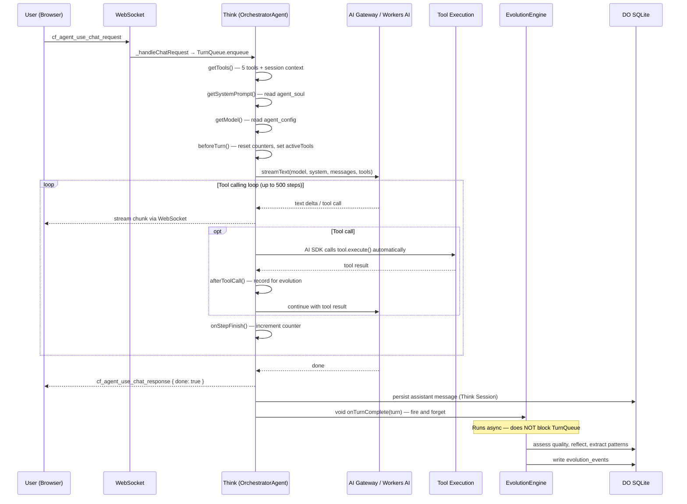
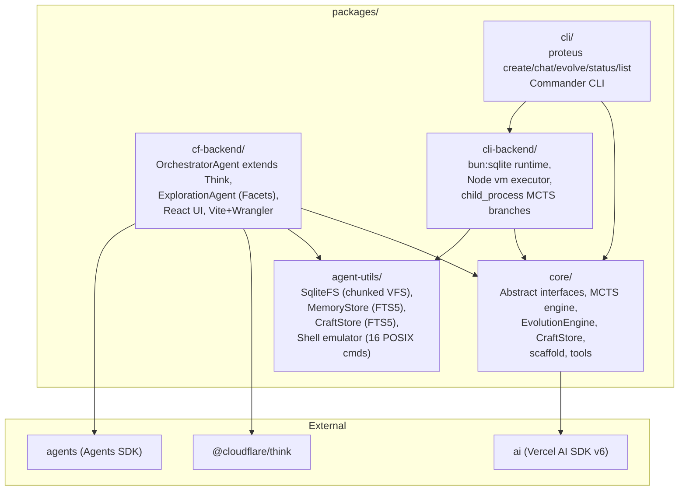
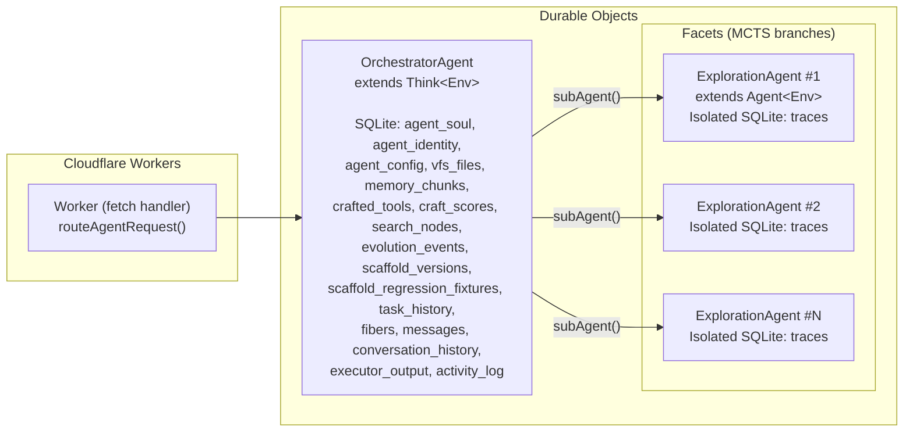

# Architecture

Proteus is a self-evolving AI agent built on Cloudflare's Agents SDK. It uses Monte Carlo Tree Search (MCTS) to explore multiple solution strategies in parallel, learns reusable tool patterns via a CraftStore, and can rewrite its own agentic loop (scaffold) based on observed performance.

## Message Flow

### End-to-End: User Clicks Send → Response Appears

```
User types text + clicks Send (or presses Enter)
│
├─ WorkspacePage.handleSend()                         [WorkspacePage.tsx:577]
│  wraps as { role: "user", parts: [{ type: "text", text }] }
│
├─ useProteus.sendChat(content)                       [use-proteus.ts:305]
│  calls useAgentChat.sendMessage()
│
├─ WebSocketChatTransport.sendMessages()              [ai-chat react.js:64]
│  generates requestId = nanoid(8)
│  sends over WebSocket:
│    { type: "cf_agent_use_chat_request",
│      id: requestId,
│      init: { method: "POST", body: JSON { messages, trigger } } }
│
═══════════════ NETWORK (WebSocket) ════════════════════
│
├─ Think._handleChatRequest()                         [think.js:815]
│  parse body, append user messages to session,
│  broadcast to other connections, enqueue in TurnQueue
│  (wrapped in keepAliveWhile + runFiber for durability)
│
├─ Think._runInferenceLoop()                          [think.js:295]
│  ├─ Merge tools: workspace + getTools() + session context + MCP + client
│  ├─ getSystemPrompt() — read agent_soul
│  ├─ Build + prune messages from session history
│  ├─ getModel() — read agent_config
│  ├─ beforeTurn() — reset counters, return activeTools
│  └─ streamText({...})                               [Vercel AI SDK]
│     │
│     ├─ [MULTI-STEP LOOP — managed by AI SDK, up to 500 steps]
│     │  ├─ Model generates text + optional tool calls
│     │  ├─ onChunk fires per token → orchestrator logs first chunk
│     │  ├─ If tool calls present:
│     │  │  ├─ AI SDK calls tool.execute(args) automatically
│     │  │  └─ onStepFinish fires:
│     │  │     ├─ afterToolCall → orchestrator records tool call
│     │  │     └─ onStepFinish → orchestrator increments step count
│     │  └─ If model stops or maxSteps reached: exit loop
│     │
│     └─ Returns StreamTextResult
│
├─ Think._streamResult()                              [think.js:944]
│  ├─ Stream chunks to all WebSocket clients as cf_agent_use_chat_response
│  ├─ Send { done: true } on completion
│  ├─ Persist assistant message to session
│  └─ _fireResponseHook()
│
├─ OrchestratorAgent.onChatResponse()                 [orchestrator.ts:468]
│  ├─ Build CompletedTurn { userMessage, assistantResponse, toolCalls, steps, durationMs }
│  ├─ void engine.onTurnComplete(turn)   — async, never blocks TurnQueue
│  └─ Every 5 turns: void engine.onSessionComplete(sessionData)
│
═══════════════ NETWORK (WebSocket) ════════════════════
│
├─ WebSocketChatTransport ReadableStream listener     [ai-chat react.js:110]
│  matches response by requestId, parses UIMessageChunks
│
├─ AI SDK useChat processes stream, updates messages array
│
└─ WorkspacePage re-renders message list               [WorkspacePage.tsx:632]
```



## Package Structure



## Durable Object Layout



## AgentRuntime Interface

The `AgentRuntime` is the central contract. Every backend (CF Workers or CLI) must provide these primitives:

| Primitive | Interface | CF Backend | CLI Backend |
|-----------|-----------|------------|-------------|
| **Storage** | `VFS` + `SqlExecutor` + `RawSqlExec` | SqliteFS over DO SQLite | SqliteFS over bun:sqlite |
| **Memory** | `write`, `append`, `index`, `search`, `read` | MemoryStore (FTS5 BM25) | MemoryStore (FTS5 BM25) |
| **Executor** | `execute(code, providers)` | `new Function()` fallback / LOADER codemode | Bun subprocess sandbox (30s timeout) |
| **LLM** | `stream`, `complete` | Workers AI binding or AI Gateway | AI Gateway via Vercel AI SDK |
| **Schedule** | `after`, `cron`, `fiber` | `agent.runFiber()` (durable) | SQLite-backed fiber |
| **Identity** | `id`, `name`, `scaffold.*` | DO ID + agent_soul table | UUID + ~/.proteus/ directory |

Additional runtime fields:
- **CraftStore** — FTS5-indexed learned tool storage
- **SpawnBranch** / **AbortBranch** — MCTS branch lifecycle (Facets on CF, child_process on CLI)
- **ExecutionRouter** (optional) — multi-executor routing for codemode
- **JudgeModel** (optional) — second LLM for cross-model judging

## Think Lifecycle Hooks

The `OrchestratorAgent` extends Think and implements these hooks:

| Hook | When | What Proteus Does |
|------|------|-------------------|
| `getModel()` | Every turn | Read stored model preference from `agent_config`, create Workers AI or AI Gateway model |
| `getSystemPrompt()` | Every turn | Read agent soul from `agent_soul` table |
| `getTools()` | Every turn | Build 5-tool ToolSet (execute_tools, run, explore, save_note, search_memory). Cached by CraftStore version. `activeTools` restricts Think to only these 5 + session context tools. |
| `configureSession()` | Session init | Memory context block (32000 tokens) + cached prompt |
| `beforeTurn()` | Before inference | Reset turn tracking (tool calls, step count, timer) |
| `afterToolCall()` | After each tool | Record tool call for evolution pattern extraction |
| `onStepFinish()` | After each step | Increment step counter |
| `onChatResponse()` | After turn complete | Fire-and-forget evolution hooks (async, never blocks TurnQueue) |
| `onFiberRecovered()` | DO wake from hibernation | Log interrupted fibers for debugging |
