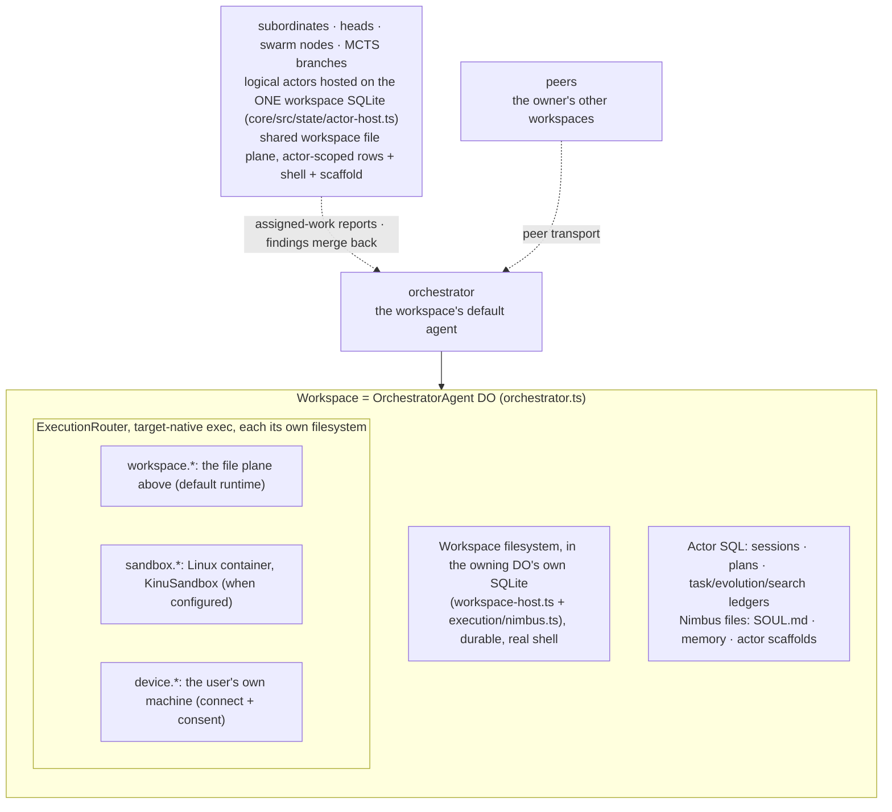
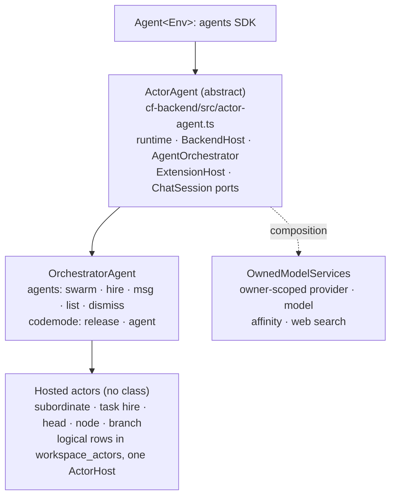
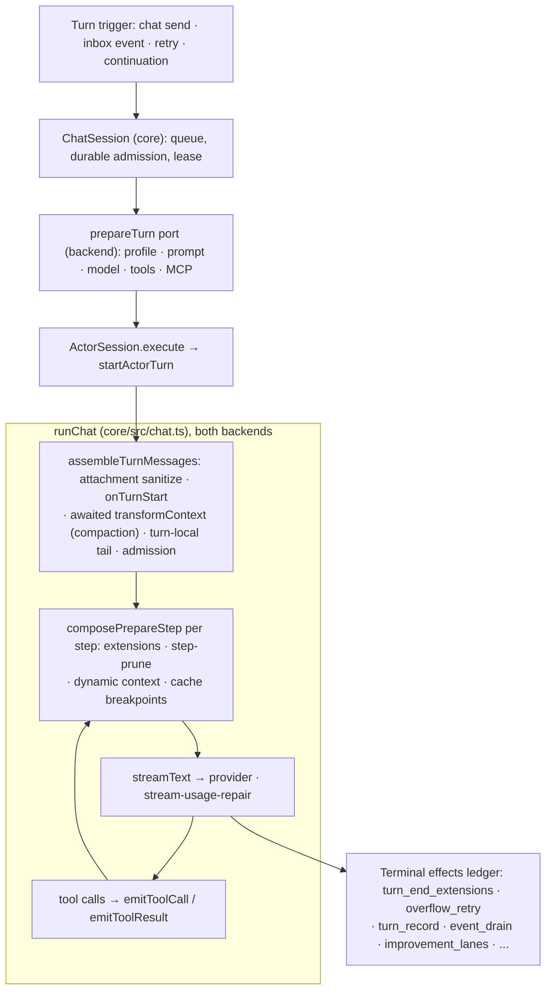
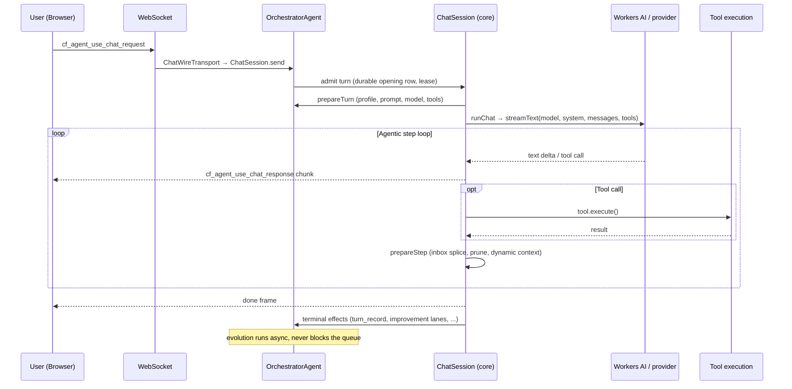
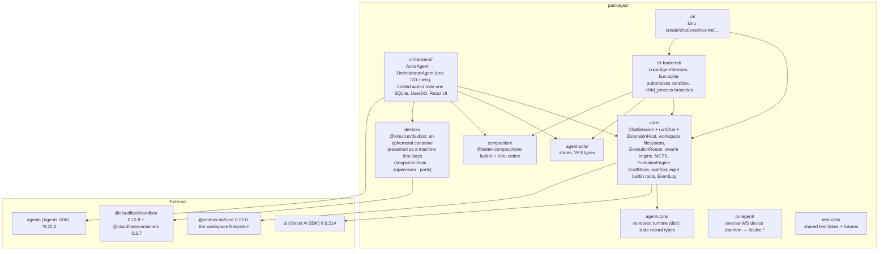

# Architecture

This page describes the implementation. [PRODUCT-SPEC.md](PRODUCT-SPEC.md)
defines the product contract.

Kinu is an agent platform with durable adaptation. A workspace has its own
filesystem, execution environments, and sessions. Its agent answers chat, runs
tools, runs a tree search when that fits, builds reusable tools, and judges
changes to its own loop. Platform-neutral policy, including the turn loop, lives
in `packages/core`. The Cloudflare and local backends supply storage, models,
scheduling, execution, and the transport a turn arrives on.

## The workspace object model

A workspace is 1:1 with an `OrchestratorAgent` Durable Object
(`packages/cf-backend/src/orchestrator.ts`). Its file plane is the workspace
filesystem (`packages/core/src/execution/nimbus.ts`): one authoritative
workspace. Nimbus runs there as a library over the owning Durable Object's own
`ctx.storage.sql` and serves a real shell, runtimes, processes, and ports over
the same bytes. The execution plane is an `ExecutionRouter`
(`DefaultExecutionRouter`, `packages/core/src/execution/router.ts`), which
dispatches to whichever other environment is asked for. Commands run
target-native, not emulated. Every other environment keeps its own filesystem
at native paths, reached through its namespace. The workspace view mounts a
live device under `/pc/<name>`, the container under `/sandbox`, the owner's
Drive under `/shared` and the actor's own context under `/context`
(`packages/core/src/vfs/mounts.ts`); a mount reads through that plane's own
files and never copies them into the workspace. The workspace shell serves the
same table: Nimbus binds every process through a filesystem authority that
routes a mount path there (`packages/core/src/vfs/shell-mounts.ts`), so the
shell, the `file` tool and the Files tab list and read the same paths.

The environment list is the source of truth. `listMounts()` (an orchestrator
RPC over `listEnvironments(executionRouter)`,
`packages/core/src/read-models/files.ts`) returns one row per executor with a
filesystem: its namespace prefix, whether it is live, and its declared policy
(`readOnly` and a consistency of `durable | ephemeral | live-shared`). The
`pc-agent` reverse-WebSocket daemon (`packages/pc-agent`) serves `device` on
your machine. `sandbox` is a Cloudflare container. Containers are spot
capacity, so `@kinu.run/devbox` (`packages/devbox`) presents one as a machine
that stays: files survive, supervised processes come back, and preview URLs
keep their hostnames. `KinuSandbox` (`packages/cf-backend/src/kinu-sandbox.ts`)
is a thin subclass that supplies four things: the backup bucket, the preview
zone, the two questions Devbox asks the owning workspace, and egress
interception. [WORKSPACES.md](./WORKSPACES.md) holds the noun model;
[EXECUTION-LAYER-SPEC.md](./EXECUTION-LAYER-SPEC.md) holds the execution planes.

## The actor hierarchy

One DO class acts inside a workspace, and its shared base is the security
model:

`ActorAgent` (`packages/cf-backend/src/actor-agent.ts`) extends the Agents SDK's
`Agent<Env>` for SQL, sockets, schedules, and fibers. Core's `ActorSession` and
`ChatSession` own inference and recovery. `ActorAgent` owns once what every
full-loop actor needs: the Cloudflare runtime assembly, the `BackendHost`, the
shared `AgentOrchestrator`, `ExtensionHost` plus compaction, prompt, model, and
tool caches, and the ports `ChatSession` calls. A subclass supplies the abstract
members (`getOwnerUserId`, `actorHandle`, `actorDirectory`, `actorKind`,
`workspaceBox`, `ensureSchema`, `actorToolDeps`, `engine`, `notifyOwner`,
`delegationBudget`, `actorHost`, `actorDirectoryStore`, `explorationSeams`,
`subordinateSeams`, `hostedChatWire`, `owedTerminalEffects`, `ownMission`,
`persistAutoTitle`, `promptIdentity`, `transcriptFor`) and may override three
hooks (`workspaceName`, `extraCodemodeProviders`, `isClientRpcMethodDenied`).
One subclass exists: the orchestrator. Every other actor is a logical row the
orchestrator's host acquires, not a class.

Tool gating is structural; no prompt decides it. The `agents` actions derive
from the deps the profile wires (`actorAgentsActions` over core's
`agentsActionsFor`, `packages/core/src/delegation/agents-tool.ts`). Every actor
has `swarm`. `hire`, `msg`, and `list` need a roster or the peer transport.
`dismiss` needs the roster. `msg`'s `event_id` target answers an inbound agent
message. At the depth cap `teamProfile()` returns nothing, so the roster and the
`hire` rung vanish together. `report` exists only on a subordinate. `release` is
not a native tool: it is an orchestrator-only codemode provider, left out of the
Plan-mode set. `submit_plan` exists only on an owner turn in Plan mode.

Non-root actors are logical rows, not classes. A durable hire, a
`lifetime:'task'` hire, a branching head, a swarm node, and an MCTS branch are
rows in `workspace_actors`. The workspace's one `ActorHost` acquires each as a
`HostedActor` with its own runtime objects (session, stores, queue, abort,
roles, loop pointer) under the root's lifecycle. A subordinate runs delegated
turns through `runHeadInference` over its own `HostedActor`, with the full-agent
surface built by the same `buildActorTools` the root uses, over its own runtime,
plus the `report` lane that settles the `agents.hire` that gave it the work. It
gets no peer transport, so it cannot leave its subtree. A head runs the same
runner with the head tool surface (`record_evidence`, `record_decision`, and
`split_subheads` while depth remains). A swarm node runs a `NodeRunSpec` through
the same runner. An MCTS branch makes one bare model call per
`explore`/`generateReflection` through the seat's profile route, with no tools.
There is no second object and no second database. Hosting buys lifecycle
(acquire, fence, retire), not a second storage boundary. Heads and swarm nodes
share the workspace files, processes, and ports. No seed RPC crosses an object
boundary: registration is a directory write, and acquisition binds stores.
Recursion stays bounded by construction (`maxDepth` per spawn, refused once
exhausted).

Actor addresses keep the two families apart inside one roster
(`packages/core/src/identity/actor-key.ts`). A subordinate's storage key is its
roster slug. A head, swarm node, or branch registers under an `exp:`-prefixed
key (`explorationActorKey`), which a slug cannot carry, so a hire and a
generated worker id never collide. Journals and handles keep the plain id.

No actor owns a database. Every logical actor of a workspace (the orchestrator,
its hires, its heads, its swarm nodes, and its MCTS branches) is bound by one
`ActorHost` (`packages/core/src/state/actor-host.ts`) over the workspace
object's own SQLite. `actor_id` leads the primary key of every table that holds
an actor's state, so a SQL-only snapshot of the workspace object is the
workspace, for every actor. Two actors that pick the same logical row key cannot
read or overwrite each other's row. What stays per actor is everything mutable:
its session, its store bundle bound to its own handle, its queue, its abort, its
roles, and its loop pointer.

One `OwnedModelServices` (`packages/cf-backend/src/owned-model-services.ts`)
serves every actor by composition: provider registry, model spec, Workers AI
affinity key, web-search provider. `ActorAgent` constructs it with
`ownerRequired: true`. A hired child reads the workspace's owner through its
parent and carries no credentials of its own.

A subordinate is a durable teammate: its own session, store bundle, queue, and
abort over the workspace's one SQLite, and the full-agent tool surface. It
survives hibernation as rows. Its runtime keys to the parent
workspace name, so it uses the same Nimbus files, processes, ports, container,
and device consent. Its home (`.kinu/agents/<storage-key>`), scaffold path, and
shell id (`subordinate:<key>`) are private.

Work arrives as delegated tasks admitted against the child's session. Results
return through the report lane as `subordinate_report`, decided from how the
turn ended: a `task` child answers on every ending, and a durable hire relays a
completed turn worth relaying. Reports broadcast to sockets and drain on the
parent. A delegated turn is never owner-driven and is never cancelled by a
disconnect. `retire` with `destroy` drops the actor's rows and its home; without
it the rows and the home stay with the workspace.

Locally, `LocalAgentHost` (`packages/cli-backend/src/agent-host/host.ts`) holds
one `LocalAgentSession` per bound agent for the daemon's whole life: every root
it has a ref for, plus every live subordinate beneath one. Roots are not
workspaces. Several roots share one virtual workspace as equal peers; the
workspace is the `{ cwd, workspaceId }` pair on their refs. After construction
the host installs three dependency sets, and each decides whether a tool exists:
`setTeam` gives a roster, `setPeers` gives a root the peer transport behind
`reply`, and `setReport` gives a subordinate its reporting tool. Durable work
stays in the shared `EventLog`, `background_jobs`, fiber, and `outbox_peer`
tables. The host adds no second queue and no second loop.

The system prompt (`packages/core/src/prompt.ts`) carries the matching doctrine:
decompose multi-part or multi-hour work, hire one subordinate per independent
workstream, and keep coordination and integration in the agent's own turn.

## The turn pipeline

Every root turn, cloud or local, runs through core's `ChatSession`
(`packages/core/src/orchestrator/chat-session.ts`). It runs one turn at a time
from one serialized queue. A send while a turn exists splices into that turn's
next step. Every accepted send is a durable row before the caller hears it was
taken. The answer, the reservations it spends, and the effects it owes commit
in one transaction. A turn the process died inside continues from its run
ledger, once, under the run it opened. The backend supplies what the loop cannot
know through `ChatSessionPorts`: `prepareTurn` (owner reads, profile, skills, MCP
tools, prompt, model, tools), the terminal effects a settled turn owes, the
driver lease, and the wake. On Cloudflare `ActorAgent.prepareTurn` is that port;
locally `LocalAgentSession` supplies it.

`ActorSession` (`packages/core/src/orchestrator/actor-session.ts`) holds one
logical actor's mutable state: working history, the dynamic-context ledger, the
orchestrator, the bound profile, and the abort. It runs a turn through
`startActorTurn` (`packages/core/src/orchestrator/actor-turn.ts`): `runChat`
(`packages/core/src/chat.ts`) for the builtin program, or `scaffoldChatTransform`
(`packages/core/src/scaffold/chat-transform.ts`) wrapping it when an evolved
`agent.js` is the actor's program. Hosted actors run claimed turns on their own
`ActorSession` through `runHeadInference`
(`packages/core/src/heads/head-inference.ts`), which decides how many turns a
head, node, or subordinate run gets. So one `runChat` body serves every actor
kind on both backends.

| Stage | What runs | Module |
|---|---|---|
| Turn start | `assembleTurnMessages`: attachment sanitize, extension `onTurnStart`, the awaited `transformContext` chain (compaction), then the turn-local tail; then pre-submission admission (one forced compaction, a re-measure, then a refusal) | `packages/core/src/orchestrator/turn-context.ts` |
| Each step | `composePrepareStep`: extension chain, then step pruning, then the dynamic-context weave, cache-breakpoint markers last | `packages/core/src/prompting/prepare-step.ts` |
| Tool call and result | `emitToolCall` / `emitToolResult`; the orchestrator's extension ticks the in-episode clock | `packages/core/src/extension.ts`, `packages/core/src/chat.ts` |
| Evolved program | `scaffoldChatTransform` runs an evolved `agent.js` as the turn's loop; the builtin program passes through | `packages/core/src/scaffold/chat-transform.ts` |
| Settle | `emitTurnEnd`, then the terminal effects ledger claims every owed effect before any runs and replays what a crash left owed | `packages/core/src/orchestrator/terminal-effects.ts` |

No turn carries a step cap. `runChat` hands `stopWhen` to `streamText` and
defaults it to `UNBOUNDED_STEPS`; `ActorAgent.prepareTurn` passes
`UNBOUNDED_STEPS` explicitly. The budget governor and the caller's cancel bound
a turn.

A finished run is classified, not guessed. Backends pass facts to
`classifyRunEnd` (`packages/core/src/orchestrator/turn-lifecycle.ts`) and get a
`RunEndReason`. A cut turn is `aborted` even when it threw, because Stop caused
no failure. A throw is `error`, and so is a stream that ended without the
provider naming an end. A clean end whose last step still had tool calls
pending is `incomplete`, and the `turn.ended_mid_work` failure names the defect
that stopped the loop. Every other clean end is `completed`.

- Compaction (`@kinu.run/compaction`, `createCompactionExtension`) is the
  default `transformContext`. It runs the `@better-compact/core` staged-pruning
  ladder over AI SDK `ModelMessage[]`, translated to ladder `Turn[]` by
  `packages/compaction/src/codec.ts`. It runs once per turn assembly over shared
  stores: raw transcripts in the canonical workspace VFS, the replayable plan,
  and the measured token trigger in one `compaction_state` row. The trigger is
  85% of the model context window (`COMPACTION_PRESETS.light`), measured against
  provider-reported prompt tokens floored by the history estimate plus the
  system prompt. Rungs run cheapest first: superseded ephemeral context, then
  skills, superseded reads, error inputs, old tool output, reasoning, remaining
  tool output, assistant runs, and a prefix summary. The first rung is Kinu's
  (`relieveEphemeralPressure`): a superseded `<dynamic_context>` block is stale
  and re-derivable from live state, and because it is woven per model step no
  ladder stage ever sees it. What it frees is subtracted from the pressure the
  engine hears about, so relief there stands the rest of the ladder down.
- The inbox (`kinu.inbox`, a `prepareStep` hook,
  `packages/core/src/orchestrator/inbox.ts`) is the one way anything
  asynchronous reaches the agent. A producer (event-hub drain, settled
  background job, overflow retry, take pick, MCP task, the composer's own
  message) calls `send()` and nothing else. A message sent while a turn runs is
  spliced into its next step by the `StepInjections` math
  (`packages/core/src/prompting/step-injections.ts`). Sent while idle, it becomes
  the next turn through `BackendHost.enqueueTurn`. What a running turn never
  absorbed is re-delivered at settle the same way: the operator's words first,
  as one user-origin turn, then each event as a turn of its own. `inbox.busy` is
  the only routing fact. Spliced event text is ephemeral like the
  `<dynamic_context>` beside it: visible to the model at the tip, absent from
  durable history, gone on cold start. Spliced user messages land as verbatim
  durable rows first, so the row exists before the model reads it. Mechanical
  steering (`packages/core/src/orchestrator/turn-steering.ts`) is handed to the
  step being prepared, so it cannot outlive it. Everything buffered for one
  boundary drains into one splice, and user messages become one durable user
  message first, so no registration order shifts another producer's recorded
  indices.

The supporting context machinery lives in `packages/core/src/prompting` and is
shared by both backends. The attachment sanitizer (`attachment-sanitizer.ts`)
offloads model-incompatible file parts to `attachments/`, so a poisoned
transcript heals byte-stably. `DynamicContextLedger` (`volatile-context.ts`)
appends a fresh `<dynamic_context>` block only when its render changes and
freezes earlier blocks to preserve cache breakpoints; `dropSuperseded`, the
compaction first rung, is the only unfreezer. Step pruning (`step-prune.ts`)
shrinks old tool outputs near `stepContextLimit`, the resolved model window less
`outputReserveTokens`. `cache-breakpoints.ts` places Anthropic `cache_control`
and OpenAI `prompt_cache_key`. `stream-usage-repair`
(`packages/core/src/providers/stream-usage-repair.ts`) fixes Cloudflare AI SSE
zeroing `cached_tokens` in its duplicate final chunk.
[EXTENSIONS.md](./EXTENSIONS.md) has the per-turn hook contract.

## Message flow (cloud)

The browser side is `WorkspacePage.tsx` through `use-kinu.ts` (`useAgent` and
`useAgentChat`) to the Agents SDK WebSocket transport. `ChatWireTransport`
(`packages/cf-backend/src/chat-transport.ts`) maps the SDK's `cf_agent_*` chat
protocol onto `ChatSession`: a chat request becomes one `ChatSession.send` per
new message, a cancel becomes an interrupt, and the transport writes no row
itself. The worker entrypoint is `packages/cf-backend/src/server.ts`
(`routeAgentRequest`, plus the `email()` handler); it hands every `/api/` path to
one Hono app (`packages/cf-backend/src/api/app.ts`), whose registration order is
its gate order. The CLI drives the same `ChatSession` through `LocalAgentSession`.

## Events and ingress

Wake-ups beyond chat publish through a durable `EventLog`
(`packages/core/src/events/hub/log.ts`, schema in `hub/schema.ts`). The
`consumed_at` column on `agent_log` leases delivery four ways: it is set when an
event binds to a turn (`markConsumed`), cleared on completion
(`markTurnCompleted`), released on abort or replan (`unbind`), and re-pended for
stranded leases by a stale sweep (`unbindStale`). A `DrainScheduler`
(`packages/core/src/orchestrator/drain-scheduler.ts`, 250 ms debounce)
coalesces a burst into one programmatic turn instead of one turn per event.

Five ingress paths publish into the log:

| Source | Path | Wakes via |
|---|---|---|
| Email | `packages/core/src/events/ingress/email.ts` (plus `server.ts` `email()`) | `ingress: 'email_inbound'` |
| Webhook | `packages/core/src/events/ingress/webhook.ts` (plus `packages/cf-backend/src/events/routes.ts`, `packages/core/src/events/webhook-route.ts`) | signed route capability in the URL, then per-trigger HMAC, Bearer, or mTLS |
| Peer | `packages/core/src/events/ingress/peer.ts` (`outbox_peer` to `PeerHub`) | `ingress: 'peer_async'` (cross-workspace) |
| Subordinate | `packages/core/src/events/ingress/subordinate.ts` (plus `subordinates/support.ts` admission) | `ingress: 'subordinate'` (variants `subordinate_task`, `subordinate_report`) |
| Timer | `packages/core/src/events/ingress/triggers.ts`, driven by each backend's clock | `ingress: 'timer_alarm'` (cron or one-shot) |

The webhook rail is the only public one, and it has two checks. The delivery URL
ends in `v1-<32 hex>`, an HMAC-SHA-256 over the workspace and trigger identity
under `WEBHOOK_ROUTE_SECRET`, minted server-side and verified by the Worker
before the ingress budget, the body, or the workspace object. That decides which
workspace a stranger may address. The trigger's own HMAC, Bearer, or mTLS check
then decides whether the payload is authentic. The capability is derived, so it
needs no table. Revoking one URL revokes its trigger, and revoking all of them
rotates the secret.

Core owns the checks: auth, replay window, rate limit, trust, admission. Each
backend supplies only the transport: on Cloudflare the Worker HTTP and `email()`
routes plus the DO alarm, locally the process timer. The `IngressKind` union in
`packages/core/src/events/hub/types.ts` also names `chat_ws`, `sandbox_cb`,
`process_watch`, `file_watch`, `mcp_streamable`, `self_emit`, and
`reply_request`. The five above are what wake a sleeping workspace from outside
its own turn.

## MCP: user-level auth, no token transfer

MCP servers authenticate once, at the user level, held by the `UserDO`
(`packages/cf-backend/src/user/user-do.ts`, `user_mcp_servers`; OAuth callback
`userMcp_handleOAuthCallback`). Agents never receive a token. The actor fetches
only serializable descriptors (`buildUserMcpTools`). Each tool's `execute`
closure calls back to `userMcp_callTool(caller, serverId, ...)` on the UserDO,
where the one credentialed call runs. The caller presents a workspace capability
token, which exists only for a workspace this user's registry issued one to and
dies with it, so there is nothing to spoof. A second in-SQL check covers server
membership plus `allowed_tools`.

Connecting and reading descriptors are separate jobs. `userMcp_warmConnections`
owns connecting and always runs off the turn. Two triggers reach it: the first
`/api/user` hit per isolate, under the Worker's `ctx.waitUntil`, which covers
the first interactive turn; and every settled turn, from
`ActorAgent.warmUserMcpInBackground` inside the `improvement_lanes` terminal
effect. The second exists because the first is keyed per isolate: an
alarm-woken, email-woken, or peer-woken workspace never trips it, and an evicted
UserDO has already spent it. `userMcp_toolDescriptors` runs on the turn's
critical path, so it starts no network work and waits for none. It reads the
current connection snapshot and returns. A configured server that is not
connected yet is reported through `unavailable`, and the next turn installs it
once the connection completes. `userMcp_callTool` connects on explicit use. One
autonomous or post-eviction turn may lack MCP tools; its settle warms the next
one, and a failed warm is named and retried by the following settle.

A server name addresses its tools (`mcp_<server>_<tool>`), so names are unique.
`userMcp_add` and `userMcp_update` seal and validate first, then claim the
canonical `lower(name)` and write inside one `ctx.storage.transactionSync`. No
await sits inside that boundary, so two concurrent adds cannot both pass, and a
refusal names the taken name. `initUserTables` builds a `UNIQUE` index over
`lower(name)` unconditionally, so no write path leaves a duplicate behind.

## The UserDO caller boundary

Every secret a user owns lives in one `UserDO`. Every privileged method takes a
`UserCaller` first and checks it with `requireTier`
(`packages/core/src/safety/workspace-capability.ts`). Worker routes act for the
edge-verified owner and present `ownerCaller(env)`, an HMAC of the Worker's own
secret: owner authority is something the deployment holds, not a token it
passes around. A workspace presents the secret minted for it at claim time,
stored hashed. Tokens are identity, not capability: admission follows the
matrix, and only the two `owner_only` entries refuse a workspace token.

Neither kind attests who is calling; a sibling DO sharing `env` can derive the
owner capability too. What the boundary buys: the tool surface, which an
injected prompt can steer, reaches the UserDO only through code presenting a
workspace token, so a forgotten tool check still leaves the call attenuated.
Logical actors (subordinates, heads, MCTS branches) present their parent's
token and hold no identity of their own. Enforcement lives where the secrets
are.

## Evolution

Evolution runs on four timescales. The step clock ticks inside one long turn.
The other three belong to the `EvolutionEngine`
(`packages/core/src/evolution/engine.ts`):

- In-episode: every settled `eval` call scores crafted-tool fitness into
  `craft_scores` with one synchronous SQL write and no model call
  (`packages/core/src/orchestrator/craft-cycle.ts` over `craft/in-episode.ts`).
- Turn level: `reviewTurn()` assesses the finished turn. A negative outcome
  writes a reflection into memory; a strong one extracts a crafted tool into
  the CraftStore.
- Session level: `onSessionReflection()` consolidates patterns and can call
  `maybeEvolveScaffold()` to propose a new `agent.js`.
- Lifetime: `onLifetimeEvolution()` runs replay eval, craft consolidation, and
  a full `runMCTS()`.

Hosted actors tick the step clock only: they record no turn into the evolution
window.

MCTS branch rewards are execution-grounded on both backends. One scorer
(`packages/core/src/mcts/evaluation.ts`) lets the execution outcome dominate the
judge for hosted branches and CLI child-process branches alike. Checks run
before a scaffold mutation takes effect: the misevolution gate
(`scaffold/misevolution.ts`) rejects harmful edits by fixed criteria, the
shadow veto (`scaffold/shadow.ts`, `maxRegressions: 1`, `minDecisiveTrials: 5`,
Monte-Carlo-derived) rejects regressions, and the DGM-style archive
(`scaffold/archive.ts`) keeps prior variants as stepping stones, ranked for
re-branching by clade-metaproductivity (what a lineage went on to produce).
Every self-modification surfaces as a human-readable card through the evolution
changelog (`evolution/changelog.ts`). See [EVOLUTION.md](./EVOLUTION.md) and
[MCTS.md](./MCTS.md).

## Package structure

Kinu adopts agent-core's slate record types, not its runtime.

## Backends and the AgentRuntime contract

`AgentRuntime` and `BackendHost` are the two interfaces a backend implements,
and they are the whole contract: implement the pair and `packages/core` runs on
your platform. Cloudflare binds actor state to Durable Object SQLite and
workspace files and execution to Nimbus. Local binds them to `bun:sqlite` and a
local process. Both drive the same core `ChatSession`.

| Primitive | CF backend | CLI backend |
|---|---|---|
| Storage | Nimbus VFS + actor DO SQL | Nimbus VFS over `bun:sqlite` + actor SQL |
| Memory | MemoryStore (FTS5 BM25) | MemoryStore (FTS5 BM25) |
| Executor | codemode over the Worker Loader (`KinuSandboxExecutor`) | Bun subprocess sandbox, in-process fallback |
| LLM | Workers AI binding or AI Gateway | AI Gateway via AI SDK |
| Swarm nodes | Hosted `node` actors acquired from the one `ActorHost`, seated per run | `LocalAgentSession` node runtime with a credentialed home when the local VFS supports principals |
| MCTS branches | Hosted `branch` actors: one model call per `explore`/`generateReflection` | `child_process.fork` (`packages/cli-backend/src/branch-process.ts`) |
| Subordinates | Hosted `subordinate` actors (`host.acquire` + `host.run`, report lane) | `LocalAgentSession` per agent, held by `LocalAgentHost` |

The full contract and the three extension points (`ModelProvider`,
`ActorAgent`, `KinuExtension`) are in [EXTENSIBILITY.md](./EXTENSIBILITY.md).
One client contract, `AgentClient`, reaches either backend.
[AGENT-CLIENT-ARCHITECTURE-SPEC.md](./AGENT-CLIENT-ARCHITECTURE-SPEC.md) holds
it: which side owns which state, the connect-ticket exchange, the
`AGENT_RPC_ACCESS` scope policy, and the rejected designs.

## Model providers

Model choice is per workspace, resolved through a registry
(`packages/core/src/providers/registry.ts`) that the backends build differently
and use identically. Cloud registers `workers-ai`, user-owned `my-gateway`, the
platform `ai-gateway` fallback, `codex`, `claude` (a Claude Pro or Max login,
sent as Claude Code's CLI sends it), `openai`, `anthropic`, `openrouter`,
`openai-compat`, then the dynamic models.dev catalog source
(`packages/cf-backend/src/providers/agent-registry.ts`). The CLI registers the
same set plus `opencode` and one
`openai-compat:<name>` entry per extra compatible credential
(`packages/cli-backend/src/model-resolver.ts`). Its `workers-ai` and
`my-gateway` entries resolve three ways: a local gateway endpoint, a proxy
through the owner's cloud account, or a signed-out placeholder naming what is
missing. Registration order is the default-preference order.

Two policies apply to every provider:

- The catalog is live. `models-dev.ts` fetches `https://models.dev/api.json`
  behind a 5-minute cache and derives each model's window and capabilities from
  it. The static lists (`WORKERS_AI_FALLBACK_MODEL_CATALOG`, per-provider
  `FALLBACK_MODELS`) cover a failed fetch or an empty filter.
- Every model fetch waits out rate limits, with no ceiling on the wait.
  `withRateLimitRetry` (`rate-limit-retry.ts`) wraps all four fetch paths: the
  shared `createAuthedFetch`, Workers AI, AI Gateway, and codex. A rate-limited
  request follows the provider's `Retry-After` until success, another failure,
  or caller cancel; elapsed time and attempt count never end it. It treats 429
  and 529 as rate limits always, and a 503 only when the status text,
  `x-error-code`, or body reads as overload, capacity, or too many requests. An
  unreadable 503 propagates. Without `Retry-After` it draws full-jitter waits
  under a ceiling doubling from 2 s to a 60 s cap (both unmeasured). Bodies that
  cannot be replayed pass untouched. Beside the retry, `ProviderPacer`
  (`pacing.ts`) holds each request to a host behind the cooldown a sibling
  declared. Waits are declared before they are taken, so siblings join one
  cooldown. The pacer counts no requests: Workers bounds connections per
  invocation, and an isolate-wide count hung the requests queued on it (1101s
  on kinu.run, 2026-09-23). The AI SDK transport retry stays at
  its default of 2, stated as `PROVIDER_SDK_RETRIES` so a vendor update cannot
  move it silently.

Reasoning effort is set by the user. `/effort` in chat or
`kinu effort <name> [level]` stores `reasoning_effort` in the workspace
`agent_config`; a workspace without its own runs the profile's default tier.
`packages/core/src/strategy/effort.ts` maps the level onto each family's native
option: `reasoningEffort` for Workers AI, OpenAI-shaped providers, and
OpenRouter, and `effort` for Anthropic (levels Anthropic does not take are not
sent). Internal stages take theirs from `REASONING_EFFORT_FOR_STAGE`, sized to
the work: reflection and MCTS rollouts take `low`, and scaffold mutation takes
`high`.

## Storage and formal models

Two authorities own workspace state. The Nimbus session owns files, including
`SOUL.md`, memory markdown, and scaffolds. The actor SQLite owns relational
state: plans, messages, memory and craft indexes, MCTS, search records,
evolution, and event logs. Schema and boundaries are in
[STORAGE.md](./STORAGE.md). The vendored filesystem is in
[NIMBUS-INTEGRATION.md](./NIMBUS-INTEGRATION.md).

Selected core algorithms are modeled in Lean 4 (`lean/`): 366 named declarations
cover abstract models of agent, evolution, execution, exploration, MCTS, safety,
and storage properties. The traceability map enrolls 276
proved-in-abstract-model entries and 90 by-construction witnesses against 46
requirements, with no `sorry` (measured 2026-09-09 by
`lean/check-traceability.mjs`). Axiom reports use only Lean's three kernel
axioms. One separate SQLite FTS5 assumption is documented and enrolled. CI
(`.github/workflows/lean-verify.yml`, `scripts/verify-lean.sh`) checks
compilation, negative consistency, axiom closure, and
requirement-to-proof-to-source traceability. These are checked statements about
the models, not a proof that the deployed TypeScript refines them. See
[FORMAL-SPEC.md](./FORMAL-SPEC.md).
