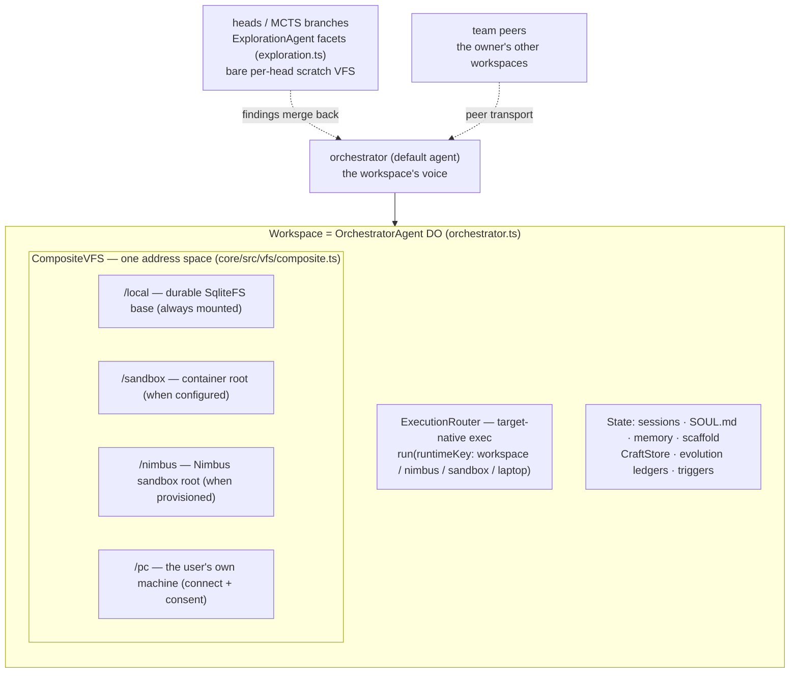
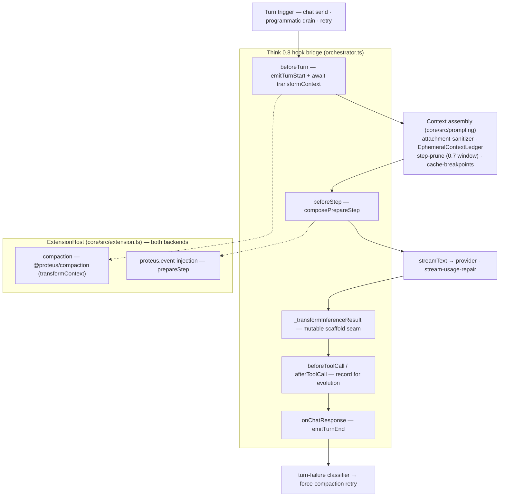
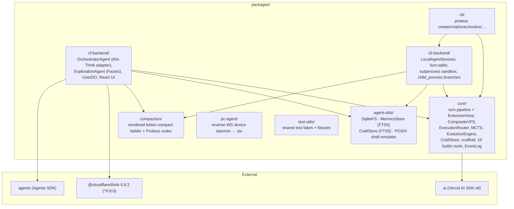

# Architecture

> Maintained by Claude (AI-edited documentation, presented as-is); verify against the code when precision matters.

Proteus is a self-evolving agent **workspace**. You create a workspace — a durable
container with its own filesystem, execution environments, and sessions — and its
agent answers chat, runs tools, explores strategies with Monte Carlo Tree Search,
learns reusable tools, and can rewrite its own agentic loop.

The design has one rule that keeps it honest: **one shared brain, thin adapters.**
Everything platform-independent lives in `packages/core`. The cloud backend
(`packages/cf-backend`, a Durable Object over Cloudflare's [Think](https://github.com/cloudflare/agents))
and the local backend (`packages/cli-backend`) are thin shells that give the same
core loop a place to run. This document maps that structure to real modules; file
paths are cited so you can jump to the source.

## The workspace object model

A workspace is the container; agents are the actors inside it. The workspace is
1:1 with an `OrchestratorAgent` Durable Object on the cloud backend
(`cf-backend/src/orchestrator.ts`). Its file plane is a `CompositeVFS`
(`core/src/vfs/composite.ts`) — a single address space over every environment —
and its execution plane is an `ExecutionRouter` (`core/src/execution/router.ts`)
that dispatches to whichever environment is asked for, running commands
target-native rather than emulating them.

The mount table is the source of truth: `listMounts()` (an orchestrator RPC over
`compositeVfs.listMounts()`) returns each live mount plus its declared policy
(`readOnly`, `durable | ephemeral | live-shared`, credentials-stay-in-host). The
`/pc` mount is served by the `pc-agent` reverse-WebSocket daemon
(`packages/pc-agent`) running on the user's machine. See
[WORKSPACES.md](./WORKSPACES.md) for the full noun model.

## The turn pipeline

Every turn — cloud or local — flows through the same `ExtensionHost`
(`core/src/extension.ts`), the one small, stable seam both backends fire. On the
cloud the `OrchestratorAgent` bridges Think 0.8's subclass hooks onto that host;
on the CLI, `LocalAgentSession` (`cli-backend/src/local-session.ts`) drives
`runChat` with the same host. There is deliberately no private callback path
running parallel to the plugin API.

What the boxes are:

| Think 0.8 hook | Proteus binding | Module |
|---|---|---|
| `beforeTurn` | `emitTurnStart`, then the awaited `transformContext` chain; the ephemeral ledger + turn-local tail are woven **after** the transform; tools folded into `activeTools` | `orchestrator.ts`, `core/src/extension.ts` |
| `beforeStep` | `composePrepareStep` — the extension chain runs first, cache-breakpoint markers land last | `core/src/prompting/prepare-step.ts` |
| `beforeToolCall` / `afterToolCall` | `emitToolCall` / `emitToolResult`; the evolution engine records each call | `orchestrator.ts` |
| `_transformInferenceResult` | the **mutable scaffold** seam — an evolved `agent.js` becomes the turn's inference loop; un-evolved passes through untouched | `core/src/scaffold/inference-transform.ts` |
| `onChatResponse` | `emitTurnEnd` → fire-and-forget evolution (never blocks the queue); the turn-failure classifier may arm a one-shot force-compaction retry | `orchestrator.ts`, `core/src/turn-failure.ts` |
| `getModel` / `getSystemPrompt` / `getTools` | model from `agent_config`; `SOUL.md` from the VFS; the 10 builtin tools | `core/src/tools/registry.ts` |

The two default registrants attach at construction on both backends:

- **Compaction** (`@proteus/compaction`, `createCompactionExtension`) is the
  default `transformContext`: the vendored better-compact staged-pruning ladder
  (`compaction/src/engine/`) plus the Proteus codec (`compaction/src/codec.ts`,
  AI-SDK `ModelMessage[]` ⇄ ladder `Turn[]`). It runs once per turn assembly over
  shared stores — raw transcripts in the CompositeVFS, the replayable plan + the
  measured token trigger in one `compaction_state` row.
- **Mid-turn event injection** (`proteus.event-injection`, a `prepareStep` hook)
  drains background events that arrived mid-turn into the active turn's next step,
  using the `StepInjections` splice math (`core/src/orchestrator/event-injection.ts`,
  `core/src/prompting/step-injections.ts`). It is the DO counterpart of the CLI's
  `proteus.steering` drain — same mechanism, one host.

Supporting context machinery, all in `core/src/prompting` and shared by both
backends: the **attachment sanitizer** (`attachment-sanitizer.ts`) offloads
model-incompatible file parts to `/local/attachments` so a poisoned transcript
heals byte-stably; the **EphemeralContextLedger** (`volatile-context.ts`) appends
a fresh system-state block only when its fingerprint changes, freezing earlier
blocks in place to preserve provider cache breakpoints; **step-prune**
(`step-prune.ts`, `STEP_CONTEXT_BUDGET_RATIO = 0.7`) shrinks old tool outputs once
a step nears the window; **cache-breakpoints** (`cache-breakpoints.ts`) places
Anthropic `cache_control` / OpenAI `prompt_cache_key`; and **stream-usage-repair**
(`cf-backend/src/providers/stream-usage-repair.ts`) fixes Cloudflare AI SSE that
zeroes `cached_tokens` in its duplicate final chunk. See
[EXTENSIONS.md](./EXTENSIONS.md) for the per-turn hook contract.

## Message flow (cloud)

The browser side is `WorkspacePage.tsx` → `use-proteus.ts` → the agents SDK
WebSocket transport; the worker entrypoint is `cf-backend/src/server.ts`
(`routeAgentRequest`, plus the `email()` handler). The CLI takes the same core
loop through `LocalAgentSession` instead of the WebSocket transport.

## Events and ingress

The workspace is not only chat-driven — it wakes on external events through a
durable `EventLog` (`core/src/events/hub/log.ts`, schema in
`core/src/events/hub/schema.ts`). Delivery uses a **lease**: the `consumed_at`
column on the `agent_log` table is set when an event is bound to a turn
(`markConsumed`), cleared on completion (`markTurnCompleted`), released on
abort/replan (`unbind`), and re-pended by a stale-sweep for stranded leases
(`unbindStale`). A `DrainScheduler` (`core/src/orchestrator/drain-scheduler.ts`,
250 ms debounce) coalesces a burst of events into one programmatic turn instead of
one turn per event.

Four ingress adapters publish into the log (`cf-backend/src/events/ingress/`):

| Source | Path | Wakes via |
|---|---|---|
| Email | `ingress/email.ts` (+ `server.ts` `email()`) | `ingress: 'email_inbound'` |
| Webhook | `events/routes.ts` → `acceptWebhookDelivery` | per-trigger HMAC / Bearer / mTLS |
| Peer | `ingress/peer.ts` (`peer_outbox` → `PeerHub`) | `ingress: 'peer_async'` (cross-workspace) |
| Timer | `orchestrator.ts` `alarm()` + `core/src/events/hub/triggers.ts` | `ingress: 'timer_alarm'` (cron / one-shot) |

## MCP — user-level once-auth, zero token transfer

MCP servers are authenticated **once at the user level** and held by the `UserDO`
(`cf-backend/src/user/user-do.ts`, `user_mcp_servers` table; OAuth callback at
`userMcp_handleOAuthCallback`). Agents never receive a token. The orchestrator
fetches only serializable tool descriptors (`buildUserMcpTools`) and each tool's
`execute` closure RPCs back to `userMcp_callTool(callerAgentName, serverId, …)` on
the UserDO, where the one credentialed call runs. That call is **ownership-gated**:
`userMcp_callTool` checks `hasWorkspace(callerAgentName)` and fails closed if the
caller is not one of the user's live workspaces, with a second in-SQL check of
server membership + `allowed_tools`.

## Evolution

The `EvolutionEngine` (`core/src/evolution/engine.ts`) runs across three
timescales, each feeding the next:

- **Turn-level** — `reviewTurn()` assesses the just-finished turn; a negative
  outcome gates a reflection into memory, a strong one extracts a reusable
  CraftStore tool.
- **Session-level** — `onSessionReflection()` consolidates patterns and may call
  `maybeEvolveScaffold()` to propose a new `agent.js`.
- **Lifetime** — `onLifetimeEvolution()` runs replay eval, craft consolidation,
  and full `runMCTS()`.

MCTS branch rewards are **execution-grounded on both backends** — the single
scorer (`core/src/mcts/evaluation.ts`) lets execution outcome dominate the judge
for CF Facets, the CF inline fallback, and CLI forked branches alike. Scaffold
mutations are guarded before they can take effect: a **misevolution gate**
(`core/src/scaffold/misevolution.ts`) rejects harmful edits by fixed criteria, a
**shadow-veto** (`core/src/scaffold/shadow.ts`, `maxRegressions: 1`,
`minDecisiveTrials: 5`, Monte-Carlo-derived) rejects regressions, and a **DGM-style
archive** (`core/src/scaffold/archive.ts`) keeps prior variants as stepping stones.
Every self-modification surfaces as a human-readable card via the **Evolution
Changelog** (`core/src/evolution/changelog.ts`). See [EVOLUTION.md](./EVOLUTION.md)
and [MCTS.md](./MCTS.md).

## Package structure

## Backends and the AgentRuntime contract

`AgentRuntime` is the seam every backend implements so `packages/core` never has
to know where it runs. `packages/cf-backend` binds it to Durable Object SQLite
and Think; `packages/cli-backend` binds it to `bun:sqlite` and a local process.

| Primitive | CF backend | CLI backend |
|---|---|---|
| Storage | SqliteFS over DO SQLite | SqliteFS over `bun:sqlite` |
| Memory | MemoryStore (FTS5 BM25) | MemoryStore (FTS5 BM25) |
| Executor | codemode LOADER / `new Function()` fallback | Bun subprocess sandbox |
| LLM | Workers AI binding or AI Gateway | AI Gateway via AI SDK |
| Schedule | `agent.runFiber()` (durable) + DO `alarm()` | SQLite-backed fiber |
| Identity | DO id + `SOUL.md` (VFS) | UUID + `~/.proteus/` + `SOUL.md` (VFS) |
| Turn driver | `OrchestratorAgent` (Think hooks) | `LocalAgentSession` (`runChat`) |
| MCTS branches | `ExplorationAgent` Facets (`subAgent`) | `child_process.fork` |

The full contract and the four "plug in a new idea" seams (ModelProvider,
ExplorationStrategy, InferenceLoop, CredentialStore) are in
[EXTENSIBILITY.md](./EXTENSIBILITY.md).

## Storage and formal models

All workspace state lives in one Durable Object SQLite database — the VFS
(`vfs_files`, including `SOUL.md`), memory, crafted tools + scores, MCTS
`search_nodes`, `scaffold_versions`, evolution ledgers, `agent_log`,
`compaction_state`, and Think's own session tables. The schema and the SqliteFS /
MemoryStore internals are documented in [STORAGE.md](./STORAGE.md).

Selected core algorithms are modeled in Lean 4 (`lean/`): 84 named theorems over
hand-maintained abstract models of agent, evolution, execution, MCTS, safety, and
storage properties. Their axiom reports use only Lean's three kernel axioms; one
separate SQLite FTS5 assumption is documented and enrolled. CI
(`.github/workflows/lean-verify.yml` → `scripts/verify-lean.sh`) gates
compilation, negative consistency, axiom closure, and requirement-to-proof-to-source
traceability. These are checked statements about the models, not a proof that the
deployed TypeScript refines them — see [FORMAL-SPEC.md](./FORMAL-SPEC.md).
