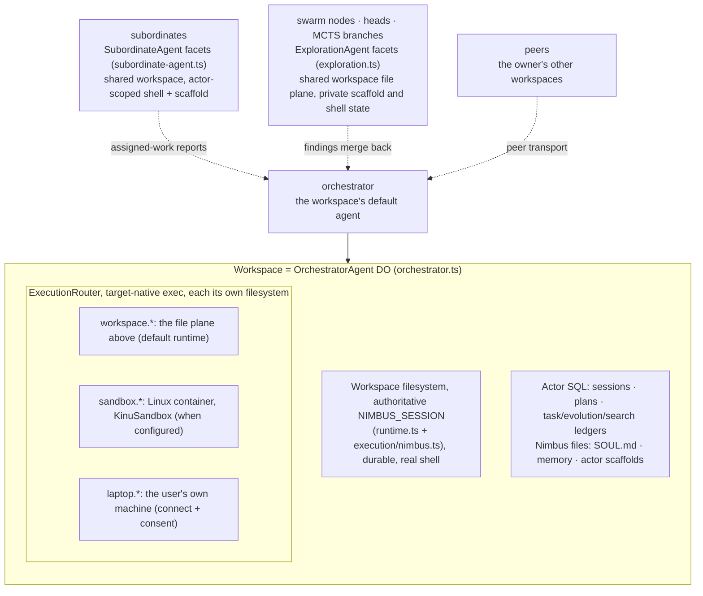
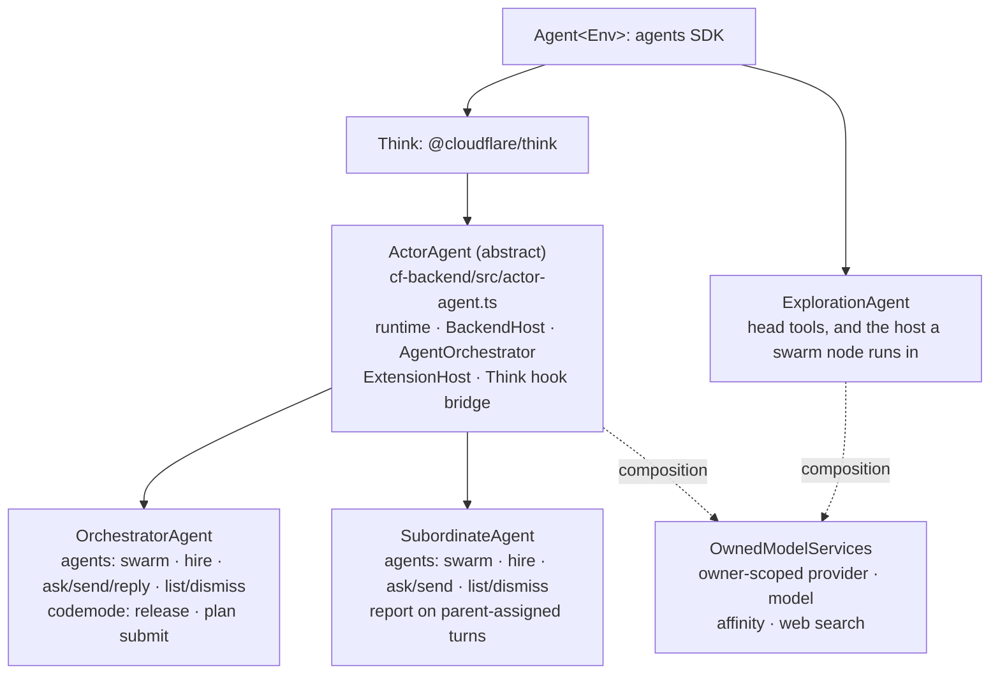
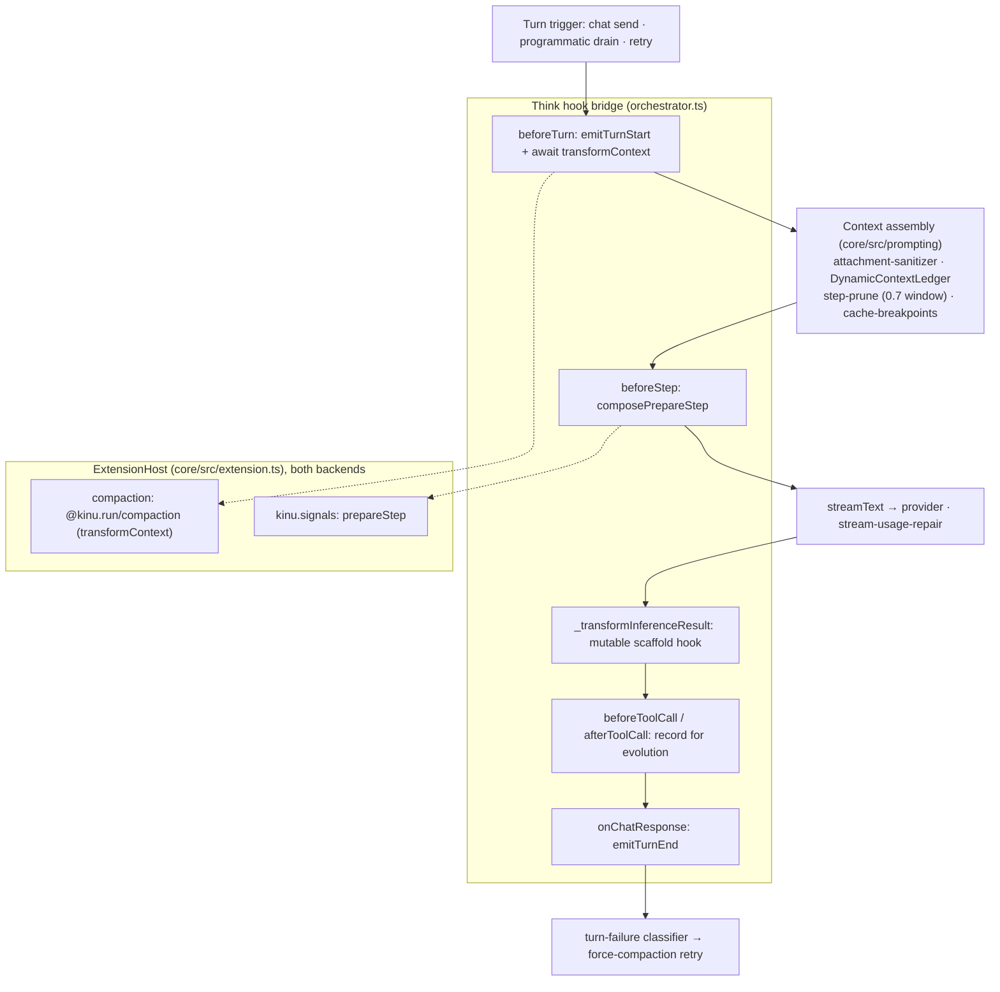
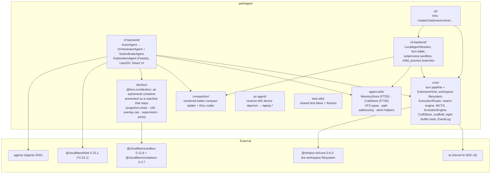

# Architecture

Kinu is an agent platform whose adaptation mechanisms are durable. A workspace
has its own filesystem, execution environments, and sessions; its agent answers
chat, runs tools, can choose a tree search, builds reusable tools, and evaluates
changes to its own loop. Platform-neutral policy lives in `packages/core`. The
Cloudflare and local backends supply storage, models, scheduling, and execution
over different turn transports: Cloudflare Think and the local `runChat` loop.

## The workspace object model

A workspace is 1:1 with an `OrchestratorAgent` Durable Object
(`cf-backend/src/orchestrator.ts`). Its file plane is the workspace filesystem
(`core/src/execution/nimbus.ts`), one authoritative `NIMBUS_SESSION`: a real
shell, runtimes, processes, and ports over the same bytes. Its execution plane
is an `ExecutionRouter` (`core/src/execution/router.ts`) dispatching to
whichever other environment is asked for, running commands target-native rather
than emulating them. There is no mount table; every other environment is its own
filesystem at native paths, reached through its namespace.

The environment list is the source of truth. `listMounts()` (an orchestrator RPC
over `listEnvironments(executionRouter)`, `core/src/read-models/files.ts`)
returns one row per executor with a filesystem: namespace prefix, whether it is
live, and declared policy (`readOnly`, `rootPath`,
`durable | ephemeral | live-shared`). `laptop` is served by the `pc-agent`
reverse-WebSocket daemon (`packages/pc-agent`) on your machine. `sandbox` is a
Cloudflare container, and containers are spot capacity, so
`@kinu.run/devbox` (`packages/devbox`) presents one as a machine that stays:
files survive, supervised processes come back, preview URLs keep their
hostnames. `KinuSandbox` (`cf-backend/src/kinu-sandbox.ts`) is a thin subclass
supplying only my four things: the backup bucket, the preview zone, the two
questions Devbox asks the owning workspace, and egress interception.
[WORKSPACES.md](./WORKSPACES.md) has the noun model;
[EXECUTION-LAYER-SPEC.md](./EXECUTION-LAYER-SPEC.md) the execution planes.

## The actor hierarchy

Three DO classes act inside a workspace, and their inheritance is the security
model:

`ActorAgent` (`cf-backend/src/actor-agent.ts`) owns once what every full-loop
actor needs: the CF runtime assembly, the `BackendHost`, the shared
`AgentOrchestrator`, `ExtensionHost` + compaction, the dynamic-context ledger,
prompt/model/tool caches, and the Think hook bridge. A subclass supplies ten
abstract members (`getOwnerUserId`, `actorKind`, `ensureSchema`,
`actorToolDeps`, `engine`, `notifyOwner`, `delegationBudget`,
`subordinateFacet`, `ownMission`, `persistAutoTitle`) plus three optional hooks
(`workspaceName`, `extraCodemodeProviders`, `isClientRpcMethodDenied`);
`persistAutoTitle` stores a core-decided workspace name wherever that backend
keeps state.

Tool gating is structural; a prompt never decides it. The `agents` schema
derives from the capabilities the profile wires (`actorAgentsActions`). Everyone
can `swarm`; the search substrate is wired unconditionally. `hire`, `ask`,
`send` and `list` need a roster or peer transport, `dismiss` needs the roster,
`reply` needs peers, and only the orchestrator wires those. At the depth cap
`teamProfile()` returns nothing, so roster and hire rung vanish together.
`report` exists only on a subordinate's parent-assigned turn; Release ships as
an orchestrator-only codemode provider omitted from Plan-mode construction;
`submit_plan` only on an orchestrator Plan turn.

`ExplorationAgent` deliberately stays on the bare `Agent`, with three modes. An
MCTS rollout gets no tools and no runtime. A branching head gets the hand-built
head surface (evidence, decisions, `execute_tools`, `run`, `file`, `web`,
depth-budgeted subheads) over the canonical parent workspace. A swarm node
arrives as a serialisable `NodeRunSpec` over RPC and `runAsNode` calls the same
`runNodeLoop` an in-isolate node runs; the facet is a transport. Hosting buys a
storage boundary and a teardown verb, not a second runtime. Heads and nodes
share the workspace's files, processes and ports; SQL journal, scaffold path,
and `shellId` stay private. Neither inherits the full actor surface, so
recursion is bounded by construction: `split_subheads` decrements `maxDepth` per
spawn and refuses once the budget is exhausted.

All three reach the owner/provider/model/web substrate by composition through
`OwnedModelServices` (`cf-backend/src/owned-model-services.ts`): provider
registry, model spec, Workers-AI affinity key, web-search provider.
`ActorAgent` constructs it with `ownerRequired: true`;
`ExplorationAgent` builds its own with `ownerRequired: false`, taking the owner
from the `facet_owner` row its parent seeds.

## Subordinates

`agents({action:'hire', ...})` calls `this.subAgent(subordinateFacet(), name)`
on the hiring actor (`cf-backend/src/actor-agent.ts`) and seeds the facet's
identity immediately. Any actor with a roster hires, so subordinate trees
recurse down to the depth cap. Identity is single-row and immutable after
seeding: re-seeding under a different name, parent workspace, or owner throws,
and the seeding RPC is denied to client sockets, so only a worker-held parent
stub creates one.

A subordinate is a durable teammate: its own SQLite turn/history state, full
loop, evolution engine, survives hibernation. Its runtime keys to the parent's
workspace name, so it uses the same authoritative Nimbus files, processes,
ports, container, and device consent. Its `shellId` and scaffold path are
private, and rendered identity comes from `subordinate_identity` rather than
overwriting the workspace `SOUL.md`.

Work arrives as `ingress: 'subordinate'` variant `subordinate_task`; results
return through `receiveSubordinateEvent` as `subordinate_report`, broadcast to
sockets and drained on the parent. An assigned turn finishing without `report`
relays its answer automatically. Owner-driven subordinate chat is private and
report-less. `dismiss` deletes the facet unless `keep_history` marks only the
roster row dismissed.

Locally, `LocalAgentHost` (`cli-backend/src/agent-host/host.ts`) holds one
`LocalAgentSession` per bound agent for the daemon's whole life: every root it
has a ref for, plus every live subordinate beneath one. Roots are not
workspaces; several roots share one virtual workspace as equal peers, the
workspace being the `{ cwd, workspaceId }` pair on their refs. After
construction the host installs three dependency sets, each deciding whether a
tool exists: `setTeam` gives a roster, `setPeers` gives a root the peer
transport behind `reply`, `setReport` gives a subordinate its reporting tool.
Durable work stays in the shared `EventLog`, `background_jobs`, fiber and
`outbox_peer` tables; the host adds no second queue and no second loop.

The system prompt (`core/src/prompt.ts`) carries the matching doctrine:
decompose multi-part or multi-hour work, hire one subordinate per independent
workstream, keep the coordination and integration turn yourself.

## The turn pipeline

Every turn, cloud or local, flows through one `ExtensionHost`
(`core/src/extension.ts`). The cloud bridges Think's subclass hooks onto it;
the CLI drives `runChat` through it from `LocalAgentSession`
(`cli-backend/src/local-session.ts`). No private callback path parallels the
plugin API.

Three agent kinds run turns here, on two bodies. `runChat` (`core/src/chat.ts`)
serves CLI sessions and swarm nodes alike, since a node reaches it through
`runHeadInference`, which owns no loop (`core/src/heads/head-inference.ts`). One
implementation therefore holds the stall watchdog, dead-stream detection,
mid-step abort, step-boundary pruning, and unpaired-tool-call repair for both.
The cloud actor is the exception: its loop belongs to Think, and I bind to the
hooks below. Nodes register no extensions, so compaction and signal delivery
belong to actor turns alone.

No turn carries a step cap. Think OR-s `stepCountIs(this.maxSteps)` ahead of
anything a caller passes, and the vendor default of 10 cut production turns
mid-tool-call. So `ActorAgent` sets `UNBOUNDED_MAX_STEPS` and `UNBOUNDED_STEPS`
on the Think config, and `runChat` hands `stopWhen` straight to `streamText`
defaulting to `UNBOUNDED_STEPS`. Heads and nodes keep bounded stop conditions of
their own: a node is one graded attempt, not a conversation.

A finished run is named, not guessed. Backends pass facts to `classifyRunEnd`
(`core/src/orchestrator/turn-lifecycle.ts`) and get a `RunEndReason`. A cut turn
is `aborted` even when it threw, because Stop caused no failure. A throw is
`error`, a clean end `completed`. One state stays impossible: reaching your own
end with tool calls pending. The completed arm checks anyway and fires the
`turn.ended_mid_work` tripwire as a diagnostic rather than adding a fourth
ledger word; the step ceiling was the only thing that ever produced that state,
and the tripwire says when that stops holding.

What the boxes are:

| Think hook | Kinu binding | Module |
|---|---|---|
| `beforeTurn` | `emitTurnStart`, then the awaited `transformContext` chain; the turn-local tail is appended **after** the transform; tools folded into `activeTools` | `orchestrator.ts`, `core/src/extension.ts` |
| `beforeStep` | `composePrepareStep`: extension chain, then step-pruning, then the dynamic-context weave, cache-breakpoint markers last | `core/src/prompting/prepare-step.ts` |
| `beforeToolCall` / `afterToolCall` | `emitToolCall` / `emitToolResult`; the evolution engine records each call | `orchestrator.ts` |
| `_transformInferenceResult` | the **mutable scaffold** hook. An evolved `agent.js` becomes the turn's inference loop; un-evolved passes through untouched | `core/src/scaffold/inference-transform.ts` |
| `onChatResponse` | `emitTurnEnd` → fire-and-forget evolution (never blocks the queue); the turn-failure classifier may arm a one-shot force-compaction retry | `orchestrator.ts`, `core/src/turn-failure.ts` |
| `getModel` / `getSystemPrompt` / `getTools` | model from `agent_config`; `SOUL.md` from the VFS; the eight builtin tools, filtered to the actor's wired deps | `core/src/tools/registry.ts` |

Two extensions register at construction on both backends:

- **Compaction** (`@kinu.run/compaction`, `createCompactionExtension`) is the
  default `transformContext`: the vendored better-compact staged-pruning ladder
  (`compaction/src/engine/`) plus my codec (`compaction/src/codec.ts`, AI-SDK
  `ModelMessage[]` ⇄ ladder `Turn[]`). It runs once per turn assembly over
  shared stores: raw transcripts in the canonical workspace VFS, the replayable
  plan, the measured token trigger in one `compaction_state` row. The trigger
  is 85% of the model's context window (`COMPACTION_PRESETS.light`, measured
  against provider-reported prompt tokens floored by the history estimate plus
  the system prompt); rungs run cheapest-first: **superseded ephemeral
  context** → skills → superseded reads → error inputs → old tool output →
  reasoning → remaining tool output → assistant runs → prefix summary. The
  first rung is mine (`relieveEphemeralPressure`): a superseded
  `<dynamic_context>` block is stale and re-derivable from live state, the
  cheapest thing in the request to give up, and being woven per model step no
  ladder stage ever sees it. What it frees is subtracted from the pressure the
  engine hears about, so relief here can stand the rest of the ladder down.
- **Signal delivery** (`kinu.signals`, a `prepareStep` hook) is the one way
  anything asynchronous reaches the agent
  (`core/src/orchestrator/signals.ts`). A producer (event-hub drain, settled
  background job, overflow retry, take pick, MCP task) states intent and
  nothing else. A signal compatible with the active turn is spliced into its
  next step by the `StepInjections` math (`step-injections.ts`); one needing
  its own turn or a different trusted Plan/Build mode enqueues immediately via
  `BackendHost.enqueueTurn`, starting a turn if none runs. `turnInFlight` and
  the trusted mode are the only routing facts. Spliced messages are ephemeral
  exactly like `<dynamic_context>` beside them: model-visible at the tip,
  absent from durable history, gone on cold start. Mechanical steering
  (`turn-steering.ts`) is handed to the step being prepared, so it cannot
  outlive it. Compatible live-turn signals share one buffer and one splice, so
  no registration order shifts another producer's recorded indices; queued
  own-turn signals use the same host without the buffer. This is the DO
  counterpart of the CLI's `kinu.steering` drain.

Supporting context machinery, all in `core/src/prompting`, shared by both
backends: the attachment sanitizer offloads model-incompatible file parts to
`attachments/` so a poisoned transcript heals byte-stably; the
DynamicContextLedger (`volatile-context.ts`) appends a fresh `<dynamic_context>`
block only when its render changes, freezing earlier blocks to preserve cache
breakpoints (`dropSuperseded`, the compaction first rung, is the only
unfreezer); step-prune (`stepContextLimit` = the resolved model's window less
`outputReserveTokens`, the answer allowance the catalog reports, bounded by the
even split) shrinks old tool
outputs near the window; cache-breakpoints places Anthropic `cache_control` /
OpenAI `prompt_cache_key`; stream-usage-repair
(`cf-backend/src/providers/stream-usage-repair.ts`) fixes Cloudflare AI SSE
zeroing `cached_tokens` in its duplicate final chunk.
[EXTENSIONS.md](./EXTENSIONS.md) has the per-turn hook contract.

## Message flow (cloud)

The browser side is `WorkspacePage.tsx` → `use-kinu.ts` → the agents SDK
WebSocket transport; the worker entrypoint is `cf-backend/src/server.ts`
(`routeAgentRequest`, plus the `email()` handler). The CLI takes the same core
loop through `LocalAgentSession` instead.

## Events and ingress

Wake-ups beyond chat publish through a durable `EventLog`
(`core/src/events/hub/log.ts`, schema in `hub/schema.ts`). Delivery leases: the
`consumed_at` column on `agent_log` is set when an event binds to a turn
(`markConsumed`), cleared on completion (`markTurnCompleted`), released on
abort/replan (`unbind`), re-pended for stranded leases by a stale-sweep
(`unbindStale`). A `DrainScheduler` (`drain-scheduler.ts`, 250 ms debounce)
coalesces a burst into one programmatic turn instead of one turn per event.

Five ingress paths publish into the log:

| Source | Path | Wakes via |
|---|---|---|
| Email | `core/src/events/ingress/email.ts` (+ `server.ts` `email()`) | `ingress: 'email_inbound'` |
| Webhook | `core/src/events/ingress/webhook.ts` (+ `cf` `events/routes.ts`, `events/webhook-route.ts`) | signed route capability in the URL, then per-trigger HMAC / Bearer / mTLS |
| Peer | `core/src/events/ingress/peer.ts` (`outbox_peer` → `PeerHub`) | `ingress: 'peer_async'` (cross-workspace) |
| Subordinate | `core/src/events/ingress/subordinate.ts` (+ `subordinates/support.ts` admission) | `ingress: 'subordinate'` (variants `subordinate_task`, `subordinate_report`) |
| Timer | `core/src/events/ingress/triggers.ts`, driven by each backend's clock | `ingress: 'timer_alarm'` (cron / one-shot) |

The webhook rail is the only public one, and it is two gates rather than one.
The delivery URL ends in `v1-<32 hex>`, an HMAC-SHA-256 over the workspace and
trigger identity under `WEBHOOK_ROUTE_SECRET`, minted server-side and verified
by the Worker before the ingress budget, the body, or the workspace object.
That is what decides which workspace a stranger may address; the trigger's own
HMAC / Bearer / mTLS check then decides whether the payload is authentic. The
capability is derived, so it needs no table: revoking one URL is revoking its
trigger, and revoking all of them is rotating the secret.

Core owns the gates: auth, replay window, rate limit, trust, admission; each
backend supplies only the transport. On cf that is the Worker's HTTP and
`email()` routes plus the DO alarm; locally, the process timer. The full
`IngressKind` union in `core/src/events/hub/types.ts` also names `chat_ws`,
`sandbox_cb`, `process_watch`, `file_watch`, `mcp_streamable`, `self_emit`,
`reply_request`; the five above are what wake a sleeping workspace from outside
its own turn.

## MCP: user-level auth once, zero token transfer

MCP servers authenticate once, at the user level, held by the `UserDO`
(`cf-backend/src/user/user-do.ts`, `user_mcp_servers`; OAuth callback
`userMcp_handleOAuthCallback`). Agents never receive a token. The orchestrator
fetches only serializable descriptors (`buildUserMcpTools`); each tool's
`execute` closure RPCs back to `userMcp_callTool(caller, serverId, …)` on the
UserDO, where the one credentialed call runs. The caller presents a workspace
capability token, so there is nothing to spoof: it exists only for a workspace
this user's registry issued one to, and dies with it. A second in-SQL check
covers server membership + `allowed_tools`.

Connection establishment and the descriptor read are separate jobs.
`userMcp_warmConnections` owns establishment and always runs off the turn. Two
triggers reach that one method: the first `/api/user` hit per isolate, under the
*Worker's* `ctx.waitUntil`, which covers the first interactive turn; and every
settled turn, from `ActorAgent.warmUserMcpInBackground` inside the terminal
effect body that runs after the turn's durable recording
(`TerminalTransitions.settle` drives it). The second exists because the first is
keyed per isolate, so an alarm-woken, email-woken or peer-woken workspace never
trips it and an evicted UserDO has already spent it.
`userMcp_toolDescriptors` runs on the turn's critical path and therefore starts
no network work and waits for none: it reads the current connection snapshot and
returns. A configured server that is not connected yet is reported through
`unavailable`, and the next turn's read installs it once the connection
completes. `userMcp_callTool` hydrates on explicit use. One autonomous or
post-eviction turn may honestly lack MCP tools; its settle warms the next one,
and a failed warm is named and retried by the following settle.

A server's name addresses its tools (`mcp_<server>_<tool>`), so names are
unique. `userMcp_add` and `userMcp_update` seal and validate first, then claim
the canonical `lower(name)` and write inside one `ctx.storage.transactionSync` —
no await inside the boundary, so two concurrent adds cannot both pass. That
transaction owns the message the owner reads: a refusal names the taken name.
`initUserTables` builds a `UNIQUE` index over `lower(name)` unconditionally, so
no write path can leave a duplicate behind for a reader to report.

## The UserDO caller boundary

Every secret a user owns lives in one `UserDO`; every privileged method takes a
`UserCaller` first and gates on `requireTier`
(`cf-backend/src/user/workspace-capability.ts`). Worker routes act for the edge-
verified owner and present `ownerCaller(env)`, an HMAC of the Worker's own
secret, so owner authority is something the deployment holds rather than a
string any module can type. A workspace presents the secret minted for it at
claim time, stored hashed; the UserDO looks its tier up live in
`workspace_tiers`. Tokens are identity rather than capability, so re-tainting a
workspace is a single row update.

Neither kind attests who is calling; a sibling DO sharing `env` can derive the
owner capability too. What the boundary buys: the tool surface (what an injected
prompt can steer) reaches the UserDO only through code presenting a workspace
token, attenuated by tier whichever tool gate someone forgets. Today every
workspace registers `full`, the whole surface, exactly as before. The `shared`
tier is what a second human gets: full capability inside itself, no reach into
the wider account. Facets (subordinates, heads, MCTS branches) present their
parent's token, so they attenuate with it and have no identity of their own to
forget. Enforcement lives where the secrets are, so no forgotten tool gate can
route around it.

## Evolution

Evolution runs across four timescales, each feeding the next. The step clock
ticks inside one long turn; the other three belong to the `EvolutionEngine`
(`core/src/evolution/engine.ts`):

- **In-episode:** every settled `execute_tools` call scores crafted-tool
  fitness into `craft_scores` with one synchronous SQL write, no model call
  (`craft-cycle.ts` over `craft/in-episode.ts`).
- **Turn-level:** `reviewTurn()` assesses the finished turn; a negative outcome
  writes a reflection into memory, a strong one extracts a crafted tool into
  the CraftStore.
- **Session-level:** `onSessionReflection()` consolidates patterns and may call
  `maybeEvolveScaffold()` to propose a new `agent.js`.
- **Lifetime:** `onLifetimeEvolution()` runs replay eval, craft consolidation,
  and full `runMCTS()`.

MCTS branch rewards are execution-grounded on both backends. One scorer
(`core/src/mcts/evaluation.ts`) lets execution outcome dominate the judge for CF
Facets, the CF inline fallback, and CLI child-process branches alike. Gates run
before a scaffold mutation takes effect: the misevolution gate
(`scaffold/misevolution.ts`) rejects harmful edits by fixed criteria, the
shadow-veto (`shadow.ts`, `maxRegressions: 1`, `minDecisiveTrials: 5`,
Monte-Carlo-derived) rejects regressions, and the DGM-style archive
(`scaffold/archive.ts`) keeps prior variants as stepping stones, ranked for
re-branching by clade-metaproductivity (what a lineage went on to produce).
Every self-modification surfaces as a human-readable card via the Evolution
Changelog (`evolution/changelog.ts`). See [EVOLUTION.md](./EVOLUTION.md) and
[MCTS.md](./MCTS.md).

## Package structure

## Backends and the AgentRuntime contract

`AgentRuntime` and `BackendHost` are the two interfaces a backend implements,
and they are the whole contract: implement the pair and `packages/core` runs on
your platform. Cloudflare binds actor state to Durable Object SQLite, workspace
files and execution to Nimbus, and the turn driver to Think; local binds them to
`bun:sqlite` and a local process.

| Primitive | CF backend | CLI backend |
|---|---|---|
| Storage | Nimbus VFS + actor DO SQL | Nimbus VFS over `bun:sqlite` + actor SQL |
| Memory | MemoryStore (FTS5 BM25) | MemoryStore (FTS5 BM25) |
| Executor | codemode LOADER / `new Function()` fallback | Bun subprocess sandbox |
| LLM | Workers AI binding or AI Gateway | AI Gateway via AI SDK |
| Schedule | `agent.runFiber()` (durable) + DO `alarm()` | SQLite-backed fiber |
| Identity | DO id + `SOUL.md` (VFS) | UUID + `~/.kinu/` + `SOUL.md` (VFS) |
| Turn driver | `OrchestratorAgent` (Think hooks) | `LocalAgentSession` (`runChat`) |
| Swarm nodes | `ExplorationAgent` Facets (`spawnNodeFacet`) | `LocalAgentSession` node runtime with a credentialed home when the local VFS supports principals |
| MCTS branches | `ExplorationAgent` Facets (`subAgent`) | `child_process.fork` |
| Subordinates | `SubordinateAgent` Facets (`subAgent`) | `LocalAgentSession` per agent, held by `LocalAgentHost` |

The full contract and the four extension points (`ModelProvider`,
`ExplorationStrategy`, `ActorAgent`, `KinuExtension`) are in
[EXTENSIBILITY.md](./EXTENSIBILITY.md). One client contract, `AgentClient`,
reaches either backend;
[AGENT-CLIENT-ARCHITECTURE-SPEC.md](./AGENT-CLIENT-ARCHITECTURE-SPEC.md) holds
it: which side owns which state, the connect-ticket exchange, the
`AGENT_RPC_ACCESS` scope policy, and the designs I rejected.

## Model providers

Model choice is per workspace, resolved through a registry
(`core/src/providers/registry.ts`) the backends build differently and use
identically. Cloud registers `workers-ai`, user-owned `my-gateway`, the platform
`ai-gateway` fallback, `codex`, `openai`, `anthropic`, `openrouter`,
`openai-compat`, then the dynamic models.dev catalog source
(`cf-backend/src/providers/agent-registry.ts`). The CLI registers the same set
plus `claude` (the local Claude Code binary), `opencode`, and one
`openai-compat:<name>` entry per extra compatible credential
(`cli-backend/src/model-resolver.ts`). Its `workers-ai` and `my-gateway` entries
resolve three ways: a local gateway endpoint, a proxy through the owner's cloud
account, or a signed-out placeholder naming what is missing. Registration order
is the default-preference order.

Two policies apply to every provider:

- **The catalog is live.** `models-dev.ts` fetches
  `https://models.dev/api.json` behind a 5-minute cache and derives each
  model's window and capabilities from it; the static lists
  (`WORKERS_AI_FALLBACK_MODEL_CATALOG`, per-provider `FALLBACK_MODELS`) cover
  fetch failure or an empty filter.
- **Every model fetch waits out rate limits, and the wait has no ceiling.**
  `withRateLimitRetry` (`rate-limit-retry.ts`) wraps all four fetch paths: the
  shared `createAuthedFetch`, Workers AI, AI Gateway, codex. A rate-limited
  request follows the provider's `Retry-After` until success, another failure,
  or caller cancel; elapsed time and attempt count never end it. It treats 429
  and 529 as rate limits always, a 503 only when status text, `x-error-code`,
  or body reads as overload, capacity, or too many requests; an unreadable 503
  propagates. Without `Retry-After` it draws full-jitter waits under a ceiling
  doubling from 2 s to a 60 s cap. Non-replayable bodies pass untouched.
  Beside the retry, `ProviderPacer` (`pacing.ts`) spaces request starts per
  host and holds the lane only while awaiting headers, so a request sleeping
  out a `Retry-After` frees capacity for a sibling and streaming bodies stay
  untouched; waits are declared before taken, so siblings join one cooldown.
  The AI SDK transport retry stays at its default of 2, stated explicitly as
  `PROVIDER_SDK_RETRIES` so a vendor update cannot move it silently.

Reasoning effort is yours to set. `/effort` in chat or
`kinu effort <name> [level]` stores `reasoning_effort` in the workspace's
`agent_config`, `~/.kinu/config.json` holding the CLI-side default.
`core/src/strategy/effort.ts` maps the level onto each family's native knob:
`reasoning_effort` (Workers AI), `reasoningEffort` (OpenAI-shaped,
OpenRouter), thinking `budgetTokens` 4k/16k/32k (Anthropic). Internal stages
take theirs from `REASONING_EFFORT_FOR_STAGE`, sized to the work: reflection
and MCTS rollouts `low`, scaffold mutation `high`.

## Storage and formal models

Two authorities own workspace state. The Nimbus session owns files, including
`SOUL.md`, memory markdown, and scaffolds. The actor's SQLite owns relational
state: plans, messages, memory/craft indexes, MCTS, search records, evolution,
event logs, Think session tables. Schema and boundaries:
[STORAGE.md](./STORAGE.md); the vendored filesystem:
[NIMBUS-INTEGRATION.md](./NIMBUS-INTEGRATION.md).

Selected core algorithms are modeled in Lean 4 (`lean/`): 485 named declarations
cover abstract models of agent, evolution, execution, exploration, MCTS, safety,
and storage properties. The traceability map enrolls 380 proved-in-abstract-model
entries and 90 by-construction witnesses against 49 requirements, with no `sorry`
(measured 2026-08-30 by `lean/check-traceability.mjs`). Axiom reports
use only Lean's three kernel axioms; one separate SQLite FTS5 assumption is
documented and enrolled. CI (`.github/workflows/lean-verify.yml` →
`scripts/verify-lean.sh`) gates compilation, negative consistency, axiom
closure, requirement-to-proof-to-source traceability. These are checked
statements about the models, not a proof that the deployed TypeScript refines
them. See [FORMAL-SPEC.md](./FORMAL-SPEC.md).
