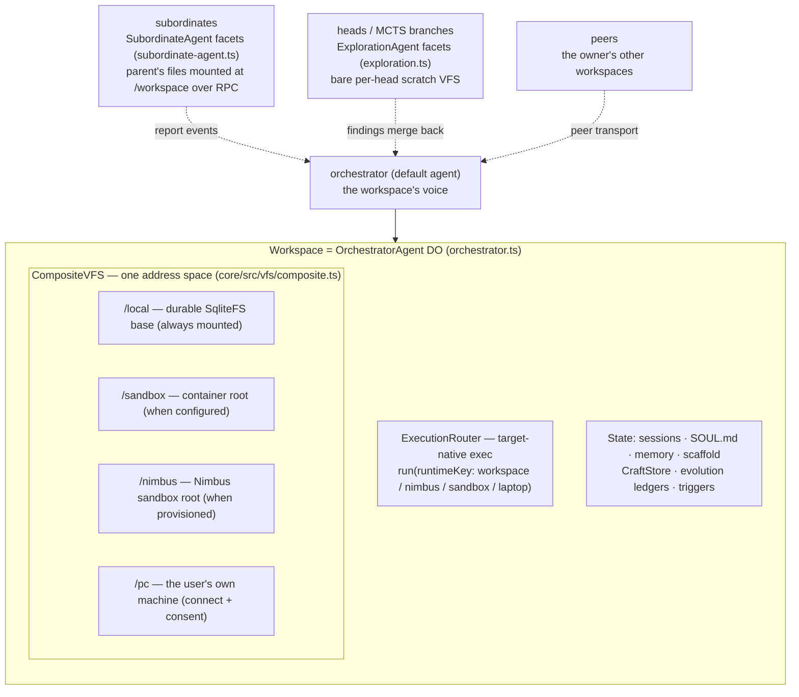
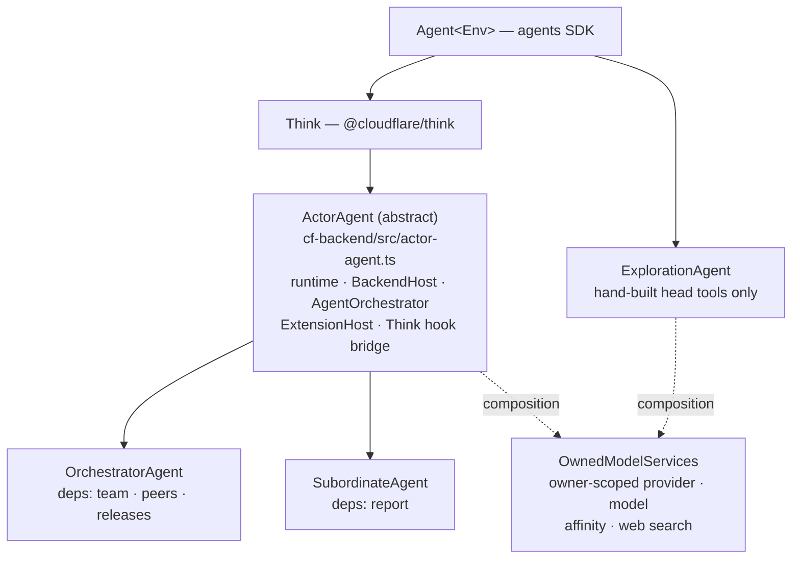
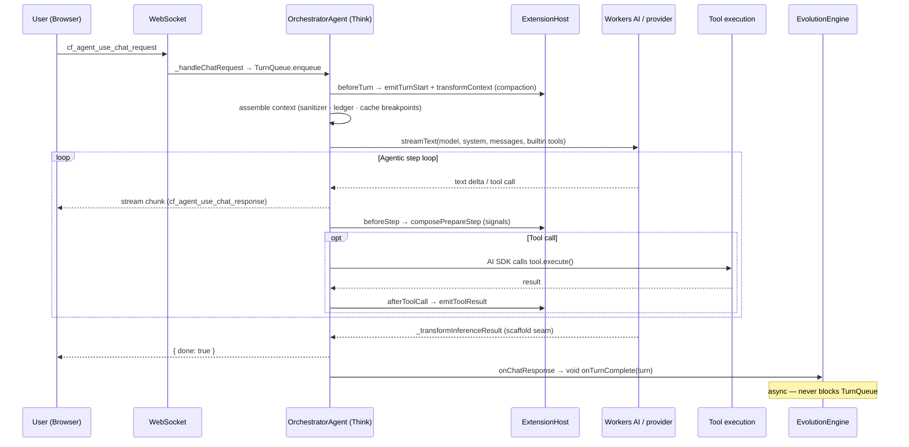
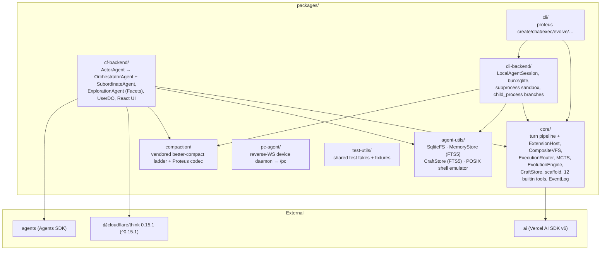

# Architecture

> Maintained by Claude (AI-edited documentation, presented as-is); verify against the code when precision matters.

Proteus is a self-evolving agent **workspace**. You create a workspace — a durable
container with its own filesystem, execution environments, and sessions — and its
agent answers chat, runs tools, explores strategies with Monte Carlo Tree Search,
learns reusable tools, and can rewrite its own agentic loop.

The design has one rule that keeps it honest: **one shared brain, thin adapters.**
Everything platform-independent lives in `packages/core`. The cloud backend
(`packages/cf-backend`, a Durable Object over Cloudflare's [Think](https://github.com/cloudflare/agents))
and the local backend (`packages/cli-backend`) are thin shells that give the same
core loop a place to run. This document maps that structure to real modules; file
paths are cited so you can jump to the source.

## The workspace object model

A workspace is the container; agents are the actors inside it. The workspace is
1:1 with an `OrchestratorAgent` Durable Object on the cloud backend
(`cf-backend/src/orchestrator.ts`). Its file plane is a `CompositeVFS`
(`core/src/vfs/composite.ts`) — a single address space over every environment —
and its execution plane is an `ExecutionRouter` (`core/src/execution/router.ts`)
that dispatches to whichever environment is asked for, running commands
target-native rather than emulating them.

The mount table is the source of truth: `listMounts()` (an orchestrator RPC over
`compositeVfs.listMounts()`) returns each live mount plus its declared policy
(`readOnly`, `durable | ephemeral | live-shared`, credentials-stay-in-host). The
`/pc` mount is served by the `pc-agent` reverse-WebSocket daemon
(`packages/pc-agent`) running on the user's machine. See
[WORKSPACES.md](./WORKSPACES.md) for the full noun model.

## The actor hierarchy

Three DO classes act inside a workspace, and their inheritance is the security
model, not an implementation detail:

`ActorAgent` owns everything a full-loop actor needs once: the CF runtime
assembly, the `BackendHost`, the shared `AgentOrchestrator`, `ExtensionHost` +
compaction, the dynamic-context ledger, the prompt/model/tool caches, and the Think
hook bridge. A subclass supplies only a four-member profile — `getOwnerUserId`,
`actorToolDeps`, `engine`, `notifyOwner` — plus three optional hooks
(`workspaceName`, `extraCodemodeProviders`, `isClientRpcMethodDenied`).

**Tool gating is structural, not flagged.** `DEPS_GATED_TOOLS` is
`['team', 'peers', 'report', 'release']`, and `actorActiveTools()` filters
the active set by which deps the profile actually wired. The orchestrator wires
`team`, `peers`, and `releases`; a subordinate wires only `report`. That
is the whole mechanism — a subordinate cannot staff subordinates of its own
because there is no `team` tool in its ToolSet to call.

**`ExplorationAgent` deliberately stays on the bare `Agent`.** It is not an
`ActorAgent` and never inherits the actor tool surface. Its ToolSet is
hand-assembled by `buildHeadTools()` — `record_evidence`, `record_decision`, the
four `sandbox_*` verbs over its own ephemeral SqliteFS and virtual shell,
`web`, three `shared_*` verbs into the root's scratch, and
the depth-budgeted `split_subheads`. No `execute_tools`, no `run`, no `think`,
no `team`, no `peers`. Recursion is bounded by construction: without `think` a
head cannot start a fresh strategy run, and its one fan-out path,
`split_subheads`, decrements `maxDepth` on every spawn and refuses once the
budget is exhausted.

All three share the owner/provider/model/web substrate by **composition**, not
inheritance: `OwnedModelServices`
(`cf-backend/src/owned-model-services.ts`) resolves the owner's provider
registry, the model spec, the Workers-AI session-affinity key, and the web-search
provider. `ActorAgent` constructs it with `ownerRequired: true`;
`ExplorationAgent` constructs its own with `ownerRequired: false`, taking the
owner from the `facet_owner` row its parent seeds.

## Subordinates

`team(action:'spawn')` calls `orchestrator.subAgent(SubordinateAgent, name)` and
immediately seeds the facet's identity. That identity is single-row and
immutable after seeding: re-seeding with a different name, parent workspace, or
owner throws, and the seeding RPC is denied to client sockets, so only a
worker-held parent stub can create one.

A subordinate is a *durable* teammate, not a one-shot call. It has its own
SQLite, runs the full turn loop, keeps its own evolution engine and history, and
survives hibernation. It sees the workspace's files through
`createParentRpcMountVFS`, mounted at `/workspace` with `consistency: 'durable'`
and `credentialsStayInHost: true`; the five parent-side methods it calls
(`readWorkspaceFile`, `writeWorkspaceFile`, `listWorkspaceFiles`,
`statWorkspaceFile`, `deleteWorkspaceFile`) deliberately carry no `@callable`,
so nothing but a parent stub can reach them. Exec planes stay keyed on the
*parent's* workspace name, so sandbox and `/pc` are shared rather than
duplicated.

Work arrives as an `ingress: 'subordinate'` event with variant
`subordinate_task`; results come back through `receiveSubordinateEvent` as
variant `subordinate_report`, which broadcasts to sockets and schedules a drain
on the parent. If a subordinate finishes an assigned turn without calling
`report`, its answer is relayed automatically. `dismiss` deletes the facet
unless `keep_history` is set, in which case only the roster row is marked
dismissed.

The system prompt (`core/src/prompt.ts`) carries the matching doctrine — the
delegation ladder that steers the agent to decompose multi-part or multi-hour
work and staff one subordinate per independent workstream, keeping the
coordination and integration turn for itself, rather than grinding through
everything inline.

## The turn pipeline

Every turn — cloud or local — flows through the same `ExtensionHost`
(`core/src/extension.ts`), the one small, stable seam both backends fire. On the
cloud the `OrchestratorAgent` bridges Think's subclass hooks onto that host;
on the CLI, `LocalAgentSession` (`cli-backend/src/local-session.ts`) drives
`runChat` with the same host. There is deliberately no private callback path
running parallel to the plugin API.

What the boxes are:

| Think hook | Proteus binding | Module |
|---|---|---|
| `beforeTurn` | `emitTurnStart`, then the awaited `transformContext` chain; the turn-local tail is appended **after** the transform; tools folded into `activeTools` | `orchestrator.ts`, `core/src/extension.ts` |
| `beforeStep` | `composePrepareStep` — extension chain, then step-pruning, then the dynamic-context weave, cache-breakpoint markers last | `core/src/prompting/prepare-step.ts` |
| `beforeToolCall` / `afterToolCall` | `emitToolCall` / `emitToolResult`; the evolution engine records each call | `orchestrator.ts` |
| `_transformInferenceResult` | the **mutable scaffold** seam — an evolved `agent.js` becomes the turn's inference loop; un-evolved passes through untouched | `core/src/scaffold/inference-transform.ts` |
| `onChatResponse` | `emitTurnEnd` → fire-and-forget evolution (never blocks the queue); the turn-failure classifier may arm a one-shot force-compaction retry | `orchestrator.ts`, `core/src/turn-failure.ts` |
| `getModel` / `getSystemPrompt` / `getTools` | model from `agent_config`; `SOUL.md` from the VFS; the 12 builtin tools, filtered to the actor's wired deps | `core/src/tools/registry.ts` |

The two default registrants attach at construction on both backends:

- **Compaction** (`@proteus/compaction`, `createCompactionExtension`) is the
  default `transformContext`: the vendored better-compact staged-pruning ladder
  (`compaction/src/engine/`) plus the Proteus codec (`compaction/src/codec.ts`,
  AI-SDK `ModelMessage[]` ⇄ ladder `Turn[]`). It runs once per turn assembly over
  shared stores — raw transcripts in the CompositeVFS, the replayable plan + the
  measured token trigger in one `compaction_state` row. The trigger is 85% of
  the model's context window (`COMPACTION_PRESETS.light`, measured against the
  provider's own reported prompt tokens floored by the history estimate plus the
  system prompt), and the rungs run cheapest-first: **superseded ephemeral
  context** → skills → superseded reads → error inputs → old tool output →
  reasoning → remaining tool output → assistant runs → prefix summary. The first
  rung is Proteus's own (`relieveEphemeralPressure`): a superseded
  `<dynamic_context>` block is stale by definition and re-derivable from live
  state, so it is the cheapest thing in the request to give up — and, being
  woven per model step, it is the one thing a ladder stage can never see. What
  it frees is subtracted from the pressure the engine is told about, so relief
  here can stand the rest of the ladder down.
- **Signal delivery** (`proteus.signals`, a `prepareStep` hook) is the ONE way
  anything asynchronous reaches the agent, at the ONE time anything reaches it
  (`core/src/orchestrator/signals.ts`). A producer — the event-hub drain, a
  settled background job, an overflow retry, a take pick, an MCP task — states
  intent and nothing else; the signal is spliced into the live turn's next step
  using the `StepInjections` math (`core/src/prompting/step-injections.ts`).
  When no turn is running there is no next step, so delivery starts one
  (`BackendHost.enqueueTurn`) — that is what "next step" means to an idle
  agent, not a second timing, and `BackendHost.turnInFlight` is the fact the
  seam reads to tell them apart. The spliced message is ephemeral exactly like
  the `<dynamic_context>` block beside it: model-visible at the tip, never
  durable history, gone on a cold start. The turn's own mechanical steering
  (`core/src/orchestrator/turn-steering.ts`) is not delivered — it is handed to the step being
  prepared, so it cannot outlive it. One buffer and one splice for every
  signal, so no registration order can shift another producer's recorded
  indices. It is the DO counterpart of the CLI's `proteus.steering` drain —
  same mechanism, one host.

Supporting context machinery, all in `core/src/prompting` and shared by both
backends: the **attachment sanitizer** (`attachment-sanitizer.ts`) offloads
model-incompatible file parts to `/local/attachments` so a poisoned transcript
heals byte-stably; the **DynamicContextLedger** (`volatile-context.ts`) re-reads
live state at every model step and appends a fresh `<dynamic_context>` block only
when its render changes, freezing earlier blocks in place to preserve provider
cache breakpoints (`dropSuperseded`, the compaction ladder's first rung, is the
only thing that ever unfreezes one); **step-prune**
(`step-prune.ts`, `STEP_CONTEXT_BUDGET_RATIO = 0.7`) shrinks old tool outputs once
a step nears the window; **cache-breakpoints** (`cache-breakpoints.ts`) places
Anthropic `cache_control` / OpenAI `prompt_cache_key`; and **stream-usage-repair**
(`cf-backend/src/providers/stream-usage-repair.ts`) fixes Cloudflare AI SSE that
zeroes `cached_tokens` in its duplicate final chunk. See
[EXTENSIONS.md](./EXTENSIONS.md) for the per-turn hook contract.

## Message flow (cloud)

The browser side is `WorkspacePage.tsx` → `use-proteus.ts` → the agents SDK
WebSocket transport; the worker entrypoint is `cf-backend/src/server.ts`
(`routeAgentRequest`, plus the `email()` handler). The CLI takes the same core
loop through `LocalAgentSession` instead of the WebSocket transport.

## Events and ingress

The workspace is not only chat-driven — it wakes on external events through a
durable `EventLog` (`core/src/events/hub/log.ts`, schema in
`core/src/events/hub/schema.ts`). Delivery uses a **lease**: the `consumed_at`
column on the `agent_log` table is set when an event is bound to a turn
(`markConsumed`), cleared on completion (`markTurnCompleted`), released on
abort/replan (`unbind`), and re-pended by a stale-sweep for stranded leases
(`unbindStale`). A `DrainScheduler` (`core/src/orchestrator/drain-scheduler.ts`,
250 ms debounce) coalesces a burst of events into one programmatic turn instead of
one turn per event.

Five ingress paths publish into the log:

| Source | Path | Wakes via |
|---|---|---|
| Email | `events/ingress/email.ts` (+ `server.ts` `email()`) | `ingress: 'email_inbound'` |
| Webhook | `events/routes.ts` → `acceptWebhookDelivery` | per-trigger HMAC / Bearer / mTLS |
| Peer | `events/ingress/peer.ts` (`peer_outbox` → `PeerHub`) | `ingress: 'peer_async'` (cross-workspace) |
| Subordinate | `subordinate-support.ts` `admitSubordinateTask` / `admitSubordinateReport` | `ingress: 'subordinate'` (variants `subordinate_task`, `subordinate_report`) |
| Timer | `orchestrator.ts` `alarm()` + `core/src/events/hub/triggers.ts` | `ingress: 'timer_alarm'` (cron / one-shot) |

The full `IngressKind` union in `core/src/events/hub/types.ts` is wider than
this — it also names `chat_ws`, `sandbox_cb`, `process_watch`, `file_watch`,
`mcp_streamable`, `self_emit`, and `reply_request` — but the five above are the
paths that wake a sleeping workspace from outside its own turn.

## MCP — user-level once-auth, zero token transfer

MCP servers are authenticated **once at the user level** and held by the `UserDO`
(`cf-backend/src/user/user-do.ts`, `user_mcp_servers` table; OAuth callback at
`userMcp_handleOAuthCallback`). Agents never receive a token. The orchestrator
fetches only serializable tool descriptors (`buildUserMcpTools`) and each tool's
`execute` closure RPCs back to `userMcp_callTool(caller, serverId, …)` on the
UserDO, where the one credentialed call runs. The caller is a **workspace
capability token**, not a claimed name, so there is nothing to spoof: the token
exists only for a workspace this user's registry issued one to, and dies with
it. A second in-SQL check covers server membership + `allowed_tools`.

## The UserDO caller boundary

Every secret a user owns lives in one `UserDO`, and every privileged method on
it takes a `UserCaller` first and gates on `requireTier`
(`cf-backend/src/user/workspace-capability.ts`). Worker routes act for the owner
whose identity the edge verified and pass `OWNER_SESSION`; a workspace presents
the per-workspace secret minted for it at claim time and stored hashed, and the
UserDO looks its tier up live in `workspace_tiers`. The token is identity, not
capability, so re-tainting a workspace is a single row update.

Today every workspace is registered `full` — the whole user surface, exactly as
before. The `shared` tier is what a workspace shared with a second human will
get: full capability inside itself, no reach into the owner's wider account.
Facets (subordinates, heads, MCTS branches) present their PARENT workspace's
token, so they attenuate with it and have no identity of their own to forget.
Enforcement lives where the secrets are, so no workspace-DO code path or
forgotten tool gate can route around it.

## Evolution

The `EvolutionEngine` (`core/src/evolution/engine.ts`) runs across three
timescales, each feeding the next:

- **Turn-level** — `reviewTurn()` assesses the just-finished turn; a negative
  outcome gates a reflection into memory, a strong one extracts a reusable
  CraftStore tool.
- **Session-level** — `onSessionReflection()` consolidates patterns and may call
  `maybeEvolveScaffold()` to propose a new `agent.js`.
- **Lifetime** — `onLifetimeEvolution()` runs replay eval, craft consolidation,
  and full `runMCTS()`.

MCTS branch rewards are **execution-grounded on both backends** — the single
scorer (`core/src/mcts/evaluation.ts`) lets execution outcome dominate the judge
for CF Facets, the CF inline fallback, and CLI forked branches alike. Scaffold
mutations are guarded before they can take effect: a **misevolution gate**
(`core/src/scaffold/misevolution.ts`) rejects harmful edits by fixed criteria, a
**shadow-veto** (`core/src/scaffold/shadow.ts`, `maxRegressions: 1`,
`minDecisiveTrials: 5`, Monte-Carlo-derived) rejects regressions, and a **DGM-style
archive** (`core/src/scaffold/archive.ts`) keeps prior variants as stepping
stones, ranked for re-branching by clade-metaproductivity (what a lineage went
on to produce) rather than by each variant's own score.
Every self-modification surfaces as a human-readable card via the **Evolution
Changelog** (`core/src/evolution/changelog.ts`). See [EVOLUTION.md](./EVOLUTION.md)
and [MCTS.md](./MCTS.md).

## Package structure

## Backends and the AgentRuntime contract

`AgentRuntime` is the seam every backend implements so `packages/core` never has
to know where it runs. `packages/cf-backend` binds it to Durable Object SQLite
and Think; `packages/cli-backend` binds it to `bun:sqlite` and a local process.

| Primitive | CF backend | CLI backend |
|---|---|---|
| Storage | SqliteFS over DO SQLite | SqliteFS over `bun:sqlite` |
| Memory | MemoryStore (FTS5 BM25) | MemoryStore (FTS5 BM25) |
| Executor | codemode LOADER / `new Function()` fallback | Bun subprocess sandbox |
| LLM | Workers AI binding or AI Gateway | AI Gateway via AI SDK |
| Schedule | `agent.runFiber()` (durable) + DO `alarm()` | SQLite-backed fiber |
| Identity | DO id + `SOUL.md` (VFS) | UUID + `~/.proteus/` + `SOUL.md` (VFS) |
| Turn driver | `OrchestratorAgent` (Think hooks) | `LocalAgentSession` (`runChat`) |
| MCTS branches | `ExplorationAgent` Facets (`subAgent`) | `child_process.fork` |
| Subordinates | `SubordinateAgent` Facets (`subAgent`) | not available (one agent per process) |

The full contract and the four "plug in a new idea" seams (ModelProvider,
ExplorationStrategy, InferenceLoop, CredentialStore) are in
[EXTENSIBILITY.md](./EXTENSIBILITY.md).

## The model seam

Model choice is per workspace and resolved through a provider registry
(`core/src/providers/registry.ts`) that both backends build differently and then
use identically. The cloud registers `workers-ai`, the user's own `my-gateway`,
the platform `ai-gateway` fallback, `codex`, `openai`, `anthropic`,
`openrouter`, `openai-compat`, plus a dynamic source backed by the live
models.dev catalog; the CLI registers the same minus the dynamic catalog, plus
`claude` (the local Claude Code binary) and `opencode`. Registration order is
the default-preference order.

Two policies live at this seam and apply to every provider:

- **The catalog is live.** `core/src/providers/models-dev.ts` fetches
  `https://models.dev/api.json` behind a 5-minute cache and derives each model's
  context window and capabilities from it. The static per-provider lists
  (`WORKERS_AI_FALLBACK_MODEL_CATALOG`, each provider's `FALLBACK_MODELS`) are
  only what you get when that fetch fails or filters to nothing.
- **Every model fetch retries rate limits.** `withRateLimitRetry`
  (`core/src/providers/rate-limit-retry.ts`) wraps the fetch of every provider —
  the shared `createAuthedFetch`, the Workers AI path, the AI Gateway path, and
  codex. It retries 429/529 (and overload-shaped 503s) up to 6 attempts inside a
  180 s budget, honoring `Retry-After` verbatim when the server sends one and
  otherwise waiting a full-jitter draw under an exponentially growing ceiling
  (2 s doubling to a 60 s cap). Requests whose body isn't replayable pass through
  untouched, and an exhausted budget returns the original response rather than
  throwing.

**Reasoning effort** is user-settable rather than baked in: `/effort` in chat or
`proteus effort <workspace> <level>` stores `reasoning_effort` in the workspace's
`agent_config`, with `~/.proteus/config.json` holding the CLI-side default for
new workspaces. `core/src/strategy/effort.ts` maps the level onto each provider
family's native knob — `reasoning_effort` for Workers AI, `reasoningEffort` for
OpenAI-shaped and OpenRouter providers, and a thinking `budgetTokens`
(4k/16k/32k) for Anthropic. Internal stages that shouldn't cost chat-grade
thinking pick their own level from `REASONING_EFFORT_FOR_STAGE` — reflection and
MCTS rollouts run `low`, scaffold mutation runs `high`.

## Storage and formal models

All workspace state lives in one Durable Object SQLite database — the VFS
(`vfs_files`, including `SOUL.md`), memory, crafted tools + scores, MCTS
`search_nodes`, `scaffold_versions`, evolution ledgers, `agent_log`,
`compaction_state`, and Think's own session tables. The schema and the SqliteFS /
MemoryStore internals are documented in [STORAGE.md](./STORAGE.md).

Selected core algorithms are modeled in Lean 4 (`lean/`): 84 named theorems over
hand-maintained abstract models of agent, evolution, execution, MCTS, safety, and
storage properties. Their axiom reports use only Lean's three kernel axioms; one
separate SQLite FTS5 assumption is documented and enrolled. CI
(`.github/workflows/lean-verify.yml` → `scripts/verify-lean.sh`) gates
compilation, negative consistency, axiom closure, and requirement-to-proof-to-source
traceability. These are checked statements about the models, not a proof that the
deployed TypeScript refines them — see [FORMAL-SPEC.md](./FORMAL-SPEC.md).
