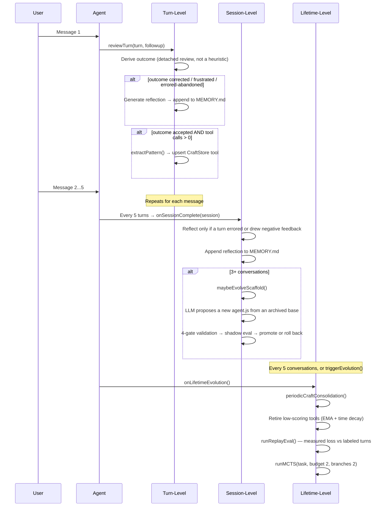
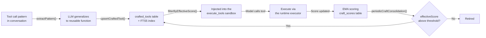

# Evolution System

> Maintained by Claude (AI-edited documentation, presented as-is); verify against the code when precision matters.

Proteus evolves across three timescales. Each operates independently, with shorter timescales feeding data to longer ones. The engine is `core/src/evolution/engine.ts`.

## Three Timescales



## Turn-Level Evolution

`reviewTurn()` fires after every chat response via `onChatResponse()`. It runs
asynchronously (fire-and-forget) so it never blocks the Think TurnQueue;
`reviewTurnDetached()` is the variant used when the review itself should run
outside the turn.

**There is no length/duration quality heuristic any more.** Quality comes from
a real turn *outcome* — `accepted`, `corrected`, `frustrated`, or `abandoned` —
recorded in the `turn_outcomes` table. Outcomes arrive from four sources: an
explicit thumbs vote (`applyExplicitFeedback`), the user's own follow-up
message, session end, and which alternate take the user picked
(`applyTakePick`). The only hardcoded number left is 0.1, the quality assigned
to an errored turn the user abandoned. An unobserved, error-free turn produces
no quality at all and the review returns early rather than inventing one.

**Reflection** fires on a negative outcome (`corrected` or `frustrated`, or an
`abandoned` turn that also errored). An LLM call generates a lesson, appended to
`memory/MEMORY.md` and recorded in the `lessons` table as `provisional` until a
later turn corroborates it.

**Pattern extraction** fires when the outcome is `accepted` and the turn made
tool calls. `extractPattern()` asks the LLM to generalize the tool-call pattern
into a reusable async arrow function with JSON Schema parameters, stored in
`crafted_tools` with conflict detection (name match, or FTS5 top-5 with Jaccard
word overlap > 0.85). An existing tool is only overwritten when the candidate
scores more than 0.1 above it.

## Judge Calibration

Every outcome the follow-up classifier records is a *judgement*, and every rate
downstream — K_align, the per-scaffold outcome rates, the GEPA train/val split,
craft retirement — counts those judgements rather than what actually happened.
If the classifier misses a third of the corrections, all of those numbers are
wrong by an unknown amount in an unknown direction, and more turns only tighten
the interval around the wrong answer.

`calibration.ts` + `ppi.ts` close that with a few hand labels:

```
proteus label export <agent>            # draws ~100 turns into a file
$EDITOR <agent>-calibration.txt         # one letter per turn (~30-45 min)
proteus label ingest <agent> <file>     # validates, then stores
proteus label report <agent>            # what the labels established
```

The draw is stratified on the classifier's verdict (a uniform sample of an
~85%-`accepted` ledger would measure nothing about the rare verdicts) and
systematic in time within each stratum. The file is **blind** — it shows the
request, the answer and the user's follow-up, never the classifier's verdict —
because pre-filling the guess would anchor the labeler on the very number under
test. Labels land append-only in `outcome_labels`; a re-label is a new row and
the newest wins.

The estimator is prediction-powered inference (Angelopoulos et al. 2023) with a
prediction-stratified rectifier, factored so it transports across slices:
sensitivity and specificity are estimated once with the population
re-weighting the design requires, then each slice's own observed rate is
corrected by Rogan–Gladen, `θ̂ = (p̂ + q̂₀ − 1)/(q̂₁ + q̂₀ − 1)`, with the delta
method propagating all three uncertainties. Over the population the labels came
from, that is algebraically the same estimate as the stratified PPI form.

`proteus alignment` prints the corrected block beneath K_align always. With no
labels it reads `uncalibrated` rather than letting the reader assume the
classifier and the truth agree.

### Can two models do the labeling next time?

A profile measured against last quarter's classifier says nothing about this
quarter's, so calibration has to be redone — and thirty minutes a time is the
kind of cost that quietly stops being paid. `ensemble.ts` asks whether that job
can be handed over, and answers it with a measurement rather than a hope:

```
proteus label ensemble <agent>          # two cross-family judges, same turns
```

Both judges see exactly what the human file showed (the same
`renderLabelingEvidence` call renders both) and never the classifier's verdict,
the human's, or each other's. They answer independently; agreement is the
panel's verdict and a split is `unclear`. There is no third judge on purpose —
a majority vote would turn those admissions of ignorance back into confident
answers, and the admissions are what a two-model panel is for. Verdicts land
append-only in `outcome_ensemble_labels`, one row per model per turn.

The report is Cohen's κ for all three rater pairs (you↔panel, you↔classifier,
panel↔classifier) over the same turns, the panel's verdict against yours cell
by cell, and the panel's sensitivity/specificity on the negative class through
the same `classifierAccuracy` estimator the classifier's own profile comes
from. One thing needed care: the panel's verdict varies inside a stratum the
sample was drawn on, so `classifierAccuracy`'s closed-form interval treats two
halves of one sample as independent and comes back far too narrow — measured
against a known truth it covers at 44–75% against a nominal 95%, where the
stratified bootstrap `resampledAccuracy` uses covers at 86–93%.

Whether the panel may stand in is decided by three conditions written into
`ensemble.ts` **before** any of these numbers existed: κ(you↔panel) lower bound
≥ 0.60, κ(you↔panel) ≥ κ(you↔classifier) on the same turns, and negative-class
recall ≥ 0.70 with specificity ≥ 0.90 as lower bounds (which keeps the
Rogan–Gladen denominator at ≥ 0.60). The second is the one that matters: a
panel no closer to you than the classifier already is would be measuring one
flawed rater with another. Below the bar the report says the panel cannot stand
in and nothing changes; above it, nothing switches on either — what it buys is
grounds to draw the next set with the panel and hand-audit a slice.

## Session-Level Evolution

The cadence lives in `AgentOrchestrator`, not the engine: every
`sessionReflectionInterval` (5) turns it calls `engine.onSessionComplete()` with
the accumulated turns. Both backends pass 5.

`onSessionComplete` is selective — it needs at least **3 turns** in the window,
and `sessionWarrantsReflection()` requires that some turn errored, drew negative
feedback, or has a negative recorded outcome. A clean session produces no
reflection. When it does reflect, an LLM call analyzes the window's recent
lessons and writes a structured reflection to `memory/MEMORY.md`.

**Scaffold mutation** is gated on at least 3 conversations, and skipped outright
if a proposal is already pending. The proposal is not built from the live
scaffold alone: `selectEvolutionBase()` picks a base from the DGM archive —
with probability `1 − scaffold_explore_share` (default 0.2) it branches from the
live `current`, otherwise it samples an archived `historical` or `rolled_back`
variant weighted by its **clade-metaproductivity** and inverse trial count. The
clade score is the evidence-weighted pooled win rate over the candidate's whole
descendant subtree (itself included), win rates having already been blended with
real user outcomes — HGM's (ICLR 2026) correction to DGM: a variant that won its
own trial but whose children all regressed is a dead end, while the middling
variant every good version descends from is the one worth branching off again.
A candidate with no descendants pools over itself alone and scores exactly its
own win rate, so a shallow archive reproduces the pre-clade policy term for
term. The newest 8 archive entries are rendered into the proposal prompt.

`modifyScaffold()` then validates through 4 gates:

1. **Structural gate** — rationale ≥ 50 chars; none of the four forbidden
   patterns (`require`/`import`, `globalThis`, `eval(`, `Function(`); the
   required signature `async function* run(rt, task)`; then the misevolution
   veto below.
2. **Parse gate** — the code is compiled through `rt.executor` as a syntax check.
3. **Version checkpoint** — a single-pending invariant (a second `pending`
   version is refused), the base taken from `status = 'current'` rather than
   `MAX(version)`, `newVersion = MAX(version) + 1`, and the DGM base must exist
   in the archive. Backing up the current version falls out of this step.
4. **Write gate** — the proposal is written to the **versioned** file
   `scaffold/agent.js.v{N}`, never to the live `scaffold/agent.js`, so shadow
   evaluation is never comparing new code against itself.

### Misevolution gate

`core/src/scaffold/misevolution.ts` is a pure text check with five frozen
criteria; the first match rejects the proposal and writes a
`misevolution_veto` row to `evolution_events`:

| Criterion | Rejects |
|---|---|
| `network-egress` | `fetch(`, `XMLHttpRequest`, `new WebSocket`, `sendBeacon(`, `EventSource` |
| `version-machinery-tamper` | touching `scaffold_versions`, `scaffold_evaluations`, `scaffold/agent.js`, `agent.js.v<N>` |
| `rollout-config-tamper` | touching `auto_promote_scaffold`, `shadow_sample_rate`, `scaffold_explore_share`, `auto_gepa_every_n_turns`, `changelog_seen_at` |
| `self-modification-reentry` | calling `proposeScaffold`, `modifyScaffold`, `applyPromotionDecision`, `applyScaffoldDecision`, `rollbackScaffold`, `checkMisevolution` |
| `consent-weakening` | touching `shell_approval_mode`, `setShellApprovalMode`, `allow_all`, `device_consent` |

The same check runs at three surfaces, not one: the proposal gate, the promotion
decision (re-checked against the on-disk file), and crafted-tool upsert.

### Shadow evaluation

A validated proposal does not take effect on merit alone. It is sampled into
real turns at `shadow_sample_rate` (0.25) and judged against the incumbent:

```
minTrials 5 · maxTrials 20 · promoteThreshold 0.6 · rollbackThreshold 0.4
maxRegressions 1 · minDecisiveTrials 5 · autoPromote false
```

Each trial is judged **twice, with the two responses swapped**. The judge sees
them unlabelled and in a randomized order, and a candidate takes the trial only
by winning both orders — a flip is recorded as a tie. That removes the position
and status-quo bias the old prompt built in by pinning the incumbent to
"Response A" and labelling it CURRENT. The judge itself prefers a model from a
different vendor family than the agent's chat model whenever one is connected,
because a model grading its own family's prose inflates it; same-model judging
survives only as the single-vendor fallback.

The **regression veto runs first**: more than `maxRegressions` losses rolls the
proposal back regardless of win rate. Every constant here comes from binomial
Monte Carlo rather than taste (`scripts/shadow-veto-monte-carlo.ts`, which
models the judging protocol itself). At the shipping settings a genuinely
better scaffold is promoted about 62% of the time, against a worst case of
about 3.2% for promoting a clearly worse one.

### How much of a turn a judge actually sees

Every reader in this loop — the shadow judge, the GEPA reflector, the turn
outcome classifier, the replay judge — used to carry its own hard-coded
`slice(0, n)`: the FIRST n characters. That is not a cost bound, it is a blind
spot with a shape. A turn whose payoff lands at step 9 of 12 was invisible to a
judge reading its opening 2,500 characters, so the loop could not select for
long-horizon behaviour at all.

`core/src/prompts/evidence-window.ts` is now the single source. `evidenceWindow`
keeps head **and** tail and names what it dropped, on an even split — a tool
result's head carries the command echo, but a judged trajectory carries its
outcome at the end, and the outcome is what is being judged. The budgets are 4×
their predecessors and, for the first time, **ordered**: a reader never asks for
more than the row it reads was stored at, which is why `turn_outcomes` had to be
widened first (GEPA's eval instances and the replay judge both read those rows).
A candidate's *source* stays head-truncated rather than windowed — a rewrite of
code whose middle was elided comes back with a hole.

The protocols, thresholds and sampling rates above are unchanged by this. That
is not the same as unaffected: the Monte Carlo that settled them modelled the
OLD evidence, and richer evidence moves both decisive yield and tie rate, so
those constants are due a re-run against the new budgets.

The archive keeps **every** version — it is a read model over
`scaffold_versions` joined to `scaffold_evaluations`, with no eviction — so a
rolled-back variant remains available as a future stepping stone.

## Lifetime-Level Evolution

Triggered by:
- `onLifetimeEvolution()`, automatically every `lifetimeEvolutionInterval` (5) conversations
- The `triggerEvolution()` @callable RPC (manual trigger from UI)

**CraftStore consolidation**: computes `effectiveScore` with EMA (α=0.3) and
time decay (30-day half-life), retiring tools below 0.1 that have been used at
least twice. Unscored tools are skipped, and the whole pass aborts if it would
empty the store.

**Replay eval** (`runReplayEval`): re-scores labeled past turns to produce a
measurable loss curve, so scaffold changes are judged against a number rather
than a vibe. Every point on that curve is a mean of `DEFAULT_REPLAY_SAMPLE_SIZE`
judge verdicts, so it is reported — and persisted, in `replay_evals.score_lo` /
`score_hi` — with the 95% Wilson interval around it (`core/src/utils/stats.ts`).
The changelog only calls a move "improved" or "declined" when the two intervals
don't overlap.

**GEPA train/val split** (`buildOutcomeEvalSplit`): the reflection minibatch
draws from older corrected/frustrated turns; the newest failures are held out
and scored on alongside the accepted-turn regression guards. The two sets are
disjoint, so a winning candidate was never optimised against the instances that
picked it. When the ledger holds too few failures to hold any out, the split
returns a `degeneracy` reason and the caller reports the selection as
exploratory instead of quietly overlapping the sets.

**Full MCTS exploration**: a smaller search than the tool's default — budget 2,
branches 2. See [MCTS.md](./MCTS.md).

## Evolution Changelog

Every self-modification surfaces as a human-readable card
(`core/src/evolution/changelog.ts`). It is a pure read model over the durable
ledgers — the only state it owns is a `changelog_seen_at` marker — with six
entry kinds:

| Kind | Source | Revertable via |
|---|---|---|
| `scaffold` | the archive + promotion/rollback run events | `scaffold_rollback` |
| `tool` | `crafted_tools` joined to `craft_scores` | `craft_retire` |
| `fact` | `agent_facts`, collapsed into one card with children | `fact_forget` / `fact_forget_many` |
| `gepa` | completed GEPA runs | — |
| `replay` | replay-eval scores with their intervals, and the direction vs the previous run when the intervals separate | — |
| `outcomes` | aggregated `turn_outcomes` counts | — |

Reverts dispatch to the real code paths (`applyPromotionDecision`,
`rollbackScaffold`, `craftStore.delete`, `facts.forget`), not to a separate undo
log.

## CraftStore Lifecycle



**Scoring formula:**
- EMA update: `newScore = 0.7 * oldScore + 0.3 * observation` (α = 0.3)
- Time decay: `effectiveScore = score * 0.5^(daysSinceLastUse / 30)`
- Injection cutoff: `effectiveScore >= 0.2` — unscored (brand-new) tools always pass
- Retirement threshold: `effectiveScore < 0.1`, and only after 2 uses

Crafted-tool code must be between 50 and 1500 characters to be extracted at all.
Extraction happens from three places: an accepted turn (`extractPattern`), an
MCTS iteration scoring above `craftExtractionThreshold` (0.8), and MCTS
convergence when the winner scores above 0.8.

## Evolution Events

Evolution activity is persisted to the `evolution_events` SQL table:

| Column | Type | Description |
|--------|------|-------------|
| `id` | TEXT PK | Random hex ID |
| `type` | TEXT | `turn_complete`, `reflection`, `craft_discovered`, `scaffold_proposed`, `consolidation`, `mcts_started`, `mcts_complete`, `replay_eval`, `changelog_digest`, `misevolution_veto` |
| `message` | TEXT | Human-readable description |
| `data` | TEXT | JSON payload (optional) |
| `created_at` | INTEGER | Epoch milliseconds |

This table is one of three sources the web UI's timeline merges
(`cf-backend/src/lib/timeline.ts`) — the others are the durable `run_events` log
and the MCTS `search_nodes` tree. `proteus status` reads the same table locally.
