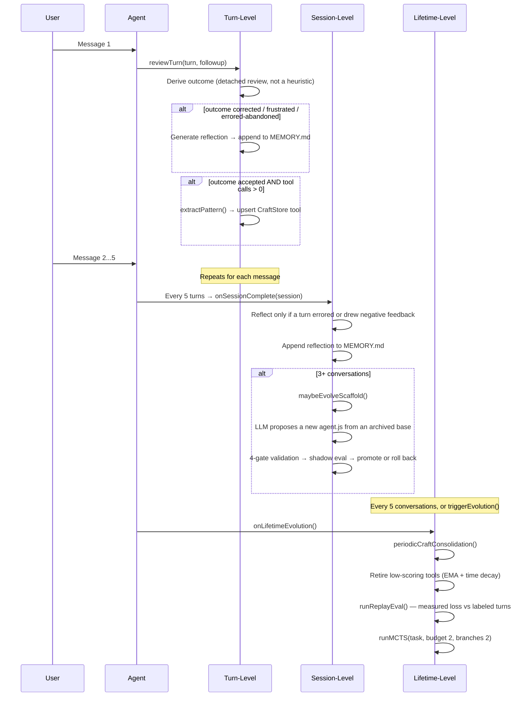
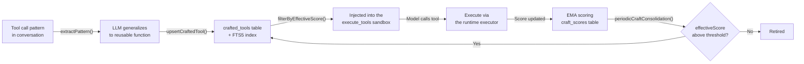

# Evolution System

> Maintained by Claude (AI-edited documentation, presented as-is); verify against the code when precision matters.

Proteus evolves across three timescales. Each operates independently, with shorter timescales feeding data to longer ones. The engine is `core/src/evolution/engine.ts`.

## Three Timescales



## Turn-Level Evolution

`reviewTurn()` fires after every chat response via `onChatResponse()`. It runs
asynchronously (fire-and-forget) so it never blocks the Think TurnQueue;
`reviewTurnDetached()` is the variant used when the review itself should run
outside the turn.

**There is no length/duration quality heuristic any more.** Quality comes from
a real turn *outcome* — `accepted`, `corrected`, `frustrated`, or `abandoned` —
recorded in the `turn_outcomes` table. Outcomes arrive from four sources: an
explicit thumbs vote (`applyExplicitFeedback`), the user's own follow-up
message, session end, and which alternate take the user picked
(`applyTakePick`). The only hardcoded number left is 0.1, the quality assigned
to an errored turn the user abandoned. An unobserved, error-free turn produces
no quality at all and the review returns early rather than inventing one.

**Reflection** fires on a negative outcome (`corrected` or `frustrated`, or an
`abandoned` turn that also errored). An LLM call generates a lesson, appended to
`memory/MEMORY.md` and recorded in the `lessons` table as `provisional` until a
later turn corroborates it.

**Pattern extraction** fires when the outcome is `accepted` and the turn made
tool calls. `extractPattern()` asks the LLM to generalize the tool-call pattern
into a reusable async arrow function with JSON Schema parameters, stored in
`crafted_tools` with conflict detection (name match, or FTS5 top-5 with Jaccard
word overlap > 0.85). An existing tool is only overwritten when the candidate
scores more than 0.1 above it.

## Session-Level Evolution

The cadence lives in `AgentOrchestrator`, not the engine: every
`sessionReflectionInterval` (5) turns it calls `engine.onSessionComplete()` with
the accumulated turns. Both backends pass 5.

`onSessionComplete` is selective — it needs at least **3 turns** in the window,
and `sessionWarrantsReflection()` requires that some turn errored, drew negative
feedback, or has a negative recorded outcome. A clean session produces no
reflection. When it does reflect, an LLM call analyzes the window's recent
lessons and writes a structured reflection to `memory/MEMORY.md`.

**Scaffold mutation** is gated on at least 3 conversations, and skipped outright
if a proposal is already pending. The proposal is not built from the live
scaffold alone: `selectEvolutionBase()` picks a base from the DGM archive —
with probability `1 − scaffold_explore_share` (default 0.2) it branches from the
live `current`, otherwise it samples an archived `historical` or `rolled_back`
variant weighted by its **clade-metaproductivity** and inverse trial count. The
clade score is the evidence-weighted pooled win rate over the candidate's whole
descendant subtree (itself included), win rates having already been blended with
real user outcomes — HGM's (ICLR 2026) correction to DGM: a variant that won its
own trial but whose children all regressed is a dead end, while the middling
variant every good version descends from is the one worth branching off again.
A candidate with no descendants pools over itself alone and scores exactly its
own win rate, so a shallow archive reproduces the pre-clade policy term for
term. The newest 8 archive entries are rendered into the proposal prompt.

`modifyScaffold()` then validates through 4 gates:

1. **Structural gate** — rationale ≥ 50 chars; none of the four forbidden
   patterns (`require`/`import`, `globalThis`, `eval(`, `Function(`); the
   required signature `async function* run(rt, task)`; then the misevolution
   veto below.
2. **Parse gate** — the code is compiled through `rt.executor` as a syntax check.
3. **Version checkpoint** — a single-pending invariant (a second `pending`
   version is refused), the base taken from `status = 'current'` rather than
   `MAX(version)`, `newVersion = MAX(version) + 1`, and the DGM base must exist
   in the archive. Backing up the current version falls out of this step.
4. **Write gate** — the proposal is written to the **versioned** file
   `scaffold/agent.js.v{N}`, never to the live `scaffold/agent.js`, so shadow
   evaluation is never comparing new code against itself.

### Misevolution gate

`core/src/scaffold/misevolution.ts` is a pure text check with five frozen
criteria; the first match rejects the proposal and writes a
`misevolution_veto` row to `evolution_events`:

| Criterion | Rejects |
|---|---|
| `network-egress` | `fetch(`, `XMLHttpRequest`, `new WebSocket`, `sendBeacon(`, `EventSource` |
| `version-machinery-tamper` | touching `scaffold_versions`, `scaffold_evaluations`, `scaffold/agent.js`, `agent.js.v<N>` |
| `rollout-config-tamper` | touching `auto_promote_scaffold`, `shadow_sample_rate`, `scaffold_explore_share`, `auto_gepa_every_n_turns`, `changelog_seen_at` |
| `self-modification-reentry` | calling `proposeScaffold`, `modifyScaffold`, `applyPromotionDecision`, `applyScaffoldDecision`, `rollbackScaffold`, `checkMisevolution` |
| `consent-weakening` | touching `shell_approval_mode`, `setShellApprovalMode`, `allow_all`, `device_consent` |

The same check runs at three surfaces, not one: the proposal gate, the promotion
decision (re-checked against the on-disk file), and crafted-tool upsert.

### Shadow evaluation

A validated proposal does not take effect on merit alone. It is sampled into
real turns at `shadow_sample_rate` (0.25) and judged against the incumbent:

```
minTrials 5 · maxTrials 20 · promoteThreshold 0.6 · rollbackThreshold 0.4
maxRegressions 1 · minDecisiveTrials 5 · autoPromote false
```

Each trial is judged **twice, with the two responses swapped**. The judge sees
them unlabelled and in a randomized order, and a candidate takes the trial only
by winning both orders — a flip is recorded as a tie. That removes the position
and status-quo bias the old prompt built in by pinning the incumbent to
"Response A" and labelling it CURRENT. The judge itself prefers a model from a
different vendor family than the agent's chat model whenever one is connected,
because a model grading its own family's prose inflates it; same-model judging
survives only as the single-vendor fallback.

The **regression veto runs first**: more than `maxRegressions` losses rolls the
proposal back regardless of win rate. Every constant here comes from binomial
Monte Carlo rather than taste (`scripts/shadow-veto-monte-carlo.ts`, which
models the judging protocol itself). At the shipping settings a genuinely
better scaffold is promoted about 62% of the time, against a worst case of
about 3.2% for promoting a clearly worse one.

The archive keeps **every** version — it is a read model over
`scaffold_versions` joined to `scaffold_evaluations`, with no eviction — so a
rolled-back variant remains available as a future stepping stone.

## Lifetime-Level Evolution

Triggered by:
- `onLifetimeEvolution()`, automatically every `lifetimeEvolutionInterval` (5) conversations
- The `triggerEvolution()` @callable RPC (manual trigger from UI)

**CraftStore consolidation**: computes `effectiveScore` with EMA (α=0.3) and
time decay (30-day half-life), retiring tools below 0.1 that have been used at
least twice. Unscored tools are skipped, and the whole pass aborts if it would
empty the store.

**Replay eval** (`runReplayEval`): re-scores labeled past turns to produce a
measurable loss curve, so scaffold changes are judged against a number rather
than a vibe.

**Full MCTS exploration**: a smaller search than the tool's default — budget 2,
branches 2. See [MCTS.md](./MCTS.md).

## Evolution Changelog

Every self-modification surfaces as a human-readable card
(`core/src/evolution/changelog.ts`). It is a pure read model over the durable
ledgers — the only state it owns is a `changelog_seen_at` marker — with six
entry kinds:

| Kind | Source | Revertable via |
|---|---|---|
| `scaffold` | the archive + promotion/rollback run events | `scaffold_rollback` |
| `tool` | `crafted_tools` joined to `craft_scores` | `craft_retire` |
| `fact` | `agent_facts`, collapsed into one card with children | `fact_forget` / `fact_forget_many` |
| `gepa` | completed GEPA runs | — |
| `replay` | replay-eval scores, with the delta vs the previous run | — |
| `outcomes` | aggregated `turn_outcomes` counts | — |

Reverts dispatch to the real code paths (`applyPromotionDecision`,
`rollbackScaffold`, `craftStore.delete`, `facts.forget`), not to a separate undo
log.

## CraftStore Lifecycle



**Scoring formula:**
- EMA update: `newScore = 0.7 * oldScore + 0.3 * observation` (α = 0.3)
- Time decay: `effectiveScore = score * 0.5^(daysSinceLastUse / 30)`
- Injection cutoff: `effectiveScore >= 0.2` — unscored (brand-new) tools always pass
- Retirement threshold: `effectiveScore < 0.1`, and only after 2 uses

Crafted-tool code must be between 50 and 1500 characters to be extracted at all.
Extraction happens from three places: an accepted turn (`extractPattern`), an
MCTS iteration scoring above `craftExtractionThreshold` (0.8), and MCTS
convergence when the winner scores above 0.8.

## Evolution Events

Evolution activity is persisted to the `evolution_events` SQL table:

| Column | Type | Description |
|--------|------|-------------|
| `id` | TEXT PK | Random hex ID |
| `type` | TEXT | `turn_complete`, `reflection`, `craft_discovered`, `scaffold_proposed`, `consolidation`, `mcts_started`, `mcts_complete`, `replay_eval`, `changelog_digest`, `misevolution_veto` |
| `message` | TEXT | Human-readable description |
| `data` | TEXT | JSON payload (optional) |
| `created_at` | INTEGER | Epoch milliseconds |

This table is one of three sources the web UI's timeline merges
(`cf-backend/src/lib/timeline.ts`) — the others are the durable `run_events` log
and the MCTS `search_nodes` tree. `proteus status` reads the same table locally.
