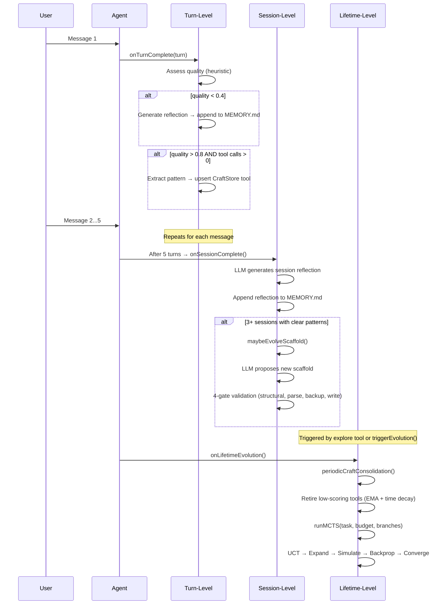

# Evolution System

Proteus evolves across three timescales. Each operates independently, with shorter timescales feeding data to longer ones.

## Three Timescales



## Turn-Level Evolution

Fires after every chat response via `onChatResponse()`. Runs asynchronously (fire-and-forget) to avoid blocking the Think TurnQueue.

**Quality assessment** uses a heuristic based on:
- Response length (longer = more substantive)
- Tool usage (tools indicate active problem-solving)
- Error presence
- Duration

**Reflection** (quality < 0.4): An LLM call generates a lesson from the failed turn, appended to `memory/MEMORY.md` with a quality score and timestamp.

**Pattern extraction** (quality > 0.8 with tool calls): An LLM call generalizes the successful tool-call pattern into a reusable async arrow function with JSON Schema parameters. Stored in `crafted_tools` via `upsertCraftedTool()` with conflict detection (Jaccard similarity > 0.85).

## Session-Level Evolution

Session reflection fires via two independent paths:

1. **Orchestrator path** (`orchestrator.ts:505`): The orchestrator calls `engine.onSessionComplete()` every `SESSION_REFLECTION_INTERVAL` (5) turns, passing accumulated turn data. This resets its own counter.
2. **Engine-internal path** (`engine.ts:130`): The engine's `onTurnComplete()` tracks `turnsSinceReflection` and triggers its own `onSessionReflection()` every `sessionReflectionInterval` (default 10) turns.

Both paths call the same reflection logic; the orchestrator path fires more frequently.

**Session reflection**: An LLM call analyzes the accumulated turns for patterns, writing a structured reflection to `memory/MEMORY.md`.

**Scaffold mutation** (after 3+ sessions): If the reflection suggests significant improvement, `maybeEvolveScaffold()` proposes a new scaffold via LLM, validated through 4 gates:

1. **Structural gate**: Rationale ≥ 50 chars, no forbidden patterns (`require`, `import`, `eval`, `Function`, `globalThis`), required signature `async function* run(rt, task)`
2. **Parse gate**: Syntax check via executor
3. **Version checkpoint**: Current scaffold backed up to `scaffold/agent.js.v{N}`
4. **Write gate**: New scaffold written to VFS, logged to memory

## Lifetime-Level Evolution

Triggered by:
- The `explore` tool (agent decides to deeply investigate a subproblem)
- The `triggerEvolution()` @callable RPC (manual trigger from UI)
- Automatic trigger after N sessions (consolidation only; full MCTS requires explicit trigger)

**CraftStore consolidation**: Iterates all crafted tools, computes `effectiveScore` with EMA (α=0.3) and time decay (30-day half-life). Retires tools below the retirement threshold (0.1). Never retires all tools (BUG-2 guard).

**Full MCTS exploration**: Runs a complete MCTS search cycle. See [MCTS.md](./MCTS.md).

## CraftStore Lifecycle

```mermaid
graph LR
    A[Tool call pattern<br/>in conversation] -->|"extractPattern()"| B[LLM generalizes<br/>to reusable function]
    B -->|"upsertCraftedTool()"| C[crafted_tools table<br/>+ FTS5 index]
    C -->|"loadCraftedTools()"| D[AI SDK tool() objects<br/>in getTools()]
    D -->|"Model calls tool"| E[Execute via<br/>rt.executor]
    E -->|"Score updated"| F[EMA scoring<br/>craft_scores table]
    F -->|"periodicConsolidation()"| G{effectiveScore<br/>above threshold?}
    G -->|Yes| C
    G -->|No| H[Retired]
```

**Scoring formula:**
- EMA update: `newScore = 0.7 * oldScore + 0.3 * observation`
- Time decay: `effectiveScore = score * 0.5^(daysSinceLastUse / 30)`
- Retirement threshold: `effectiveScore < 0.1`

## Evolution Events

All evolution activity is persisted to the `evolution_events` SQL table:

| Column | Type | Description |
|--------|------|-------------|
| `id` | TEXT PK | Random hex ID |
| `type` | TEXT | `turn_complete`, `reflection`, `craft_discovered`, `scaffold_proposed`, `consolidation`, `mcts_started`, `mcts_complete` |
| `message` | TEXT | Human-readable description |
| `data` | TEXT | JSON payload (optional) |
| `created_at` | INTEGER | Epoch milliseconds |

The web UI's Evolution tab fetches these via the `getEvolutionEvents()` @callable RPC.
