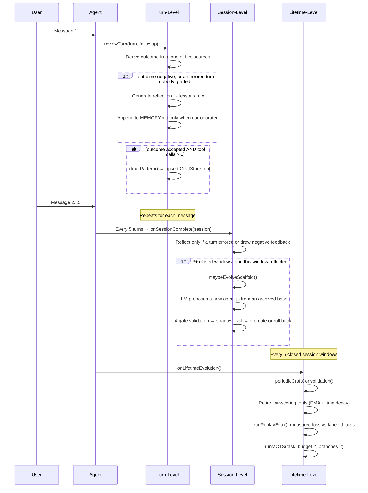
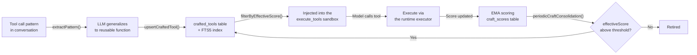

# Evolution system

Kinu evolves on four timescales. Each runs independently, and shorter ones feed data to longer ones. The engine is `core/src/evolution/engine.ts`. The shortest timescale is the only clock that ticks inside a single long autonomous turn. It has two channels: crafted-tool fitness (`core/src/orchestrator/craft-cycle.ts` over `core/src/craft/in-episode.ts`) and execution-recovery findings (`core/src/evolution/recovery.ts`, detected by the failure ledger in `core/src/orchestrator/turn-steering.ts`).

Two files this page names live in the workspace filesystem, not in this repository. Do not grep the tree for them. The curated memory note is `MemoryStore.curatedFile` (`agent-utils/src/memory/store.ts:93`), which resolves to memory/MEMORY.md inside a workspace. The live scaffold is each actor's `scaffoldPath()` (`cf-backend/src/actor-agent.ts:495`), which resolves to scaffold/agent.js there and is seeded by `createWorkspace` (`core/src/identity/create.ts:115`).

## In-episode evolution (the step clock)

The other three timescales are conversational: the next user message grades a turn, five turns close a window, five windows close a lifetime.

The step clock fires on every settled `execute_tools` call, read off the tool-result hook. The hook carries the call's own args, so the code graded is the code that ran. Creation is credited only to a call that itself invoked `workspace.createTool`. Invocation means call sites in the submitted code: `tools.<name>(`, the one namespace a crafted tool is callable in. Strings and comments are blanked first, so a tool body passed to `createTool` is not read as a call.

The fitness signal is execution, observed at the host. A crafted tool that raised is stamped with its own name leaving the sandbox, so the failure lands on the artifact whether or not the model caught it. A call that broke on its own account blames nobody. A completed call credits only tools that already existed when it started. A tool cannot certify itself on the call that created it. A call moved to the background is not a result and credits nothing.

Two gates stand between observation and effect. The misevolution veto runs before
each crafted-tool write. The injection floor is reachable because
`workspace.createTool` calls `craftStore.create`
(`core/src/execution/inline.ts:300-373`). The `crafted_tools` quality columns
default to `0.5`, the `CRAFT_NEUTRAL_PRIOR` value
(`core/src/craft/schemas.ts:13-18`; `craft/in-episode.ts:100`), so an unscored
tool cannot bypass the filter. Extracted candidates use the same store
(`core/src/craft/conflict.ts:119`). Each settled block updates that row in one
synchronous SQL statement.

`CRAFT_INVOCATION_QUALITY` maps a returned call to `0.7` and a raised call to
`0.1`. The store applies its configured EMA alpha of `0.3`. From the neutral
`0.5` prior, four raises produce `0.196`, below the `0.2` injection floor. One
later return raises that score to `0.347`. These values come from
`craft/in-episode.ts` and the current craft-store config. They are declared
policy arithmetic, not a measured success rate.

A tool that keeps raising drops out of the callable set for the rest of the
episode because both backends re-read the store per execute.

Each turn writes at most one `craft_cycle` run event carrying `crafted`, `invoked`, `reused`, `returned`, `raised` and `dropped`, with `turn_end` as the denominator. `reused` is the numerator that matters: a tool crafted this turn and called by a later block is the loop actually closing.

**The ceiling.** Execution-grounded fitness measures "it ran and did not raise". It cannot measure "it did the right thing". That needs a verifier the agent did not choose: the sealed bench has one, and production does not. So this channel feeds tool injection and nothing with a wider blast radius. No scaffold, prompt or gate is ever promoted on it. A `--no-auto-evolve` run observes nothing, so a benchmark's arms still mean what they say.

### The knowledge channel (execution recoveries)

The step clock's second observation sits beside the artifact channel, in `core/src/evolution/recovery.ts`, detected by the failure ledger in `core/src/orchestrator/turn-steering.ts`. When a tool's failure streak reaches the steer threshold and a changed call of the same tool then runs clean, the runtime records the pairing as a durable lesson. It stores `source = 'execution_recovery'` with both arg echoes verbatim. It injects the newest `MAX_RECOVERY_FINDINGS` findings (5, at `core/src/evolution/recovery.ts:83`) into every subsequent step's dynamic-context block.

That makes it the one knowledge plane that moves during a long turn. Facts and the MEMORY.md tail freeze at turn assembly; a finding recorded at step 40 rides step 41. It survives compaction, continuation turns and instance death, where in-context learning does not.

The discipline matches the artifact channel. The runtime records on both halves, on the same failing-result predicate the steer trusts, with no model asked. A streak broken by the same call finally working records nothing. A lucky retry is not a changed approach, and durable "keep grinding" advice is the exact misevolution the steer exists to prevent. The pairing is temporal rather than causal, so a finding gates nothing. It is a bounded hint plane, provisional forever, bound to no turn. Lesson corroboration can never admit it to MEMORY.md, and the experience library can never export it.

Each turn with a broken streak writes one `execution_recovery` run event carrying `tool`, `failures` and `failedSignature`. The falsifier is a query: the same `failedSignature` failing again in a later turn is a finding that did not take.

## Three conversational timescales



## Turn-level evolution

`reviewTurn()` (`core/src/evolution/engine.ts:469`) fires after every chat response, via `onChatResponse()`. It runs fire-and-forget, so it never blocks the Think TurnQueue.

There is no length or duration quality heuristic. Quality comes from a real turn outcome, one of `accepted`, `corrected`, `frustrated` or `abandoned`, recorded in the `turn_outcomes` table. Outcomes arrive from five sources, in canonical order in `TURN_OUTCOME_SOURCES` (`core/src/evolution/outcomes.ts:80`):

| Source | What produced it |
|---|---|
| `explicit` | The user's thumbs vote, through `applyExplicitFeedback` |
| `classifier` | The LLM verdict on a real conversational follow-up |
| `session_end` | The session-end abandoned rule |
| `take_pick` | Which alternate take the user picked, through `applyTakePick` |
| `execution` | The environment's verdict on a turn no user will grade, through `executionVerdict` |

`execution` is machine evidence rather than a person's judgement, so `isUserVerdictSource()` excludes it. Every reader that speaks about user opinion must say so; `core/src/evolution/alignment.ts` does.

The quality constants live in `outcomeQuality()` (`core/src/evolution/outcomes.ts:122`). A thumbs verdict is 0.9 or 0.2. `frustrated` is 0.1 and `abandoned` a neutral 0.5. An execution-sourced row prices on its own narrower band, 0.7 or 0.3, because it is a proxy. `reviewTurn` adds one case of its own: an abandoned or ungraded turn that errored scores 0.1. A turn with no outcome and no error produces no quality at all. The review returns early rather than inventing one. Such a turn still records, as a `turn_complete` event with `graded: false`.

**Reflection** fires on any negative outcome, and on an abandoned or ungraded turn that also errored. An LLM call generates a lesson, always recorded in `lessons`. It reaches the curated memory note only when corroborated, and corroboration requires a negative verdict from a user source. An `execution` verdict deliberately does not corroborate. "The turn hit an error" is not a reader confirming the lesson drawn from it. An uncorroborated lesson stays `provisional` until a later user outcome corroborates it.

**Pattern extraction** fires when the outcome is `accepted` and the turn made tool calls. `extractPattern()` (`core/src/evolution/engine.ts:1174`) asks the LLM to generalize the tool-call pattern into a reusable async arrow function with JSON Schema parameters. `upsertCraftedTool` stores it in `crafted_tools` after compiling it and running the misevolution veto. Conflict detection is a name match, or an FTS5 top-5 search whose Jaccard word overlap exceeds `conflictSimilarityThreshold` (0.85). An existing tool is overwritten only when the candidate scores more than 0.1 above it (`core/src/craft/conflict.ts:102`).

## Judge calibration

Every outcome the follow-up classifier records is a judgement, and every rate downstream counts those judgements rather than what actually happened. That covers K_align, the per-scaffold outcome rates, the GEPA train/val split, and craft retirement. If the classifier misses a third of the corrections, all of those numbers are wrong by an unknown amount in an unknown direction. More turns only tighten the interval around the wrong answer. `core/src/evolution/calibration.ts` and `core/src/evolution/ppi.ts` close that with a few hand labels:

```
kinu label export <agent>            # draws ~100 turns into a file
$EDITOR <agent>-calibration.txt         # one letter per turn (~30-45 min)
kinu label ingest <agent> <file>     # validates, then stores
kinu label report <agent>            # what the labels established
```

`DEFAULT_LABEL_BUDGET` is 100 (`core/src/evolution/calibration.ts:120`). The file is sized so ~100 turns is a 30 to 45 minute read (`core/src/evolution/calibration.ts:257`). The draw stratifies on the classifier's verdict. A uniform sample of a ledger that is ~85% `accepted` would measure nothing about the rare verdicts; within each stratum it is systematic in time. The file is blind: the request, the answer, the user's follow-up, never the classifier's verdict. Pre-filling the guess anchors the labeler on the number under test. Labels land append-only in `outcome_labels`; a re-label is a new row and the newest wins.

The estimator is prediction-powered inference (Angelopoulos et al. 2023) with a prediction-stratified rectifier, factored so it transports across slices. Sensitivity and specificity are estimated once, with the population re-weighting the design requires. Each slice's observed rate is corrected by Rogan–Gladen, `θ̂ = (p̂ + q̂₀ − 1)/(q̂₁ + q̂₀ − 1)`, the delta method propagating all three uncertainties. Over the population the labels came from, that is algebraically the same estimate as the stratified PPI form.

`kinu alignment <agent>` always prints the corrected block beneath K_align. With no labels it reads `uncalibrated`. That stops the reader assuming classifier and truth agree.

### Can two models do the labeling next time?

A profile measured against last quarter's classifier says nothing about this quarter's, so calibration has to be redone. Thirty minutes a time quietly stops being paid. `core/src/evolution/ensemble.ts` measures whether the job can be handed over:

```
kinu label ensemble <agent>          # two cross-family judges, same turns
```

Both judges see exactly what the human file showed, through the same `renderLabelingEvidence` call. Neither sees the classifier's verdict, the human's, or the other judge's; they answer independently. Agreement is the panel's verdict and a split is `unclear`. There is no third judge on purpose. A majority vote would turn those admissions of ignorance back into confident answers, and the admissions are what a two-model panel is for. Verdicts land append-only in `outcome_ensemble_labels`, one row per model per turn.

The report gives Cohen's κ for all three rater pairs (you↔panel, you↔classifier, panel↔classifier) over the same turns, the panel's verdict against yours cell by cell, and the panel's sensitivity and specificity on the negative class, through the same `classifierAccuracy` estimator the classifier's own profile comes from.

One measurement needed care. The panel's verdict varies inside the stratum the sample drew on, so `classifierAccuracy`'s closed-form interval treats two halves of one sample as independent and comes back far too narrow. `core/src/evolution/ppi.ts:317-325` records it. Over 250 simulated calibration sets per regime at the ~100-label budget, on a 3,000-row ledger with 15% negatives, the stratified bootstrap `resampledAccuracy` covers at 85–98% against a nominal 95%. The closed form on the same split covers at 44–75%. The source records no date for that run, and `packages/core/tests/unit-ensemble.test.ts` pins the ordering rather than the decimals.

Whether the panel may stand in was decided by three conditions written into `core/src/evolution/ensemble.ts` before any of these numbers existed. First, κ(you↔panel) needs a lower bound at or above 0.60. Second, it must be at least κ(you↔classifier) on the same turns. Third, negative-class recall needs a lower bound at or above 0.70 with specificity at or above 0.90, keeping the Rogan–Gladen denominator at or above 0.60. The second condition is the one that matters: a panel no closer to you than the classifier already is would be measuring one flawed rater with another. Below the bar the report says the panel cannot stand in. Above it nothing switches either. What it buys is grounds to draw the next set with the panel and hand-audit a slice.

## Session-level evolution

The cadence lives in `AgentOrchestrator`, not the engine. Every five turns it calls `engine.onSessionComplete()` with the accumulated turns. Five is not a per-backend option. Nothing a host can read chooses it, so both backends take one constant, `DEFAULT_SESSION_REFLECTION_INTERVAL` (`core/src/orchestrator/agent-orchestrator.ts:105`).

`onSessionComplete` is selective. It needs at least 3 turns in the window (`core/src/evolution/engine.ts:828`), and `sessionWarrantsReflection()` requires that some turn errored, drew negative feedback, or has a negative recorded outcome. A clean session produces no reflection. When it reflects, an LLM call analyzes the window's recent lessons and records a `session_reflection` lesson. That lesson reaches the curated memory note only when a turn in the window carries a negative outcome.

**Scaffold mutation** runs inside that reflection path, so it needs the window to have reflected at all. It is then gated on at least 3 closed session windows, and skipped outright if a proposal is pending. `selectEvolutionBase()` picks the base from the DGM archive. With probability `1 − scaffold_explore_share` (default 0.2, `core/src/config/store.ts:427`) it branches from the live `current`. Otherwise it samples an archived `historical` or `rolled_back` variant weighted by clade-metaproductivity and inverse trial count. The clade score is the evidence-weighted pooled win rate over the candidate's whole descendant subtree, itself included, with win rates already blended with real user outcomes. That is HGM's (ICLR 2026) correction to DGM: a trial win whose children all regressed is a dead end, and the middling ancestor of every good version is worth branching off again. A candidate with no descendants scores exactly its own win rate, so a shallow archive reproduces the pre-clade policy. The engine reads 12 archive entries and renders the newest 8 into the proposal prompt (`core/src/evolution/engine.ts:131, 992`).

`modifyScaffold()` then validates through 4 gates:

1. **Structural gate.** The rationale must reach `minRationaleLength` (50 characters). None of the four `SCAFFOLD_FORBIDDEN_PATTERNS` may appear (`require` or `import`, `globalThis`, `eval(`, `Function(`), and the code must match `SCAFFOLD_REQUIRED_SIGNATURE`, `async function* run(rt, task)` (`core/src/scaffold/safety-patterns.ts:13-21`). Then the misevolution veto below runs.
2. **Parse gate.** The code is compiled through `rt.executor` as a syntax check.
3. **Version checkpoint.** A single-pending invariant refuses a second `pending` version. The base is taken from `status = 'current'` rather than `MAX(version)`. `newVersion = MAX(version) + 1`. The DGM base must exist in the archive. Backing up the current version falls out of this step.
4. **Write gate.** The proposal is written to a versioned file beside the live scaffold, never over it, so shadow evaluation never compares new code against itself. Both names come from `scaffoldPath()`.

### Misevolution gate

`core/src/scaffold/misevolution.ts` is a pure text check with five frozen criteria; the first match rejects the artifact and writes a `misevolution_veto` row to `evolution_events`.

| Criterion | Rejects |
|---|---|
| `network-egress` | `fetch(`, `XMLHttpRequest`, `new WebSocket`, `sendBeacon(`, `EventSource` |
| `version-machinery-tamper` | `scaffold_versions`, `scaffold_evaluations`, `scaffold_trial_queue`, the live scaffold path in quoted form, a versioned scaffold filename |
| `rollout-config-tamper` | `auto_promote_scaffold`, `shadow_sample_rate`, `scaffold_explore_share`, `auto_gepa_every_n_turns`, `changelog_seen_at` |
| `self-modification-reentry` | `proposeScaffold`, `modifyScaffold`, `applyPromotionDecision`, `applyScaffoldDecision`, `rollbackScaffold`, `checkMisevolution` |
| `consent-weakening` | `shell_approval_mode`, `setShellApprovalMode`, `allow_all`, `device_consent` |

`version-machinery-tamper` matches the scaffold path only in quoted-path form, because the v0 bootstrap header legitimately mentions the path in a comment.

The check runs at five call sites over four declared surfaces (`SURFACE_CRITERIA`, `core/src/scaffold/misevolution.ts:130`):

| Surface | Call site | Criteria enforced |
|---|---|---|
| `scaffold` | The proposal gate, `core/src/scaffold/modify.ts:56` | all five |
| `scaffold` | The promotion decision, re-checked against the on-disk pending file, `core/src/scaffold/shadow.ts:624` | all five |
| `craft` | Extracted crafted-tool upsert, `core/src/craft/conflict.ts:82` | all five |
| `craft_tool` | `workspace.createTool`, `core/src/execution/inline.ts:337` | the four safety-machinery criteria |
| `import` | Experience-library import, `core/src/experience/imports.ts:160` | all five |

`craft_tool` is the one documented exception. It skips `network-egress` because the codemode Worker exposes raw network globals, so the same `fetch(...)` ran freely in an ephemeral `execute_tools` call one line earlier, and vetoing only the persisted form buys no containment. What persistence changes is blast radius over time, so criteria 2 through 5 are enforced there in full.

### Shadow evaluation

A validated proposal is sampled into real turns at `shadow_sample_rate` (default 0.25, `core/src/config/store.ts:421`) and judged against the incumbent before it takes effect. `DEFAULT_SHADOW_CONFIG` (`core/src/scaffold/shadow.ts:185-193`):

```
minTrials 5 · maxTrials 20 · promoteThreshold 0.6 · rollbackThreshold 0.4
maxRegressions 1 · minDecisiveTrials 5
```

Each trial is judged twice with the two responses swapped, unlabelled and in randomized order. A candidate takes the trial only by winning both orders, and a flip records as a tie. That removes the position and status-quo bias the old prompt built in by pinning the incumbent to "Response A". The judge prefers a model from a different vendor family than the chat model whenever one is connected. A model grading its own family's prose inflates it; same-model judging survives as the single-vendor fallback.

The regression veto runs first: more than `maxRegressions` losses rolls the proposal back regardless of win rate. At `maxTrials` the decision is forced, and only `winRate > 0.5` promotes (`core/src/scaffold/shadow.ts:592`), so a tie rolls back to current. Every constant here comes from binomial Monte Carlo rather than taste, in `scripts/shadow-veto-monte-carlo.ts`, which models the judging protocol itself. At the shipping settings that script reports a genuinely better scaffold promoted about 62% of the time, against a worst case of about 3.2% for promoting a clearly worse one. Neither figure carries a measurement date in the source; re-run the script to date them.

### How much of a turn a judge actually sees

Four readers in this loop once truncated evidence to its opening (`slice(0, n)`): the shadow judge, the GEPA reflector, the turn outcome classifier, and the replay judge. A turn whose payoff lands at step 9 of 12 was invisible to them, so the loop could not select for long-horizon behaviour.

`core/src/prompts/evidence-window.ts` is now the single source. `evidenceWindow` keeps head and tail on an even split and names what it dropped: a tool result's head carries the command echo, while a judged trajectory carries its outcome at the end, and the outcome is what is being judged.

`EVIDENCE_BUDGETS` is ordered, so a reader never asks for more than the row it reads was stored at. The stored `turn_outcomes` budgets are the ceiling on the whole ledger path and were widened first. GEPA's eval instances and the replay judge both read those rows: `storedUserMessage` 8,000, `storedAssistantResponse` 16,000, `storedFollowup` 8,000, `storedEvidence` 1,000. Readers sit under them: `shadowTask` 6,000, `shadowOutput` 10,000, `outcomeUserMessage` 4,000, `outcomeAssistantResponse` 8,000, `replayTask` 6,000, `replayFreshResponse` and `replayReferenceResponse` 12,000. A candidate's *source* stays head-truncated rather than windowed (`gepaParentSource` 16,000). A rewrite of code whose middle was elided comes back with a hole.

The protocols, thresholds and sampling rates above are unchanged by this, which is not the same as unaffected. The Monte Carlo that settled them modelled the old evidence, and richer evidence moves decisive yield and tie rate. Those constants are due a re-run against the new budgets.

The archive keeps every version: a read model over `scaffold_versions` joined to `scaffold_evaluations`, no eviction, so a rolled-back variant remains available as a stepping stone.

## Lifetime-level evolution

`onLifetimeEvolution()` fires from `onSessionComplete` when the count of closed session windows is a multiple of `lifetimeEvolutionInterval`, which is 5 (`core/src/evolution/types.ts:154`, gate at `core/src/evolution/engine.ts:833`). With a 5-turn window that is every 25 turns. There is no separate manual-trigger RPC.

**CraftStore consolidation** (`periodicCraftConsolidation`, `core/src/craft/consolidation.ts`) computes `effectiveScore` with the EMA (α = 0.3) and time decay on a 30-day half-life. It retires tools below 0.1 that have been used at least twice. Unscored tools are skipped. The whole pass aborts if it would empty the store. A workspace whose every tool went stale keeps a low-quality toolbox rather than an empty one.

**Replay eval** (`runReplayEval`, `core/src/evolution/replay.ts:154`) re-scores labeled past turns into a measurable loss curve. A scaffold change is judged against a number rather than a vibe. Every point on the curve is a mean of `DEFAULT_REPLAY_SAMPLE_SIZE` (20) judge verdicts, reported and persisted in `replay_evals.score_lo` and `score_hi` with the 95% Wilson interval around it (`core/src/utils/stats.ts`). The changelog calls a move "improved" or "declined" only when the two intervals do not overlap.

**GEPA train/val split** (`buildOutcomeEvalSplit`, `core/src/evolution/eval-split.ts`). The reflection minibatch draws from older corrected and frustrated turns, while the newest failures are held out and scored alongside the accepted-turn regression guards. The two sets are disjoint, so a winning candidate was never optimised against the instances that picked it. When the ledger holds too few failures to hold any out, the split returns a `degeneracy` reason. The caller reports the selection as exploratory rather than quietly overlapping the sets.

**Full MCTS exploration** runs smaller than the tool's default, at budget 2 and branches 2 (`DEFAULT_EVOLUTION_CONFIG`, `core/src/evolution/types.ts:152-157`, called at `core/src/evolution/engine.ts:1088`). An operator MCTS override replaces the branch count; the budget stays the lifetime cadence cap. See [MCTS.md](./MCTS.md).

## Evolution changelog

Every self-modification surfaces as a human-readable card (`core/src/evolution/changelog.ts`), a pure read model over the durable ledgers whose only owned state is a `changelog_seen_at` marker. `ChangelogEntryKind` has eight kinds:

| Kind | Source | Revertable via |
|---|---|---|
| `scaffold` | the archive plus promotion and rollback run events | `scaffold_rollback` |
| `tool` | `crafted_tools` joined to `craft_scores` | `craft_retire` |
| `fact` | `agent_facts`, collapsed into one card with children | `fact_forget` / `fact_forget_many` |
| `gepa` | completed GEPA runs | not revertable |
| `replay` | replay-eval scores with their intervals, plus the direction against the previous run when the intervals separate | not revertable |
| `outcomes` | aggregated `turn_outcomes` counts | not revertable |
| `prompt_section` | `prompt_section_versions`, keyed `<sectionId>:<version>` because versions are numbered per section | `prompt_section_rollback` |
| `refinement` | `refinement_requests`, one card per request with one child per routed edit | the children carry the owner's own revert |

Reverts dispatch to the real code paths rather than a separate undo log (`executeChangelogRevert`, `core/src/evolution/changelog.ts:589`): `revertScaffoldVersion`, `craftStore.delete` with the matching `craft_scores` row, `facts.forget`, and the prompt-section rollback.

## Continual refinement

A refinement reviews the agent's own recent failures and proposes the smallest typed edits. It is the only evolution lane whose proposer is a full agent: the read-only temporary rung (`agents.ask`) reads the trajectory and answers with one strict object.

`/refine` opens one on request. The automatic trigger opens one when three or more corrected or frustrated turns sit unresolved that no earlier request has taken. Three is a pattern rather than a coincidence. It is also the point where `buildOutcomeEvalSplit` can both give reflection something to fix and keep a failure back to score against: at three it holds one out and leaves two to train on.

Debt EXCLUDES covered turns before it caps the batch, not after. A batch is at most twelve, oldest first, and the remainder is reported ("8 more waiting behind this batch") rather than dropped. Filtering a fixed window would let twelve refined failures hide every older unresolved one permanently.

The refiner sees the TRAIN half only. The held-out turns are the ones `proposeMeasuredPromptSection` and `runPromptSectionTrials` score candidates on. Showing them to the proposer would let a proposal memorise its own exam. `runSectionGepa` already obeys the same split discipline. The brief names how many turns it withheld.

### The request is durable and behaviourally inert

`requestRefinement` (`core/src/evolution/refinement-lane.ts`) captures the trajectory by turn id and returns a row at `requested`. No model has run and no artifact has moved. Two conditions are refused here, before a model is worth spending. An `account`-scoped request is one, which no authority reachable from a workspace database can serve. A trajectory with nothing graded in it is the other.

The refiner runs later, on the off-turn cadence pass (`AgentOrchestrator.runCadencePass` → `refinementLane`). Crash recovery is `resetStalePlanning`, by activation and never by clock. There is no elapsed cap, on the same ruling that bounds no other delegation. Two writes make a resumed pass safe:

- The **proposal is persisted before the first owner write.** Routing makes real changes, so a resumed pass must re-route the SAME plan; re-asking would give it a plan the writes already on disk do not belong to.
- The **routes are persisted after each one.** A crash between two owner writes leaves the completed ones recorded, so the changelog cannot omit an edit the workspace is carrying.

Every route then adopts the owner record it finds. A keyed fact reports `unchanged`, a pending section version with these exact bytes is adopted rather than re-proposed, and identical skill bytes on disk are adopted rather than rewritten. So re-driving is idempotent at every owner.

```
requested → planning → gated       (every routed edit already decided)
                    ↘  evaluating  (something is pending in an owner's store)
                         ↘ applied | rolled_back
                    ↘  refused
```

Every transition is `WHERE stage = <from>`, so a duplicate delivery writes nothing. The automatic trigger is idempotent twice over: a taken batch stops counting as debt, and `debt_key` is unique.

### Typed edits go to the authority that already owns the artifact

`refinement_requests` holds the request, the proposal, and one route per edit. The route names the owner's table plus the identity inside it. It stores no prompt, no fact, no skill and no agent spec, because two authorities for one artifact is drift with a schema.

| Edit | Authority | What happens |
|---|---|---|
| `fact` | `agent_facts` (`FactsStore.upsert`) | Applied immediately, and only when the refiner quotes the user substantively. A trial cannot decide a preference, so the user's own words are the evidence that stands in for one. The quote must be at least 20 characters and 4 words. A token like "one line" matches almost any conversation and is evidence of nothing, and must appear in a USER message or follow-up, never in the agent's own response. The accepted quote rides the route into the changelog. |
| `prompt_section` | `prompt_section_versions` (`proposeMeasuredPromptSection`) | Scored against the incumbent on held-out labelled turns first, then handed to `proposePromptSection`, where it lands **pending**. `advancePromptSectionLane` promotes it on trial evidence or not at all. A degenerate split refuses the proposal rather than scoring a counterfactual against a ledger holding no failures. |
| `skill` | staged under `.kinu/`, promoted into the workspace VFS by `instruction_approvals` | **Stages** the bytes at `.kinu/refinement/<requestId>/<name>.md`, which nothing that builds a prompt reads. The owner's approval is what promotes them. Refuses a non-canonical path, a built-in's name, an unparsable file, a final path that already exists, and any standing approval or revocation for that path. |
| `subagent_spec` | none | **Refused by name.** A subordinate's role and spec belong to that agent's own config, which a workspace reads and never writes. The finding is recorded; no mirror store is created. |

A proposal at `account` scope is refused: no authority reachable from a workspace database can write account-wide state, and quietly narrowing it to one workspace would apply a preference somewhere the owner did not ask for.

### A staged skill influences nothing until the owner promotes it

Writing the file to `/workspace/skills/<name>.md` and relying on content-addressed trust to hold it `unverified` leaks. The second review found it. Trust decides placement and tool policy, not visibility: `discoverSkills` walks that directory every turn, so the file's front matter enters the skills index and its body renders in the unverified reference tier. The model reads it. A proposal that changes what the next turn reads has already been applied.

So the bytes go to `refinementStagingPath(requestId, name)` under `.kinu/`. That is the same internal root as `SPILL_DIRS` and `EVENT_CONTENT_DIR`. Neither `discoverSkills` nor `gatherApprovableInstructions` walks it. Zero influence, not bounded influence. The request row stays the only record of the proposal; no second store exists.

The whole path lives in `core/src/evolution/refinement-skill.ts`: staging, showing, deciding, promoting.

### Read it, then decide

`showRefinement(requestId, routeIndex)` returns the whole file and the digest of the bytes as they are right now. Never an excerpt: everything else in this flow is bounded because it is for scanning, and this one is the approval surface. A truncated approval surface asks for a decision about bytes the decider could not see, which is the same failure as approving blind. A skill file needs no ceiling of this module's own. It is bounded by exactly what bounds every skill file, the turn's admission allocation, which defers an oversize body rather than rejecting it.

The digest is a token. `decideRefinementRoute` takes `{ requestId, routeIndex, expectedDigest, decision }` and refuses any other digest. Between reading and deciding, the request can be re-driven, the routes can be re-ordered, and the staging can be rewritten; every one of those changes the digest and none of them changes the index. So a decision is always about bytes, never about a list position.

Surfaces: `/refine show <n> <edit>` prints the file and the two commands to paste back; `/refine approve|reject <n> <edit> <digest>` decides. The CF `showRefinement` and `decideRefinement` callables are both gated `interactive`. All of it is absent from every model-facing tool surface. This is the act that turns proposed bytes into system instructions, so it stays off those surfaces.

A decision is only offered while it is owed. `ChangelogEntry.decision` is present exactly while the route is `pending_owner_approval`. A decided row stops advertising an action the backend would refuse. `showRefinement` and `decideRefinementRoute` also refuse unless the request is `gated` or `evaluating`.

### The approval order, and why nothing half-lands

1. the route must be decidable and the digest must be the one shown;
2. the staged bytes must still hash to that digest;
3. the final path must be absent, or already hold these exact bytes;
4. write the `InstructionApproval` for the FINAL path and digest;
5. copy the staged bytes onto the final path, **read them back**, verify the digest, and only then delete the staging.

Step 5's read-back is not paranoia. A partial or transformed write would leave a file discovery admits and the trust row vouches for, whose content is not what the owner approved. That would be a trusted skill nobody wrote. Verifying before the unlink means the staging outlives every failure, so the promotion is always retryable and never half-done.

A crash between 3 and 4 leaves an approval for a file that does not exist. Nothing discovers a path with no file, so the window is inert, and the next settle completes the promotion. The file appears already trusted and is never briefly live-but-unverified. The reverse order would have exactly that window.

Every reachable state is correct or recoverable, and `promoteStagedSkill` is idempotent so whoever looks next repairs it:

| state | what happens |
|---|---|
| trust row, no file, staging present | copied and verified now |
| trust row, right file, staging present | staging deleted now |
| trust row, right file, no staging | done |
| trust row, **wrong** file | refused, staging kept, collision surfaced on the request detail. Never overwritten |
| trust row, no file, no staging | refused; the bytes are gone and cannot be invented |

Copy-then-verify-then-unlink rather than a rename, because core's `VFS` (`types/primitives.ts`) offers no rename and every backend implements that narrow interface. The guarantee is not move atomicity. It is the order, plus the read-back.

A resumed plan never re-routes a decided edit. Re-routing a skill the owner already approved or rejected would replace their answer with a fresh `pending_owner_approval`. It asks them again about bytes they had settled and, in the approve case, silently un-applies a promotion that really happened.

Staging is discarded on every path that ends it: approval (after the read-back), rejection, revocation, and a trust row that moved to different bytes.

Rejecting deletes the staging and settles the request `rolled_back`. `rejected` is its own disposition, distinct from `refused`. A refusal is a gate working as designed, a rejection is the owner declining bytes they were shown, and a rate that mixed them would measure the gates and the person as one signal.

Settlement is derived, never notified. The lane reads `listPromptSectionVersions` for a section verdict and `InstructionApprovalStore.get` for a skill's, comparing the stored decision's digest against the route's. Approved or grandfathered for this digest is applied, revoked or a moved digest is rolled back, and no row at all stays pending with no clock on the owner.

The settle scan covers `gated` and `evaluating`. `gated` is where a hard kill lands. `plan` routes the edits, advances to `gated`, and settles in the same pass, so a process killed between those two steps leaves a row with every owner write done and nothing watching it.

A request is `applied` when at least one artifact is in effect. That means a promoted proposal or a fact the user's own words earned. A preference that landed beside a section that lost its trials settles `applied`, with both counted in the detail: calling it rolled back would be a lie about the fact that is live. A fact-only proposal therefore reaches `applied` rather than parking in `gated` with nothing to wait for.

The proposal schema is `strictObject` at every level. An unknown field refuses the whole proposal rather than being dropped. A dropped field is a claim the agent made that the harness then silently overrode: a proposal obeyed in a way nobody wrote.

## CraftStore lifecycle



The scoring constants live in `DEFAULT_CONFIG.craftStore` (`core/src/config.ts:108-115`):

- EMA update: `newScore = 0.7 * oldScore + 0.3 * observation`, so α = 0.3.
- Time decay: `effectiveScore = score * 0.5^(daysSinceLastUse / 30)`.
- Injection cutoff: `effectiveScore >= 0.2`. Unscored tools pass, which is why `workspace.createTool` seeds the 0.5 neutral prior at creation.
- Retirement threshold: `effectiveScore < 0.1`, and only after 2 uses.

Extraction happens from three places: an accepted turn (`extractPattern`), an MCTS iteration scoring above `craftExtractionThreshold` (0.8 at `core/src/config.ts:100`, applied at `core/src/mcts/engine.ts:483`), and MCTS convergence when the winner scores above the same threshold (`core/src/mcts/convergence.ts:135`). Only the MCTS paths carry a size gate, and it is a floor. `maybeStoreCraftedTool` returns early below 50 characters (`core/src/craft/discovery.ts:49`). There is no upper ceiling. A 1500-char ceiling used to sit there and was removed, because it silently excluded every substantial win from the craft loop; the prompt budget bounds the source instead. `extractPattern` applies no length gate at all. `upsertCraftedTool` decides usability by compiling the code the way the runtime will.

## Evolution events

Evolution activity is persisted to the `evolution_events` SQL table:

| Column | Type | Description |
|--------|------|-------------|
| `id` | TEXT PK | Random hex ID |
| `type` | TEXT | See below |
| `message` | TEXT | Human-readable description |
| `data` | TEXT | JSON payload (optional) |
| `created_at` | INTEGER | Epoch milliseconds |

The engine emits eleven types (`core/src/evolution/types.ts:85`): `reflection`, `craft_discovered`, `scaffold_proposed`, `consolidation`, `mcts_started`, `mcts_complete`, `turn_complete`, `replay_eval`, `changelog_digest`, `experience_import` and `advisor_note`. `recordMisevolutionVeto` writes a twelfth, `misevolution_veto`, directly (`core/src/scaffold/misevolution.ts:169`).

This table is one of four sources the Run Timeline read model merges (`getRunTimeline`, `core/src/read-models/timeline.ts`); the others are the per-run `run_events` log, the MCTS `search_nodes` tree, and detached background jobs. The merge is server-side and platform agnostic, so the timeline is a capability every backend has. `kinu status` reads the same table locally.
