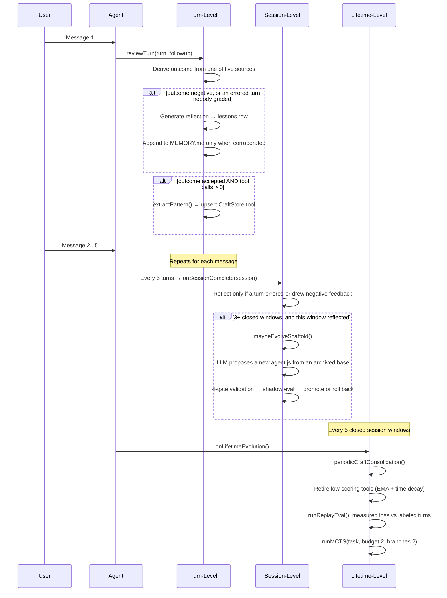
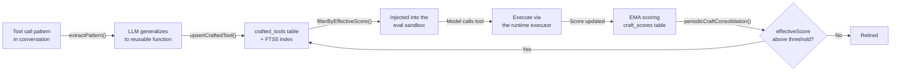

# Evolution system

Kinu evolves on four timescales. Each runs on its own, and shorter ones feed data to longer ones. The engine is `packages/core/src/evolution/engine.ts`. The shortest timescale, the step clock, is the only one that ticks inside a single long autonomous turn. It has two channels: crafted-tool fitness (`packages/core/src/orchestrator/craft-cycle.ts` over `packages/core/src/craft/in-episode.ts`) and execution-recovery findings (`packages/core/src/evolution/recovery.ts`, detected by the failure ledger in `packages/core/src/orchestrator/turn-steering.ts`).

Two files named on this page live in the workspace filesystem, not in this repository, so grepping the tree for them finds nothing. The curated memory note is `MemoryStore.curatedFile` (`packages/agent-utils/src/memory/store.ts`), which resolves to memory/MEMORY.md inside a workspace. The live scaffold is each actor's `scaffoldPath()` (`packages/cf-backend/src/actor-agent.ts`), which resolves to scaffold/agent.js there and is seeded by `createWorkspace` (`packages/core/src/workspace-birth.ts`).

## In-episode evolution (the step clock)

The other three timescales are conversational. The next user message grades a turn, five turns close a window, and five windows close a lifetime.

A headless actor runs the step clock and nothing above it. `runHeadInference` (`packages/core/src/heads/head-inference.ts`) hands no turn to `AgentOrchestrator.recordTurn`, so a head, a swarm node, or a subordinate hosted on that loop never enters the turn review, the session window, or the lifetime pass. `packages/core/tests/unit-headless-learning.test.ts` fails if one does. Only the workspace agent that owns the conversation reviews turns, closes windows, and evolves its scaffold.

The step clock fires on every settled `eval` call, read off the tool-result hook. The hook carries the call's own args, so the code graded is the code that ran. Creation is credited only to a call that itself invoked `workspace.createTool`. Invocation means call sites in the submitted code: `tools.<name>(`, the one namespace a crafted tool answers in. Comments and literal text are blanked first, so a tool body passed to `createTool` is not read as a call.

The fitness signal is execution, observed at the host. A crafted tool that raised is stamped with its own name as the error leaves the sandbox, so the failure lands on the artifact whether or not the model caught it. A call that broke on its own account blames nobody. A completed call credits only tools that already existed when it started, so a tool cannot certify itself on the call that created it. A call moved to the background is not a result and credits nothing.

Two gates stand between observation and effect. The misevolution veto runs before each crafted-tool write. The injection floor applies because `workspace.createTool` calls `craftStore.create` (`packages/core/src/tools/inline-executor.ts`) with the `CRAFT_NEUTRAL_PRIOR` quality of `0.5` (`packages/core/src/craft/in-episode.ts`), so an unscored tool cannot bypass the filter. Extracted candidates go through the same store (`upsertCraftedTool`, `packages/core/src/craft/conflict.ts`). Each settled block updates the tool's row in one synchronous SQL statement.

`CRAFT_INVOCATION_QUALITY` maps a returned call to `0.7` and a raised call to `0.1`. The store applies `DEFAULT_CONFIG.craftStore.emaAlpha`, `0.3`. From the neutral `0.5` prior, four raises give `0.196`, below the `0.2` injection floor. One later return lifts that score to `0.347`. These values are policy arithmetic over the constants in `craft/in-episode.ts` and `config.ts`, not a measured success rate.

A tool that keeps raising drops out of the callable set for the rest of the episode, because both backends re-read the store per run.

Each turn writes at most one `craft_cycle` run event carrying `crafted`, `invoked`, `reused`, `returned`, `raised`, and `dropped`, with `turn_end` as the denominator. `reused` is the numerator that matters: a tool crafted this turn and called by a later block is the loop closing.

Execution-grounded fitness measures "it ran and did not raise". It never measures "it did the right thing", which needs a verifier the agent did not choose. The sealed bench has one; production does not. So this channel feeds tool injection and nothing with a wider blast radius. No scaffold, prompt, or gate is ever promoted on it. A `--no-auto-evolve` run observes nothing, so a benchmark's arms still mean what they say.

### The knowledge channel (execution recoveries)

The step clock's second channel sits beside the artifact channel in `packages/core/src/evolution/recovery.ts`. The failure ledger in `packages/core/src/orchestrator/turn-steering.ts` detects the event. When a tool's failure streak reaches the steer threshold and a changed call of the same tool then runs clean, the runtime records the pair as a durable lesson with `source = 'execution_recovery'` and both arg echoes verbatim. The newest `MAX_RECOVERY_FINDINGS` (5) findings go into every later step's dynamic-context block.

## Three conversational timescales



## Turn-level evolution

A turn is reviewed when the next user message arrives. `AgentOrchestrator.observeUserTurn` claims the previous turn from the durable window and dispatches `reviewTurn()` (`packages/core/src/evolution/engine.ts`) with the new message as its follow-up, but only when that message continues the conversation. An interactive host or the Durable Object runs the review detached, so it never holds the turn queue. A one-shot host writes a durable row instead (`deferTurnReview`), and the next host that opens the workspace drains it through the same `reviewTurn` path.

No length or duration heuristic grades a turn. Quality comes from a real turn outcome, one of `accepted`, `corrected`, `frustrated`, or `abandoned`, recorded in the `turn_outcomes` table. Outcomes come from five sources, listed in canonical order in `TURN_OUTCOME_SOURCES` (`packages/core/src/types/evolution.ts`):

| Source | What produced it |
|---|---|
| `explicit` | The user's thumbs vote, through `applyExplicitFeedback` |
| `classifier` | The LLM verdict on a real conversational follow-up |
| `session_end` | The session-end abandoned rule |
| `take_pick` | Which alternate take the user picked, through `applyTakePick` |
| `execution` | The environment's verdict on a turn no user will grade, through `executionVerdict` |

Reflection fires on any negative outcome, and on an abandoned or ungraded turn that also errored. An LLM call writes a lesson and always records it in `lessons`. The lesson reaches the curated memory note only when corroborated, and corroboration needs a negative verdict from a user source. An `execution` verdict does not corroborate: "the turn hit an error" is not a reader confirming the lesson drawn from it. An uncorroborated lesson stays `provisional` until a later user outcome corroborates it.

## Calibrating the classifier

Every outcome the follow-up classifier records is a judgement, and every rate downstream counts those judgements rather than what happened: K_align, the per-scaffold outcome rates, the GEPA train/val split, and craft retirement. If the classifier misses a third of the corrections, all of those numbers are wrong by an unknown amount in an unknown direction. More turns only tighten the interval around the wrong answer. `packages/core/src/evolution/calibration.ts` and `packages/core/src/evolution/ppi.ts` correct for this with a few hand labels:

```
kinu label export <agent>            # draws ~100 turns into a file
$EDITOR <agent>-calibration.txt         # one letter per turn (~30-45 min)
kinu label ingest <agent> <file>     # validates, then stores
kinu label report <agent>            # what the labels established
```

`DEFAULT_LABEL_BUDGET` is 100, sized so the file is a 30 to 45 minute read. The draw stratifies on the classifier's verdict, because a uniform sample of a ledger that is about 85% `accepted` would measure nothing about the rare verdicts. Within each stratum the draw is systematic in time. The file is blind: it shows the request, the answer, and the user's follow-up, never the classifier's verdict, because a pre-filled guess anchors the labeler on the number under test. Labels land append-only in `outcome_labels`. A re-label is a new row, and the newest wins.

`kinu alignment <agent>` prints the corrected block beneath K_align when text output is selected. With no labels it reads `uncalibrated`, so the reader does not assume classifier and truth agree.

### Two-model labeling panel

A profile measured against last quarter's classifier says nothing about this quarter's, so calibration has to be redone, and thirty minutes each time tends to stop being paid. `packages/core/src/evolution/ensemble.ts` measures whether two models can take the job over:

```
kinu label ensemble <agent>          # two cross-family judges, same turns
```

The report gives Cohen's kappa for all three rater pairs (you to panel, you to classifier, panel to classifier) over the same turns, the panel's verdict against yours cell by cell, and the panel's sensitivity and specificity on the negative class, through the same `classifierAccuracy` estimator the classifier's own profile uses.

One measurement needed care. The panel's verdict varies inside the stratum the sample drew on, so `classifierAccuracy`'s closed-form interval treats two halves of one sample as independent and comes back far too narrow. `packages/core/src/evolution/ppi.ts` records the fix, `resampledAccuracy`. Over 250 simulated calibration sets per regime at the about 100-label budget, on a 3,000-row ledger with 15% negatives, this stratified bootstrap covers at 85 to 98% against a nominal 95%. The closed form on the same split covers at 44 to 75%. The source records no date for that run, and `packages/core/tests/unit-ensemble.test.ts` pins the ordering rather than the decimals.

Three conditions in `packages/core/src/evolution/ensemble.ts`, written before any of these numbers existed, decide whether the panel can stand in. First, kappa (you to panel) needs a lower bound at or above 0.60. Second, it must be at least kappa (you to classifier) on the same turns. Third, negative-class recall needs a lower bound at or above 0.70 with specificity at or above 0.90, which keeps the Rogan-Gladen denominator at or above 0.60. The second condition is the one that matters: a panel no closer to you than the classifier already is measures one flawed rater with another. Below the bar the report says the panel cannot stand in. Above it nothing switches automatically either. Passing gives grounds to draw the next set with the panel and hand-audit a slice.

## Session-level evolution

The cadence lives in `AgentOrchestrator`, not the engine. Every five turns it calls `engine.onSessionComplete()` with the accumulated turns. Five is one constant for both backends, `DEFAULT_SESSION_REFLECTION_INTERVAL` (`core/src/orchestrator/agent-orchestrator.ts`); no host setting changes it.

`onSessionComplete` is selective. It needs at least 3 turns in the window, and `sessionWarrantsReflection()` requires that some turn errored, drew negative feedback, or has a negative recorded outcome. A clean session produces no reflection. When it reflects, an LLM call analyzes the window's recent lessons and records a `session_reflection` lesson. That lesson reaches the curated memory note only when a turn in the window carries a negative outcome.

Scaffold mutation runs inside that reflection path, so the window must have reflected. It also needs at least 3 closed session windows, and it is skipped if a proposal is pending. `selectEvolutionBase()` (`core/src/scaffold/archive.ts`) picks the base from the DGM archive. With probability `1 − scaffold_explore_share` (default 0.2, `getScaffoldExploreShare` in `core/src/config/store.ts`) it branches from the live `current`. Otherwise it samples an archived `historical` or `rolled_back` variant weighted by clade-metaproductivity and inverse trial count. The clade score is the evidence-weighted pooled win rate over the candidate's whole descendant subtree, itself included, with win rates already blended with real user outcomes. That is HGM's (ICLR 2026) correction to DGM: a trial win whose children all regressed is a dead end, and the middling ancestor of every good version is worth branching off again. A candidate with no descendants scores exactly its own win rate, so a shallow archive reproduces the pre-clade policy. `maybeEvolveScaffold` reads 12 archive entries, and `renderArchiveBlock` puts the newest 8 into the proposal prompt (`core/src/evolution/engine.ts`).

`modifyScaffold()` then validates through 4 gates:

1. Structural gate. The rationale must reach `minRationaleLength` (50 characters). The code must parse as JavaScript, declare `async function* run(rt, task)` at its top level, and reference none of `require`, `import`, `globalThis`, `eval` or `Function` (`scaffoldRefusal` in `core/src/scaffold/safety-patterns.ts`, judged on the acorn syntax tree, so a comment naming them is not a finding). Then the misevolution veto below runs.
2. Parse gate. The code is compiled through `rt.executor` as a syntax check.
3. Version checkpoint. A single-pending invariant refuses a second `pending` version. The base is taken from `status = 'current'` rather than `MAX(version)`, and `newVersion = MAX(version) + 1`. The DGM base must exist in the archive. The current version is backed up in this step.
4. Write gate. The proposal is written to a versioned file beside the live scaffold, never over it, so shadow evaluation never compares new code against itself. Both names come from `scaffoldPath()`.

### Misevolution gate

`core/src/safety/misevolution.ts` is a pure check with six frozen criteria. The first match rejects the artifact and writes a `misevolution_veto` row to `evolution_events`. An artifact is code and prose: code is parsed with acorn (`core/src/safety/evolved-code.ts`) and judged on the names it references (identifiers, property names, constant computed keys) and the words and paths of the strings it states, with constant concatenations folded; comments are not read. Prose (a prompt section, a lesson, a description or rationale) is judged on its words and paths.

| Criterion | Rejects |
|---|---|
| `network-egress` | code naming `fetch`, `XMLHttpRequest`, `WebSocket`, `EventSource` or `sendBeacon`, including through an alias, or stating one as a folded string (`Reflect.get(self, "fe" + "tch")`) |
| `version-machinery-tamper` | `scaffold_versions`, `scaffold_evaluations`, `scaffold_trial_queue`, a path to `scaffold/agent.js` or a versioned `agent.js.vN` |
| `rollout-config-tamper` | `auto_promote_scaffold`, `shadow_sample_rate`, `scaffold_explore_share`, `auto_gepa_every_n_turns`, `changelog_seen_at` |
| `self-modification-reentry` | `proposeScaffold`, `modifyScaffold`, `applyPromotionDecision`, `applyScaffoldDecision`, `rollbackScaffold`, `checkMisevolution` |
| `consent-weakening` | `shell_approval_mode`, `setShellApprovalMode`, `allow_all`, `device_consent` |
| `unanalysable-code` | code that does not parse, reads `eval`, `Function` or `require` (a property or key of that name is not a read; `instanceof Function` is allowed), imports a module, uses `with`, takes `.constructor` out of an object other than to compare it or read its properties, or uses an unshadowed `globalThis`/`self`/`window`/`global` other than to read a property it names |

What it cannot see: a name built at runtime (a `join`, char codes, a decoded string) and a value handed in from outside the artifact. `unanalysable-code` refuses the constructs that would make every name invisible; the rest is a tripwire, not a proof.

`SURFACE_CRITERIA` declares four surfaces. Prose never trips the code-only criteria (`network-egress`, `unanalysable-code`).

| Surface | Call site | Artifact |
|---|---|---|
| `scaffold` | The proposal gate, `modifyScaffold` in `core/src/scaffold/modify.ts` | code |
| `scaffold` | The promotion decision, re-checked against the on-disk pending file, `core/src/scaffold/shadow.ts` | code |
| `scaffold` | Prompt-section proposal and promotion, `proposePromptSection` and `applyPromptSectionDecision` in `core/src/prompting/section-store.ts` | prose |
| `scaffold` | Section GEPA candidates, `runSectionGepa` in `core/src/evolution/gepa/section-bridge.ts` | prose |
| `craft` | Extracted crafted-tool upsert, `upsertCraftedTool` in `core/src/craft/conflict.ts` | code |
| `craft_tool` | `workspace.createTool`, `core/src/tools/inline-executor.ts` | code, without `network-egress` |
| `import` | Experience-library import, `core/src/experience/imports.ts` | code and description or rationale for a tool or scaffold; prose for a lesson or fact |

`craft_tool` is the one exception. It skips `network-egress` because the codemode Worker exposes raw network globals: the same `fetch(...)` runs freely in an ephemeral `eval` call one line earlier, so vetoing only the persisted form buys no containment. Persistence changes blast radius over time, so the other criteria apply there in full.

### Shadow evaluation

A validated proposal is sampled into real turns at `shadow_sample_rate` (default 0.25, `getShadowSampleRate` in `core/src/config/store.ts`) and judged against the incumbent before it takes effect. `DEFAULT_SHADOW_CONFIG` (`core/src/scaffold/shadow.ts`):

```
minTrials 5 · maxTrials 20 · promoteThreshold 0.6 · rollbackThreshold 0.4
maxRegressions 1 · minDecisiveTrials 5
```

Each trial is judged twice with the two responses swapped, unlabelled and in random order. A candidate takes the trial only by winning both orders; a split records as a tie. This removes the position and status-quo bias that a prompt pinning the incumbent to "Response A" builds in. The judge prefers a model from a different vendor family than the chat model whenever one is connected, because a model grading its own family's prose inflates it. Same-model judging remains as the single-vendor fallback.

The regression veto runs first: more than `maxRegressions` losses rolls the proposal back regardless of win rate. At `maxTrials` the decision is forced, and only `winRate > 0.5` promotes (`decidePromotion`), so a tie rolls back to current. Every constant here comes from binomial Monte Carlo in `scripts/shadow-veto-monte-carlo.ts`, which models the judging protocol itself. At the shipping settings that script reports a better scaffold promoted about 62% of the time, against a worst case of about 3.2% for promoting a clearly worse one. Neither figure carries a measurement date in the source; re-run the script to date them.

### How much of a turn a judge sees

Four readers in this loop once truncated evidence to its opening (`slice(0, n)`): the shadow judge, the GEPA reflector, the turn outcome classifier, and the replay judge. A turn whose payoff lands at step 9 of 12 was invisible to them, so the loop could not select for long-horizon behaviour.

`core/src/utils/evidence-window.ts` is now the single source. `evidenceWindow` keeps head and tail on an even split and names what it dropped. A tool result's head carries the command echo, while a judged trajectory carries its outcome at the end, and the outcome is what is being judged.

`EVIDENCE_BUDGETS` (`core/src/types/evidence.ts`) is ordered so a reader never asks for more than the row it reads was stored at. The stored `turn_outcomes` budgets cap the whole ledger path and were widened first. GEPA's eval instances and the replay judge both read those rows: `storedUserMessage` 8,000, `storedAssistantResponse` 16,000, `storedFollowup` 8,000, `storedEvidence` 1,000. Readers sit under them: `shadowTask` 6,000, `shadowOutput` 10,000, `outcomeUserMessage` 4,000, `outcomeAssistantResponse` 8,000, `replayTask` 6,000, `replayFreshResponse` and `replayReferenceResponse` 12,000. A candidate's source stays head-truncated rather than windowed (`gepaParentSource` 16,000), because a rewrite of code whose middle was elided comes back with a hole.

This change left the protocols, thresholds, and sampling rates above as they were, but not unaffected. The Monte Carlo that set them modelled the old evidence, and richer evidence moves decisive yield and tie rate. Those constants are due a re-run against the new budgets.

The archive keeps every version: a read model over `scaffold_versions` joined to `scaffold_evaluations`, with no eviction, so a rolled-back variant stays available as a stepping stone.

## Lifetime-level evolution

`onLifetimeEvolution()` fires from `onSessionComplete` when the count of closed session windows is a multiple of `lifetimeEvolutionInterval`, which is 5 (`DEFAULT_EVOLUTION_CONFIG`, `core/src/evolution/types.ts`). With a 5-turn window that is every 25 turns. There is no separate manual-trigger RPC.

CraftStore consolidation (`periodicCraftConsolidation`, `core/src/craft/consolidation.ts`) computes `effectiveScore` with the EMA (α = 0.3) and time decay on a 30-day half-life. It retires tools below 0.1 that have been used at least twice. Unscored tools are skipped. The whole pass aborts if it would empty the store: a workspace whose every tool went stale keeps a low-quality toolbox rather than an empty one.

Replay eval (`runReplayEval`, `core/src/evolution/replay.ts`) re-scores labeled past turns into a loss curve, so a scaffold change is judged against a number. Every point on the curve is a mean of `DEFAULT_REPLAY_SAMPLE_SIZE` (20) judge verdicts, reported and persisted in `replay_evals.score_lo` and `score_hi` with the 95% Wilson interval around it (`core/src/utils/stats.ts`). The changelog calls a move "improved" or "declined" only when the two intervals do not overlap.

GEPA train/val split (`buildOutcomeEvalSplit`, `core/src/evolution/eval-split.ts`). The reflection minibatch draws from older corrected and frustrated turns, while the newest failures are held out and scored alongside the accepted-turn regression guards. The two sets are disjoint, so a winning candidate was never optimised against the instances that picked it. When the ledger holds too few failures to hold any out, the split returns a `degeneracy` reason, and the caller reports the selection as exploratory rather than overlapping the sets.

A failed judge call is unavailable evidence, not a neutral score. Failure during
seed scoring, reflection evaluation, or candidate scoring aborts the GEPA run;
the run keeps its attempted-call count and completed iterations but selects no
winner. Every complete candidate, including the seed, is retained before later
evaluation starts. An incomplete candidate gets no numeric aggregate. The shared
metric boundary refuses non-finite scores and scores outside 0..1. Iteration counts
include rejected proposals, independently of the accepted-candidate history.
Section proposal and paired promotion trials propagate judge failures before
writing the unmeasured proposal or trial.

MCTS exploration runs smaller than the engine's default, at budget 2 and branches 2 (`DEFAULT_EVOLUTION_CONFIG`, called from `onLifetimeEvolution` in `core/src/evolution/engine.ts`). An operator MCTS override replaces the branch count; the budget stays the lifetime cap. See [MCTS.md](./MCTS.md).

## Evolution changelog

Every self-modification shows up as a human-readable card (`core/src/evolution/changelog.ts`), a pure read model over the durable ledgers whose only owned state is a `changelog_seen_at` marker. `ChangelogEntryKind` has eight kinds:

| Kind | Source | Revertable via |
|---|---|---|
| `scaffold` | the archive plus promotion and rollback run events | `scaffold_rollback` |
| `tool` | `crafted_tools` joined to `craft_scores` | `craft_retire` |
| `fact` | `agent_facts`, collapsed into one card with children | `fact_forget` / `fact_forget_many` |
| `gepa` | completed GEPA runs | not revertable |
| `replay` | replay-eval scores with their intervals, plus the direction against the previous run when the intervals separate | not revertable |
| `outcomes` | aggregated `turn_outcomes` counts | not revertable |
| `prompt_section` | `prompt_section_versions`, keyed `<sectionId>:<version>` because versions are numbered per section | `prompt_section_rollback` |
| `refinement` | `refinement_requests`, one card per request with one child per routed edit | the children carry the owner's own revert |

Reverts dispatch to the real code paths rather than a separate undo log (`executeChangelogRevert`, `core/src/evolution/changelog.ts`): `revertScaffoldVersion`, `craftStore.delete` with the matching `craft_scores` row, `facts.forget`, and the prompt-section rollback.

## Continual refinement

A refinement reviews the agent's own recent failures and proposes the smallest typed edits. It is the only evolution lane whose proposer is a full agent: the read-only task lifetime (`agents.hire` with `lifetime:'task'`, reached programmatically through `TemporaryAgentPort`) reads the trajectory and answers with one strict object.

`/refine` opens one on request. The automatic trigger opens one when three or more corrected or frustrated turns sit unresolved and no earlier request has taken them (`MIN_REFINEMENT_DEBT`). Three is a pattern rather than a coincidence. It is also the point where `buildOutcomeEvalSplit` can both give reflection something to fix and keep a failure back to score against: at three it holds one out and leaves two to train on.

Debt excludes covered turns before it caps the batch, not after. A batch is at most twelve (`MAX_REFINEMENT_DEBT_BATCH`), oldest first, and the remainder is reported ("8 more waiting behind this batch") rather than dropped. Filtering a fixed window would let twelve refined failures hide every older unresolved one permanently.

The refiner sees only the train half. The held-out turns are the ones `proposeMeasuredPromptSection` and `runPromptSectionTrials` score candidates on, and showing them to the proposer would let a proposal memorise its own exam. `runSectionGepa` follows the same split. The brief says how many turns it withheld.

### The request is durable and changes no behaviour

`requestRefinement` (`core/src/evolution/refinement-lane.ts`) captures the trajectory by turn id and returns a row at `requested`. No model has run and no artifact has moved. Two requests are refused here, before any model spend: an `account`-scoped request, which no authority reachable from a workspace database can serve, and a trajectory with nothing graded in it.

The refiner runs later, on the off-turn cadence pass (`AgentOrchestrator.runCadencePass` → `refinementLane`). Crash recovery is `resetStalePlanning`, run on activation and never on a timer. There is no elapsed-time cap, by the same ruling that leaves every other delegation uncapped. Two writes make a resumed pass safe:

- The proposal is persisted before the first owner write. Routing makes real changes, so a resumed pass must re-route the same plan; asking again would produce a plan the writes already on disk do not belong to.
- The routes are persisted after each one. A crash between two owner writes leaves the completed ones recorded, so the changelog cannot omit an edit the workspace is carrying.

Every route then adopts the owner record it finds. A keyed fact reports `unchanged`, a pending section version with these exact bytes is adopted rather than re-proposed, and identical skill bytes on disk are adopted rather than rewritten. Re-driving is idempotent at every owner.

```
requested → planning → gated       (every routed edit already decided)
                    ↘  evaluating  (something is pending in an owner's store)
                         ↘ applied | rolled_back
                    ↘  refused
```

Every transition is `WHERE stage = <from>`, so a duplicate delivery writes nothing. The automatic trigger is idempotent twice over: a taken batch stops counting as debt, and `debt_key` is unique.

### Typed edits go to the authority that already owns the artifact

`refinement_requests` holds the request, the proposal, and one route per edit. The route names the owner's table plus the identity inside it. It stores no prompt, fact, skill, or agent spec, because two authorities for one artifact drift apart.

| Edit | Authority | What happens |
|---|---|---|
| `fact` | `agent_facts` (`FactsStore.upsert`) | Applied immediately, and only when the refiner quotes the user substantively. A trial cannot decide a preference, so the user's own words stand in as the evidence. The quote must be at least 20 characters and 4 words (a fragment like "one line" matches almost any conversation), and must appear in a user message or follow-up, never in the agent's own response. The accepted quote rides the route into the changelog. |
| `prompt_section` | `prompt_section_versions` (`proposeMeasuredPromptSection`) | Scored against the incumbent on held-out labelled turns first, then handed to `proposePromptSection`, where it lands pending. `advancePromptSectionLane` promotes it on trial evidence or not at all. A degenerate split refuses the proposal rather than scoring a counterfactual against a ledger with no failures. |
| `skill` | staged under `.kinu/`, promoted into the workspace VFS by `instruction_approvals` | Stages the bytes at `.kinu/refinement/<requestId>/<name>.md`, which nothing that builds a prompt reads. The owner's approval promotes them. Refuses a non-canonical path, a built-in's name, an unparsable file, a final path that already exists, and any standing approval or revocation for that path. |
| `subagent_spec` | none | Refused by name. A subordinate's role and spec belong to that agent's own config, which a workspace reads and never writes. The finding is recorded; no mirror store is created. |

A proposal at `account` scope is refused. No authority reachable from a workspace database can write account-wide state, and narrowing it to one workspace would apply a preference where the owner did not ask for it.

### A staged skill influences nothing until the owner promotes it

Writing the file to `/home/user/skills/<name>/SKILL.md` and relying on content-addressed trust to hold it `unverified` leaks, as the second review found. Trust decides placement and tool policy, not visibility: `discoverSkills` walks that directory every turn, so the file's front matter enters the skills index and its body renders in the unverified reference tier. The model reads it, and a proposal that changes what the next turn reads has already been applied.

So the bytes go to `refinementStagingPath(requestId, name)` under `.kinu/`, the same internal root as `SPILL_DIRS` and `EVENT_CONTENT_DIR`. Neither `discoverSkills` nor `gatherApprovableInstructions` walks it, so the staged file has zero influence. The request row stays the only record of the proposal; no second store exists.

The whole path (staging, showing, deciding, promoting) lives in `core/src/evolution/refinement-skill.ts`.

### Read it, then decide

`showRefinementRoute` returns the whole file and the digest of its current bytes, never an excerpt. Everything else in this flow is bounded because it is for scanning, but this is the approval surface, and a truncated one asks for a decision about bytes the decider could not see. A skill file needs no ceiling of this module's own: it is bounded by what bounds every skill file, the turn's admission allocation, which defers an oversize body rather than rejecting it.

The digest is a token. `decideRefinementRoute` takes `{ requestId, routeIndex, expectedDigest, decision }` and refuses any other digest. Between reading and deciding, the request can be re-driven, the routes re-ordered, and the staging rewritten. Each of those changes the digest and none changes the index, so a decision is always about bytes, never about a list position.

Surfaces: `/refine show <n> <edit>` prints the file and the two commands to paste back; `/refine approve|reject <n> <edit> <digest>` decides. The CF `showRefinement` and `decideRefinement` callables are both gated `interactive`. None of it is on any model-facing tool surface, because this is the act that turns proposed bytes into system instructions.

A decision is offered only while it is owed. `ChangelogEntry.decision` is present exactly while the route is `pending_owner_approval`, so a decided row stops advertising an action the backend would refuse. `showRefinementRoute` and `decideRefinementRoute` also refuse unless the request is `gated` or `evaluating`.

### The approval order, and why nothing half-lands

1. the route must be decidable and the digest must be the one shown;
2. the staged bytes must still hash to that digest;
3. the final path must be absent, or already hold these exact bytes;
4. write the `InstructionApproval` for the final path and digest;
5. copy the staged bytes onto the final path, read them back, verify the digest, and only then delete the staging.

Step 5's read-back guards against a partial or transformed write. Such a write would leave a file that discovery admits and the trust row vouches for, whose content is not what the owner approved: a trusted skill nobody wrote. Verifying before the unlink means the staging outlives every failure, so the promotion can always be retried and is never half-done.

A crash between 3 and 4 leaves an approval for a file that does not exist. Nothing discovers a path with no file, so the window is inert, and the next settle completes the promotion. The file appears already trusted and is never briefly live but unverified. The reverse order would have exactly that window.

Every reachable state is correct or recoverable, and `promoteStagedSkill` is idempotent, so whoever looks next repairs it:

| state | what happens |
|---|---|
| trust row, no file, staging present | copied and verified now |
| trust row, right file, staging present | staging deleted now |
| trust row, right file, no staging | done |
| trust row, **wrong** file | refused, staging kept, collision surfaced on the request detail. Never overwritten |
| trust row, no file, no staging | refused; the bytes are gone and cannot be invented |

The promotion is copy, verify, unlink rather than a rename, because core's `VFS` (`types/primitives.ts`) offers no rename and every backend implements that narrow interface. The guarantee comes from the order plus the read-back, not from an atomic move.

A resumed plan never re-routes a decided edit. Re-routing a skill the owner already approved or rejected would replace their answer with a fresh `pending_owner_approval`, asking again about bytes they had settled and, after an approval, silently undoing a promotion that happened.

Staging is discarded on every path that ends it: approval (after the read-back), rejection, revocation, and a trust row that moved to different bytes.

Rejecting deletes the staging and settles the request `rolled_back`. `rejected` is its own disposition, distinct from `refused`. A refusal is a gate working as designed; a rejection is the owner declining bytes they were shown. A rate that mixed them would measure the gates and the person as one signal.

Settlement is derived, never notified. The lane reads `listPromptSectionVersions` for a section verdict and `InstructionApprovalStore.get` for a skill's, comparing the stored decision's digest against the route's. Approved or grandfathered for this digest counts as applied; revoked, or a moved digest, counts as rolled back; no row at all stays pending, with no clock on the owner.

The settle scan covers `gated` and `evaluating`. `gated` is where a hard kill lands: `plan` routes the edits, advances to `gated`, and settles in the same pass, so a process killed between those two steps leaves a row with every owner write done and nothing watching it.

A request is `applied` when at least one artifact is in effect: a promoted proposal, or a fact the user's own words earned. A preference that landed beside a section that lost its trials settles `applied`, with both counted in the detail, because calling it rolled back would misreport a fact that is live. A fact-only proposal therefore reaches `applied` rather than parking in `gated` with nothing to wait for.

The proposal schema is `strictObject` at every level. An unknown field refuses the whole proposal rather than being dropped, because a dropped field is a claim the agent made that the harness silently overrode.

## CraftStore lifecycle



The scoring constants live in `DEFAULT_CONFIG.craftStore` (`core/src/config.ts`):

- EMA update: `newScore = 0.7 * oldScore + 0.3 * observation`, so α = 0.3.
- Time decay: `effectiveScore = score * 0.5^(daysSinceLastUse / 30)`.
- Injection cutoff: `effectiveScore >= 0.2`. Unscored tools pass, which is why `workspace.createTool` seeds the 0.5 neutral prior at creation.
- Retirement threshold: `effectiveScore < 0.1`, and only after 2 uses.

Extraction happens in three places: an accepted turn (`extractPattern`), an MCTS iteration scoring above `craftExtractionThreshold` (0.8, `DEFAULT_CONFIG.mcts` in `core/src/config.ts`, applied in `runMCTS`, `core/src/mcts/engine.ts`), and MCTS convergence when the winner scores above the same threshold (`core/src/mcts/convergence.ts`). Only the MCTS paths have a size gate, and it is a floor: `maybeStoreCraftedTool` (`core/src/craft/discovery.ts`) returns early below 50 characters. There is no upper limit, because a ceiling silently excluded every substantial win from the craft loop; the prompt budget bounds the source instead. `extractPattern` applies no length gate. `upsertCraftedTool` decides usability by compiling the code the way the runtime will.

## Evolution events

Evolution activity is persisted to the `evolution_events` SQL table:

| Column | Type | Description |
|--------|------|-------------|
| `id` | TEXT PK | Random hex ID |
| `type` | TEXT | See below |
| `message` | TEXT | Human-readable description |
| `data` | TEXT | JSON payload (optional) |
| `created_at` | INTEGER | Epoch milliseconds |

The engine emits eleven types (`EvolutionEvent`, `core/src/evolution/types.ts`): `reflection`, `craft_discovered`, `scaffold_proposed`, `consolidation`, `mcts_started`, `mcts_complete`, `turn_complete`, `replay_eval`, `changelog_digest`, `experience_import` and `advisor_note`. `recordMisevolutionVeto` writes a twelfth, `misevolution_veto`, directly (`core/src/safety/misevolution.ts`).

This table is one of four sources the Run Timeline read model merges (`getRunTimeline`, `core/src/read-models/timeline.ts`); the others are the per-run `run_events` log, the MCTS `search_nodes` table, and detached background jobs. The merge runs server-side and does not depend on the platform, so every backend has the timeline. `kinu status` reads the same table locally.
