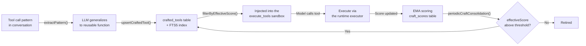

# Evolution System

> Maintained by Claude (AI-edited documentation, presented as-is); verify against the code when precision matters.

Proteus evolves across four timescales. Each one runs independently, and shorter
timescales feed data to longer ones. The engine is
`core/src/evolution/engine.ts`. The shortest timescale is the only one that
ticks inside a single long autonomous turn, and it has two channels:
crafted-tool fitness (`core/src/orchestrator/craft-cycle.ts` over
`core/src/craft/in-episode.ts`) and execution-recovery findings
(`core/src/evolution/recovery.ts`, detected by the failure ledger in
`core/src/orchestrator/turn-steering.ts`).

## In-episode evolution (the step clock)

The other three timescales are conversational. The next user message grades a
turn, five turns close a window, five windows close a lifetime. One long agentic
episode is one turn: one prompt, hours of steps, nobody watching. None of the
conversational clocks fire inside it. The in-episode loop is the one that does.

| | |
|---|---|
| **Trigger** | Every settled `execute_tools` call, read off the tool-result hook. The hook carries the call's own args, so the code graded is the code that ran. Creation is a diff of the callable set across the call, credited only to a call that itself invoked `workspace.createTool`. Invocation is call sites (`tools.<name>(` or `codemode.<name>(`) in the submitted code, with strings and comments blanked first, so a tool BODY passed to `createTool` is not read as a call. |
| **Fitness signal** | Execution, observed at the host. A crafted tool that raised is stamped with its own name on the way out of the sandbox, so the failure is attributed to the artifact whether or not the model caught it, and a call that broke on its own account blames nobody. A call that completed credits only tools that already existed when it started, so a tool cannot certify itself in the breath that created it. A call moved to the background is not a result and credits nothing. |
| **Acceptance gate** | The misevolution veto, which already runs before every crafted-tool write, plus the effective-score injection floor. The floor is reachable because `workspace.createTool` seeds a `craft_scores` row (`seedCraftScore`, `core/src/craft/in-episode.ts:284`). An unscored tool is exempt from the filter forever, so a tool with no row could never be dropped however it behaved. |
| **Timescale** | One synchronous SQL update as the block settles. No model call, no await, no turn boundary. A tool that keeps raising drops out of the callable set for the rest of the same episode, because both backends re-read the store per execute. |

Observations land in `craft_scores` through the same `updateCraftScores` EMA the
turn clock uses (`core/src/craft/ema.ts:68`). One score per tool, not a parallel
one. Invocations are priced on their own band, `CRAFT_INVOCATION_QUALITY`
(`core/src/craft/in-episode.ts:93`), which is 0.7 for ran and 0.1 for raised.
The positive pole sits strictly inside what a person's verdict reaches, 0.9 for
a thumbs up, so no volume of self-dealing lets a crafted tool outrank one a
human approved. The raised pole, 0.1, sits below the 0.2 injection floor, which
is what makes dropping out reachable at all. Those constants compose. From the
seeded prior of 0.5 at α = 0.3, four consecutive raises take a tool to 0.196 and
under the floor, and one success pulls it back to 0.347.

Each turn writes at most one `craft_cycle` run event, carrying `crafted`,
`invoked`, `reused`, `returned`, `raised` and `dropped`, with `turn_end` as the
denominator. `reused` is the numerator that matters: a tool crafted this turn
and then called by a LATER block is the loop actually closing.

**The ceiling, stated plainly.** Execution-grounded fitness measures "it ran and
did not raise". It cannot measure "it did the right thing". That needs a
verifier the agent did not choose, which the sealed bench has and production
does not. So this channel feeds tool injection and nothing with a wider blast
radius. No scaffold, prompt or gate is ever promoted on it.

The channel is gated with the rest of evolution. A `--no-auto-evolve` run
observes nothing, so a benchmark's arms still mean what they say.

### The knowledge channel (execution recoveries)

The step clock's second observation sits beside the artifact channel above, in
`core/src/evolution/recovery.ts`, detected by the failure ledger in
`core/src/orchestrator/turn-steering.ts`. When a tool's failure streak reaches
the steer threshold, and a **changed** call of the same tool then runs clean,
the runtime records the pairing as a durable lesson with
`source = 'execution_recovery'`. Both arg echoes are stored verbatim. It then
injects the newest `MAX_RECOVERY_FINDINGS` findings (5, at
`core/src/evolution/recovery.ts:83`) into every subsequent step's
dynamic-context block.

That makes it the one knowledge plane that moves DURING a long turn. Facts and
the MEMORY.md tail are frozen at turn assembly, while a finding recorded at step
40 rides step 41. It also survives compaction, continuation turns and instance
death, which is where in-context learning dies.

The fitness discipline is the same. Both halves are the runtime's own records,
using the same failing-result predicate the steer trusts. No model is asked. A
streak broken by the SAME call finally working records nothing, because a lucky
retry is not a changed approach, and durable "keep grinding" advice is the exact
misevolution the steer exists to prevent. One more ceiling applies here. The
pairing is temporal rather than causal, and the rendered line claims neither. A
finding therefore gates nothing. It is a bounded hint plane, provisional
forever, bound to no turn, so lesson corroboration can never admit it to
MEMORY.md and the experience library can never export it.

Each turn with a broken streak writes one `execution_recovery` run event
carrying `tool`, `failures` and `failedSignature`. The falsifier is a query: the
same `failedSignature` failing again in a later turn is a finding that did not
take.

## Three conversational timescales


## Turn-level evolution

`reviewTurn()` (`core/src/evolution/engine.ts:325`) fires after every chat
response, via `onChatResponse()`. It runs fire-and-forget, so it never blocks
the Think TurnQueue.

There is no length or duration quality heuristic. Quality comes from a real turn
outcome, one of `accepted`, `corrected`, `frustrated` or `abandoned`, recorded
in the `turn_outcomes` table. Outcomes arrive from five sources, named in
canonical order at `core/src/evolution/outcomes.ts:76`:

| Source | What produced it |
|---|---|
| `explicit` | The user's thumbs vote, through `applyExplicitFeedback` |
| `classifier` | The LLM verdict on a real conversational follow-up |
| `session_end` | The session-end abandoned rule |
| `take_pick` | Which alternate take the user picked, through `applyTakePick` |
| `execution` | The environment's verdict on a turn no user will grade, through `executionVerdict` |

`execution` is machine evidence rather than a person's judgement, so
`isUserVerdictSource()` excludes it and every reader that speaks about user
opinion must say so. `core/src/evolution/alignment.ts` does.

The quality constants live in `outcomeQuality()`
(`core/src/evolution/outcomes.ts:118`). A thumbs verdict is 0.9 or 0.2,
`frustrated` is 0.1, `abandoned` is a neutral 0.5, and an execution-sourced row
is priced on its own narrower band of 0.7 or 0.3 because it is a proxy.
`reviewTurn` adds one case of its own. An abandoned or ungraded turn that
errored is scored 0.1. A turn with no outcome and no error produces no quality
at all, and the review returns early rather than inventing one. Such a turn is
still recorded, as a `turn_complete` event with `graded: false`.

**Reflection** fires on any negative outcome, and on an abandoned or ungraded
turn that also errored. An LLM call generates a lesson, which is always recorded
in the `lessons` table. It is appended to `memory/MEMORY.md` only when the
lesson is corroborated, and corroboration requires a negative verdict from a
user source. An `execution` verdict deliberately does not corroborate: "the turn
hit an error" is not a reader confirming the lesson drawn from it. An
uncorroborated lesson stays `provisional` until a later user outcome
corroborates it.

**Pattern extraction** fires when the outcome is `accepted` and the turn made
tool calls. `extractPattern()` (`core/src/evolution/engine.ts:976`) asks the LLM
to generalize the tool-call pattern into a reusable async arrow function with
JSON Schema parameters. `upsertCraftedTool` then stores it in `crafted_tools`,
after compiling it to a callable and running the misevolution veto. Conflict
detection is a name match, or an FTS5 top-5 search whose Jaccard word overlap
exceeds `conflictSimilarityThreshold` (0.85). An existing tool is overwritten
only when the candidate scores more than 0.1 above it
(`core/src/craft/conflict.ts:102`).

## Judge calibration

Every outcome the follow-up classifier records is a judgement. Every rate
downstream counts those judgements rather than what actually happened: K_align,
the per-scaffold outcome rates, the GEPA train/val split, and craft retirement.
If the classifier misses a third of the corrections, all of those numbers are
wrong by an unknown amount in an unknown direction, and more turns only tighten
the interval around the wrong answer.

`core/src/evolution/calibration.ts` and `core/src/evolution/ppi.ts` close that
with a few hand labels:

```
proteus label export <agent>            # draws ~100 turns into a file
$EDITOR <agent>-calibration.txt         # one letter per turn (~30-45 min)
proteus label ingest <agent> <file>     # validates, then stores
proteus label report <agent>            # what the labels established
```

`DEFAULT_LABEL_BUDGET` is 100 (`core/src/evolution/calibration.ts:120`), and the
file is sized so that ~100 turns is a 30 to 45 minute read
(`core/src/evolution/calibration.ts:257`). The draw is stratified on the
classifier's verdict, because a uniform sample of a ledger that is ~85%
`accepted` would measure nothing about the rare verdicts. Within each stratum it
is systematic in time. The file is blind. It shows the request, the answer and
the user's follow-up, and never the classifier's verdict, because pre-filling
the guess would anchor the labeler on the very number under test. Labels land
append-only in `outcome_labels`. A re-label is a new row and the newest wins.

The estimator is prediction-powered inference (Angelopoulos et al. 2023) with a
prediction-stratified rectifier, factored so it transports across slices.
Sensitivity and specificity are estimated once, with the population re-weighting
the design requires. Each slice's own observed rate is then corrected by
Rogan–Gladen, `θ̂ = (p̂ + q̂₀ − 1)/(q̂₁ + q̂₀ − 1)`, with the delta method
propagating all three uncertainties. Over the population the labels came from,
that is algebraically the same estimate as the stratified PPI form.

`proteus alignment <agent>` always prints the corrected block beneath K_align.
With no labels it reads `uncalibrated`, rather than letting the reader assume
the classifier and the truth agree.

### Can two models do the labeling next time?

A profile measured against last quarter's classifier says nothing about this
quarter's, so calibration has to be redone. Thirty minutes a time is the kind of
cost that quietly stops being paid. `core/src/evolution/ensemble.ts` asks
whether that job can be handed over, and answers with a measurement.

```
proteus label ensemble <agent>          # two cross-family judges, same turns
```

Both judges see exactly what the human file showed, because the same
`renderLabelingEvidence` call renders both. Neither sees the classifier's
verdict, the human's, or the other judge's. They answer independently. Agreement
is the panel's verdict and a split is `unclear`. There is no third judge on
purpose. A majority vote would turn those admissions of ignorance back into
confident answers, and the admissions are what a two-model panel is for.
Verdicts land append-only in `outcome_ensemble_labels`, one row per model per
turn.

The report gives Cohen's κ for all three rater pairs (you↔panel, you↔classifier,
panel↔classifier) over the same turns, the panel's verdict against yours cell by
cell, and the panel's sensitivity and specificity on the negative class. That
last pair comes through the same `classifierAccuracy` estimator the classifier's
own profile comes from.

One thing needed care. The panel's verdict varies inside a stratum the sample
was drawn on, so `classifierAccuracy`'s closed-form interval treats two halves
of one sample as independent and comes back far too narrow.
`core/src/evolution/ppi.ts:317-325` records the measurement. Over 250 simulated
calibration sets per regime at the ~100-label budget, on a 3,000-row ledger with
15% negatives, the stratified bootstrap `resampledAccuracy` uses covers at
85–98% against a nominal 95%, where the closed form applied to the same split
covers at 44–75%. The source records no date for that run, and
`packages/core/tests/unit-ensemble.test.ts` pins the ordering rather than the
decimals.

Whether the panel may stand in is decided by three conditions written into
`core/src/evolution/ensemble.ts` **before** any of these numbers existed.
κ(you↔panel) needs a lower bound at or above 0.60. κ(you↔panel) must be at least
κ(you↔classifier) on the same turns. Negative-class recall needs a lower bound
at or above 0.70 with specificity at or above 0.90, which keeps the Rogan–Gladen
denominator at or above 0.60. The second condition is the one that matters: a
panel no closer to you than the classifier already is would be measuring one
flawed rater with another. Below the bar the report says the panel cannot stand
in and nothing changes. Above it, nothing switches on either. What it buys is
grounds to draw the next set with the panel and hand-audit a slice.

## Session-level evolution

The cadence lives in `AgentOrchestrator` rather than the engine. Every
`sessionReflectionInterval` turns it calls `engine.onSessionComplete()` with the
accumulated turns. The interval is 5 on both backends. The cloud backend passes
5 explicitly (`cf-backend/src/actor-agent.ts:1125`) and the CLI backend takes
`DEFAULT_SESSION_REFLECTION_INTERVAL`, which is also 5
(`core/src/orchestrator/agent-orchestrator.ts:95`).

`onSessionComplete` is selective. It needs at least 3 turns in the window, and
`sessionWarrantsReflection()` requires that some turn errored, drew negative
feedback, or has a negative recorded outcome. A clean session produces no
reflection. When it does reflect, an LLM call analyzes the window's recent
lessons and records the result as a `session_reflection` lesson. As with a turn
reflection, it is appended to `memory/MEMORY.md` only when a turn in the window
carries a negative outcome.

**Scaffold mutation** runs inside that reflection path, so it needs the window
to have reflected at all. It is then gated on at least 3 closed session windows,
and skipped outright if a proposal is already pending. The proposal is not built
from the live scaffold alone. `selectEvolutionBase()` picks a base from the DGM
archive. With probability `1 − scaffold_explore_share` (default 0.2) it branches
from the live `current`; otherwise it samples an archived `historical` or
`rolled_back` variant, weighted by its
**clade-metaproductivity** and inverse trial count. The clade score is the
evidence-weighted pooled win rate over the candidate's whole descendant subtree,
itself included, with win rates already blended with real user outcomes. That is
HGM's (ICLR 2026) correction to DGM. A variant that won its own trial but whose
children all regressed is a dead end, while the middling variant every good
version descends from is the one worth branching off again. A candidate with no
descendants pools over itself alone and scores exactly its own win rate, so a
shallow archive reproduces the pre-clade policy term for term. The engine reads
12 archive entries and renders the newest 8 into the proposal prompt
(`core/src/evolution/engine.ts:123, 770`).

`modifyScaffold()` then validates through 4 gates:

1. **Structural gate.** The rationale must reach `minRationaleLength` (50
   characters). None of the four forbidden patterns may appear (`require` or
   `import`, `globalThis`, `eval(`, `Function(`). The required signature is
   `async function* run(rt, task)`. Then the misevolution veto below runs.
2. **Parse gate.** The code is compiled through `rt.executor` as a syntax check.
3. **Version checkpoint.** A single-pending invariant refuses a second
   `pending` version. The base is taken from `status = 'current'` rather than
   `MAX(version)`. `newVersion = MAX(version) + 1`. The DGM base must exist in
   the archive. Backing up the current version falls out of this step.
4. **Write gate.** The proposal is written to the **versioned** file
   `scaffold/agent.js.v{N}` and never to the live `scaffold/agent.js`, so
   shadow evaluation is never comparing new code against itself.

### Misevolution gate

`core/src/scaffold/misevolution.ts` is a pure text check with five frozen
criteria. The first match rejects the artifact and writes a `misevolution_veto`
row to `evolution_events`.

| Criterion | Rejects |
|---|---|
| `network-egress` | `fetch(`, `XMLHttpRequest`, `new WebSocket`, `sendBeacon(`, `EventSource` |
| `version-machinery-tamper` | `scaffold_versions`, `scaffold_evaluations`, `scaffold_trial_queue`, a quoted `scaffold/agent.js` path, `agent.js.v<N>` |
| `rollout-config-tamper` | `auto_promote_scaffold`, `shadow_sample_rate`, `scaffold_explore_share`, `auto_gepa_every_n_turns`, `changelog_seen_at` |
| `self-modification-reentry` | `proposeScaffold`, `modifyScaffold`, `applyPromotionDecision`, `applyScaffoldDecision`, `rollbackScaffold`, `checkMisevolution` |
| `consent-weakening` | `shell_approval_mode`, `setShellApprovalMode`, `allow_all`, `device_consent` |

`version-machinery-tamper` matches `scaffold/agent.js` only in quoted-path form,
because the v0 bootstrap header legitimately mentions the path in a comment.

The check runs at five call sites over four declared surfaces
(`SURFACE_CRITERIA`, `core/src/scaffold/misevolution.ts:130`):

| Surface | Call site | Criteria enforced |
|---|---|---|
| `scaffold` | The proposal gate, `core/src/scaffold/modify.ts:56` | all five |
| `scaffold` | The promotion decision, re-checked against the on-disk pending file, `core/src/scaffold/shadow.ts:607` | all five |
| `craft` | Extracted crafted-tool upsert, `core/src/craft/conflict.ts:82` | all five |
| `craft_tool` | `workspace.createTool`, `core/src/execution/inline.ts:337` | the four safety-machinery criteria |
| `import` | Experience-library import, `core/src/experience/imports.ts:125` | all five |

`craft_tool` is the one documented exception. It does not enforce
`network-egress`, because the codemode Worker exposes raw network globals, so
the same `fetch(...)` runs freely in an ephemeral `execute_tools` call one line
earlier. Vetoing only the persisted form buys no containment. What persistence
changes is blast radius over time, so criteria 2 through 5 are enforced there in
full.

### Shadow evaluation

A validated proposal is sampled into real turns at `shadow_sample_rate`
(default 0.25, `core/src/config/store.ts:356`) and judged against the incumbent
before it can take effect. `DEFAULT_SHADOW_CONFIG`
(`core/src/scaffold/shadow.ts:186-192`) is:

```
minTrials 5 · maxTrials 20 · promoteThreshold 0.6 · rollbackThreshold 0.4
maxRegressions 1 · minDecisiveTrials 5 · autoPromote false
```

Each trial is judged twice, with the two responses swapped. The judge sees them
unlabelled and in a randomized order, and a candidate takes the trial only by
winning both orders. A flip is recorded as a tie. That removes the position and
status-quo bias the old prompt built in by pinning the incumbent to "Response A"
and labelling it CURRENT. The judge itself prefers a model from a different
vendor family than the agent's chat model whenever one is connected, because a
model grading its own family's prose inflates it. Same-model judging survives
only as the single-vendor fallback.

The regression veto runs first. More than `maxRegressions` losses rolls the
proposal back regardless of win rate. At `maxTrials` the decision is forced, and
only `winRate > 0.5` promotes (`core/src/scaffold/shadow.ts:575`), so a tie
rolls back to current. Every constant here comes from binomial Monte Carlo
rather than taste, in `scripts/shadow-veto-monte-carlo.ts`, which models the
judging protocol itself. At the shipping settings that script reports a
genuinely better scaffold promoted about 62% of the time, against a worst case
of about 3.2% for promoting a clearly worse one. Neither figure carries a
measurement date in the source; re-run the script to date them.

### How much of a turn a judge actually sees

Four readers in this loop used to carry their own hard-coded `slice(0, n)`, the
FIRST n characters. They are the shadow judge, the GEPA reflector, the turn
outcome classifier, and the replay judge. A head slice is a blind spot with a
shape. A turn whose payoff lands at step 9 of 12 was invisible to a judge
reading only the opening, so the loop could not select for long-horizon
behaviour at all.

`core/src/prompts/evidence-window.ts` is now the single source. `evidenceWindow`
keeps head **and** tail on an even split and names what it dropped. A tool
result's head carries the command echo, while a judged trajectory carries its
outcome at the end, and the outcome is what is being judged.

`EVIDENCE_BUDGETS` is ordered, so a reader never asks for more than the row it
reads was stored at. The stored `turn_outcomes` budgets are the ceiling on the
whole ledger path and had to be widened first, because GEPA's eval instances and
the replay judge both read those rows: `storedUserMessage` 8,000,
`storedAssistantResponse` 16,000, `storedFollowup` 8,000, `storedEvidence`
1,000. Readers sit under them, for example `shadowTask` 6,000 and `shadowOutput`
10,000, `outcomeUserMessage` 4,000 and `outcomeAssistantResponse` 8,000,
`replayTask` 6,000 with `replayFreshResponse` and `replayReferenceResponse` at
12,000. A candidate's *source* stays head-truncated rather than windowed
(`gepaParentSource` 16,000), because a rewrite of code whose middle was elided
comes back with a hole.

The protocols, thresholds and sampling rates above are unchanged by this, which
is not the same as unaffected. The Monte Carlo that settled them modelled the
OLD evidence. Richer evidence moves both decisive yield and tie rate, so those
constants are due a re-run against the new budgets.

The archive keeps every version. It is a read model over `scaffold_versions`
joined to `scaffold_evaluations`, with no eviction, so a rolled-back variant
remains available as a future stepping stone.

## Lifetime-level evolution

`onLifetimeEvolution()` fires from `onSessionComplete` when the count of closed
session windows is a multiple of `lifetimeEvolutionInterval`, which is 5
(`core/src/evolution/types.ts:127`, gate at `core/src/evolution/engine.ts:611`).
With a 5-turn window that is every 25 turns. There is no separate manual-trigger
RPC.

**CraftStore consolidation** (`periodicCraftConsolidation`,
`core/src/craft/consolidation.ts`) computes `effectiveScore` with the EMA (α =
0.3) and time decay on a 30-day half-life, then retires tools below 0.1 that
have been used at least twice. Unscored tools are skipped. The whole pass aborts
if it would empty the store, so a workspace whose every tool went stale keeps a
low-quality toolbox rather than an empty one.

**Replay eval** (`runReplayEval`, `core/src/evolution/replay.ts:154`) re-scores
labeled past turns to produce a measurable loss curve, so a scaffold change is
judged against a number rather than a vibe. Every point on that curve is a mean
of `DEFAULT_REPLAY_SAMPLE_SIZE` (20) judge verdicts. It is reported, and
persisted in `replay_evals.score_lo` and `score_hi`, with the 95% Wilson
interval around it (`core/src/utils/stats.ts`). The changelog calls a move
"improved" or "declined" only when the two intervals do not overlap.

**GEPA train/val split** (`buildOutcomeEvalSplit`,
`core/src/evolution/outcomes.ts:823`). The reflection minibatch draws from older
corrected and frustrated turns, while the newest failures are held out and
scored on alongside the accepted-turn regression guards. The two sets are
disjoint, so a winning candidate was never optimised against the instances that
picked it. When the ledger holds too few failures to hold any out, the split
returns a `degeneracy` reason and the caller reports the selection as
exploratory rather than quietly overlapping the sets.

**Full MCTS exploration** runs a smaller search than the tool's default, at
budget 2 and branches 2 (`core/src/evolution/types.ts:128-129`, called at
`core/src/evolution/engine.ts:862`). See [MCTS.md](./MCTS.md).

## Evolution Changelog

Every self-modification surfaces as a human-readable card
(`core/src/evolution/changelog.ts`). It is a pure read model over the durable
ledgers, and the only state it owns is a `changelog_seen_at` marker.
`ChangelogEntryKind` (`core/src/evolution/changelog.ts:38`) has seven kinds:

| Kind | Source | Revertable via |
|---|---|---|
| `scaffold` | the archive plus promotion and rollback run events | `scaffold_rollback` |
| `tool` | `crafted_tools` joined to `craft_scores` | `craft_retire` |
| `view` | `agent_views`, live version only | `view_revert` |
| `fact` | `agent_facts`, collapsed into one card with children | `fact_forget` / `fact_forget_many` |
| `gepa` | completed GEPA runs | not revertable |
| `replay` | replay-eval scores with their intervals, plus the direction against the previous run when the intervals separate | not revertable |
| `outcomes` | aggregated `turn_outcomes` counts | not revertable |

Reverts dispatch to the real code paths rather than to a separate undo log
(`executeChangelogRevert`, `core/src/evolution/changelog.ts:497`):
`revertScaffoldVersion`, `craftStore.delete` with the matching `craft_scores`
row, `revertView`, and `facts.forget`.

## CraftStore lifecycle



The scoring constants live in `DEFAULT_CONFIG.craftStore`
(`core/src/config.ts:142-147`):

- EMA update: `newScore = 0.7 * oldScore + 0.3 * observation`, so α = 0.3.
- Time decay: `effectiveScore = score * 0.5^(daysSinceLastUse / 30)`.
- Injection cutoff: `effectiveScore >= 0.2`. Unscored tools pass, which is why
  `workspace.createTool` seeds the 0.5 neutral prior at creation.
- Retirement threshold: `effectiveScore < 0.1`, and only after 2 uses.

Observations come from two clocks, both writing the same `craft_scores` row. The
turn clock writes the turn's outcome once the turn is graded. The in-episode
clock writes each observed invocation as the episode runs.

Extraction happens from three places: an accepted turn (`extractPattern`), an
MCTS iteration scoring above `craftExtractionThreshold` (0.8,
`core/src/mcts/engine.ts:468`), and MCTS convergence when the winner scores
above the same threshold (`core/src/mcts/convergence.ts:135`). Only the MCTS
paths carry a size gate, and it is a floor: `maybeStoreCraftedTool` returns
early below 50 characters (`core/src/craft/discovery.ts:49`). There is no upper
ceiling. A 1500-char ceiling used to sit there and was removed, because it
silently excluded every substantial win from the craft loop; the prompt budget
bounds the source instead. `extractPattern` applies no length gate at all, and
`upsertCraftedTool` decides usability by compiling the code the way the runtime
will.

## Evolution Events

Evolution activity is persisted to the `evolution_events` SQL table:

| Column | Type | Description |
|--------|------|-------------|
| `id` | TEXT PK | Random hex ID |
| `type` | TEXT | See below |
| `message` | TEXT | Human-readable description |
| `data` | TEXT | JSON payload (optional) |
| `created_at` | INTEGER | Epoch milliseconds |

The engine emits ten types (`core/src/evolution/types.ts:69`): `reflection`,
`craft_discovered`, `scaffold_proposed`, `consolidation`, `mcts_started`,
`mcts_complete`, `turn_complete`, `replay_eval`, `changelog_digest` and
`experience_import`. `recordMisevolutionVeto` writes an eleventh,
`misevolution_veto`, directly (`core/src/scaffold/misevolution.ts:173`).

This table is one of four sources the Run Timeline read model merges
(`core/src/read-models/timeline.ts:147-194`). The others are the per-run
`run_events` log, the MCTS `search_nodes` tree, and detached background jobs.
The merge is server-side, and nothing in it is backend-shaped, so a timeline is
a capability any backend has rather than one the Durable Object grew.
`proteus status` reads the same table locally.
