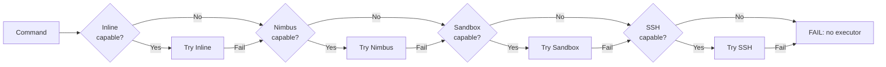
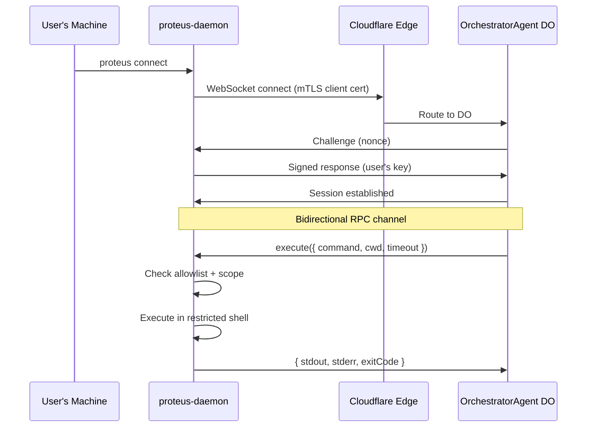
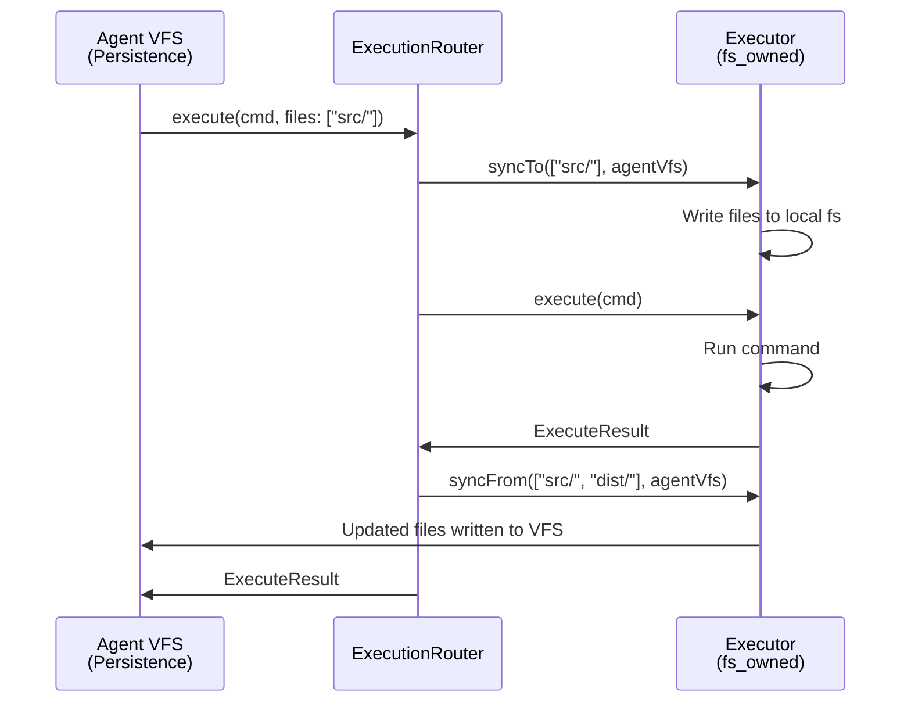

# Execution Layer Architecture Specification

> Maintained by Claude (AI-edited documentation, presented as-is); verify against the code when precision matters.

> Version 1.1 — April 2026
> Design principle: **Persistence is immortal. Execution is ephemeral.**
>
> **Note:** This document contains both the implemented interfaces (§2, §3) and
> aspirational design patterns (§5-§9). The actual code in `packages/core/src/execution/`
> uses the tools-record `ExecutorProvider` pattern, not the monolithic `ExecutionLayer`
> interface originally proposed. Sections marked **(Implemented)** match the code;
> sections marked **(Design)** describe future plans.

---

## 1. Core Insight: Persistence ≠ Execution

An agent's identity — its memory, learned tools, MCTS search history, scaffold
versions, evolution events — lives in a Durable Object's SQLite database and
survives indefinitely. But the environment where the agent *runs code* is
fundamentally different: it's ephemeral, swappable, and may not even be on the
same machine.

These two concerns have been conflated in the current architecture. The agent's
`Executor` interface (`execute(code, providers)`) is a single function that
hides whether code runs in a V8 isolate, a Bun subprocess, a Linux container,
or on the user's laptop. This works for trivial cases but breaks down when:

- The agent needs to run `npm install` (requires a real filesystem + network)
- The agent needs to compile C code (requires `gcc`, not available in V8)
- The agent needs to access the user's local git repo (requires the user's machine)
- Different tasks within the same conversation need different execution environments

The solution: a formal **Execution Layer** that sits between the persistence
layer (DO SQLite) and the actual execution environment, with a capability-based
routing system that selects the right executor for each task.

```mermaid
graph TB
    subgraph "Persistence Layer (DO SQLite — lives forever)"
        VFS[SqliteFS / VFS]
        Memory[MemoryStore + FTS5]
        Craft[CraftStore]
        MCTS[search_nodes]
        Scaffold[scaffold_versions]
        Evolution[evolution_events]
        Identity[SOUL.md in VFS + workspace_identity]
    end

    subgraph "Execution Router"
        Router{ExecutionRouter}
        CapCheck[Capability<br/>Matcher]
    end

    subgraph "Execution Layer (ephemeral, swappable)"
        Inline[InlineExecutor<br/>V8 isolate<br/>fastest, JS only]
        Nimbus[NimbusExecutor<br/>DO + Facets<br/>shell, node, npm, git]
        Sandbox[SandboxExecutor<br/>CF Container<br/>full Linux, any language]
        SSH[DeviceTunnelExecutor<br/>User's PC<br/>full hardware, local repos]
    end

    Router --> CapCheck
    CapCheck --> Inline
    CapCheck --> Nimbus
    CapCheck --> Sandbox
    CapCheck --> SSH

    Router -.->|reads/writes| VFS
    Router -.->|reads/writes| Memory
    Nimbus -.->|file sync| VFS
    Sandbox -.->|file sync| VFS
    SSH -.->|file sync| VFS

    style Inline fill:#1a1a2e,stroke:#4ade80
    style Nimbus fill:#1a1a2e,stroke:#60a5fa
    style Sandbox fill:#1a1a2e,stroke:#a78bfa
    style SSH fill:#1a1a2e,stroke:#f59e0b
```



---

## 2. Formal TypeScript Interfaces

### 2.1 Capability Type System

```typescript
/**
 * Formal capability tokens. Each executor declares which capabilities it
 * supports. The router matches required capabilities against available
 * executors using set inclusion.
 *
 * Lean formalization: Proteus.Execution.ExecutorCapability
 */
type ExecutorCapability =
  // Language runtimes
  | "javascript"         // Can evaluate JS code
  | "typescript"         // Can evaluate TS (implies transpilation)
  | "python"             // Can run Python scripts
  | "native_binary"      // Can execute compiled binaries (gcc output, etc.)

  // Development tools
  | "shell"              // POSIX shell commands (ls, grep, sed, etc.)
  | "npm"                // npm install / run / test
  | "git"                // git clone / commit / push / pull
  | "docker"             // Docker build / run (container-in-container)

  // Filesystem models
  | "fs_shared"          // Shares filesystem with the persistence layer
  | "fs_owned"           // Owns a separate filesystem (needs sync)

  // Network
  | "net_outbound"       // Can make outbound HTTP/TCP requests
  | "net_inbound"        // Can accept inbound connections (serve HTTP)

  // Process management
  | "process_spawn"      // Can spawn child processes
  | "process_long"       // Supports long-running processes (dev servers)
  | "process_signal"     // Can send signals (SIGTERM, SIGKILL)

  // Hardware
  | "gpu";               // GPU access for ML workloads
```

### 2.2 ExecutorProvider Interface **(Implemented)**

The actual contract every executor must satisfy. Unlike the monolithic `ExecutionLayer` originally proposed, the implemented design uses a **tools-record pattern** where each operation is a named tool with a description and execute function:

```typescript
// From packages/core/src/execution/types.ts

type ExecutorKind = 'workspace' | 'nimbus' | 'sandbox' | 'laptop';

interface ExecutorProvider {
  /** Stable name for this provider (e.g., "workspace", "nimbus") */
  readonly name: string;

  /** Which kind of executor this is */
  readonly kind: ExecutorKind;

  /** Declared capabilities — immutable after construction */
  readonly capabilities: ReadonlySet<ExecutorCapability>;

  /** Check if the executor is currently reachable and healthy */
  isAvailable(): boolean;

  /** Establish connection to the execution environment */
  connect(): Promise<void>;

  /** Tear down connection, release resources */
  disconnect(): Promise<void>;

  /** Tools exposed by this provider — each is a named operation */
  readonly tools: Record<string, {
    description: string;
    execute: (...args: unknown[]) => Promise<unknown>;
  }>;

  /** Optional TypeScript type declarations for codemode */
  readonly types?: string;

  /** Whether tools use positional args (for codemode) */
  readonly positionalArgs?: boolean;
}
```

**Key difference from original spec**: Instead of `execute()`, `readFile()`, `writeFile()`, `spawn()` as interface methods, the provider exposes a `tools` record. Each tool has a `description` (used by the LLM) and an `execute` function. This enables the codemode sandbox to call `namespace.toolName(args)` directly.

### 2.3 ExecutionRouter **(Implemented)**

```typescript
// From packages/core/src/execution/types.ts

interface ExecutionRouter {
  /** Register a new executor provider */
  register(provider: ExecutorProvider): void;

  /** Remove a provider by name */
  unregister(name: string): void;

  /** Get a specific provider by name */
  getProvider(name: string): ExecutorProvider | undefined;

  /**
   * Get all available providers with their tools for codemode injection.
   * Returns only providers where isAvailable() is true.
   * Each entry has: name, tools record, optional types, positionalArgs flag.
   */
  getProviders(): Array<{
    name: string;
    tools: Record<string, { description: string; execute: (...args: unknown[]) => Promise<unknown> }>;
    types?: string;
    positionalArgs?: boolean;
  }>;

  /** List all registered executors with availability status */
  listExecutors(): ExecutorInfo[];
}

interface ExecutorInfo {
  name: string;
  kind: ExecutorKind;
  capabilities: string[];
  available: boolean;
  configured: boolean;
  active: boolean;
  status: ExecutorLifecycleStatus;   // not_configured | idle | active | disconnected | error
  reason?: string;
}
```

`available`, `configured`, and `active` are three different questions, and the
UI needs all three: a sandbox can be configured but not yet booted, and a laptop
can be configured but disconnected. `reason` carries the human-readable "why
not" the Environment surface shows.

Providers may also implement four optional members the interface above omits:
`getStatus()`, and `exposePort` / `unexposePort` / `listExposedPorts` for
runtimes that can serve a preview URL.

**Key difference from original spec**: The router does NOT route individual commands. Instead, it manages providers whose tools are injected into the codemode sandbox. The LLM calls `namespace.tool(args)` directly — the "routing" is the LLM choosing which namespace to use. The `AgentRuntime` keeps both `executor: Executor` (the baseline single-command interface) and `executionRouter?: ExecutionRouter` (optional, additive — not a replacement).

---

## 3. Capability Matrix

**(Implemented)** — derived from the actual capability sets in each executor's source code:

| Capability | workspace | nimbus | sandbox | laptop |
|------------|-----------|--------|---------|--------|
| `javascript` | **Yes** | **Yes** | No | **Yes** |
| `typescript` | **Yes** | **Yes** | No | **Yes** |
| `python` | No | **Yes** | No | **Yes** |
| `native_binary` | No | **Yes** | No | **Yes** |
| `shell` | **Yes** | **Yes** | **Yes** | **Yes** |
| `npm` | No | **Yes** | **Yes** | **Yes** |
| `git` | No | **Yes** | **Yes** | **Yes** |
| `docker` | No | No | **Yes** | **Yes** |
| `fs_shared` | **Yes** | No | No | No |
| `fs_owned` | No | **Yes** | **Yes** | **Yes** |
| `net_outbound` | No | **Yes** | **Yes** | **Yes** |
| `net_inbound` | No | **Yes** | **Yes** | **Yes** |
| `process_spawn` | No | **Yes** | **Yes** | **Yes** |
| `process_long` | No | **Yes** | **Yes** | **Yes** |
| `process_signal` | No | **Yes** | No | **Yes** |
| `gpu` | No | No | No | **Yes** |

Sources: `inline.ts`, `nimbus.ts`, `sandbox.ts`, `device-tunnel-executor.ts` —
all in `packages/core/src/execution/`.

The sandbox row surprises people: it advertises `shell` but not `javascript` or
`python`. That is deliberate rather than an oversight — the sandbox is a shell
container, and you reach a language through the shell (`node x.js`,
`python3 x.py`) rather than through a language capability. `docker` is the one
capability sandbox has that nimbus does not.

### Performance Characteristics

| Property | workspace | nimbus | sandbox | laptop |
|----------|--------|--------|---------|-----|
| Cold start | 0ms | 0ms (same DO) | 2-10s (container boot) | ~1s (tunnel RTT) |
| Warm latency | <1ms | 5-50ms (RPC) | 50-200ms (container fetch) | 50-500ms (network) |
| Max memory | 128MB (DO limit) | 128MB (DO limit) | Configurable (GB+) | Host RAM |
| Max disk | 10GB (DO SQLite) | 10GB (DO SQLite) | Configurable | Host disk |
| Isolation | V8 isolate | DO boundary | Container (Linux cgroups) | None (user's machine) |
| Persistence | Shares agent VFS | Own VFS (synced) | Ephemeral (backup/restore) | Host filesystem |
| Cost | Free (Workers CPU) | Free (DO compute) | Container compute | Free (user's hardware) |

---

## 4. Executor Implementations

### 4.1 InlineExecutor (workspace) **(Implemented)**

The simplest executor. Shares the agent's SqliteFS directly.
Namespace: `workspace`. Kind: `workspace`. 9 tools.

From `packages/core/src/execution/inline.ts`:

| Tool | Description |
|------|-------------|
| `workspace.readFile(path)` | Read file from agent workspace |
| `workspace.writeFile(path, content)` | Write file; auto-creates parents; auto-indexes `memory/` paths |
| `workspace.readdir(path)` | List directory entries |
| `workspace.exists(path)` | Check if path exists |
| `workspace.exec(command)` | POSIX shell (16 commands: cat, grep, find, sed, ls, etc.) |
| `workspace.searchMemory(query)` | FTS5 search over long-term memory |
| `workspace.saveNote(content)` | Save note to MEMORY.md (FTS5-indexed) |
| `workspace.listTools()` | List all built-in + crafted tools |
| `workspace.createTool(name, desc, code)` | Create reusable tool in CraftStore |

Capabilities: `javascript`, `typescript`, `shell`, `fs_shared`.

### 4.2 NimbusExecutor **(Implemented)**

The Cloudflare backend builds the real `@nimbus-sh/sdk` handle
(`Nimbus.fromEnv(...).sandbox(...)`) and passes it in; core consumes a duck-typed
`NimbusSandboxHandle` so it stays dependency-free.
Namespace: `nimbus`. Kind: `nimbus`. 18 tools.

From `packages/core/src/execution/nimbus.ts`:

| Tool | Description |
|------|-------------|
| `nimbus.exec(command)` | Run shell command (60+ POSIX, npm, node, git) |
| `nimbus.runCode(code)` | Execute code directly |
| `nimbus.readFile(path)` | Read file from Nimbus filesystem |
| `nimbus.writeFile(path, content)` | Write file to Nimbus filesystem |
| `nimbus.listFiles(path)` / `nimbus.readdir(path)` | List directory contents |
| `nimbus.exists(path)` | Check if path exists |
| `nimbus.stat(path)` | Get file/directory metadata |
| `nimbus.mkdir(path)` | Create directory (recursive) |
| `nimbus.rm(path)` | Delete a file |
| `nimbus.startProcess` / `killProcess` / `logs` | Long-running process control |
| `nimbus.exposePort` / `unexposePort` / `listPorts` | Port preview |
| `nimbus.installRuntime` / `listRuntimes` | Language runtime management |

Capabilities: `javascript`, `typescript`, `python`, `native_binary`, `shell`,
`npm`, `git`, `fs_owned`, `net_outbound`, `net_inbound`, `process_spawn`,
`process_long`, `process_signal`.

Binding name: `NIMBUS_SESSION`, an active Durable Object binding in
`wrangler.jsonc` (class `NimbusSession`, deployed with this Worker).

### 4.3 SandboxExecutor **(Implemented)**

Backed by `@cloudflare/sandbox`: the orchestrator obtains a handle with
`getSandbox(env.SANDBOX, agentId)` and core consumes it duck-typed as
`SandboxHandle`. Full Linux container. Namespace: `sandbox`. Kind: `sandbox`.
10 tools.

From `packages/core/src/execution/sandbox.ts`:

| Tool | Description |
|------|-------------|
| `sandbox.exec(command)` | Execute shell command in the Linux container |
| `sandbox.readFile(path)` | Read file from container filesystem |
| `sandbox.writeFile(path, content)` | Write content to container filesystem |
| `sandbox.listFiles(path)` / `sandbox.readdir(path)` | List directory contents |
| `sandbox.deleteFile(path)` | Delete a file |
| `sandbox.exists(path)` | Check if path exists |
| `sandbox.exposePort` / `unexposePort` / `listPorts` | Preview URLs for servers |

Capabilities: `shell`, `npm`, `git`, `docker`, `process_spawn`, `process_long`,
`net_inbound`, `net_outbound`, `fs_owned`.

The DO binding must be named exactly `Sandbox` — the SDK's `proxyToSandbox`
hardcodes `env.Sandbox`. The container image and instance type are pinned in
`wrangler.jsonc`'s `containers` block.

### 4.4 DeviceTunnelExecutor (laptop) **(Implemented)**

Connects to the user's machine via a WebSocket bridge using JSON-RPC.
Namespace: `laptop`. Kind: `laptop`. 5 tools.

From `packages/core/src/execution/device-tunnel-executor.ts`:

| Tool | Description |
|------|-------------|
| `laptop.exec(command)` | Execute command on user's local machine |
| `laptop.readFile(path)` | Read file from local filesystem (via `cat`) |
| `laptop.writeFile(path, content)` | Write content (via RPC `writeFile`) |
| `laptop.readdir(path)` | List directory (via `ls -1a`) |
| `laptop.exists(path)` | Check path exists (via `test -e`) |

Capabilities: `javascript`, `typescript`, `python`, `native_binary`, `shell`, `npm`, `git`, `docker`, `fs_owned`, `net_outbound`, `net_inbound`, `process_spawn`, `process_long`, `process_signal`, `gpu`.

The executor is constructed with a `DeviceTransport` — `rpc(method, params)`,
`status()`, `refreshStatus()` — so core never touches a socket. The WebSocket
half lives in `packages/core/src/execution/device-tunnel.ts` (`TunnelSocket`,
`class DeviceTunnel`), where the RPC timeout is 30 s.

---

## 5. ExecutionRouter Design **(Design — partially implemented)**

The router is an **optional, additive** field on `AgentRuntime` (`executionRouter?: ExecutionRouter`). It does NOT replace `AgentRuntime.executor` — both coexist. The router manages providers whose tools are injected into the codemode sandbox; the LLM decides which namespace to use.

### Routing Algorithm

```
ROUTE(command, requiredCapabilities):
  1. candidates ← executors.filter(e → requiredCapabilities ⊆ e.getCapabilities())
  2. available  ← candidates.filter(e → e.isAvailable())
  3. IF available is empty → FAIL("No executor available for capabilities: {requiredCapabilities}")
  4. selected ← available[0]  // highest priority
  5. TRY result ← selected.execute(command)
  6. IF success → RETURN result
  7. IF retriable failure:
       available.shift()  // remove failed executor
       GOTO 3             // try next
  8. RETURN failure
```

### Capability Inference **(Design decision: not part of runtime)**

The capability inference function described in v1.0 of this spec is intentionally not part of the current runtime. The LLM chooses which namespace to use (workspace, nimbus, sandbox, laptop) based on the task description; routing is implicit in the LLM's tool selection.

### Priority Order

Default priority (configurable per agent):

1. **Inline** — fastest, no overhead, but JS-only
2. **Nimbus** — warm DO, rich shell, no cold start
3. **Sandbox** — full Linux, cold start acceptable for heavy tasks
4. **SSH** — user's machine, only when specifically requested or needed

### Failover Semantics



---

## 6. Security Model

### 6.1 InlineExecutor Security

- **Isolation**: V8 isolate via `@cloudflare/codemode` LOADER binding
- **Filesystem**: Read/write limited to agent's SqliteFS (no host filesystem)
- **Network**: No outbound network access
- **Secrets**: Cannot access env vars or wrangler secrets
- **Risk**: Lowest — sandboxed by V8 + Workers runtime

### 6.2 NimbusExecutor Security

- **Isolation**: Durable Object boundary — separate SQLite, separate memory
- **Filesystem**: Own SqliteVFS (10GB). No access to agent's VFS without sync
- **Network**: Outbound fetch via Workers runtime (subject to egress rules)
- **Process isolation**: Facets (dynamic workers) for `node` execution — each gets own V8 isolate
- **Risk**: Low — DO isolation is strong, but Nimbus shell commands run in-DO (no cgroup)

### 6.3 SandboxExecutor Security

Uses Linux containers with strong isolation:

- **Isolation**: Linux container with cgroups + namespaces
- **Filesystem**: Ephemeral ext4. Destroyed on container death. Backup/restore via R2
- **Network**: Configurable egress allowlist
- **Process isolation**: Real process isolation (fork, exec, separate PID namespace)
- **Lifecycle**: the reported states are `ExecutorLifecycleStatus` —
  `not_configured | idle | active | disconnected | error`. The container is
  auto-provisioned on first use, so a `run` against an unready sandbox returns a
  structured `runtime_not_provisioned` error telling the caller to retry rather
  than blocking.
- **Risk**: Medium — full Linux means more attack surface, but container boundary is strong

### 6.4 DeviceTunnelExecutor Security

This is the most sensitive executor. The agent running on Cloudflare sends
commands to the user's personal machine. The security model must prevent:

1. **Unauthorized access** — only the authenticated user's machines can connect
2. **Command injection** — the agent can't run arbitrary commands beyond what's allowed
3. **Data exfiltration** — the agent can't read files outside scoped directories
4. **Persistence** — the agent can't install backdoors or modify system files

#### Connection Protocol



#### Authentication

1. User installs `proteus-daemon` on their machine
2. Daemon generates an Ed25519 keypair; public key registered with the agent via the web UI
3. On connect, the daemon presents a client certificate (mTLS) signed by the user's key
4. The agent challenges with a nonce; daemon signs with the private key
5. Session is bound to the authenticated user identity

#### Command Allowlist

The daemon maintains a configurable allowlist of permitted command patterns:

```yaml
# ~/.proteus/daemon.yml
permissions:
  # Filesystem scope — agent can only access these directories
  allowed_paths:
    - /home/user/projects/
    - /tmp/proteus/

  # Command allowlist — regex patterns for permitted commands
  allowed_commands:
    - "^(ls|cat|head|tail|wc|grep|find|tree)\\b"  # read-only shell
    - "^git\\b"                                     # git operations
    - "^(npm|yarn|pnpm|bun)\\s+(install|run|test|build|start)"  # package management
    - "^(node|python|python3|bun)\\b"              # language runtimes
    - "^(gcc|g\\+\\+|make|cmake)\\b"              # build tools
    - "^(docker|podman)\\b"                         # containers

  # Explicitly blocked (overrides allowlist)
  blocked_commands:
    - "^(rm\\s+-rf\\s+/|dd\\s+|mkfs|fdisk|shutdown|reboot)"  # destructive
    - "\\b(curl|wget).*\\|.*sh"                                # pipe-to-shell
    - "\\bsudo\\b"                                              # privilege escalation

  # Resource limits
  max_concurrent_processes: 5
  max_execution_time_s: 300
  max_output_bytes: 10_000_000  # 10MB
```

#### Filesystem Scoping

Every file operation is path-checked against `allowed_paths`:

```typescript
function isPathAllowed(path: string, allowedPaths: string[]): boolean {
  const resolved = resolve(path);
  return allowedPaths.some(allowed => resolved.startsWith(resolve(allowed)));
}
```

Symlinks are resolved before checking. Path traversal (`../`) is normalized.

#### Capability Negotiation

On connect, the daemon advertises what's available on the user's machine:

```typescript
interface DaemonCapabilityReport {
  platform: "linux" | "macos" | "windows";
  arch: "x64" | "arm64";
  runtimes: { node?: string; python?: string; bun?: string; go?: string; rust?: string };
  tools: { git?: string; docker?: string; gcc?: string };
  gpu: { cuda?: string; metal?: boolean };
  allowedPaths: string[];
  maxConcurrent: number;
}
```

The `DeviceTunnelExecutor` converts this report into `ExecutorCapability` tokens.

#### Session Lifecycle

- Sessions have a configurable timeout (default: 30 minutes of inactivity)
- The daemon heartbeats every 15 seconds; 3 missed heartbeats = disconnect
- On disconnect, all running processes spawned by the agent are killed
- The user can revoke access at any time via the daemon CLI or the web UI

---

## 7. Integration with AgentRuntime **(Implemented)**

The `ExecutionRouter` is an **optional, additive** field — it does NOT replace `executor`:

```typescript
// From packages/core/src/types/agent-runtime.ts
interface AgentRuntime {
  storage: Storage;
  memory: Memory;
  executor: Executor;                    // Legacy single-function interface (still required)
  llm: LLM;
  schedule: Schedule;
  identity: Identity;
  craftStore: CraftStore;
  judgeModel?: LLM;
  spawnBranch: SpawnBranch;
  abortBranch: AbortBranch;
  executionRouter?: ExecutionRouter;     // Optional — additive, not a replacement
  shell?: Shell;                         // The in-VFS POSIX emulator
  checkpoints?: FileCheckpoints;         // Shadow-git undo, when the backend has one
}
```

### Per-Backend Construction

From `packages/cf-backend/src/runtime.ts`:

```typescript
// CF backend: DefaultExecutionRouter with conditional providers
const executionRouter: ExecutionRouter = new DefaultExecutionRouter();

// Always registered:
executionRouter.register(createInlineExecutor({ vfs, memory, craftStore, shell }));

// Conditional on bindings / connection state. Each factory has a zero-arg
// stub form so the Environment surface can still list the runtime as
// not-configured rather than hiding it:
executionRouter.register(createSandboxExecutor(handle, previewHostname, sandboxId));
executionRouter.register(createNimbusExecutor({ box: nimbusBox }));
executionRouter.register(createDeviceTunnelExecutor(deviceTransport));
```

Each registration is paired with a `compositeVfs.mount(...)` for the same
environment, or a `reserve(...)` when it isn't available — that is how the
mount table can show `/sandbox` as a reserved-but-unprovisioned row.

The router's `getProviders()` filters to available providers and passes them to
`createExecuteTool()`. The LLM sees every available namespace and its tools in
the codemode type declarations.

### The file plane alongside it

Execution and files are two planes over the same set of environments. Where
`ExecutionRouter` dispatches commands target-native, `CompositeVFS`
(`packages/core/src/vfs/composite.ts`) gives every environment one address
space. The mapping from executor key to mount prefix is
`EXECUTOR_MOUNT_PREFIX`:

| Executor | Mount |
|---|---|
| (workspace) | `/local` — the durable base; the composite *is* the workspace VFS |
| `sandbox` | `/sandbox` |
| `nimbus` | `/nimbus` |
| `laptop` | `/pc` |

Each mount declares a `MountPolicy`: `readOnly`, a `MountConsistency` of
`durable | ephemeral | live-shared`, and whether credentials stay in the host.
`listMounts()` returns the live table, which is what the Environment surface
renders. Note that a subordinate agent adds one more mount that has no executor
at all — `/workspace`, its parent's files over RPC.

---

## 8. Multi-Executor Usage Patterns

### Pattern 1: Escalation

The agent starts with the fastest executor and escalates when it hits
a capability wall:

```
User: "Build and test this Rust project"

Agent thinks: need `native_binary` + `shell`
  → Inline lacks `native_binary` ✗
  → Nimbus lacks `native_binary` ✗
  → Sandbox has `native_binary` ✓
  → Routes to SandboxExecutor

sandbox.exec("cargo build --release")
sandbox.exec("cargo test")
```

### Pattern 2: Parallel Execution

Different subtasks routed to different executors simultaneously:

```
User: "Analyze this codebase and run the test suite"

Agent uses two executors in parallel:
  1. Nimbus: shell_exec("find . -name '*.ts' | wc -l")   — quick file analysis
  2. Sandbox: exec("npm test")                            — real test execution
```

### Pattern 3: Local + Cloud

Agent works with the user's local repository via SSH while using cloud
compute for heavy operations:

```
User: "Review my local changes and run CI"

  1. SSH: exec("git diff HEAD~3")                — read local changes
  2. SSH: exec("cat src/main.ts")                — read local files
  3. Sandbox: exec("npm test && npm run build")  — CI in the cloud
  4. SSH: exec("git push origin main")           — push from local
```

### Pattern 4: MCTS Branch Isolation

Each MCTS exploration branch gets its own executor instance for isolation:

```
MCTS iteration 1:
  Branch A → Sandbox-A: "try approach using React"
  Branch B → Sandbox-B: "try approach using Vue"
  Branch C → Nimbus: "analyze existing patterns" (lighter task)
```

---

## 9. File Synchronization Protocol

Executors with `fs_owned` capability need a synchronization protocol to
exchange files with the agent's persistence layer.

### Sync Modes

1. **On-demand sync** (default): Files are synced explicitly before/after execution
2. **Watched sync**: File system events on the executor trigger automatic sync-back
3. **Snapshot sync**: Full directory snapshot at execution boundaries

### Protocol



### Conflict Resolution

When both the agent VFS and the executor have modified the same file:

1. **Last-writer-wins** (default): The executor's version overwrites the agent's
2. **Merge**: For text files, attempt a 3-way merge (base = pre-sync snapshot)
3. **Fail**: Reject the sync and report the conflict

---

## Appendix A: Lean Formalization **(Implemented)**

Formal proofs for the execution layer live in two files under `lean/Proteus/Execution/`:

### `Capabilities.lean` (10 theorems)

- `Capability` — inductive type with 16 variants matching the TypeScript union
- `ExecutorKind` — `workspace | nimbus | container | ssh`. **The Lean is stale
  here**: the runtime union is `workspace | nimbus | sandbox | laptop`, and
  `container` / `ssh` are dead names. The subsumption chain the theorems prove is
  also no longer true of the implementation — sandbox does not subsume nimbus
  (nimbus has `javascript`/`python`/`native_binary`/`process_signal` that sandbox
  lacks; sandbox has `docker`). Treat this file as modeling an earlier design.
- `container_subsumes_nimbus` — Container capabilities ⊇ Nimbus capabilities
- `ssh_subsumes_container` — SSH capabilities ⊇ Container capabilities
- `ssh_subsumes_nimbus` — Transitivity: SSH ⊇ Nimbus
- `workspace_incomparable_nimbus` — Workspace is NOT subsumable by Nimbus (different profiles)
- `chain` — Subsumption chain: ssh ⊇ container ⊇ nimbus
- `route_satisfies_all` — Router selects executor satisfying all required capabilities
- `route_available` — Selected executor is available
- `route_has_all_caps` — Selected executor has all required capabilities
- `subsumes_refl` / `subsumes_trans` — Reflexivity and transitivity

### `ToolSystem.lean` (8 theorems)

Models a 5-tool architecture (execute_tools, run, explore, save_note,
search_memory). **Also stale**: three of those five tools no longer exist. The
real roster is the 12 names in `BUILTIN_TOOLS`; `explore`, `save_note`, and
`search_memory` were folded into `think`, `memory`, and the `workspace.*`
sandbox APIs. The theorems below are checked statements about the modeled
5-tool vocabulary, not about the shipped one:

- `action_routes_to_valid_tool` — Every agent action maps to one of the 5 tools
- `only_mcts_uses_explore` — Only MCTS exploration uses the explore tool
- `shell_uses_run` — Shell execution uses the run tool
- `memory_search_uses_search` / `memory_save_uses_note` — Memory operations route correctly
- `file_ops_use_codemode` — File operations route through execute_tools
- `empty_is_isolated` / `append_workspace_preserves` — Sandbox call isolation

See the Lean source for complete proofs.
