# MCTS Exploration

> Maintained by Claude (AI-edited documentation, presented as-is); verify against the code when precision matters.

Proteus uses Monte Carlo Tree Search (LATS variant, [arXiv:2310.04406](https://arxiv.org/abs/2310.04406)) to explore multiple solution approaches in parallel. Each branch is an isolated Durable Object (Facet) with its own SQLite database.

## Search Flow

```mermaid
flowchart TD
    Start([runMCTS]) --> Init[Create root node<br/>in search_nodes]
    Init --> Budget{budget > 0?}
    Budget -->|No| Conv[Convergence check]
    Budget -->|Yes| Select[UCT Selection<br/>Pick best open node]
    Select --> Expand[Expand: spawn N branches<br/>via subAgent / Facets]
    Expand --> Sim1[Branch 1: explore]
    Expand --> Sim2[Branch 2: explore]
    Expand --> SimN[Branch N: explore]
    Sim1 --> Eval1[Evaluate branch 1]
    Sim2 --> Eval2[Evaluate branch 2]
    SimN --> EvalN[Evaluate branch N]
    Eval1 --> BP[Backpropagation<br/>WITH RECURSIVE CTE<br/>update ancestors]
    Eval2 --> BP
    EvalN --> BP
    BP --> Prune{Score < threshold<br/>AND visits ≥ 2?}
    Prune -->|Yes| PruneNode[Mark pruned<br/>Generate reflection<br/>Write lesson to memory]
    Prune -->|No| Budget
    PruneNode --> Budget
    Conv --> Best{Best terminal node?}
    Best -->|Yes| Success[Write success lesson<br/>Maybe extract crafted tool]
    Best -->|No| Fail[Write failure lesson]

    style Start fill:#1a1a2e
    style Conv fill:#16213e
    style Success fill:#0f3460
    style Fail fill:#533483
```



## UCT Formula

```
UCT(node) = value + W × √(ln(parent_visits) / node_visits)
```

Where:
- `value` = running mean of backpropagated rewards (0-1)
- `W` = exploration constant (`DEFAULT_CONFIG.mcts.explorationWeight` = `Math.SQRT2` ≈ 1.414)
- `parent_visits` = number of times the parent was visited
- `node_visits` = number of times this node was visited

Implemented in SQL (`mcts/uct.ts`). Selection is a **global argmax over every open node**, not a root-down descent — one self-join to look up parent visits, one `ORDER BY … LIMIT 1`:
```sql
SELECT
  s.*,
  COALESCE(p.visits, max(2, s.visits)) AS parent_visits
FROM search_nodes s
LEFT JOIN search_nodes p ON s.parent_id = p.id
WHERE s.status = 'open' AND s.depth < :maxDepth
ORDER BY (
  s.value + W * sqrt(
    (log(max(2.0, COALESCE(p.visits, max(2, s.visits)))) / log(exp(1.0))) /
    max(1.0, s.visits)
  )
) DESC
LIMIT 1
```

Three things in that query are deliberate:

- SQLite's `log()` is log₁₀, so natural log is computed as `log(x) / log(exp(1.0))`.
- **Root re-widening.** The root has no parent, so a literal `ln(N(parent))`
  would be `ln(1) = 0` — the root's exploration term collapses and it is never
  re-selected after the first expansion, permanently freezing breadth at
  `branches`. The root instead uses its own visit count as a synthetic
  parent-visit, floored at 2, so it stays selectable but decays as visits
  accrue and the tree deepens over time.
- **The depth cap is a `WHERE` clause**, not an abort. A node at depth `d`
  expands children at `d+1`, so only nodes below `maxDepth` can still produce
  in-bounds children; selection skips the capped ones and keeps spending budget
  on the shallower frontier instead of dying when the argmax happens to be deep.

Defaults (`core/src/config.ts`): `budget: 5`, `branches: 3`, `maxDepth: 20`,
`explorationWeight: Math.SQRT2`, `pruneThreshold: 0.25`,
`minAcceptableScore: 0.3`, `minVisitsForPrune: 2`, `reflectionThreshold: 0.35`,
`judgeSamples: 3`, `maxEvalLLMCalls: 4`, `maxCostUSD: 10`. Lifetime evolution
runs a smaller search (budget 2, branches 2), and an operator can override
iterations, depth, branches, judge samples, eval-call ceiling, and the
exploration weight per workspace through `agent_config`.

## Scoring — execution picks the band, the judge positions inside it

The single scorer (`mcts/evaluation.ts`) is used by every backend. Execution
outcome and judge score are **not** averaged: whether the branch's code ran and
passed selects a score band, and the judge only decides where inside that band
the branch lands.

| Branch produced | Score | Range |
|---|---|---|
| Code that ran and **passed** | `0.60 + 0.40 · j` | 0.60 – 1.00 |
| Code that ran and **failed** | `0.05 + 0.25 · j` | 0.05 – 0.30 |
| Prose only, no sibling wrote code | `0.75 · j` | 0.00 – 0.75 |
| Prose only, a sibling **did** write code | `0.30 · j` | 0.00 – 0.30 |

`j` is the **median** of up to `judgeSamples` judge calls; samples that fail to
parse are dropped rather than scored zero, and if every sample fails the branch
falls to its band floor. An empty trajectory scores a hard 0 without spending a
judge call. Assertions are generated once (one LLM call) and only when at least
two eval calls remain in the budget.

This is why a branch cannot talk its way to a good score: the ceiling for prose
when a sibling actually produced running code is 0.30, below
`minAcceptableScore`. The other thresholds are pinned to the same bands —
`craftExtractionThreshold` 0.80 is the pass-band midpoint, `minAcceptableScore`
0.30 is the fail ceiling, `reflectionThreshold` 0.35 sits just above it, and
`pruneThreshold` 0.25 sits inside the fail band.

## Backpropagation

Uses a `WITH RECURSIVE` CTE to walk from the evaluated leaf node up to the root, updating each ancestor's running mean (from `mcts/backpropagation.ts:38-52`):

```sql
WITH RECURSIVE ancestors(id, depth) AS (
  SELECT id, 0 FROM search_nodes WHERE id = ?
  UNION ALL
  SELECT s.parent_id, a.depth + 1
  FROM search_nodes s
  JOIN ancestors a ON s.id = a.id
  WHERE s.parent_id IS NOT NULL
)
UPDATE search_nodes
SET
  visits = visits + 1,
  value  = (value * visits + ?) / (visits + 1)
WHERE id IN (SELECT id FROM ancestors)
```

Reward is clamped to `[0, 1]` before backpropagation.

**Running mean formula**: `new_value = (old_value × visits + reward) / (visits + 1)`

## Branch Isolation

Each MCTS branch runs in an isolated environment:

| Platform | Mechanism | Isolation |
|----------|-----------|-----------|
| CF Workers | `agent.subAgent(ExplorationAgent, branchId)` — Facets | Separate DO with own SQLite. Proven in Lean: `StorageIsolated` invariant. |
| CF Workers (fallback) | Inline LLM calls | No storage access at all. Captures only LLM config, never agent reference. |
| CLI | `child_process.fork('branch-worker.ts')` | Separate OS process with its own SQLite file under `~/.proteus/<agent>/branches/` |

Branches only **explore**; scoring is engine-level, so both backends score
through the same `evaluation.ts` and the reward is execution-grounded either
way. `ExplorationAgent`'s MCTS-mode `@callable()` methods are:

- `explore(history, craftedTools, languages, mode, siblingAngles)` — propose one approach under the parent's trusted work mode
- `generateReflection(task)` — explain what went wrong (for pruned branches)

plus `setOwner` / `setSharedParent` for bootstrap. Siblings are pushed apart by
`mcts/diversity.ts`, which hands each branch index a different framing angle, so
three branches don't converge on the same idea.

The same class also serves **head mode** for `agents({action:'fork'})` —
`initHead` / `runAsHead` / `abortHead` drive a multi-step agentic loop over a
restricted tool surface. See [ARCHITECTURE.md](./ARCHITECTURE.md) for why that
class deliberately stays outside the `ActorAgent` hierarchy.

## Pruning and convergence

Pruning needs both conditions: `value < pruneThreshold` (0.25) **and**
`visits >= minVisitsForPrune` (2). A pruned node is soft-marked
(`status = 'pruned'`, `branch_agent_key` cleared) and its branch aborted; the
reflection that explains the failure is written first, at the slightly higher
`reflectionThreshold` (0.35).

Winner selection (`mcts/convergence.ts`) takes the argmax over `terminal` and
`open` nodes by value, then applies a **test-based tie-break**: rivals within
`takesEpsilon` (0.1) of the leader are run against one shared generated
assertion harness, and if the leader fails where a near-tied rival passes, the
passer is promoted. If the winner still scores below `minAcceptableScore` (0.3)
the search reports `converged: false`, writes a failure lesson, and marks the
open nodes failed rather than shipping a bad answer.

## search_nodes Table

| Column | Type | Description |
|--------|------|-------------|
| `id` | TEXT PK | Node ID (nanoid) |
| `parent_id` | TEXT | Parent node ID (null for root) |
| `task` | TEXT | The task being explored |
| `action` | TEXT | The approach taken at this node |
| `observation` | TEXT | Result of the exploration |
| `depth` | INTEGER | Depth in tree (root = 0) |
| `visits` | INTEGER | Number of backpropagation passes |
| `value` | REAL | Running mean score (0-1) |
| `status` | TEXT | `open`, `terminal`, `pruned`, `failed` |
| `code_used` | TEXT | Runnable source selected from an exploration proposal |
| `code_language` | TEXT | Executor language for `code_used`; null when no runnable code was offered |
| `msg_id` | TEXT | Session message ID for tree navigation |
| `branch_agent_key` | TEXT | Maps to the Facet agent key |
| `created_at` | INTEGER | Epoch milliseconds |

## Formal Properties (Lean 4)

Eleven of the corpus's 84 published theorems live in `lean/Proteus/MCTS/`.
The backpropagation model is exact scaled-integer arithmetic, so these are
statements about that model — SQLite backpropagates in IEEE-754 `REAL`. See
[FORMAL-SPEC.md](./FORMAL-SPEC.md) for the claim taxonomy and what each status
does and does not assert.

| Property | File | Theorem | Claim status |
|----------|------|---------|--------------|
| Budget terminates (well-founded on Nat) | `StorageIsolation.lean` | `budget_well_founded` | by-construction-witness |
| Initial state is storage-isolated | `StorageIsolation.lean` | `init_isolated` | proved-in-abstract-model |
| All 7 MCTS transitions preserve isolation | `StorageIsolation.lean` | `transition_preserves_isolation` | proved-in-abstract-model |
| A reward in [0,S] keeps a node's mean in range | `Backpropagation.lean` | `update_preserves_range` | proved-in-abstract-model |
| …lifted to a whole reward history | `Backpropagation.lean` | `applyRewards_preserves_range` | proved-in-abstract-model |
| `value · visits = Σ rewards` after any history | `Backpropagation.lean` | `applyRewards_sum_invariant`, `sum_invariant` | proved-in-abstract-model |
| At the first visit the init value is erased | `Backpropagation.lean` | `init_values_equal_at_first_step` | by-construction-witness |
| One update yields exactly the running-mean numerator | `Backpropagation.lean` | `update_matches_ts_numerator` | by-construction-witness |
| A fresh node starts in range | `Backpropagation.lean` | `initial_in_range` | by-construction-witness |
| The ancestor walk touches visits/value only, never row IDs | `Backpropagation.lean` | `backprop_preserves_ids` | by-construction-witness |

Two MCTS requirements deliberately have **no** theorems and stay
`specified-not-modeled`: monotonicity of the implemented UCT-style bonus (the
production selector is a global argmax with visit-count plateaus and root
self-parenting, which defeats a naive self-antitonic claim) and convergence of
the production search. Modeling a different textbook algorithm would not be
evidence about Proteus.
