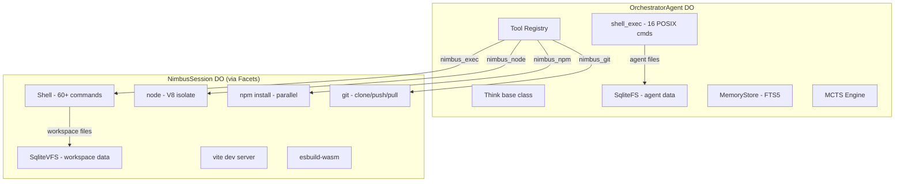
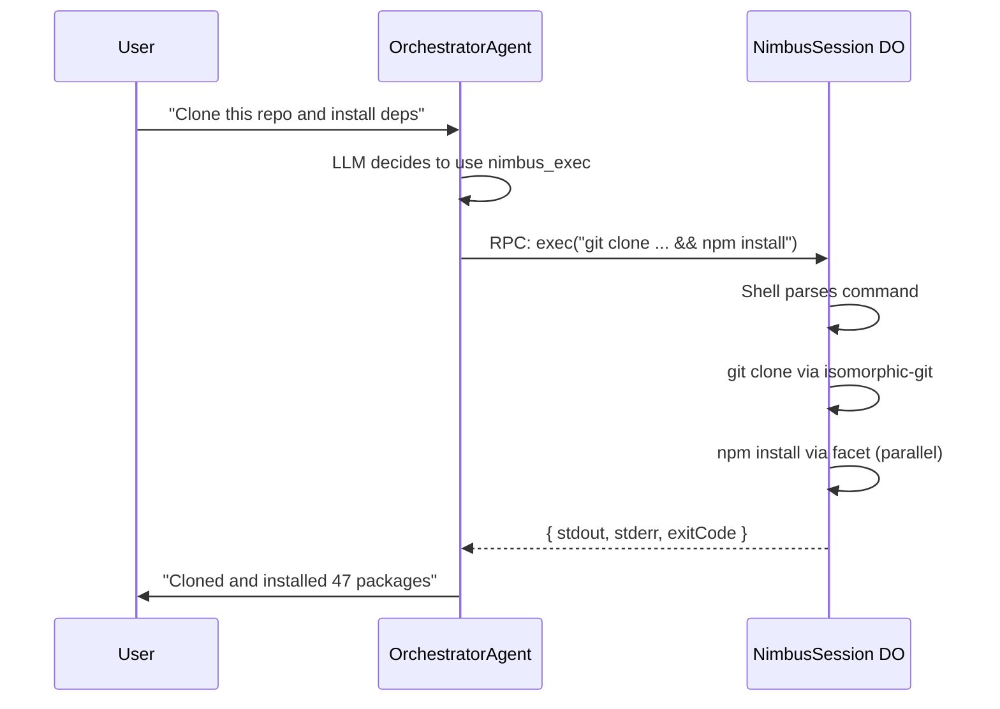

# Nimbus Integration Plan

> Maintained by Claude (AI-edited documentation, presented as-is); verify against the code when precision matters.

> **Note:** This is a design plan. The current implementation differs — see "Current Implementation" below.

> Nimbus: cloud-native development environment on Cloudflare Workers.
> Repository: github.com/AshishKumar4/Nimbus

## 1. Nimbus Architecture Summary

Nimbus provides a full Linux-like development environment running entirely on Cloudflare Durable Objects with SQLite storage. It is a single `NimbusSession` DO that acts as a supervisor for shell commands, process isolation, filesystem, and package management.

### Core Components

```
NimbusSession (Durable Object)
├── SqliteVFS           — 10 GB demand-paged filesystem (64KB chunks, 512-slot LRU cache)
├── Shell (@lifo-sh)    — 60+ Unix commands (ls, grep, sed, awk, find, tree, diff, etc.)
├── FacetManager        — Dynamic Worker spawner for isolated execution
│   ├── node            — V8 isolate with full require() + module resolution
│   ├── npm install     — Parallel tarball fetch (12× concurrency) + SUPERVISOR.writeFile()
│   └── vite dev        — Long-running HTTP facet with HMR + esbuild transforms
├── EsbuildService      — In-DO esbuild-wasm for TS/TSX/JSX transforms
├── isomorphic-git      — CF-compatible fork: clone, commit, push, pull, branch, merge
├── ProcessTable        — PID tracking, signal routing
├── PortRegistry        — HTTP server port mapping (node apps serve on /port/:n/)
└── SupervisorRPC       — WorkerEntrypoint for facet→supervisor IPC (ctx.exports loopback)
```

### Process Isolation Model

Heavy operations run in dynamic workers (facets) via `LOADER.get(codeId)`:

| Operation | Isolation | I/O |
|-----------|-----------|-----|
| Shell commands | In-DO (synchronous VFS) | Direct SqliteVFS access |
| `node script.js` | Facet (isolated V8 isolate) | Pre-compiled VFS bundle |
| `npm install` | Facet (parallel HTTP fetches) | SUPERVISOR.writeFile() per file |
| `vite dev` | Facet (long-running HTTP) | SUPERVISOR.readFile() + transform() |
| `git clone` | In-DO (background async) | Direct VFS access |
| `esbuild` | In-DO (esbuild-wasm) | Direct VFS access |

Facets communicate with the supervisor via `SupervisorRPC`, a `WorkerEntrypoint` that routes RPC calls to the parent DO via `ctx.props.doId`. This gives facets live access to:
- `readFile(path)` / `writeFile(path, content)` — live VFS
- `stdout(data)` / `stderr(data)` — live terminal output
- `transform(code)` — esbuild transforms
- `prefetch(cwd)` — module bundling
- `registerPort(n)` — HTTP server port mapping

### VFS Design

Demand-paged with write-back caching:
- **Inodes**: always in memory (~200B per file, covers 50K files in ~10MB)
- **Content**: 64KB chunks in SQLite, LRU-cached (512 slots = 32MB hot)
- **Batch writes**: `ctx.storage.transactionSync()` with throttle (500 pending max)
- **Events**: VfsEventEmitter fires `create`, `modify`, `delete` for HMR

### Command Coverage

60+ commands across categories:
- **Core POSIX**: ls, cat, echo, mkdir, cp, mv, rm, touch, stat, chmod, chown, ln, du
- **Text processing**: grep -r, sed, awk, sort, uniq, head, tail, wc, diff, tee, xargs
- **Search**: find, tree, which
- **Encoding**: base64, xxd, sha256sum
- **Dev tools**: node, npm, npx, esbuild, vite, git (full client)
- **System**: env, export, ps, top, kill, date, id, hostname, sleep, history, alias

## 2. Current Implementation

The Nimbus executor is implemented in `packages/core/src/execution/nimbus.ts` as a single `createNimbusExecutor()` function. It exposes 8 tools under the `nimbus` namespace:

| Tool | Description |
|------|-------------|
| `nimbus.exec` | Run shell command (60+ POSIX, npm, node, git, esbuild, vite) |
| `nimbus.readFile` | Read file from Nimbus filesystem |
| `nimbus.writeFile` | Write file to Nimbus filesystem |
| `nimbus.readdir` | List directory contents |
| `nimbus.exists` | Check if path exists |
| `nimbus.stat` | Get file/directory metadata |
| `nimbus.mkdir` | Create directory (recursive) |
| `nimbus.rm` | Delete a file |

**Wrangler binding**: The DO binding is named `NIMBUS_SESSION` (currently commented out in `wrangler.jsonc:22`). Communication is via `NimbusStub._rpc*` methods. The `_rpcExec` method is optional — not all Nimbus builds expose it.

**Capabilities**: `javascript`, `typescript`, `shell`, `npm`, `git`, `fs_owned`, `net_outbound`, `net_inbound`, `process_spawn`, `process_long`.

**File sync**: Not yet implemented. The plan below describes the intended design.

## 3. Integration Architecture (Plan)

### Design Decision: Nimbus as a DO Binding, Not a Replacement

Nimbus should NOT replace the current agent-utils shell layer. Instead, Nimbus provides a separate DO that the OrchestratorAgent delegates to for heavy execution — a full development environment the agent can use.

**Rationale:**
- Proteus's `shell_exec` tool operates on the agent's own SqliteFS (same DO). Replacing it with Nimbus would mean a separate DO owns the filesystem — breaking the tight coupling between VFS, memory, and MCTS nodes.
- Nimbus excels at tasks our shell can't do: `npm install`, `node script.js`, `vite dev`, `git clone`. These are the gaps.
- The agent already has 16 POSIX commands. Nimbus adds the 44+ commands we're missing plus the critical ones (node, npm, git, esbuild, vite).

### Architecture



### Tool Design (Original Plan)

The original plan called for 4 separate top-level tools. The actual implementation uses 8 namespace tools under `nimbus.*` (see Current Implementation above). The namespace approach integrates with the `ExecutionRouter` and `execute_tools` codemode pattern rather than exposing separate top-level tools:

```typescript
// Inside execute_tools codemode, the agent calls:
await nimbus.exec("npm install express && node server.js");
await nimbus.readFile("/workspace/package.json");
await nimbus.writeFile("/workspace/config.json", JSON.stringify(config));
```

### Communication Flow



### Wrangler Configuration

```jsonc
{
  "durable_objects": {
    "bindings": [
      { "class_name": "OrchestratorAgent", "name": "OrchestratorAgent" },
      { "class_name": "ExplorationAgent", "name": "ExplorationAgent" },
      { "class_name": "NimbusSession", "name": "NIMBUS_SESSION" }
    ]
  },
  "worker_loaders": [{ "binding": "LOADER" }]
}
```

### File Synchronization

The agent's VFS and Nimbus's VFS are separate SQLite stores (different DOs). File sync between them:

1. **Agent → Nimbus**: When the agent generates code via MCTS or crafted tools, write it to Nimbus's VFS before running.
2. **Nimbus → Agent**: When Nimbus produces output files (build artifacts, test results), copy relevant data back to the agent's memory.
3. **Selective sync**: Not all files need to cross. Agent memory/MCTS data stays in the agent. Nimbus workspace files stay in Nimbus.

```typescript
// Sync agent code to Nimbus before execution
async function syncToNimbus(nimbus: NimbusSession, agentVfs: VFS, paths: string[]) {
  for (const path of paths) {
    const content = await agentVfs.readFile(path, { encoding: 'utf8' });
    await nimbus._rpcWriteFile(path, content as string);
  }
}
```

## 3. CLI Backend: Just Use Real Bash

For `cli-backend`, Nimbus integration is unnecessary. Bun runs locally with full POSIX shell access:

```typescript
// cli-backend already has this
const result = Bun.spawn(["bash", "-c", command], { stdout: "pipe", stderr: "pipe" });
```

The CLI `run` and `execute_tools` (workspace.exec) paths use `Bun.spawn` via agent-utils shell for real bash. Nimbus is exclusively for the CF backend where there's no real shell.

## 4. Implementation Phases

### Phase 1: Basic Integration (Week 1)
- Import NimbusSession DO into cf-backend's wrangler.jsonc
- Add `nimbus_exec` tool to OrchestratorAgent
- Simple RPC: send command string, get stdout/stderr/exitCode
- No file sync yet — Nimbus has its own workspace

### Phase 2: File Synchronization (Week 2)
- Bidirectional file sync between agent VFS and Nimbus VFS
- Agent can write code → Nimbus runs it → results flow back
- Workspace tree visible in the UI

### Phase 3: Long-Running Processes (Week 3)
- Vite dev server management (start/stop/restart)
- Preview URL forwarding to the UI
- Port registry for HTTP servers
- Process table visible in the UI

### Phase 4: Full Development Environment (Week 4)
- Git operations (clone, commit, push)
- npm package management
- Project scaffolding
- Live terminal output streaming to the UI

## 5. Risk Assessment

| Risk | Mitigation |
|------|------------|
| Two DOs means double SQLite storage cost | Only sync needed files; Nimbus workspace is ephemeral |
| RPC latency between DOs | Batch file operations; prefetch file bundles |
| Nimbus depends on `@lifo-sh/core` | Vendor the dependency; it's small |
| LOADER binding required | Already required for codemode; no new dependency |
| Nimbus is experimental | Proteus is too — research context accepts instability |

## 6. What Nimbus Gives Us That We Don't Have

| Capability | Current Proteus | With Nimbus |
|-----------|----------------|-------------|
| Shell commands | 16 POSIX (our shell emulator) | 60+ (grep -r, diff, sed, awk, find) |
| Node.js execution | `new Function()` / Bun subprocess | Full V8 isolate with require() |
| npm | Not supported | Full install/run/test/start |
| Git | Not supported | clone, commit, push, pull, branch |
| Build tools | Not supported | esbuild, vite dev server |
| Dev server | Not supported | Vite with HMR + preview URL |
| File system | 1.8MB chunk VFS (agent-utils) | 64KB demand-paged VFS (10GB) |
