# Kinu product specification and acceptance contract

## Contents

- [1. Purpose and reading rules](#1-purpose-and-reading-rules)
- [2. Terms and ownership](#2-terms-and-ownership)
- [3. Product invariants](#3-product-invariants)
- [4. Workspace architecture](#4-workspace-architecture)
- [5. Agent identity, creation and lifecycle](#5-agent-identity-creation-and-lifecycle)
- [6. State, contexts and editable files](#6-state-contexts-and-editable-files)
- [7. Where context and runtime state live today](#7-where-context-and-runtime-state-live-today)
- [8. The common agentic turn](#8-the-common-agentic-turn)
- [9. Codemode, tools and database capability](#9-codemode-tools-and-database-capability)
- [10. Files, execution environments and devices](#10-files-execution-environments-and-devices)
- [11. Exploration, memory and evolution](#11-exploration-memory-and-evolution)
- [12. Slates and authored applications](#12-slates-and-authored-applications)
- [13. Web, terminal and everyday interactions](#13-web-terminal-and-everyday-interactions)
- [14. Identity, authority and trust](#14-identity-authority-and-trust)
- [15. Durability, interruption and recovery](#15-durability-interruption-and-recovery)
- [16. Evals, service identities and acceptance evidence](#16-evals-service-identities-and-acceptance-evidence)
- [17. Cross-surface acceptance journeys](#17-cross-surface-acceptance-journeys)
- [18. Acceptance catalogue and current implementation comparison](#18-acceptance-catalogue-and-current-implementation-comparison)
- [19. Completion sequence and approval boundaries](#19-completion-sequence-and-approval-boundaries)
- [20. Maintaining this specification](#20-maintaining-this-specification)

## 1. Purpose and reading rules

This document defines the product the owner has requested. It also compares that contract with the implementation and its evidence.

It has three kinds of statements:

- **Required behavior** comes from the recorded user requests, including later corrections that supersede earlier instructions.
- **Target design** explains how the required behavior should fit together. It is not a claim that the code already implements it.
- **Implementation evidence** states what a particular source revision or exercised product path proves. A passing test of one path does not prove a whole feature.

The request snapshot contains 975 catalogued messages and 801 occurrences from the active OMP session. All 794 previously captured occurrences remain accounted for. The input audit contains 2,740 separate ask rows: 2,584 historical rows, 125 previously added rows, and 31 rows from messages 971–975. These are coverage counts, not a completion percentage. Imported handoffs, repeated instructions, questions and superseded requests are not counted as separate implemented features.

The source comparison starts from `9e452eadaaedcc5994fbc0c43cd4bcfc83588b5a`. The independently checked production revision is `71479ace9`. Source-only or locally verified changes are labelled separately from deployed behavior. The full private message and evidence audit lives under the primary checkout's `docs/research/product-acceptance/`; this public document does not republish private transcripts or credentials.

A criterion is complete only when its stated behavior and failure cases are exercised through the relevant surface. Compilation, a source symbol, a mock response, a retained proposal, or a method that returns `unsupported` is not that proof.

### What this document does not authorize

The product contract does not authorize data loss, a production reset, unrestricted database access, or weakened security checks. A storage cutover must preserve existing work and identify any required operator decision before it changes production data.

It also does not turn the earlier agent-core architecture investigation into a wholesale rewrite requirement. That request was a what-if investigation. The later request for shared workspace SQLite and editable agent state is an explicit target, and is compared with the current design below.

## 2. Terms and ownership

| Term | Meaning |
|---|---|
| **Owner** | The human account that owns a workspace and controls its credentials, grants and destructive operations. The main agent is not the owner. |
| **Workspace** | The ownership and working-state boundary: identity, canonical files, agents, durable work and their records. |
| **Workspace address** | The routing name used to find a workspace. It is not its generated or user-chosen display title. |
| **Main agent** | The workspace's default conversational agent. Additional agents do not create additional copies of the shared workspace files. |
| **Subordinate** | An agent recorded under a parent in the workspace, created by the owner or admitted delegation. It has its own identity, context, role and lifecycle. |
| **Temporary helper** | A task-lifetime subordinate created for one question. Completion releases it from further model messaging; retained evidence remains inspectable by the owner. |
| **Persistent subordinate** | A workspace-lifetime agent that remains available for further assignments until dismissed. |
| **Swarm node** | A tool-using agent participating in exploration. A `search_nodes` row is a tree vertex; it is not automatically an agent. |
| **Exploration head** | A tool-using exploration actor with a defined assignment and reporting contract. |
| **Rollout branch** | A search attempt with the capabilities declared for that attempt. A toolless branch must not be described as a full tool-using agent. |
| **Role** | A capability and model-routing configuration. It does not identify an agent or establish ownership. |
| **Work mode** | Plan or Build authority attached to admitted work and retained through its causal chain. It is not a prompt suggestion. |
| **Conversation** | The durable conversation associated with an agent, independent of which client is connected. |
| **Working context** | The selected messages, summaries, memory and other inputs prepared for future model calls. |
| **Transcript** | Retained evidence of messages, model requests and results that actually occurred. It must remain distinguishable from an edited working history. |
| **Agent loop** | The code and configuration that drive model steps, tool use and completion. Kinu currently uses the term **scaffold** for versioned loop source. |
| **Capability binding** | A specific operation surface supplied to code under an actor's effective authority. Possessing a workspace address does not grant every capability. |
| **Slate** | An authored client/server project that presents a live UI and can compose admitted capabilities. It is not a JSON widget vocabulary. |
| **SDK facet** | A Cloudflare Agents hosting mechanism used by the current implementation. It is not automatically an agent-core Facet contract. |
| **Workspace fork** | A new workspace ownership boundary created from a defined snapshot. |
| **Context fork** | A new actor context derived from a particular parent context revision. It does not imply a new workspace or copied file plane. |

A name must keep one meaning throughout the product. In particular, workspace, agent, conversation, run, search vertex and execution process must not be used interchangeably.

## 3. Product invariants

These requirements govern every later feature and interaction.

1. **One workspace file plane.** The workspace owns one canonical base filesystem. Agent-scoped homes and private temporary paths are views within that plane, not independent copies of the project.
2. **Shared workspace state is explicit.** The requested cloud target has one workspace SQLite store for the main agent and its subordinate/exploration actors. Agent identity and access rules still partition the records.
3. **Shared storage is not shared authority.** An actor cannot gain another actor's private context, owner credentials or policy tables merely because their bytes share a database.
4. **One core for full agents.** Main, persistent, temporary and tool-using exploration actors reuse the same core turn behavior. Their wrappers supply identity, role, lifetime, context seed and task-specific ports.
5. **Visible state is truthful.** Queued, running, waiting for approval, failed, cancelled, completed and missing are different states. A transport acknowledgement is not a completed task.
6. **Native and codemode access agree.** Both enter the same capability policy and state owner. Code must not bypass a native tool's role, mode, consent or approval rules.
7. **Results remain data.** Successful output containing `error`, `reason`, an exit number or similar text does not become a failure. Invocation status comes from the producer's declared result/error channel.
8. **Unknown measurements stay unknown.** Missing usage, cost, outcomes or verification evidence must not become zero, success or an inferred benchmark score.
9. **Work survives the right boundaries.** Hosted work is independent of an attached browser or terminal. A client disconnect is not cancellation.
10. **Cancellation is explicit.** Cancellation reaches the admitted work and its children, stops new effects, and leaves a truthful terminal record. It must not discard already completed effects or their evidence.
11. **Editing creates a new version.** Loop and working-context edits have an identity, validation result, activation point and rollback path. They do not silently overwrite the evidence of an earlier run.
12. **Every limit has a reason.** Provider/platform limits, explicit user budgets, transport liveness and product policy are separate. An arbitrary elapsed agent deadline is not a substitute for correct lifecycle handling.
13. **No hidden second implementation.** A new UI, tool, backend or adapter must reuse existing state and policy where those contracts are the same. Different names are not proof of different responsibilities.
14. **Completion is end to end.** A feature includes its reachable user/tool surface, persistence, failure behavior and verification. A scaffold or unused adapter is not a completed feature.

## 4. Workspace architecture

### 4.1 Current hosted architecture

The current hosted workspace has a root `OrchestratorAgent` Durable Object. Its SQLite storage backs the canonical Nimbus workspace and the main agent's state. Additional agents run as SDK facets and share the canonical files through the workspace owner.

Those facets have **separate actor-local SQLite storage**. Their conversations and execution records are not all rows in the root's database. A root database export must therefore not be described as a complete snapshot of every retained actor merely because the filesystem is shared.

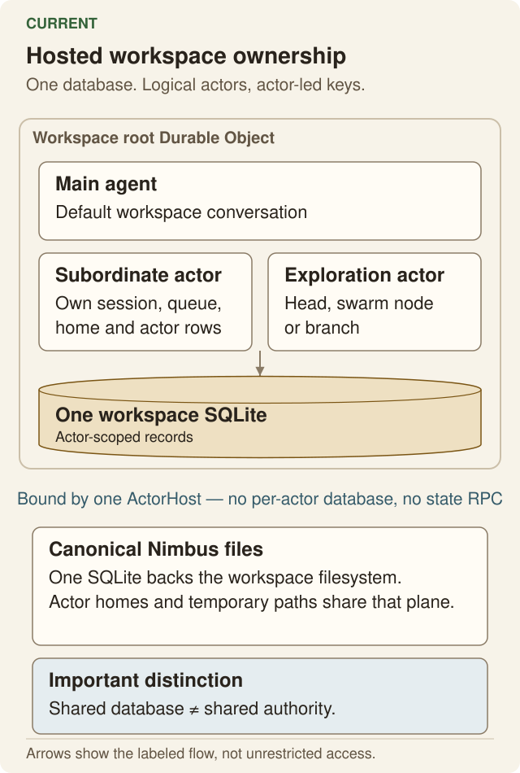

This is a real mismatch with the owner's latest shared-SQLite requirement. It must remain visible in the implementation comparison.

One root actor directory issues immutable actor and parent references. It separates logical aliases from physical storage keys. Actor-scoped storage uses `actor_config`, `actor_program_state`, `actor_subordinates` and `actor_identity`. The root directory uses `workspace_actors`. Hosted and local child runtime storage remains separate.

On 2026-09-08, 8 directory cases and 3 admitted-birth cases passed locally. They cover colliding state keys, lost acknowledgements, cross-parent refusal, retirement retries and reused aliases. The native Worker tier passed 2 actor-identity cases and 5 retained-inspection cases after removal of the obsolete legacy-root contract. These are local proofs. No deployment is claimed.

Retained dismissal keeps the logical name reserved. Successful destructive retirement removes only the roster row that matches its captured actor reference. Interrupted retirement keeps its intent in the directory and roster.

### 4.2 Required shared-SQLite target

For the cloud product, one workspace Durable Object owns:

- the workspace identity and canonical Nimbus file plane;
- the main agent and the workspace's logical agent roster;
- agent-scoped conversations, working contexts, loop versions and durable work;
- memory, tools, evolution records and the state needed to recover admitted work.

The workspace can contain **N** subordinate or exploration actors. Their logical independence does not require separate authoritative databases. They keep distinct identities, contexts, roles, queues and records within the shared storage boundary.

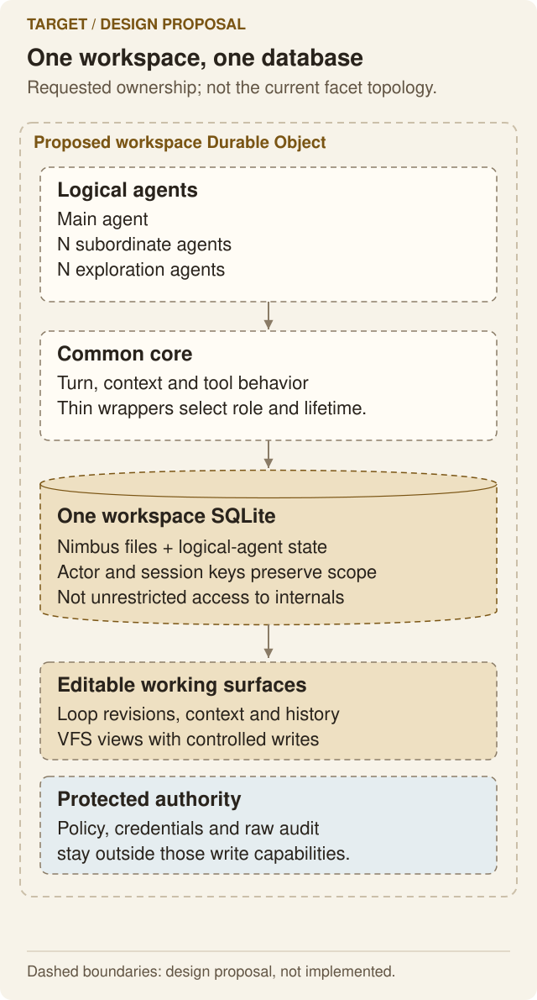

Account-level services remain separate where their ownership differs. The user registry, provider credentials, operator control plane and external machines do not become agent-editable workspace data.

Execution may use isolated workers, containers or connected devices. Those execution resources must not become a second owner of the agent's durable conversation or the canonical workspace files.

The target does not promise unlimited simultaneous CPU or memory inside one isolate. Concurrency must be scheduled against real resources and declared budgets. Resource exhaustion must be observable; it must not be disguised as successful delegation.

### 4.3 Local adaptation

A local workspace has no Cloudflare Durable Object. It must preserve the same product concepts using local persistence and execution.

The current local backend can bind the project plane to a native directory while keeping agent state in SQLite-backed storage. That difference matters: a host shell path and a state-file path are not interchangeable. The specification must not claim local/cloud storage parity where only their interfaces are shared.

### 4.4 Workspace journeys

| Journey | Required interaction and outcome |
|---|---|
| Create | I choose the host, purpose and supported initial settings. Interactive creation makes the agent take its first turn from that mission/prompt without a second user prompt. Creation returns a durable workspace or a classified failure, not an unnamed half-created workspace. |
| Open | The workspace loads its canonical conversation and current state. Its title is the generated or owner-selected title, not a random routing identifier. |
| Rename | The display title changes through its actual owner. The routing address is not silently rewritten or truncated. |
| Switch | Switching workspaces does not carry the previous workspace's context, approvals, files or client state into the new one. |
| Reconnect | A reconnect resumes current data and relevant stream positions. Failed/stale reads are retried through the established load identity, not left hidden behind an old banner. |
| Fork | I can identify the source revision or cut point, the copied state and the state deliberately excluded. The result is a distinct workspace, not an alias to mutable source state. |
| Export/import | The archive states its coverage and consistency boundary. It must not claim actor histories or secrets that it does not actually include. Import validates before exposing a usable workspace. |
| Delete | Destruction requires owner authority and clear confirmation. Associated resources and durable work have a defined teardown. Absence is verified, not inferred from the UI closing. |

The mission is not a reason to leave the new workspace inert. A general mission can lead the agent to ask what to do next; an actionable initial request should start that work. An import or setup-only API must state explicitly when it does not start a turn. The UI must not present internal storage IDs as competing workspace identities.

## 5. Agent identity, creation and lifecycle

### 5.1 Shared core, narrow roles

The target uses a common full-agent core. An actor instance supplies data and capabilities rather than copying the entire loop implementation.

Its descriptor must distinguish:

- immutable identity and parent/workspace lineage;
- display name and current role;
- workspace or task lifetime;
- trusted Plan/Build mode for admitted work;
- context initialization policy;
- available tools and execution environments;
- task, deliverable, completion and reporting contract;
- active loop/context revisions and durable run identifiers.

A role is not a second agent class. A temporary lifetime is not a reduced text-only completion. An exploration assignment does not justify maintaining another copy of ordinary tool use, cancellation or history handling.

The product has five inference tiers: `tiny`, `fast`, `default`, `slow` and `deep`. Every tier without an explicit override inherits the default-tier setting. Changing that default must preserve explicit per-tier overrides. Roles/templates remain separate, and the main agent must be able to discover and use admitted subordinate templates. This is the explicit requirement in message 614 and the current catalogue's stated model.

The requested default model for a new user or a user with no default override is **GLM 5.3 on Workers AI** (message 851; current model ID `@cf/zai-org/glm-5.3`). Existing user overrides must not be replaced. Missing credentials must produce an actionable availability state, not an unannounced alternative model.

The current backend already consolidates full facet behavior in `SubordinateAgent` and shared `ActorAgent`/core code. The storage and lifecycle hosting arrangement remains different from the requested single-store target.

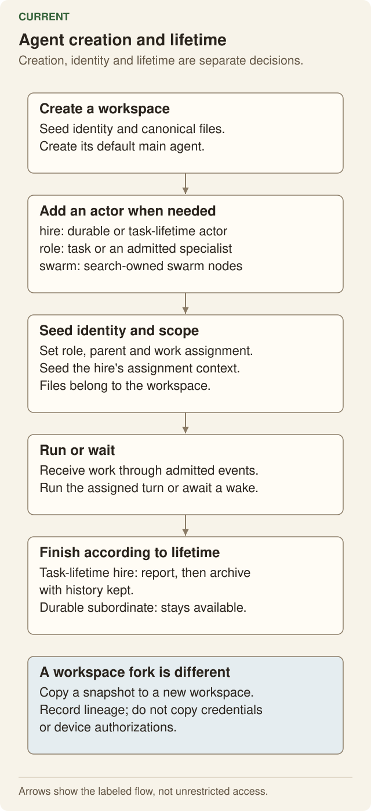

### 5.2 Creation and delegation choices

| Operation | Purpose | Context and lifetime contract |
|---|---|---|
| Direct work | The current agent handles the task. | Uses that agent's current working context and capabilities. |
| Ask an existing subordinate | Assign one question to an available subordinate. | Returns accepted/working state and correlation promptly; the report arrives through the durable reporting path. It retains the target conversation and does not spawn a hidden fresh actor. |
| Ask by role | Create one temporary full agent for one question. | Waits for its terminal answer/outcome, not merely a progress report; then releases the task-lifetime actor with truthful evidence retention. |
| Hire | Add a persistent subordinate. | The actor retains its own conversation, role and lifecycle for later work. |
| Swarm | Explore alternatives under a stated search configuration and objective. | Context initialization, tool use, scoring, settlement and resource budgets are explicit. A judged search and an unranked ideation sweep are not reported as measured optimization. |
| Ask a workspace peer | Ask an authorized agent in another workspace. | Waits for the peer reply. Its workspace ownership boundary is preserved; this is not an implicit child or shared-filesystem grant. |

`agent` and `role` are different ask targets. Invalid combinations and unknown fields must be refused before work or spend begins.

This target-dependent settlement is deliberate: message 748 explicitly accepts immediate subordinate assignment and awaited peer replies. Native and codemode forms must agree for each target; the specification does not homogenize them into a different return contract. `send` and `reply` retain their own message/event correlation.

A `context_ref` names a file or other admitted context source for the receiver to read. Passing a path is not proof that the receiver read it. Acceptance must inspect actual calls or resulting source-grounded evidence.

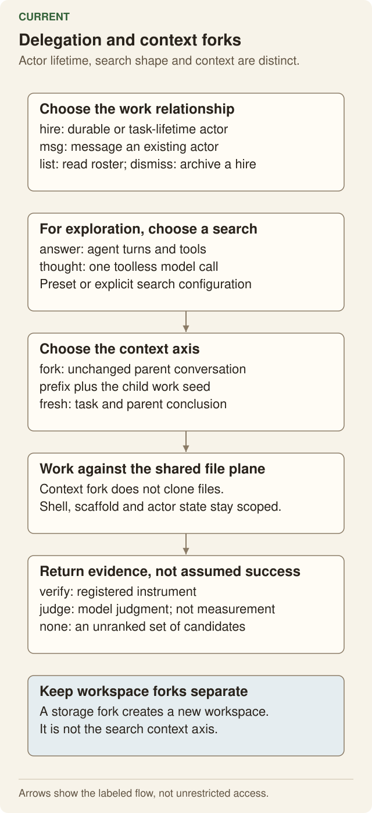

### 5.3 Fresh, context-forked and workspace-forked

These operations must remain separate:

- **Fresh context:** initialize an actor from its role, assignment and explicitly supplied context. Do not silently import the whole parent conversation.
- **Context fork:** derive a new actor context from a named parent context revision. Later child edits do not rewrite the parent's context.
- **Workspace fork:** create a new ownership/file-state boundary from a defined snapshot. This is a storage operation with its own consistency and merge contract.

Sharing project files does not mean sharing a conversation. Forking a conversation does not imply copying the project. The UI and tool descriptions must state which operation happened.

The current hire path creates a new conversation with a bounded digest of recent parent messages. It is not a verbatim conversation fork or literally blank context.

### 5.4 Settlement and inspection

Completion must pair admitted work with one terminal outcome and its evidence. A child answer, its delivery to the parent, its retained records and its removal from the active roster are related but distinct facts.

Dismissal must not be treated as proof that every durable effect has settled. Retaining history does not grant the model permission to send more work to a dismissed agent.

The owner must be able to inspect retained subordinate history and recursive lineage through an authorized read path. Missing actor storage must return an explicit missing result, not a fabricated empty history. A settled archive read must not bootstrap new agent work. Genuine pre-existing recovery must retain its normal behavior.

## 6. State, contexts and editable files

### 6.1 Separate the kinds of state

| State | Meaning | Required ownership |
|---|---|---|
| Workspace files | Project and authored application bytes. | Canonical workspace VFS, with actor and mount permissions. |
| Agent identity/configuration | Who the actor is, its role and its parent/workspace relationship. | Workspace-owned, actor-scoped records; protected fields are not arbitrary agent SQL. |
| Conversation | The agent's durable conversational sequence. | Stable across browser, CLI and one-shot clients. |
| Working history | The selected and edited history used to construct future context. | Versioned, editable under the actor-management policy. |
| Rendered model context | The exact inputs submitted for a particular model step. | Readable evidence linked to the consumed working-context and loop revisions. |
| Transcript and run evidence | Messages, calls, results, usage and effects that occurred. | Retained evidence; an edited working history does not overwrite it. |
| Loop source | The program/configuration driving the actor's steps. | Versioned source with validation, activation and rollback. |
| Memory, facts and skills | Reusable knowledge and instructions. | Defined stores and scopes; indexing must follow their canonical content. |
| Host policy and credentials | Ownership, authentication, grants, secrets and enforcement. | Host/owner authority outside editable agent loop and context state. |

### 6.2 Required VFS editing model

The agent must be able to read and edit the **actual** loop and working-context source consumed by its runtime. An exported text snapshot that changes nothing when edited does not satisfy this requirement.

The preferred boundary is a VFS projection backed by the owning state store. It must not create two independent writable copies of context: one in SQL and another in a file.

Logical agent-state areas should provide:

| Area | Required behavior |
|---|---|
| Loop source | Read the active source and its version; edit a candidate; observe validation and the activation boundary. |
| Working context | Read the selected messages, summaries, references and state for future work; commit a revision without silently overwriting newer progress. |
| Working history | Edit the context branch consumed by future turns while retaining its relationship to the original transcript. |
| Rendered requests | Inspect what a particular step actually consumed, including the relevant context/loop revision identifiers. |
| Change history | Inspect who or what changed a version, why, what evidence was used, whether it activated, and how to revert it. |

The final file paths must reuse the existing agent-home and VFS addressing conventions. The contract above defines their behavior; the current path map and implementation gaps are recorded in the source comparison.

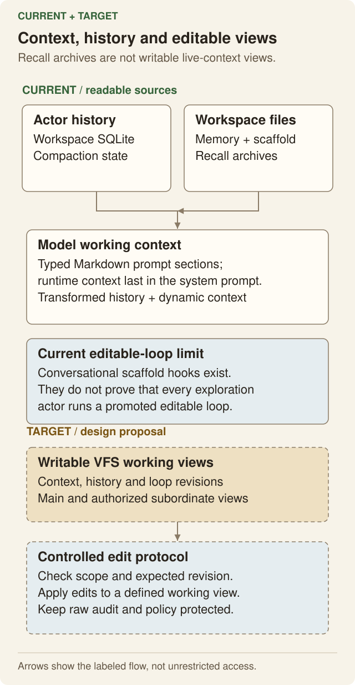

### 6.3 Editing and activation rules

1. A read identifies the version that the editor observed.
2. An edit validates authority, syntax/schema and the expected prior version.
3. A stale or invalid edit fails clearly and leaves the active version intact.
4. A valid edit creates a new revision and states when it becomes effective.
5. An in-flight model request retains the versions with which it started.
6. Activation occurs at a defined safe boundary; it does not patch arbitrary live JavaScript closures.
7. The next relevant request must demonstrably consume the new revision.
8. A failed activation or regression leaves a usable rollback path and a truthful failure record.

Parent/owner management of a subordinate must use the same checks. It must not overwrite a child's newer context merely because the parent read an older snapshot.

### 6.4 Mutable working history and immutable evidence

The requested editability applies to the context an agent will use. Historical evidence must remain available to explain what actually happened.

This preserves both capabilities: an agent can improve its context, and a reviewer can still determine which earlier request, tool result or decision produced an outcome. Replacing the active context is not permission to erase failed runs, rewrite cost records, change owner policy or fabricate a clean history.

Owner-authorized retention or permanent deletion is a separate operation. The immutability rule prevents ordinary context edits from falsifying past evidence; it does not override an explicit authorized data-deletion policy.

The current versioned scaffold provides part of this model. Full editable VFS access to actual per-agent working context/history is a separate requirement and must not be declared complete from scaffold versioning alone.

## 7. Where context and runtime state live today

This is the source inventory for the reviewed revision, not a proposed schema and not a claim that every optional SDK table exists in every database.

| Family | Current records | Physical owner and significance |
|---|---|---|
| Hosted conversation | `assistant_messages`, `assistant_config`, `assistant_compactions`, `assistant_fts` | Each Think actor's own SQLite. Messages carry session and ancestry fields. Kinu currently returns the SDK default session unchanged. |
| Local conversation/search | `messages`, `conversation_fts`, `conversation_fts_state` | Current actor database. The search index is derived; it is not another authoritative conversation. Hosted readers select the pane store when present. |
| Optional SDK session/context | `assistant_sessions`, context-block and search tables | SDK facilities. Their existence in the package does not prove Kinu uses them for every actor. |
| Stream replay | `cf_ai_chat_stream_chunks`, `cf_ai_chat_stream_metadata` | Actor-local reconnect buffers. Cleaning a replay buffer is not deletion of canonical messages. |
| SDK lifecycle | `cf_agents_state`, queues, schedules, workflows, runs, fibers, facet runs and sub-agent registry | SDK actor storage, with root coordination where the SDK requires it. Child identity/version information is SDK-owned. |
| Think lifecycle | `think_config`, tool-child runs, action ledgers, approvals, submissions and workflow notifications | Actor-local SDK state. Session-scoping messages alone would not partition these records or the in-memory queues. |
| Kinu identity/roster | `workspace_identity`, `agent_config`, `subordinate_identity`, `workspace_subordinates`, `facet_identity`, `facet_activation` | Root or actor-local store. The parent roster is distinct from the child identity. Capability-bearing records are protected state. |
| Program state | `codemode_state` | Actor-local JSON key/value state today. This is not a general SQLite binding. |
| Admitted work/effects | `pending_steers`, `active_durable_turn`, `run_events`, `background_jobs`, `tool_effect_claims`, `terminal_effects`, `effect_tombstones` | The actor's durable work, mode, outcome and recovery records. They must not become ordinary editable prompt text. |
| Compaction/prompt versions | `compaction_state`, `compaction_archive`, `prompt_section_versions`, `prompt_section_evaluations` | Actor/session-scoped context planning, recall locations and prompt trials. |
| Scaffold/learning | `scaffold_versions`, regression fixtures, trials, evaluations, completed turns, evolution events, outcomes, lessons, labels and GEPA records | Actor-local version pointers and learning evidence. Source bytes and execution evidence have different owners. |
| Exploration | `search_nodes`, `mcts_search_runs`, `swarm_node_records`, exploration records, head runs/journal/evidence/steps/merge results | Search/controller-owned durable results. Facet-local traces and model-operation outboxes are additional records; a search vertex is not a conversation. |
| Memory/tasks/permissions | Memory chunks/FTS, `agent_facts`, `agent_tasks`, plan reviews and instruction approvals | The scope supplied by the actor/root adapter. An instruction's approval is not equivalent to permission to write its file. |
| Nimbus file storage | `inodes`, `file_chunks`, content lifecycle and append receipt/writer/revocation records | Root Nimbus SQLite VFS. These tables store files; they do not automatically project arbitrary conversation tables as files. |

Relevant implementations are `identity/conversation-store.ts`, `config/conversation.ts`, `subordinates/roster.ts`, `events/recorder.ts`, `scaffold/surface.ts`, `prompting/volatile-context.ts`, the compaction stores, and the pinned Agents/Think session implementations. The full private source map records the individual symbols and paths.

### 7.1 State that is not a conversation table

The SDK also keeps facet identity and parent-path information in durable KV. Nimbus keeps shell cwd/exported environment per shell identity. Runtime instances hold a turn accumulator, dynamic-context ledger, steering drain, message/leaf caches, queues, continuations and stream controllers.

These are not all one serializable prompt file. Consolidating storage requires a rule for reconstructing each mutable runtime object for the correct agent. Reusing one object across actors would mix their contexts or authority even if their SQL rows were correctly keyed.

### 7.2 Current VFS paths and their actual effect

| Path or area | What it currently represents | What it does not prove |
|---|---|---|
| `/home/user` | Canonical relative-path root for workspace file operations. | A second file copy for each actor. |
| `SOUL.md` | Owner-editable workspace identity/purpose prose. | Permission for an agent to rewrite owner policy. |
| `memory/MEMORY.md`, `memory/*` | Durable notes and indexed memory. | The exact active conversation. |
| `scaffold/agent.js`, `scaffold/agent.js.vN` | Main scaffold view and version source. SQL selects the current/promoted version. | That any arbitrary file overwrite automatically changes an in-flight loop. |
| `.kinu/agents/<storage-key>/scaffold/agent.js[.vN]` | Subordinate scaffold source in shared files, with version metadata in that actor's SQL. The physical key is distinct from the logical alias. | Shared physical agent SQLite. |
| `.kinu/heads/<storage-key>/scaffold/agent.js`, `.kinu/nodes/<storage-key>/scaffold/agent.js` | Exploration runtime paths use the issued physical actor key. Graph IDs remain logical search identities. | Complete common-loop or consumed-version provenance acceptance. |
| Actor homes and temporary roots | Credentialed homes/shell identities within the canonical workspace. | Unrestricted access to every actor's private state. |
| `.kinu/compaction/<session>/<range>.md` | Recall text for a compacted range, cited by SQL archive records. | A writable projection of the current working conversation. |
| Tool-output, attachment and event-content spill areas | Large content retained outside a prompt-sized response. | Permission to replace canonical event outcomes or claim every byte was included in the prompt. |
| `AGENTS.md` and skill files | Instruction source whose system placement follows approved content identity. | That file write access automatically grants trusted instruction authority. |
| `/pc`, `/sandbox` | Mounted views of available external machines. | That the workspace shell runs on those machines or shares their native paths. |

### 7.3 What the shared-SQLite change actually requires

The literal target is **logical agents inside the one workspace state owner**. A facet's synchronous SQL interface cannot be replaced by an asynchronous RPC and still be called synchronous SQLite.

The implementation must address all of these together:

- actor keys for conversations, configuration, loop pointers, state keys and read models;
- actor/session identity in queues, durable submissions, fibers and effect records;
- per-actor mutable runtime objects, not one workspace-wide active-context singleton;
- scoped cursor and index reads, including rejection of another actor's cursor;
- one scheduler with explicit ownership of admitted work;
- complete export/restore of retained actor state and lineage;
- data preservation from the current separate stores before their execution path is removed.

The SDK's `Session.forSession` can help partition messages. It does not by itself partition every Kinu/SDK table or in-memory state object.

Keeping compute facets while forwarding selected state through root RPC is a different design. It retains facet-local SDK storage and asynchronous consistency boundaries. It must not be described as satisfying the literal one-SQLite request unless the owner explicitly changes that requirement.

## 8. The common agentic turn

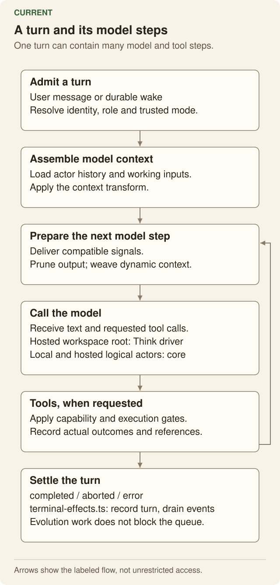

The common pipeline must preserve the following order and ownership:

1. **Admit input.** Record its identity, trusted work mode, origin and target actor. Retried delivery must not create a second copy of the same work.
2. **Select actor state.** Use that actor's queue, conversation, role, model configuration and active versions.
3. **Prepare context.** Combine permitted instructions, working history, memory, task state, tool declarations and pending signals. Preserve stable cacheable material while updating volatile facts.
4. **Apply context policy.** Pruning, compaction, replay normalization and cache markers must operate on the messages that will actually be sent.
5. **Measure honestly.** Record exact provider counts where available. Estimated or unavailable counts must be labelled as such.
6. **Call the model.** Use the selected provider/model and its actual supported settings. A UI selection that never reaches the request is not implemented configuration.
7. **Execute admitted tools.** Route through native or codemode bindings without widening authority.
8. **Capture the outcome.** Store producer-owned status, error provenance and observed usage before display formatting or truncation.
9. **Deliver progress.** Text, reasoning, tools, jobs and waiting states reach the correct user/parent surface and survive reconnect.
10. **Continue or settle.** Useful work continues until completion, definitive failure or explicit cancellation. Outstanding background work is not hidden behind a completed label.
11. **Retain evidence and learning inputs.** Completion and later feedback can feed adaptation. Learning must not delay delivery of the original terminal outcome.

Known native failures must reach the next model request with their classification. Unclassified errors remain unclassified. A successful tool returning error-shaped JSON remains successful data. The source snapshot implements this projection before extensions, pruning, dynamic context, replay normalization, cache marking and final-array measurement.

The backend wrapper may differ where the hosting API differs. Hosted Think, local execution and exploration adapters must not invent different meanings for tool failure, cancellation, context version or completion.

## 9. Codemode, tools and database capability

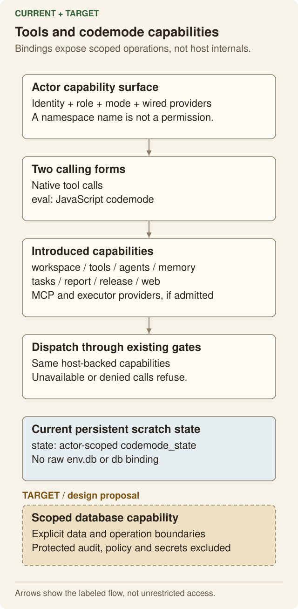

### 9.1 Current native and code surfaces

The builtin registry defines `execute_tools`, `run`, `file`, `agents`, `memory`, `tasks`, `web` and `report`. Availability is intersected with the actor's role and wired dependencies. MCP and crafted tools are additional admitted tools; eight builtin names do not mean every actor has exactly eight total tools.

The current hosted code program receives capability namespaces, not the trusted Worker's raw environment:

| Surface | Current meaning |
|---|---|
| `tools.*` | Admitted native and eligible crafted tools. MCP tools enter through the admitted tool surface, not a blanket account client. |
| `workspace.*` | Canonical workspace files, shell/process and supported workspace operations. |
| `sandbox.*`, `laptop.*`, `parent.*` | Actor-available execution adapters. Missing environments are not simulated. |
| `agents.*`, `memory.*`, `tasks.*`, `web.*` | Their existing dependency-gated dispatch paths. |
| Root/assignment control namespaces | Planning/release/report operations only where the actor's composition supplies them. A namespace named in a comment is not proof of availability. |
| `state.*` / `env.state` | Durable actor-private JSON key/value state: get, set, delete and list. These research-state operations are explicitly Plan-allowed. |
| `env` | A frozen program environment containing workspace identity, state and missing builtin names. It is not the trusted Worker Env. |
| Hosted Node-compatible shims | Supported asynchronous filesystem and process operations over workspace capabilities. Unsupported synchronous/native operations refuse. They do not grant the trusted host filesystem. |
| Hosted global `fetch` | The selected outbound capability. Plan receives no network capability; Build uses the shared destination policy. |
| `db` or `env.db` | **Absent in the reviewed implementation.** `state.*` is not raw SQLite under a different name. |

Hosted programs run in dynamic Worker isolation. The local factory has a different implementation: `createNodeExecuteToolFactory` evaluates normalized code in process with provider bindings and the local require path. The product must not describe these as identical security boundaries merely because both are called codemode.

### 9.2 Required database contract

The target should use one documented code-facing name, **`db`**, rather than introduce interchangeable aliases. This is a target capability, not an existing API claim.

Before that capability is exposed, its scope must be implemented and tested:

- parameterized SQLite operations over admitted agent/application data;
- explicit atomic batch/transaction semantics that the host can actually provide;
- shared workspace data where sharing is intended, actor-scoped state where it is private;
- no arbitrary writes to credentials, owner identity, grants, approvals, active effect claims, tombstones or measured audit records;
- no escape through schema operations, views, triggers, attached databases or other indirect SQL paths;
- the same role and Plan/Build rules as other mutations;
- classified errors and retained operation evidence.

A physical shared database does not imply an unrestricted `ctx.storage.sql` handle. The implementation must use a real enforceable SQL/capability boundary. A keyword filter or caller-supplied actor ID is not sufficient authority.

Versioned context/loop edits should enter their managed VFS/state operations. They must not require the agent to update internal message tables and lifecycle pointers by hand.

### 9.3 Tool behavior

| Interaction | Acceptance condition |
|---|---|
| Discover | The actor sees the operations it can actually call, their argument schema, native/codemode reach and availability. |
| Call | Native and codemode paths enforce the same effect, role, mode and grant policy. |
| Handle refusal | A program can handle a namespace refusal and continue. The enclosing invocation does not become a failure simply because it handled one. |
| Fail natively | The SDK error channel and retained outcome represent the actual failure. The next model request keeps known classification. |
| Return arbitrary data | Error-looking text/JSON remains data when the invocation succeeded. |
| Clamp output | The response identifies a working restoration path to the complete output. A path in the workspace is not presented as a host-machine path. |
| Background | A running operation has a usable handle, progress and terminal delivery. Detachment does not kill the work. |
| Build a tool | Source validates and executes through the real backend; it is versioned, discoverable and callable on a subsequent step. |
| Change tools | Cache invalidation follows the actual tool-store version and permission changes, not a guessed time interval. |

## 10. Files, execution environments and devices

### 10.1 One view, explicit machines

The workspace base tree is canonical. Mounted device/container paths extend that view through the owning executor's file API. They retain consent, read-only and consistency rules.

A command runs on a named executor. A filesystem mount does not make the workspace shell run on the mounted machine. Local native project directories, the SQLite-backed state tree, container paths and device paths must not be silently substituted for one another.

Hosted Node execution has a real workerd compilation restriction. Version/help output does not prove arbitrary Node programs run. The product should direct workloads to a capable environment and show the refusal when one is unavailable, not advertise a runtime from its catalogue entry alone.

### 10.2 File interactions

- Reads distinguish absent paths, denied access and failed storage/network operations.
- Text, binary, range, directory and metadata operations use the same authoritative plane.
- Edits require the appropriate prior read/version. Missing or repeated anchors fail instead of selecting an arbitrary match.
- A stale edit does not overwrite newer data from another agent or client.
- Writes, rename, deletion, permissions and links have declared semantics and preserve the host's real boundaries.
- Memory/search indexes update from canonical content without creating a second writable copy.
- File previews, downloads and editors agree on path identity and current revision.
- An unreadable file or failed listing remains an error; it is not an empty successful result.

### 10.3 Device journeys

| Journey | Required result |
|---|---|
| Install/connect | Linux, supported WSL2 and macOS paths use Kinu's supported runtime. A host Node installation must not accidentally decide whether the daemon has WebSocket support. |
| Empty state | If no device is connected, the Environment/device surface gives actionable CLI connection instructions. It must not require the user to discover the command through another conversation. |
| Available, consent pending | Connection/availability changes reach the agent's next dynamic context even before consent. The agent can explain or request the missing grant, but availability alone never authorizes access. |
| Identify machines | Multiple live devices have stable distinct identities and readable names. Two machines do not contend for one unnamed executor slot. |
| Grant | Consent is explicit per workspace and machine. Default file scope is the granted area, not the entire filesystem. |
| Select | A call identifies the intended device when more than one is live. Ambiguity produces a useful refusal. |
| Execute | Real files, PTY behavior, processes and the device's actual installed capabilities remain usable. |
| Reconnect | Ownership and request correlation survive reconnect without duplicate execution or flapping identity. |
| Revoke | New operations fail after revocation; pending/running work follows the declared cancellation policy and the UI reflects it. |
| Disable isolation explicitly | Full host access is an owner choice and is described as such. It is not a hidden fallback when restricted execution fails. |

Native Windows support is a separate future scope. It is not silently counted as implemented by WSL2 support.

## 11. Exploration, memory and evolution

### 11.1 Exploration behavior

A search has a configured strategy, context policy, objective, scoring method and settlement contract. Every tool-using node has an identity, assignment and actual tool loop.

The product must distinguish:

- measured verifier scores from model judgments;
- ranked optimization from unranked ideation;
- a reported candidate from completed/accepted work;
- context inheritance from workspace copying;
- branch creation limits from whether an existing leaf may finish its own work;
- local mechanism tests from a measured improvement on a controlled benchmark.

Per-node tasks and optional models must reach actual calls. Re-entry preserves their original assignment and provenance. Uneven-depth trees still settle and aggregate results correctly. A node's final report and its parent delivery must not be lost when the execution host is reclaimed.

The exploration UI must show current and retained runs, relationships, text/reasoning/tools, scores and meaningful failure/waiting states. A static tree snapshot is not proof of live streaming or reconnect behavior.

### 11.2 Memory and instructions

Notes, facts, skills, conversation retrieval and compaction recall are distinct capabilities:

- notes and skills have canonical content and meaningful edit/version behavior;
- facts have keyed storage and explicit scope;
- conversation search reads retained history without replacing it;
- compaction preserves recall locations and the relationship to the compacted range;
- changing approved instruction content must not inherit an old digest's trust automatically;
- shared learning follows the owner's policy and does not leak private contexts across workspaces.

### 11.3 Evolution

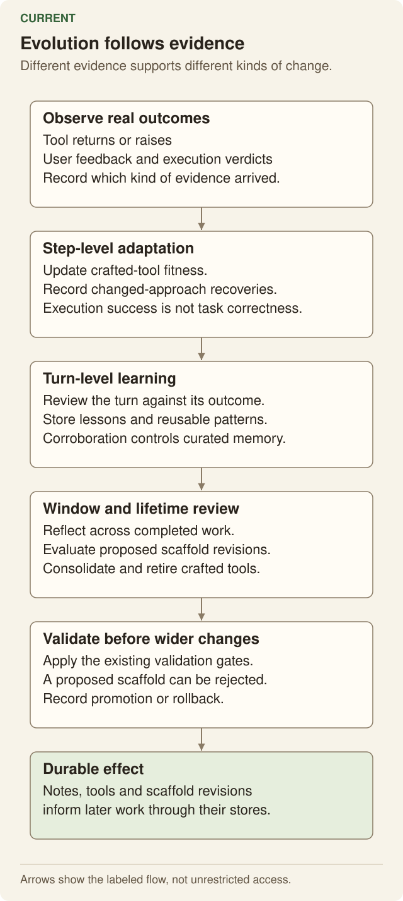

Kinu should improve tools, instructions, working context and loop versions through observable changes. The supporting mechanism must state:

1. What observation triggered a proposal.
2. Which source/version the proposal changes.
3. What verifier, replay or evaluation was used.
4. Whether the change is provisional, under trial, promoted, rejected or rolled back.
5. Which actor/owner authority permitted activation.
6. Which later outcome supports or contradicts the proposed benefit.

Tool fitness updates, turn lessons, session reflection and lifetime search are different operations. Their presence does not prove they improve task success.

Calibration must not label model agreement as human ground truth. The recovered approval for the ensemble calibration path was: a human reference pass, blind model second opinions, measured agreement/confusion, then recurring automation with a human audit. A transcript corpus alone does not replace that reference.

## 12. Slates and authored applications

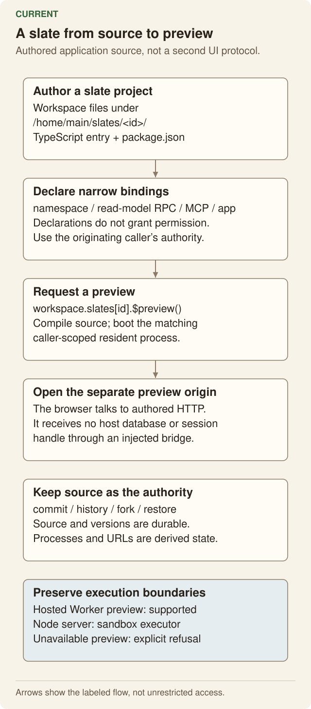

A slate is a real authored project under the workspace file plane. Its configuration belongs in `package.json`; its UI is JS/JSX/TS/TSX that renders HTML/CSS/JavaScript in the browser. Server code can serve routes and use declared admitted bindings.

A custom JSON component vocabulary is not the required rendering model. A JSON response may be application data or an observation; it is not automatically the UI definition.

### 12.1 Implemented hosting boundary

The reviewed hosted path compiles a Worker-style server and optional browser entry through the real bundler, boots a resident process, and exposes a separate preview origin. Source and versions are durable; compilation, processes, ports and URLs are derived state.

This does not establish that arbitrary Node/Vite programs run inside hosted Nimbus. The original Node/Vite wording was an architecture question. The current answer is: hosted slate previews use Worker modules; Node workloads need a capable environment such as the sandbox. Local CLI slate hosting and a Node slate host are not claimed as implemented.

Likewise, agent-core Slate record/version reuse does not establish universal adoption of agent-core Facet, Grant, Binding, RunCommit or deployment protocols. [AGENT-CORE-ALIGNMENT.md](AGENT-CORE-ALIGNMENT.md) records that boundary.

### 12.2 Slate operations

| Operation | Required behavior |
|---|---|
| List | Discover actual projects and report load/configuration failures rather than hiding them. |
| Preview | Compile and start the authored program, or give a classified failure. A URL that never serves the authored response is not success. |
| Call | Invoke a defined server route with the originating actor's authority and preserve application data. |
| Commit/history | Retain immutable source versions and their identity. Directory existence alone is not a committed version. |
| Fork | Create a new slate from a named version without aliasing mutable source state. |
| Restore | Apply the selected source version atomically under the correct file authority. A partial restore must not be reported as complete. |
| Refresh/recycle | Source changes and process loss have explicit restart/refresh behavior. Old URLs or processes must not silently stand for new authority. |

### 12.3 Binding and preview authority

Namespace, read-model, MCP and app bindings must reuse the existing operation policy. They cannot invent a second consent ladder or recover capabilities the caller lacks.

MCP `isError` is a protocol outcome. A successful MCP/read-model value that contains `reason` or `error` remains application data.

Server outbound access must use the existing destination policy for its captured mode. A restrictive caller must not reuse a permissive resident. Worker loader identity must distinguish the mediated runtime from a cached legacy image; a changed configuration is not applied when a loader callback is skipped on a cache hit.

Preview isolation must prevent the authored application from gaining the parent UI's origin or credentials. Literal-destination and redirect checks do not prove every DNS resolution or networking API is safe. Those residuals must stay named.

The current app-hop policy is an implementation policy, not a documented platform limit or proof of cycle detection. Its justification or replacement remains part of the bound audit; neither an arbitrary value nor removal of the only protection is acceptable without analysis.

## 13. Web, terminal and everyday interactions

The web app, CLI, TUI and programmatic client are views over the same product contracts. They need not have identical widgets, but they must not invent different ownership, completion or failure semantics.

### 13.1 Conversation interaction

The user-bubble alignment requirement differs by surface: right-aligned in web chat, left-aligned in the TUI (message 7). A shared renderer must not erase that explicit distinction.

| Action | Required result |
|---|---|
| Type and paste | Long drafts, multiline text and supported attachments remain intact. The composer must not silently trim the request. |
| Send | The request reaches the intended workspace/agent once. Real terminal Enter behavior includes the bytes the user's terminal actually sends, not only a synthetic CR fixture. |
| Steer | A mid-turn instruction reaches the next relevant step with its provenance. It does not silently replace the entire conversation. |
| Queue | Explicitly queued work waits for its admitted turn and preserves its trusted mode. |
| Stop | The client requests cancellation and shows its actual progress/result. Closing a panel or losing a socket is not substituted for stop. |
| Scroll | New streaming content follows when appropriate; deliberate reading of older content is respected. |
| Inspect tools | Tool inputs, outputs, failures, waiting states and complete-output links are available without corrupting the main transcript. |
| Edit/fork/undo | Conversation/context branching and file restoration state exactly what changed and retain their source revision. |
| Reconnect | The client resumes the correct stream/history and refreshes failed reads without duplicate turns or stale selection. |

Code blocks must use the shared renderer with syntax colors, correct escaping, complete copying and horizontal scrolling. Unsupported grammars may render as plain code; they must not corrupt the text. Light/dark appearance, long lines and streaming updates must be verified on the actual surface.

### 13.2 Workspace navigation and work surfaces

- The title is human-readable and consistent after a cold open.
- Relative timestamps align at the row edge and do not collide with hover or keyboard actions.
- Workspace selection, agent selection and the current conversation remain distinguishable.
- Files and Environment reflect the same real execution/file plane used by tools.
- Work exposes plans, jobs, waiting decisions and terminal results with usable actions.
- Exploration displays actual search history and live node behavior.
- Agent exposes identity, memory, tools, learning and loop changes without pretending every stored path is active execution.
- Empty Releases/Exploration surfaces remain hidden when they have no relevant content.
- A slate preview is not automatically a release. The existing release workflow has its own deliverable, approval and publication state; it is not silently replaced by an agent-core deployment record.
- An error state remains visible and recoverable. A success-looking placeholder must not hide a failed loader, missing file or disconnected executor.

### 13.3 Terminal-specific acceptance

The TUI must be tested through a real PTY. Required cases include multiline input, cursor/selection editing, paste, Enter/Shift+Enter, command palette, external editor, stop/escape, workspace navigation, model/role changes, tool details, long lines and narrow terminal widths.

Cell widths, non-ASCII device names and escape sequences must not break layout or display a false connected state. Tool/code wells, syntax colors and contrast must follow the selected theme. A theme name or golden string is not proof of a usable terminal rendering.

### 13.4 Landing and product explanation

The public page must preserve the owner's authored message and design direction. It must not add unsupported claims, decorative labels or misleading mocked behavior.

The rejected landing polish was explicitly reverted for now. That pause does not cancel the earlier request to explore a suitable vGPU-based effect or richer interactive mocks. It also does not authorize repeating the rejected execution.

Mocks must model the real protocol. For example, a failed SDK tool part must be marked as failed; successful data containing an error field must not be used as an implicit failure flag.

### 13.5 Feedback and operator control

Feedback submission retains the note and any approved screenshot as durable records. Known secret-bearing fields must be obscured before screenshot bytes are created, not merely hidden in a later viewer.

The operator control plane is separately authorized. It may expose users, workspaces, incidents, fleet metrics and audit records. It must not turn the public product into an Access-gated admin site or grant normal actors administrative authority.

## 14. Identity, authority and trust

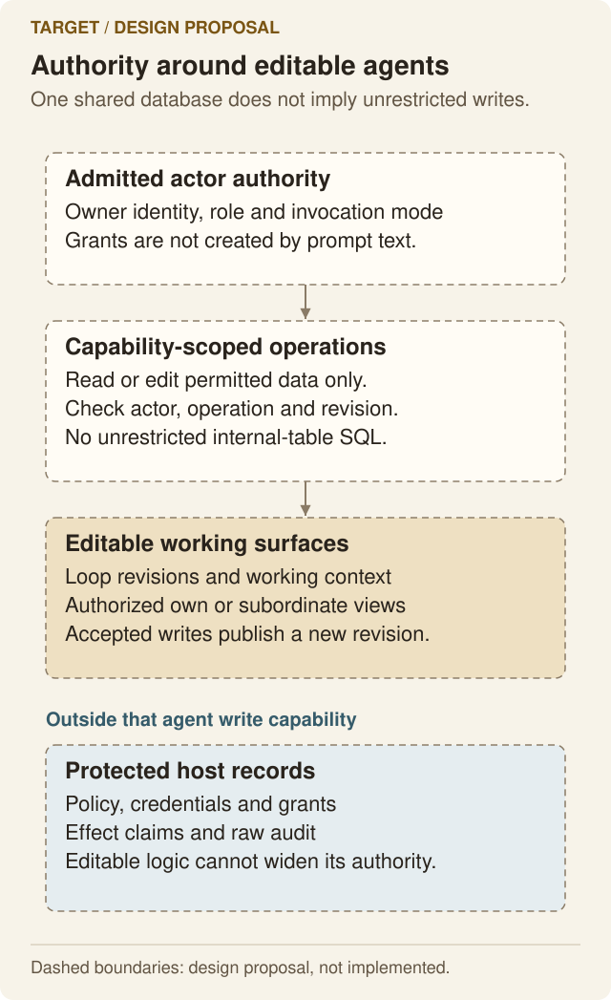

### 14.1 Authentication is not capability

A valid identity, a workspace grant, an actor role and a tool's availability answer different questions. Every operation must pass the relevant checks.

For Cloudflare sign-in, the original granted login should establish Kinu identity and Workers AI authorization together. Stored credential refresh is the normal continuation; interactive reauthentication is a fallback for genuine expiry, revocation or unavailable refresh, not a daily second-login ritual. Other sign-in providers do not automatically grant Cloudflare permissions. This is the explicit requirement in message 7, not a claim that all deployed credential lifetimes have been verified.

The main agent does not become the human owner. A subordinate cannot widen its authority by changing a role string, editing a context file or constructing a different actor path.

| Resource | Actor-facing access rule |
|---|---|
| Shared project files | Credentialed VFS and work-mode rules; mounted machines retain their own grants. |
| Own working context/loop | Managed, revision-checked operations within the selected role/mode. |
| Subordinate working context/loop | Owner or explicit ancestor-management authority; file visibility alone does not authorize replacement. |
| Retained subordinate history | Owner inspection through the supported read path. Dismissed messaging and execution remain separate. |
| Provider and MCP credentials | Opaque use of admitted services; no raw secret extraction through code bindings, context files or database access. |
| Approval/consent records | Host/owner-controlled decisions. The requesting agent cannot approve itself by editing a row or result. |
| Run/effect/spend evidence | Host-written observations. Editable working history cannot alter them retroactively. |
| Administrative resources | Explicit operator authority and required freshness/confirmation. |

Homes are agent-scoped; their actual read/write modes must be stated. A directory described as an agent's home is not automatically confidential if its mode permits sibling reads. Private temporary paths and protected context/control projections need their actual access rules.

### 14.2 Plan and Build

Plan can inspect, reason, create admitted research state and delegate read-only work. Recording observations, progress and required lifecycle state is not the same as permission for the model to modify a project.

Plan must not gain Build effects through native tools, codemode, filesystem shims, raw database operations, MCP, app bindings, queued jobs or child agents. A caller-supplied label is not trusted mode authority.

A later authorized Build turn must regain its own permissions. It must not inherit stale Plan restrictions from another queued or completed operation.

Loop/context activation and release/publication need the authority of their actual operation. Automatic evolution remains subject to the declared policy; it must not be a hidden Plan-write bypass.

### 14.3 Approval and consent

A request for approval is a durable state transition, not successful execution. Repeated delivery must not duplicate the request or spend an authorization twice.

When an operation is denied before dispatch, no external effect may occur. When it ran and failed, its actual effect and exit provenance must remain recorded. A failed process must not refund or reuse a grant merely because its diagnostic text resembles a pre-dispatch refusal.

Revocation must affect subsequent calls and the UI. Uncertain external completion must remain uncertain; retrying an irreversible effect without idempotency or reconciliation is not a safe default.

### 14.4 Isolation limits must be honest

Hosted Worker isolation, local in-process code, a Linux container and an explicitly granted host machine have different boundaries. Giving full native host access is not equivalent to handing out a restricted workspace file adapter.

The acceptance contract requires hostile boundary tests where a guarantee is claimed. Source declarations, role labels and isolated unit tests are not proof of perfect security. DNS resolution, raw networking and platform-specific behavior remain unmeasured until their relevant checks run.

## 15. Durability, interruption and recovery

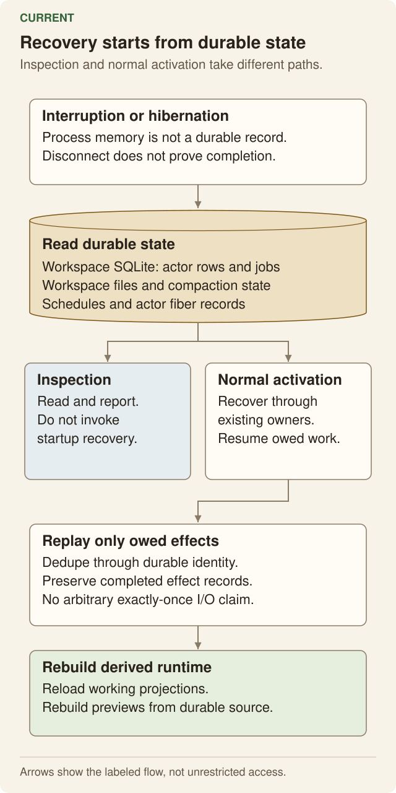

### 15.1 Product state transitions

| Boundary | Required behavior |
|---|---|
| Input admitted, client disconnects | Hosted work and its identity remain durable. A reconnect must not resubmit it as new work. |
| Tool running, foreground threshold crossed | The user receives usable running/job state. Backgrounding is not termination. |
| Process exits | Exit, output and pending delivery settle once. A missing reader must not leave an immortal supervisor waiting for acknowledgement. |
| Actor/worker restarts | Existing admitted work, effects and delivery obligations recover under the same identity. Completed work is not replayed as fresh work. |
| Explicit cancellation | Stop new admissions/effects, propagate to owned children, reconcile already completed work and report the actual result. |
| Approval deferred | The same queue record remains authoritative through restart and decision. No duplicate approval system appears in a slate or adapter. |
| Storage or transport fails | Report failure or indeterminate state. Never convert an I/O error into empty content, absent history or a successful no-op. |
| Export/fork/restore | State the snapshot boundary, copied data, omitted secrets and retained lineage. Partial data must not be presented as a complete workspace. |

An external service may complete an effect before its response is lost. Kinu must preserve that uncertainty and use the service's idempotency/reconciliation mechanism where available. It must not promise universal exactly-once behavior over an arbitrary external API.

### 15.2 Shared-store acceptance

The requested shared SQLite design must make actor ownership explicit in both writes and reads. Pagination, counts, search, compaction, context selection and export must not accidentally read every actor merely because they share a table.

The transition from current facet-local stores must preserve their retained histories and pending state. A root-only export is insufficient evidence when the omitted state still lives in facets.

The cutover must define how current and staged context/loop versions are reconstructed, how actor queues resume, how cancelled/terminal work stays terminal, and how a missing imported actor is reported. It must not emulate synchronous SQLite across RPC or create untracked copies as a compatibility mechanism.

### 15.3 Devbox is a separate storage programme

The workspace's canonical Nimbus storage and an experimental container-storage candidate are not the same acceptance claim.

A candidate must preserve namespace/metadata/data semantics across restore, mutation, publication, interruption, restart and GC. A namespace index that pages lazily does not prove that the mounted filesystem can read file data lazily.

The real native path must distinguish absent bytes from sparse holes; cache fills from user writes; written bytes from resize coverage; observed completion from an unjudged cut; and an immutable origin from a mutable pathname.

Performance measurements must cover metadata decoding, requests/bytes, staging/hashing, touched data and startup/restore work. Uploading a small delta does not prove the entire operation is proportional to the change.

Failed, missing, duplicate or malformed required cells must prevent admission. A one-repetition diagnostic pilot cannot support a statistical winner. Existing refused reports remain unchanged; a corrected interpretation is a separate record.

## 16. Evals, service identities and acceptance evidence

### 16.1 Which identity runs the work

There is an existing isolated **eval-service** account. Its supported resolver reads the eval environment or isolated service-session configuration, not the person's normal Kinu configuration.

The latest bounded check established:

- the dedicated service session is valid for staging build `1372b50f8`;
- the existing protected renewal flow works without personal `kinu auth`;
- a scoped `ai.proxy` access token can be minted and used by a constrained inference client;
- workspace access is denied to that scoped client;
- one short GLM 5.3 inference request succeeded;
- production build `71479ace9` rejects that staging bearer.

The receipt is `service-auth-20260908/proof.json`, SHA-256 `c07f6309f602f75db0d3a9aae40ef060c0978be2152cacf48f45e4b591654295`, retained privately with the eval evidence. Secret values are not product-document content.

Therefore personal sign-in is **not** a general prerequisite for service-account evals or that inference-only comparison path. It also does not follow that a staging service token validates current production behavior. Production acceptance requires legitimately issued authority for that deployment.

Containerized comparison subjects receive only the required scoped credential. Host account/session/dev credentials remain on the trusted host. Service-account separation is not a reason to give a container every service-account permission.

### 16.2 Four different claims

| Claim | Minimum proof |
|---|---|
| Protocol compatibility | The actual adapter, dataset format, execution and verifier interfaces work, with appropriate positive and negative controls. |
| Mechanism works | The intended code path runs and preserves its observable contract, including failure behavior. |
| Product acceptance | A stated user interaction succeeds through the relevant client/backend, retains state correctly and rejects its negative cases. |
| Performance improvement | Matched controlled trials on a sealed workload, retained settings/source/outcomes, sufficient repetitions and justified statistics. |

An oracle pass is not an agent pass. A pilot score is not a broad benchmark result. A successful schema test is not a live operator journey.

### 16.3 Evidence requirements

Every measured attempt must retain its source revision, target, actor/model settings, inputs or input identity, outcomes, relevant artifacts, usage and cleanup disposition.

Opening/setup failure is still an attempted run. Its unavailable channels and unmeasured spend must be recorded without fabricated zeroes. A failed assertion must not erase the attempt or cause its spend to be counted twice.

Tool success rates and failure classes come from recorded invocation outcomes. Explicit legacy diagnostics may be retained as diagnostics; they must not be parsed into invented modern provenance. Missing historical outcomes remain unmeasured.

Recovery checks must verify the requested recovery behavior. Unrelated `false` and `true` commands do not establish that an authored test failed and was rerun successfully.

Data and source prerequisites must be explicit. A deterministic selection-only fixture may test the real sampler without an optional external corpus; its expected sample must still come from the preserved preregistration. It must not invent a population or rewrite historical seals.

### 16.4 Current benchmark boundary

The retained official Kinu Terminal-Bench pilot is **0/1**. Positive/negative controls established the selected protocol path; they did not establish a Kinu optimization win. The local DeepSWE controls are also compatibility evidence, not a general performance result.

The merkle-pack/v3 cloud pilot was refused. Its journal-publication and measurement-completeness defects produced further local fixes, and the actual native demand path remains under development. No replacement storage default or across-the-board winner is admitted.

The availability of the service token removes one prerequisite. It does not itself complete a controlled comparison.

## 17. Cross-surface acceptance journeys

These scenarios join features that can look correct in isolation. They are product acceptance, not a benchmark leaderboard.

### A. Create, work, disconnect and reopen

**Given** a legitimately authenticated owner and an initial mission/prompt, **when** the owner creates a workspace, **then** the agent takes the first turn without a reprompt. After a client disconnect and reopen, the same workspace identity, title, conversation and admitted work remain visible. Reconnection must not duplicate the initial turn. Storage/connection failure remains distinct from an empty workspace.

The shared-SQLite target adds a stronger check: create multiple actors, write colliding logical state keys in their separate scopes, then snapshot/reopen the workspace. Every actor must retain its own values inside the one authoritative store.

### B. Delegate a real recursive question

**Given** a seeded workspace file whose nonce is not in the task text, **when** one agent asks a temporary helper that asks one nested helper, **then** public retained evidence must show the actual calls and lineage. The leaf must read the declared context reference and return the real value.

A nonce in a model answer is insufficient by itself. The owner must be able to inspect the retained children after settlement. The model must not regain messaging authority over dismissed actors.

### C. Edit the actual loop or context

**Given** an active loop/context revision, **when** an authorized agent edits its managed VFS view, **then** a validated new revision becomes effective at the declared boundary and the next relevant execution consumes it.

An invalid edit, a stale parent edit, a sibling edit without authority and an attempted audit/policy rewrite must each fail without changing the active version. Reverting must restore a known usable version without erasing the failed attempt's evidence.

### D. Preserve truthful tool outcomes

**Given** a command blocked before dispatch, an executed command that exits nonzero, and a successful command returning error-shaped data, **when** each crosses native, codemode, UI and retained-report boundaries, **then** their distinct outcomes remain intact.

No marker may be written by the blocked command. The executed failure must preserve observed execution facts. The successful data must not turn into a denial, a refund or recovery steering.

### E. Author and use an interactive slate

**Given** a fresh workspace and an admitted Build task, **when** the agent authors a JS-family client/server slate, **then** the browser must render the actual client and a real interaction must reach the authored server or admitted binding.

Verify a source change, a version/fork/restore, an actual file or state effect, a denied capability and preview-origin isolation. A hand-authored example and a model-authored journey are separately recorded. A page that loads without its interaction working is not complete.

### F. Device work and revocation

**Given** two named devices with different grants, **when** a workspace executes a real file/PTY operation on one and the owner revokes that grant, **then** the correct device handled the original request, the other was untouched, and a subsequent operation is denied.

Reconnect, cancellation and a second workspace must not cause slot flapping, duplicate commands or widened file scope.

### G. Timers, webhooks, email and background signals

The product supports work arriving without an open interactive client. Each ingress needs a durable event identity, authenticated origin where required, target actor, trusted mode and explicit replay policy.

A timer or retried webhook must not create duplicate admitted work. A signal arriving during a turn must reach the appropriate next step or queued turn. Cancelling a trigger must revoke its future use. A forged URL, sender or callback must not gain owner authority.

Email functionality is only live when its routing/domain prerequisites are configured and the sender-authentication path is proven. Code and a documented address do not establish live delivery. External ingress must not be described as implemented across both backends when the local daemon or a platform setup is required.

### H. Change profiles without losing provenance

Model, reasoning effort, role and inference tier are separate controls. Their activation boundary must be visible. Already-issued requests retain their recorded settings; later requests must use the newly effective settings.

A reduction in capability must apply before a newly admitted effect. Cached tool declarations, queued turns or child work must not invent broader authority. Per-node overrides must have explicit precedence and must be visible in actual request records.

### I. Export and restore the whole declared scope

Create root and child conversations, memory, loop versions, files and pending/terminal work. Export under a stated consistency boundary, restore into a new workspace and compare every included category.

If the exporter omits facet storage, credentials or concurrent mutations, it must say so. A future one-store export must include all actor-scoped state it claims to govern while re-establishing protected authority safely.

### J. Recover and compare durable storage

Run the real mounted filesystem with a published head, empty backing state where required, partial reads/writes, rename/hardlink/sparse cases, interruption and replacement. Verify exact data independently of cost.

Every required cost cell must retain its success or failure. Missing metadata channels, failed seeds, unjudged cuts and one-repetition results must block the corresponding claim rather than disappear from the comparison.

## 18. Acceptance catalogue and current implementation comparison

The 39 groups below organize the recorded product criteria. They do not replace the exact asks: the private audit retains all 2,740 ask IDs, their source message/digest, later supersessions, reaffirmations and topic references.

**A group status does not close every historical bug mapped to it.** An individual fix still needs its own acceptance evidence. “Partial” and “source-defined” deliberately distinguish visible mechanisms from complete deployed journeys.

| Criterion group | Required acceptance behavior | Current comparison | Source/evidence entry point |
|---|---|---|---|
| **workspace-authority** | Create main and multiple actors in one physical workspace SQLite; use colliding logical keys and verify isolation; snapshot and restore all actors together. | **Missing target**. Current SDK facets have separate SQLite. Shared files do not meet the new physical-store requirement. | §4, §7; createHostedWorkspace/createCFRuntime; messages 975, 818, 842 |
| **workspace-identity** | Start the first agent turn from the creation mission without reprompting; cold-open the generated title; rename without changing routing identity; reject invalid addresses before resource creation. | **Production proof, scoped**. Title/address cases passed. Initial-turn and complete creation-journey acceptance must be checked separately. | workspace-title and preview-address first-run receipts; messages 58, 186, 267, 972 |
| **actor-core** | Run the same status/cancellation/loop-version contract on main, persistent, temporary and tool-using exploration actors; vary only declared capabilities/lifetime. | **Partial**. One facet class and substantial shared core exist. Promoted-loop execution and state hosting still diverge. | ActorAgent/SubordinateAgent; runChat/runHeadInference/runNodeLoop; messages 97, 300, 387, 935, 975 |
| **delegation-contract** | Ask an existing actor without spawning; ask by role as a real temporary actor; inspect actual nested context-reference reads and retained outcomes. | **Implemented paths; live acceptance incomplete**. Core behavior and owner inspection have local proof. A completed live recursive journey is not claimed. | temporary.ts; retained-facet Worker tier; owner inspection; messages 724, 741, 748, 749, 750 |
| **fork-semantics** | Compare fresh, inherited-prefix and workspace-fork cases; preserve lineage and task on re-entry; prove no unintended file copy or parent-context mutation. | **Source-defined; acceptance partial**. Hire uses a bounded parent digest. Swarm fork/fresh is a context choice. Workspace forks are separate. | subordinates/support.ts; swarm-expansion.ts; identity/fork-driver.ts; messages 282, 387, 724, 975 |
| **context-editability** | Read the actual active context/loop through VFS; edit with expected revision; observe the next request change; reject stale/invalid/unauthorized edits and retain prior evidence. | **Missing/partial target**. Scaffold versions cover part of loop editing. Canonical editable context/history projections and exploration-loop activation are missing. | §6–7; scaffold/surface.ts; conversation-store.ts; messages 41, 141, 491, 975 |
| **context-engineering** | Preserve stable prefixes, update volatile facts at the next step, verify actual submitted requests/counters, and retain recall through compaction and context edits. | **Implemented parts; full target pending**. Preparation, typed-error projection, pruning and recall exist. Editable-context invalidation is not implemented as one contract. | prepare-step.ts; tool-error-feedback.ts; compaction stores; messages 35, 154, 164, 165, 724 |
| **termination** | Let useful work exceed former arbitrary deadlines; cancel owned work/children explicitly; retain results through detach/restart; let an exhausted leaf finish its own work. | **Repairs verified; audit remains**. Specific deadline, cancellation and leaf fixes exist. Remaining recursion/app-hop and boundary claims need explicit disposition. | work-mode/cancellation tests; terminal effects; bound audit; messages 181, 427, 440, 536, 613, 942, 964 |
| **codemode-capabilities** | Exercise native and namespace equivalents, real FS/MCP access, handled refusals and successful error-shaped data; verify a future db binding denies protected state. | **Partial target**. FS/MCP/state and typed outcome paths exist. db/env.db does not. Local and hosted isolation differ. | §9; execute-tools.ts; state-codemode.ts; sandbox-contract.ts; messages 197, 749, 909, 910, 956, 957, 975 |
| **crafted-tools** | Author a real callable tool, validate it, invoke it on the actual backend, rediscover it next step and reject malformed or failing source without poisoning other calls. | **Mechanisms present; model journey incomplete**. Persistence, invocation and fitness mechanisms exist. Curated fixtures do not establish every model-authored workflow. | craft/execution paths; codemode-craft first-run; messages 724, 904, 905, 906, 910 |
| **filesystem** | Cross actor/file/shell views, binary/range reads, private-write denial, mounted paths, stale edits and I/O failures; verify index/content agreement. | **Substantial implementation; scoped proof**. One canonical hosted base tree and gated mounts exist. Target context projections are separate unfinished work. | file-plane layer; VFS and workspace-plane proofs; messages 31, 92, 387, 617, 709, 975 |
| **execution** | Run each advertised capability on its actual machine; detach/reconnect/cancel real processes; expose a port that serves the authored response. | **Implemented environments with explicit limits**. Supported workspace/container/device paths exist. Hosted arbitrary Node execution and absent executors must remain explicit refusals. | execution providers; process/port and first-run suites; messages 32, 231, 232, 259, 292, 942 |
| **devices** | Provide empty-state CLI guidance, notify the agent of connected-but-unconsented devices, then connect real Linux/WSL2/macOS machines and verify selection/grant/execute/revoke/reconnect without widening access. | **Partial deployed acceptance**. Bun/daemon and backend fixes are deployed. Full current multi-platform device and awareness acceptance remains open. | device daemon/CLI suites; device eval and first-run contracts; messages 7, 724, 861, 869, 875, 878, 880, 902 |
| **device-sandbox** | Verify permitted paths/capabilities, deny escapes, then explicitly disable isolation and confirm only the authorized broader access; revoke and observe denial. | **Policy/capability acceptance incomplete**. Do not infer OS sandbox guarantees from file grants or a UI switch. Native Windows remains future scope. | device execution/consent implementation and platform-specific proof; messages 875, 877, 878, 880 |
| **exploration** | Run configured tool-using nodes and declared toolless attempts, measured/judged/ideation cases, fan-in and uneven-depth settlement with actual outcomes. | **Implemented core; full acceptance incomplete**. Core searches and journals exist. No universal exploration quality or performance gain is established. | strategy and heads core; exploration contracts; messages 331, 345, 374, 377, 724 |
| **node-routing** | Assign distinct node tasks/models, inspect actual provider requests, resume the original identity/brief and preserve deeper parent-authored rationale. | **Repairs locally verified**. Specific routing/re-entry/cache-identity defects were repaired. Broad live multi-model coverage is not claimed. | unit-swarm-profile-routing; node-agent and swarm-level; messages 724, 822, 836 |
| **exploration-visibility** | Observe concurrent and retained trees, live text/reasoning/tools, selection/navigation and reconnect without losing status or context. | **Source/UI proof partial**. A static or local frame does not close the entire deployed live-stream journey. | Exploration UI and head/node stream journals; messages 268, 312, 313, 465, 598, 839, 840 |
| **self-evolution** | Propose/evaluate/promote/revert a real change; verify consumed version and outcome provenance; keep invalid candidates inactive across restart. | **Partial; benefit unproved**. Root/subordinate scaffold mechanisms exist. Full exploration-loop editability and measured improvement remain open. | scaffold/evolution stores; active inference paths; messages 140, 141, 220, 489, 490, 491, 626, 975 |
| **memory** | Save/search/edit notes and keyed facts, verify scope/index consistency, and recall a compacted range without replacing the active conversation silently. | **Implemented stores; scoped acceptance**. Notes, facts, retrieval and recall exist. They are not writable canonical context/history projections. | MemoryStore, facts, conversation search and compaction stores; messages 35, 141, 164, 165, 267 |
| **slates** | Use real JS-family client/server source, interactive browser behavior, server/file effects, source commit/fork/restore and real preview HTTP. | **Hosted proof; journeys remain**. Hosted authored examples and 15 operator checks passed. Strict model-authored and outer browser-session journeys remain unverified. | LIVE-UI; production714 first-run receipts; messages 165, 171, 935, 942, 943, 947, 951 |
| **slate-authority** | Deny missing capabilities and literal/redirect escapes; preserve MCP data; isolate Plan and Build; prevent legacy cached authority reuse and parent-origin access. | **Local security fix; rollout pending**. Reviewed egress/cache fixes are in the source candidate, not production714. DNS/raw networking residuals stay unmeasured. | slate-egress Worker proofs; preview-origin evidence; messages 936, 943, 948 |
| **agent-core-study** | Identify real adopted implementations and unadopted contracts; distinguish SDK facets from agent-core facets; answer the Node/Vite question accurately. | **Investigation/notice completed, bounded**. The notice is deliberately uncommitted as requested. Broader composition remains a what-if, not automatic authorization to rewrite Kinu. | AGENT-CORE-ALIGNMENT; messages942/944/945/948; messages 944, 945, 948 |
| **web-chat** | Keep web user bubbles right-aligned and TUI user bubbles left-aligned; exercise send/steer/stop, long drafts/attachments, intentional scroll, streaming and code copy/colors in responsive themes. | **Specific fixes deployed; broader journey partial**. The latest title/timestamp/syntax fixes are deployed. Their proof does not close all historical chat/UI asks. | chat-and-files UX; workspace-title first-run; messages 1, 7, 181, 193, 267, 724, 972 |
| **web-workspace** | Switch workspaces/agents, open files/environments, act on Work decisions, hide irrelevant tabs and recover failed reads after reconnect. | **Specific fixes deployed; broader journey partial**. Implemented surfaces and individual regressions exist; full end-to-end UI acceptance remains distinct. | WorkspacePage, Work/Files/Environment and reconnect tests; messages 193, 208, 210, 268, 724, 943, 972 |
| **tui** | Use a real PTY for LF/CR Enter, editing/paste, palette/navigation, streaming, tool details, error rendering and narrow/non-ASCII layouts. | **Specific fixes verified; full platform coverage open**. Known Enter, rendering and device issues have fixes. A complete current platform matrix is not claimed. | CLI/TUI behavior, display and daemon tests; messages 1, 7, 181, 609, 610, 949, 972 |
| **landing** | Preserve authored copy/layout, verify actual responsive mocks and only adopt new effects after visual acceptance. | **Rollback verified; new design paused**. The rejected polish was rolled back. The vGPU/richer-mock direction was paused, not cancelled. | Production rollback/browser proof; messages956/969; messages 581, 956, 969 |
| **security** | Reject cross-owner/scope/role/cursor abuse, retain consent/revocation, protect secrets/audit from editable state, and test actual claimed sandbox boundaries. | **Layered mechanisms; specific proof only**. Substantial controls exist. Raw database and broader context-editing authority still need implementation; no perfect-security claim. | CLI/actor/RPC/capability tests; §14; messages 24, 162, 171, 292, 724, 861 |
| **admin** | Keep public access separate from operator control, paginate real records, redact before screenshot capture and require authority for destructive actions. | **Implemented surface; scoped verification**. Control/feedback paths exist. Their local tests are not a blanket deployed authorization audit. | ControlPlane, feedback and access-token route tests; messages 818, 842 |
| **storage** | Restore exact native namespace/metadata/data, preserve sparse/link/open-handle semantics and verify publication, interruption, restart and GC. | **Experimental, not admitted**. The real v3 pilot was refused. Native demand work is in progress; normal restore remains eager until full acceptance. | Immutable pilot20260907120000 and separate local native receipts; messages 274, 292, 633, 634, 702, 712, 860 |
| **storage-comparison** | Compare equal successful durable work; measure metadata/payload/CPU/staging costs, retain failed cells and satisfy all repetitions/admission rules. | **Unadmitted**. No replacement default or across-the-board winner is established. Correcting G6 does not retroactively admit the old pilot. | Storage admission/decision tests; G0–G9 reports; messages 658, 665, 702, 719, 842, 891, 935, 960 |
| **evals** | Exercise actual adapters/oracles, retain setup and failed attempts, identify models/settings/source, and keep missing outcomes/usage unmeasured. | **Reliability repairs verified; runs still needed**. Major evidence defects were repaired. Protocol controls and one pilot are not a full benchmark campaign. | eval-run, public-session, bench adapters and retained records; messages 303, 448, 835, 965 |
| **optimization** | Preregister a controlled alternative and compare matched settings/targets/tasks with retained results and appropriate uncertainty. | **No validated improvement**. Service inference access is now available. A controlled optimization win has not been demonstrated. | Service-auth receipt; sealed benchmark/comparison requirements; messages 965, 975 |
| **quality** | Prove gates fail in their claimed directions, keep measured/governed sets equal, reuse established packages and remove obsolete code without suppressions. | **Active controls; ongoing acceptance**. Strict gates exist and have exposed real defects. Their green result is bounded by the set they measure. | check, layergate, wiring/corpus and targeted negative fixtures; messages 422, 764, 782, 798, 807, 822, 835, 845, 956, 957, 964 |
| **release** | Publish through normal gates/assets/health checks, preserve WIP and dependency patches, remove only completed merged work and verify cleanup. | **Verified release; ongoing work separate**. Production714 is verified; main/primary14ed adds guidance only. Further inspected fixes remain separate until deployed. | Deployment receipts; primary safety ref and archive index; messages 752, 769, 798, 803, 804, 942, 951, 962, 966 |
| **operations** | Give every source ask a disposition, respect later corrections, use focused owners, report precise blockers and never equate todo counts with product completion. | **Traceability established; completion ongoing**. All2,740 asks are mapped with no attribution gaps. Implementation closure remains evidence-specific. | Private product-requirements audit and canonical ledger; messages 743, 798, 930, 942, 955, 956, 961, 964, 966, 970, 971, 975 |
| **product-documentation** | Keep one readable contract, meaningful diagrams, source/target separation and a traceable acceptance comparison; update affected criteria when the product changes. | **This deliverable; review required**. The specification and diagrams are the documentation deliverable, not a declaration that the requested architecture is already built. | This file, SVGs and the full private source/ask audit; messages 374, 375, 519, 975 |
| **actor-profiles** | Provide five tiers inheriting default unless overridden; preserve explicit overrides; expose admitted templates to the main agent; apply role/model changes and per-node precedence to actual requests. | **Implemented source; precedence acceptance ongoing**. Catalogue declares the five-tier inheritance model. Full activation/re-entry behavior still needs its stated checks. | profiles/catalog.ts; model services/routing tests; messages 610, 614, 822 |
| **providers** | Default new/no-override users to Workers AI GLM 5.3; preserve overrides; discover/connect/select providers; forward actual reasoning/affinity settings and isolate failures. | **Specific fixes verified; configured-provider coverage varies**. Source declares the GLM default and request-setting fixes. Account configuration and full new-user behavior still require real-surface proof. | providers/workers-ai.ts; model-resolver/request tests; messages 57, 59, 62, 75, 162, 171, 851, 965 |
| **calibrated-ensemble** | Use a human reference, blind ensemble comparison/confusion and calibrated recurring audit; keep uncalibrated rates labelled and uncertainty visible. | **Required method; calibration result unverified**. Recorded approval resolves the method. This audit does not establish that the required reference/validation campaign completed. | Recovered messages110/111 and outcome label/ensemble records; messages 110, 111, 113 |

### 18.1 The five largest direct mismatches in the latest request

| Latest requested target | Current implementation | Required change |
|---|---|---|
| All workspace agents share one SQLite | Root and SDK facets have separate stores. | Root-owned logical actors and explicit actor/session scoping across stores, readers, queues and runtime objects. |
| Explicit SQLite `db` code capability | FS/MCP and actor JSON state exist; no `db`/`env.db`. | Define and implement an enforceable admitted SQL/data scope, without exposing protected internal authority. |
| Editable actual context/history through VFS | SQL conversation, readonly history inspection and recall files; no supported write-through working-context projection. | Revision-checked managed VFS views, ancestry/tool-pairing rules, safe activation and index/cache invalidation. |
| Editable/evolving actual loop for every full agent kind | Root/subordinate promoted scaffold path exists; head/node inference does not use that transform. | One common full-agent loop/version contract, with appropriate narrow role/lifetime wrappers. |
| Simple wrappers around one core | Substantial reuse exists, but hosting and mutable lifecycle state still diverge. | Separate workspace hosting from per-agent runtime state and keep genuine backend seams explicit. |

### 18.2 Source interpretation corrections

The comparison preserves these later decisions:

- Message 942 asks for an agent-core notice **left uncommitted**. The checked notice is `packages/agent-core/OWNER-NOTICE-VIEWS.md` in the separate agent-core checkout; leaving it untracked is the requested outcome, not a missing publication task.
- Message 944 asks how Node/Vite hosting and a broader agent-core composition would work. It is not, by itself, authorization to implement a new Node host or replace the entire product.
- Messages 748–750 define recursive existing/temporary `agents.ask` and persistent `agents.hire`; the requirement is not unspecified and must not be replaced by a standalone `rlm.query`.
- Message 822 rejects doc-claim gates. This specification is not permission to add one.
- Message 969 reverses the rejected landing polish **for now**. It does not cancel the underlying future design request.
- Message 975 explicitly requests the shared-SQLite and editable actual context/loop target. The current separate-facet design must not be relabelled to claim compliance.
- The recovered calibration assent approves measured ensemble governance after a human reference, not AI-generated labels presented as human truth.

### 18.3 Audit coverage and limits

The final source audit has 2,740 unique ask rows with zero missing/extra rows and zero unresolved predecessor-attribution gaps. It retains 73 superseded rows with later-source references, 85 duplicate/context rows, 539 operating instructions, 3 explicitly answered rows and 2,040 product-topic rows.

Imported handoff/system material remains identified. Repeated “continue” or completion instructions do not create fictitious new features. Previous DONE labels remain historical metadata rather than automatic proof at the current source revision.

The current-source map checks the cited runtime paths and distinguishes SQL, KV, VFS and in-memory state. It does not establish that every optional SDK table is populated or every platform configuration has been exercised. The diagrams show these same current/target distinctions.

## 19. Completion sequence and approval boundaries

1. **Keep the contract and audit complete.** Maintain the source-to-criterion map, record later corrections and keep each known gap visible. Do not reduce the list by renaming unfinished work.
2. **Finish the already implemented release fixes.** Deploy owner inspection and slate egress/cache enforcement through the normal release path, then run the relevant owner-client and product journeys. Use the correct deployment identity.
3. **Implement the shared-store target as a real cutover.** Scope every actor-owned record and runtime object. Preserve/export existing state before removing facet-local canonical storage. Do not imitate synchronous SQL over asynchronous RPC or introduce a permanent dual-owner mode.
4. **Implement managed loop/context VFS operations.** Choose the precise paths and revision schemas using existing addressing conventions; prove actual activation, stale-write refusal, authority and rollback across full agent kinds.
5. **Complete native storage semantics before normal lazy restore.** Finish demand, mutation, capture, crash, restart and GC ownership. Keep cost failures and missing channels visible. Review any G5 criterion correction against actual units before a new admitted comparison.
6. **Run controlled evaluation and calibration.** Use isolated service authority and preregistered inputs/settings. Distinguish a system comparison from a single-variable optimization. Report rejected ideas and negative results as well as improvements.
7. **Close remaining surface and operating criteria.** Finish the real browser/terminal/device journeys, source-grounded documentation/history work and authorized cleanup. Preserve the paused design boundary and existing user work.

A production data reset, cross-owner sharing design, unrestricted database capability or change to an acceptance criterion is a material decision. It requires explicit evidence and authority before implementation or rollout. A general instruction to finish the project must not be used to hide data loss or weaken a gate.

## 20. Maintaining this specification

This is the canonical product/acceptance document. Detailed subsystem documents remain useful implementation references, but a stale description there must not override the requested contract here.

When a feature changes:

- update the relevant criterion and interaction, not an unrelated prose checklist;
- state whether the change is a new target, an implemented behavior or a newly exercised result;
- update the relevant diagram when ownership or flow changes;
- preserve source IDs and supersession history;
- name the source revision, actual check and limitations for a completion claim;
- keep private transcripts and credential material out of public documentation.

This is maintained through source-grounded review. No prose-shape or doc-claim CI gate is introduced by this document.

### References

- [WORKSPACES.md](WORKSPACES.md): current workspace/agent model and file planes.
- [ARCHITECTURE.md](ARCHITECTURE.md): implementation organization.
- [TOOLS.md](TOOLS.md): tool, delegation and owner-inspection surfaces.
- [EXECUTION-LAYER-SPEC.md](EXECUTION-LAYER-SPEC.md): execution environments and result contracts.
- [CONTEXT-BUDGET.md](CONTEXT-BUDGET.md): context preparation and measurement.
- [EXPLORATION.md](EXPLORATION.md), [MCTS.md](MCTS.md): configured exploration and journals.
- [EVOLUTION.md](EVOLUTION.md), [CRAFT-ARCHITECTURE.md](CRAFT-ARCHITECTURE.md): learning, trials and tool versions.
- [LIVE-UI.md](LIVE-UI.md), [AGENT-CORE-ALIGNMENT.md](AGENT-CORE-ALIGNMENT.md): authored slates and actual adoption boundaries.
- [USER-GUIDE.md](USER-GUIDE.md), [CLI.md](CLI.md), [CONFIG.md](CONFIG.md): user entry points and configuration.
- [OBSERVABILITY.md](OBSERVABILITY.md): outcome and diagnostic evidence.
- [EMAIL-INGRESS.md](EMAIL-INGRESS.md): email prerequisites and ingress authority.
- [BENCH.md](BENCH.md), [TESTING.md](TESTING.md): evaluation runners, evidence and test boundaries.
- [DEPLOYMENT.md](DEPLOYMENT.md), [BRANCH-ARCHIVE.md](BRANCH-ARCHIVE.md): release and preservation procedures.

