# Data model

A hosted workspace has one durable authority: the OrchestratorAgent Durable
Object. Nimbus, held as a library over its `ctx.storage.sql`, owns the
workspace files and execution state. The `OrchestratorAgent` Durable Object
SQLite owns relational actor state. Each subsystem owns its tables and creates
them idempotently. No shadow VFS or sync path runs between the two.

Two other Durable Object classes hold isolated databases of their own.
`SubordinateAgent` gets the full workspace schema plus the one-row seeds its
modes read: `subordinate_identity` for a hire, `facet_identity` (owner,
capability token, parent workspace) and `facet_activation` (the head or node
work spec) for an exploration worker. `SubordinateAgent.onStart` creates
`traces` and `facet_model_operation_outbox` on every activation. Every mode's
rows live in that facet's own database, which is what isolates one MCTS branch
or head from its siblings. `UserDO` holds the per-user `user_*` and
`device_*` tables and the owner `experience_library`. Those tables belong to the
user, not to any workspace.

Four things live outside actor SQLite entirely. Browser auth lives in the `AUTH_KV`
KV namespace. Sandbox `/workspace` backups live in the `BACKUP_BUCKET` R2 bucket.
The authoritative Nimbus workspace lives in DO storage. Optional embedding recall
lives in the `MEMORY_VECTORS` Vectorize index. Vectorize extends FTS5. It never
serves as the source of truth.

`AUTH_KV` holds only expiring records: browser sessions, one-time OAuth
handoff state, CLI browser-approval state, each carrying its own TTL. None of
it serves as a source of truth. A user identity lives in their `UserDO`, keyed on a
userId derived from the verified email. An emptied namespace costs everyone
a fresh sign-in and nothing more. The handoff record keeps the hash of a
binding cookie the initiating browser holds. A callback URL is worth nothing
away from the browser that started that sign-in.

A session cookie KV record is a projection. What the cookie stands for and
whether it is still live are both one row in the signing-in user own
`UserDO`. That row is written once at sign-in and read on every cookie check. KV needs up
to a minute to reach every colo in either direction, so it can answer neither
question. A copied cookie replayed at a lagging colo would outlive logout by
that window. The first request after a sign-in redirect would read as
signed out at a colo the write had not reached. It would then enter a
sign-in that loses the same race. The row answers both, from every colo.
Logout deletes it first. The KV delete that follows is cleanup. A failed
cleanup never reports a revocation that landed as one that did not.

A store that will not answer gives a 503. That answer never admits the request.
It never sends the 401 that would tell a signed-in user to sign in again. A sign-out
that cannot reach the store keeps the cookie and offers a retry. The cookie is
the only handle that can still revoke that session. Clearing it would leave
the session live with nothing able to reach it. A session whose row is gone or
lapsed is simply not signed in. A record KV does not hold is not a sign-out
on its own. The row still says what the cookie stands for. Every path that
ends a session deletes that row first. An absent record can never revive a
revoked one. A record that no longer decodes is both a fault and a dead
credential. I report it once, clear it from the row and from KV, and still
answer as not signed in. The browser can then sign in again instead of sitting
trapped behind a cookie it cannot replace.

## Entity relationship

The relational workspace tables, as created by the Core schema initializers
and agent-utils stores; workspace files live in the Nimbus filesystem below.

```mermaid
erDiagram
    workspace_identity {
        TEXT id "Stable UUID (NOT NULL)"
        TEXT name "Workspace name (NOT NULL)"
        TEXT owner_user_id "Ownership root (NOT NULL, default '')"
        TEXT mission "One-line summary, written by writeSoul"
        INTEGER created_at "Epoch ms"
    }
    agent_config {
        TEXT key PK "Config key (model, reasoning effort, skills)"
        TEXT value "Config value (NOT NULL)"
    }
    memory_chunks {
        TEXT id PK "Chunk ID"
        TEXT path "Source file path"
        INTEGER start_line "Start line in source"
        INTEGER end_line "End line in source"
        TEXT hash "SHA-256 of chunk content"
        TEXT text "Chunk text content"
        INTEGER updated_at "Epoch ms"
    }
    memory_chunks_fts {
        TEXT text "FTS5 virtual table (BM25)"
    }
    crafted_tools {
        TEXT name PK "Tool name (snake_case)"
        TEXT description "What the tool does"
        TEXT params "JSON Schema for input"
        TEXT code "Async arrow function body"
        TEXT scope "local or shared"
        INTEGER created_at "Epoch ms"
        INTEGER updated_at "Epoch ms"
    }
    crafted_tools_fts {
        TEXT name "FTS5 virtual table"
        TEXT description "FTS5 virtual table"
    }
    search_nodes {
        TEXT id PK "Node ID (nanoid)"
        TEXT parent_id FK "Parent node"
        TEXT root_id "The search run this node belongs to"
        TEXT task "MCTS task"
        TEXT action "Approach taken"
        TEXT observation "Result"
        TEXT code_used "Runnable source from exploration"
        TEXT code_language "Executor language for code_used"
        INTEGER depth "Tree depth"
        INTEGER visits "Backprop count (default 0)"
        REAL value "Running mean score (default 0)"
        TEXT status "open/terminal/pruned/failed"
        TEXT msg_id "Session message ID"
        TEXT branch_agent_key "Facet agent key"
        INTEGER created_at "Epoch ms"
    }
    evolution_events {
        TEXT id PK "Event ID"
        TEXT type "Event type"
        TEXT message "Description"
        TEXT data "JSON payload"
        INTEGER created_at "Epoch ms"
    }
    scaffold_versions {
        INTEGER version PK "Version number"
        INTEGER written_at "Epoch ms"
        TEXT rationale "Why it was changed"
        REAL canary_score "Canary evaluation score"
        REAL baseline_score "Baseline comparison score"
        TEXT status "current/pending/rolled_back/historical"
        INTEGER parent_version "DGM lineage, the version this branched from"
        TEXT pathology "The failure cell this version was written to fix"
    }
    craft_scores {
        TEXT tool_name PK "Crafted tool name"
        REAL score "EMA score (default 0.5)"
        INTEGER uses "Usage count (default 0)"
        INTEGER last_used_at "Epoch ms"
        INTEGER created_at "Epoch ms"
    }
    scaffold_regression_fixtures {
        TEXT id PK "Random hex ID"
        TEXT task "Regression test task"
        TEXT expected_keywords "Expected output keywords"
        INTEGER created_at "Epoch ms"
    }
    task_history {
        TEXT id PK "Random hex ID"
        TEXT task "Task description"
        INTEGER scaffold_version "Version used (default 0)"
        TEXT outcome "success/error/timeout"
        REAL score "Task score"
        INTEGER created_at "Epoch ms"
    }
    fibers {
        TEXT id PK "Fiber ID"
        TEXT name "Fiber name (NOT NULL)"
        TEXT snapshot "JSON checkpoint"
        INTEGER created_at "Epoch ms"
    }
    messages {
        TEXT id PK "Message ID from the SDK, so the UI can point at it"
        TEXT session_id "Session ('default' chat, 'mcts' search)"
        TEXT parent_id "Parent message. These edges ARE the session tree"
        TEXT role "user/assistant/system"
        TEXT content "Plain text (flattened for FTS and the outcome joins)"
        INTEGER created_at "Epoch ms"
    }
    messages_fts {
        TEXT content "FTS5 virtual table over messages.content"
    }
    executor_output {
        TEXT id PK "Random hex ID"
        TEXT executor "Executor name"
        TEXT command "Command run"
        TEXT stdout "Standard output"
        TEXT stderr "Standard error"
        INTEGER exit_code "Exit code"
        INTEGER created_at "Epoch ms"
    }
    activity_log {
        TEXT id PK "Random hex ID"
        TEXT event "Event type"
        TEXT detail "Event details"
        INTEGER elapsed_ms "Duration (default 0)"
        INTEGER created_at "Epoch ms"
    }
    fork_lineage {
        INTEGER id PK "Single row, or empty when this is not a fork"
        TEXT source_workspace_id "The forked-from workspace's UUID"
        TEXT source_workspace_name "The forked-from workspace's name"
        TEXT source_message_id "Where the copy stopped"
        INTEGER source_message_created_at "Epoch ms"
        INTEGER forked_at "Epoch ms"
    }
    fork_transfer {
        INTEGER id PK "Single row, or empty when no fork is arriving"
        INTEGER head_declared "1 once a begin frame declared the fork"
        TEXT head_cut_message_id "Where the copy stops"
        TEXT mission "Read from the inherited SOUL.md bytes"
        TEXT transfer_id "The transfer these columns belong to"
        INTEGER expected_seq "The frame the receiver will accept next"
        TEXT stream "Rolling digest over the frames that arrived"
        TEXT file_path "The file whose ranges are still arriving"
        INTEGER file_bytes "How many of that file's bytes the staging holds"
        INTEGER published "1 once the commit published the fork"
    }
    fork_staged_files {
        TEXT path PK "A file this unpublished transfer already published"
    }

    memory_chunks ||--|| memory_chunks_fts : "FTS5 external content"
    crafted_tools ||--|| crafted_tools_fts : "FTS5 sync triggers"
    messages ||--|| messages_fts : "FTS5 sync triggers"
    crafted_tools ||--o| craft_scores : "tool_name"
    search_nodes ||--o{ search_nodes : "parent_id"
    scaffold_versions ||--o{ task_history : "scaffold_version"
```

## Agent identity (SOUL.md)

The identity document is `SOUL.md` in the workspace filesystem, on both
backends. `readSoul`, `writeSoul`, and `seedSoul` (`core/src/identity/soul.ts`) are
the accessors. The system prompt, the evolution engine, and the `setSoul` RPC go through
them. `writeSoul` also maintains `workspace_identity.mission`. A
read-only listing reads the mission from that row. The owner may edit SOUL.md.
The agent never rewrites its own identity.

## The workspace filesystem

Both backends run the Nimbus workspace filesystem over their own SQLite. The
class is `SqliteVFS`, from `@nimbus-sh/core`. Nothing in this repository
implements a filesystem.

On hosted, the workspace lives in the actor OWN Durable Object storage. It is reached
through the remote session adapter in `core/src/execution/nimbus.ts`. The
orchestrator DO creates none of the filesystem tables. On local, `createWorkspace`
(`core/src/vfs/nimbus-workspace.ts`, imported as `createWorkspaceFilesystem`)
builds the same component over `bun:sqlite` in the session own database
(`cli-backend/src/runtime.ts:493`).

Nimbus owns those bytes and their tables.
`core/src/conformance/manifest.ts` declares the exact set. That set is what
`NimbusWorkspace.destroy()` drops. An addition means the dependency changed
its storage contract. The set is
`inodes`, `file_chunks`, `content_lifecycle`, `vfs_schema_migrations`,
`vfs_append_receipts`, `vfs_append_writer_state`, `vfs_append_module_state`,
`vfs_append_pid_revocations`, `vfs_append_acked_gaps`, plus Kinu's own
`kinu_workspace_generation`. All ten are declared present on the CLI root and
absent on both hosted roots.

Three properties follow:

- Content addressing: `inodes(path, content_id)` points at
  `file_chunks(content_id, chunk_id, data)`, with a `content_lifecycle` GC
  table. A snapshot of the plane copies the small inode index and no blobs.
- Real POSIX semantics: one filesystem, addressed identically by
  `vfs.readFile('/etc/passwd')` and by `run "cat /etc/passwd"`. Relative paths
  resolve at `WORKSPACE_ROOT` (`/home/user`). Ownership is uid/gid/mode on real
  inodes. That is how a swarm node `/home/<node>` and its private `/tmp` form
  a boundary rather than a convention (`core/src/vfs/agent-home.ts`).
- Chunked blobs: `SqliteVFS` splits file content into `file_chunks` rows of
  `CHUNK_SIZE` bytes, 65,536 as `@nimbus-sh/platform` declares it. Merge-back
  costs a write batch against the same constant. This repository imports it
  rather than restating the number (`core/src/strategy/merge-back.ts:55`).

`packages/agent-utils` supplies the `VFS` interface both planes satisfy
(`agent-utils/src/vfs/types.ts`) and nothing else on this axis: no filesystem
implementation, no shell emulator. The shell is the Nimbus `runtime-bash`.
Memory indexing reads through the active VFS on either backend. Relational
`memory_chunks` never becomes a second file authority because indexing reads through the active VFS.

One table named `vfs_files` still appears in the tree, in
`packages/cli/tests/export-import.test.ts`. The test creates it there as a blob
fixture for the archive reader. No product path creates or reads it.

## MemoryStore (FTS5 search)

`@kinu.run/agent-utils` provides FTS5 full-text search over markdown files in
the workspace filesystem. It keeps a `memory_chunks` table with a `memory_chunks_fts`
virtual table (external content via `content='memory_chunks'`) and one DDL
(`initMemoryChunkTables`, which `MemoryStore.ensureSchema()` delegates to).
Files split into chunks with a line-aware sliding window
(`DEFAULT_CHUNK_TARGET_CHARS` 1600, `DEFAULT_CHUNK_OVERLAP_CHARS` 320). Each
chunk carries a SHA-256 hash so the next pass skips unchanged chunks. Search
is FTS5 MATCH with BM25 ranking. `sanitizeFtsQuery` removes operators and stop
words. It falls back to OR-joined tokens when the AND query returns nothing.

## Think message persistence

Chat history belongs to the SDK. `Think` extends the agents SDK `Agent` and
holds a `Session` from `agents/experimental/memory/session`, whose
`AgentSessionProvider.ensureTable` (`agents/dist/experimental/memory/session/index.js:747-790`,
agents 0.20.1) creates, on the first session read — which is Think's own boot
(`@cloudflare/think/dist/think.js:1003-1028`, 0.15.1), before the actor's
`onStart`:

- `assistant_messages`: the durable message tree (`id`, `session_id`,
  `parent_id`, `role`, `content`, `created_at`)
- `assistant_compactions`: the SDK's own compaction records
- `assistant_config`: session-scoped settings
- `assistant_fts`: the provider's FTS5 index over message content

Kinu does not write these, and it does not read them through the SDK. On a
hosted workspace `assistant_messages` is the pane store — the ONE authority for
the default chat — and every conversational reader answers from it in raw SQL
when it exists and from plain `messages` when it does not
(`packages/core/src/identity/conversation-store.ts` `hasPaneStore`). Plain
`messages` is the local backend's only store, never a projection of the pane
(the header of that module records why the projection was retired). The
census in `packages/core/src/conformance/manifest.ts` declares the four
tables on both cf roots, and `ActorAgent.assertSessionStore`
(`packages/cf-backend/src/actor-agent.ts`) refuses an activation whose Think
booted without leaving `assistant_messages` behind.

### Session replatform migration plan (2026-09-10)

`@cloudflare/think`'s unreleased changeset `brisk-chats-branch`
(`.changeset/brisk-chats-branch.md` on `cloudflare/agents` `main`) replatforms
Think onto `agents/sessions`: on first wake each Durable Object lifts its
`assistant_messages`, `assistant_compactions` and `assistant_config` rows into
`cf_agents_session_*` tables, verifies every row landed, and DROPS the
originals; the migration cannot be rolled back. Installed today:
`@cloudflare/think` 0.15.1, `agents` 0.20.1 (`packages/cf-backend/package.json`).
Neither is bumped by this plan; the bump is a separate, coordinated change and
it must not ship before the readers below have moved, because the wake guard
will refuse every hosted activation the moment they have not.

Nothing below is convertible to the 0.15.1 `Session` read model with identical
results, which is why every reader is still raw SQL. That read model
(`agents/dist/experimental/memory/session/index.d.ts:197-225`) is
`Promise`-returning where every Kinu reader is synchronous over a
`SqlExecutor`; it is `session_id`-scoped and knows no actor, where every Kinu
reader is `actor_id`-scoped; `getHistory(leafId)` returns the root-to-leaf path
only, parsed to `SessionMessage` (`id`, `role`, `parts`, optional `createdAt`
from the JSON — no `parent_id`, no row `created_at`, no `rowid`), with
compaction overlays applied (`index.js:798-806`) and unparsable rows dropped.

What each reader must become, and what is unknown until the release names the
new tables and their columns (the changeset names neither):

| Reader | Today | Will read | Unknown until release |
|---|---|---|---|
| `identity/conversation-store.ts` — `hasPaneStore`, `forkPointExists`, `ancestryIds` (pane arm), `paneRowById`, `conversationCount`, `conversationPageRows`, `answersForDrainTurns`, `conversationTurnPair`, `normalizeImportedConversation` | `assistant_messages` by `actor_id`, `id`, `parent_id`, `rowid`, whole-second `created_at` | the `cf_agents_session_*` message table; the ancestry walk and the rowid page cursor must survive the "message larger than one SQLite row is split across continuation rows" model, so a logical message is reassembled from its continuation rows before `content` is flattened | table and column names; whether continuation rows share the parent's id; whether `created_at` stays a whole-second `DATETIME`; whether a `rowid` order still equals insertion order per logical message |
| `memory/conversation-search.ts` — `scroll`, `listConversations`, `refreshIndex`, and the `conversation_rev_pane_*` revision triggers (`AFTER INSERT/UPDATE/DELETE ON assistant_messages`) | same table, grouped by `session_id`; Kinu's own `conversation_fts` is rebuilt from it | the same message table; the three triggers are Kinu DDL ON the vendor table and go away with the `DROP`, so the revision counter must be re-pointed or the index rebuilt on a regime change | whether media leaving the row into the "content-addressed attachment store" changes what `content` holds for a text part |
| `identity/fork.ts` — the pane WRITE (`ensurePaneTable`, the three `INSERT OR IGNORE INTO assistant_messages`) and `carriedText` | writes rows in Kinu's own DDL: `actor_id TEXT NOT NULL`, `PRIMARY KEY (actor_id, id)` | rows the SDK's new provider reads back as a conversation — a write that must produce continuation rows and attachment references the provider understands, which raw DDL cannot do before the release documents it | the entire write shape; whether the SDK exposes a bulk import that keeps message ids and parent edges (the fork cut depends on both) |
| `identity/archive.ts` — `projectPaneIntoPlain` (export normalization) | reads `assistant_messages` by `rowid`, detects an owner column from the table's own DDL | the message table, with continuation rows reassembled | same as the store row |
| `evolution/eval-split.ts` — `advisorNegatives` join | joins `assistant_messages` twice on `id` / `parent_id` | the message table, on the same two columns | column names |
| `cf-backend/src/actor-agent.ts` — `readInheritedContext` | last `INHERITED_CONTEXT_CAP` rows by `created_at DESC`, and a `COUNT(*)`, both by `actor_id` | the message table; on the agent itself `this.session.getHistory()` is reachable, but it answers the path, not the actor's rows, and asynchronously — the port contracts that call this reader (`inheritedContext: () => …`, `orchestrator.ts`) are synchronous | whether the release keeps a synchronous in-memory view (`this.messages`) that can stand in for the window |
| `subordinates/inspection.ts` — the `history` view's existence check | `tableExists(sql, 'assistant_messages')` | the new table name | the name |
| `utils/ui-message.ts`, `orchestrator/heads-support.ts` | comments naming the table | the same, renamed | nothing |

One fact the migration cannot carry: Kinu's pane queries predicate on
`actor_id`, a column the vendor DDL does not declare
(`agents/dist/experimental/memory/session/index.js:750-757` against
`packages/core/src/identity/fork.ts:685-694`, which is the only DDL in this
repository that declares it). The SDK's lift copies the columns the SDK wrote,
so the `cf_agents_session_*` message table will not carry an actor either.
Whether hosted actors keep sharing one session table by owner column, or each
hosted actor gets its own SDK session (`Session.forSession(sessionId)` exists
at 0.20.1, `index.d.ts:104`), is the design decision the readers wait on, and
it must be made before any of the rows above is rewritten.

Two ways the pane branch can move. Land neither until the release publishes
the `cf_agents_session_*` DDL and the `this.session.history()` signature.

**A. The pane branch reads the new tables in raw SQL.** Every pane arm in the
table above is re-pointed at the released message table; the fork's pane
write is re-shaped to whatever rows the new provider reads back. Cost: the
58 references (`git grep -n -E 'assistant_(messages|compactions|config)' --
packages/*/src`), all synchronous, no signature moves; plus the continuation
row reassembly in every reader that returns `content`, plus a fork write that
fabricates continuation rows and attachment references the SDK documents for
nobody — the changeset's own words are "Think no longer reads Sessions tables
with raw SQL. If you queried `assistant_messages` yourself, use
`this.session.history()` or `getHistory()`". It leaves the `actor_id`
question exactly where it is: the new table will not carry the column, so
either every hosted actor's rows collapse into one session or a Kinu-only
column is added to a vendor table the vendor rewrites on its own schedule.
This is the coupling that put the census on watch in the first place, re-made
against a shape declared private.

**B. `AgentRuntime` gains a session read port.** One interface in
`packages/core/src/types/agent-runtime.ts` that answers what the readers
actually ask — the ancestry of a leaf as ids, a message by id, the count, a
newest-first page with a cursor, the user→assistant pairs, a full dump in
insertion order — and one write, `append(message, parentId)`, for the fork.
The cf backend implements it over Think (`getHistory(leafId)`, `getMessage`,
`appendMessage(message, parentId)` all keep their positional arguments per the
changeset; one `Session.forSession(actorId)` per hosted actor answers the
scoping the vendor column never did); the CLI implements it over plain
`messages`, which is the fall-through arm of every reader today, moved behind
the port unchanged. Cost: the port is asynchronous, so it propagates through
the call chains that reach a reader — `read-models/status.ts:159`
(`conversationPageRows`), `evolution/engine.ts:850`, `eval-split.ts:95` and
`mcts/takes.ts:424` (`conversationTurnPair`), `identity/fork-transfer.ts:380`
(`ancestryIds`, the bounded frame stream), `orchestrator.ts:1158`
(`answersForDrainTurns`), `memory/conversation-search.ts` (`scroll`,
`listConversations`, `refreshIndex`), `identity/archive.ts`
(`projectPaneIntoPlain`), `subordinates/inspection.ts:101` and
`actor-agent.ts` `readInheritedContext` with its synchronous
`inheritedContext: () => …` port contracts — about a dozen signatures, each
mechanical. What the port cannot answer identically is the rowid page cursor
and the whole-second tie-break (`conversation-store.ts:383-389`): the SDK
exposes neither, so the page is cut on the path the SDK returns, which is
also the order the pane renders. The three `conversation_rev_pane_*`
triggers go with the raw table; the index rebuilds on the port's revision
instead.

**Recommendation: B.** A's cost is smaller today and it is the same debt
again, on a table the vendor has now said it will not keep stable; B's cost is
a bounded set of signature moves that lands the fork write on the SDK's own
append (no fabricated continuation rows) and turns `actor_id` into
`forSession(actorId)`, which the SDK supports. B is also the only option whose
CLI half is provably unchanged: it is today's plain arm behind an interface.

Sequence when the release lands: read the released `agents/sessions` DDL and
`this.session.history()` signature; decide the actor scoping under B; move
`hasPaneStore` and the readers in the order of the table, with the existing
suites (`unit-conversation-store`, `unit-conversation-search`, `unit-fork`,
`integration-fork-pipeline`, `unit-session-store-guard`) as the equivalence
proof over seeded rows; replace the four `assistant_*` census rows with the
released table names; then bump `@cloudflare/think` and `agents` together,
behind a canary, because a rolled-back object has an empty conversation.

## The rest of the schema

The ER diagram above covers the shared actor substrate. Every subsystem added
since owns its own DDL. All of it is `IF NOT EXISTS`. All of it runs from the same
`initWorkspaceSchema()` pass:

| Subsystem | Tables | Owner |
|---|---|---|
| Events hub | `agent_log`, `reply_channels`, `triggers` (+ views `events_v`, `run_event_v`, `turn_phase_log_v`) | `core/src/events/hub/schema.ts` |
| Run-event log | `run_events` | `core/src/events/recorder.ts` |
| Turn outcomes | `turn_outcomes`, `lessons`, `outcome_labels`, `outcome_ensemble_labels` | `core/src/evolution/outcomes.ts` |
| Replay eval | `replay_evals` | `core/src/evolution/replay.ts` |
| GEPA | `gepa_runs`, `gepa_candidates`, `gepa_pareto_membership` | `core/src/evolution/gepa/persistence.ts` |
| Branching heads | `head_runs`, `head_journal`, `head_evidence`, `head_steps`, `head_merge_results` | `core/src/heads/schema.ts` |
| MCTS | `mcts_search_runs` (durable checkpoints), `alternate_takes` | `core/src/mcts/search-store.ts`, `takes.ts` |
| Swarm leaderboard | `exploration_records` (cumulative across runs) | `core/src/strategy/records.ts` |
| Swarm node content | `swarm_node_records` (what a swarm re-entry reads) | `core/src/strategy/swarm-resume.ts` |
| Scaffold shadow mode | `scaffold_evaluations`, `scaffold_trial_queue` | `core/src/scaffold/shadow.ts` |
| Facts | `agent_facts` | `core/src/memory/facts.ts` |
| Conversation search | `messages_fts` (FTS5 + sync triggers) | `core/src/memory/conversation-search.ts` |
| Background jobs | `background_jobs` | `core/src/jobs/store.ts` |
| Task list | `agent_tasks` (one plan per actor) | `core/src/tasks/store.ts` |
| Deferred approvals | `deferred_approvals` | `core/src/safety/deferred-approval.ts` |
| Plan review | `plan_reviews` | `core/src/plans/review.ts` |
| Curriculum | `proposed_tasks` | `core/src/curriculum/proposer.ts` |
| Release lane | `release_sources`, `release_changes`, `release_checks`, `release_approvals`, `release_deployments` | `core/src/release/sql-store.ts` (CLI session; on cf the board lives in the owner's UserDO) |
| Imported experience | `imported_experience` (staged until a turn outcome settles it) | `core/src/experience/imports.ts` |
| Compaction | `compaction_state`, `compaction_archive` | `core/src/state/workspace-schema.ts` (the DDL lives in core because `@kinu.run/compaction` sits above it in the dependency graph) |
| Typed config | `agent_config` | `core/src/config/store.ts` |
| Prompt sections | `prompt_section_versions`, `prompt_section_evaluations` | `core/src/prompting/section-store.ts` |

Five more groups are created outside that pass, by the root that owns each:

| Subsystem | Tables | Owner |
|---|---|---|
| Subordinates | `workspace_subordinates` (every actor that can hire), `subordinate_identity` (child DO) | `core/src/subordinates/support.ts` |
| Workspace-diff baseline | `vfs_baseline` | `core/src/read-models/workspace-diff.ts`, called by each root's schema pass |
| Orchestrator-local | `turn_feedback`, `turn_craft_usage` | `cf-backend/src/orchestrator.ts`, inline |
| Email + webhooks | no boot DDL; the outbound mail rows are the shared outbox's `outbox_email` | `cf-backend/src/email/outbox.ts` |
| Ingress gates | `webhook_rate_windows`, `webhook_secrets` (both backends) | `core/src/events/ingress/rate-limit.ts`, `secrets.ts` |

Three tables are created lazily: `session_window` and `turn_review_queue` by
the evolution engine constructor, `mission_budget` by the mission governor
first write.

Two durable retry outboxes are lazy too. `@nimbus-sh/fabric` creates them on the
first queue or drain: `outbox_peer` for the peer transport and `outbox_email`
for outbound mail. Their schema belongs to the library.
`core/src/events/outbox.ts` supplies the SQL handle and the alarm.

`core/src/conformance/manifest.ts` declares every one of these per root
(`cf-orchestrator`, `cf-subordinate`, `cli`), wired or deliberately absent with
a stated reason. The conformance suite compares the declaration against the
real `sqlite_master`. Read the manifest first. This page narrates over it.

## Schema initialization

`initWorkspaceSchema()` (`core/src/state/workspace-schema.ts`) is the one
answer to which tables a workspace has. Every composition root calls it: the
orchestrator DO `ensureSchema()`, the subordinate DO, `openWorkspaceCLI`,
the local session constructor, and `kinu create`. One list, because parallel
lists disagree and each disagreement is a real bug: a `craft_scores` created
only by `kinu create` makes every EMA read on a workspace opened any other way
silently no-op.

The pass runs in this order:

1. `initAllTables` (`core/src/identity/schema.ts`): `workspace_identity`, then
   `initActorTables` (the actor substrate plus `initSearchTables` and
   `initScaffoldTables`), then `fork_lineage`, `fork_transfer` and
   `fork_staged_files`.
2. Each subsystem's own `init*` from the tables above.

Then each root adds what only it carries. The orchestrator DO also runs
`initWorkspaceBaselineTable`, `initWebhookRateLimitTables`,
`subordinateRoster.ensureSchema()` and its two inline turn tables. The whole
call is gated by an in-memory flag so it runs once per activation. No
persistent schema version is tracked because a cold activation always re-runs.

Each table has exactly one owning module. A second definition of
`search_nodes` is how `code_language` went missing on a live workspace. A
second `scaffold_versions` is how `status` and `parent_version` did.

A table's `CREATE TABLE IF NOT EXISTS` is its genesis. No module carries a
column reconcile, a `CHECK`-widening rebuild or a row backfill: this tree
deploys as a reset (docs/DEPLOYMENT.md, the migrations paragraph), so every
row it ever writes is under the DDL in the tree. `scripts/schema-drift.ts`
holds that DDL to `scripts/schema-genesis.lock.json` in both directions. A
shipped table whose shape must change has two fixes: a table of its own for
the new columns, or another reset with a re-lock.
