# Data Model

> Maintained by Claude (AI-edited documentation, presented as-is); verify against the code when precision matters.

A hosted workspace has two explicit durable authorities. `NIMBUS_SESSION` owns
the workspace files and execution state. The `OrchestratorAgent` Durable
Object's SQLite owns relational actor state. The schema is split across several
subsystems, each owning its tables and creating them idempotently. There is no
shadow VFS or synchronization path between those authorities.

Three other Durable Object classes hold their own isolated databases:
`SubordinateAgent` (the full actor schema plus a one-row `subordinate_identity`),
`ExplorationAgent` (`facet_owner`, `facet_parent`, `traces` — the isolation MCTS
branches depend on), and `UserDO` (the per-user `user_*` / `device_*` tables and
the owner's `experience_library`, which are the user's, not any workspace's).
Four things live outside actor SQLite entirely: browser auth in the `AUTH_DB` D1 database
(`packages/cf-backend/migrations/auth/`), sandbox `/workspace` backups in the
`BACKUP_BUCKET` R2 bucket, the authoritative Nimbus workspace, and optional embedding recall in the
`MEMORY_VECTORS` Vectorize index — which is an addition to FTS5, never the
source of truth.

## Entity Relationship

The relational workspace tables, as created by the Core schema initializers and
agent-utils stores:

```mermaid
erDiagram
    workspace_identity {
        TEXT id "Stable UUID (NOT NULL)"
        TEXT name "Agent name (NOT NULL)"
        INTEGER created_at "Epoch ms"
    }
    agent_config {
        TEXT key PK "Config key (model, display_name, etc.)"
        TEXT value "Config value"
    }
    vfs_files {
        TEXT path "File path"
        INTEGER chunk_index "Chunk number (0-based)"
        TEXT parent_path "Parent directory"
        BLOB data "File content (up to 1.8MB per chunk)"
        INTEGER is_dir "1 for directories"
        INTEGER size "Total file size"
        INTEGER mtime "Last modified (epoch ms)"
    }
    memory_chunks {
        TEXT id PK "Chunk ID"
        TEXT path "Source file path"
        INTEGER start_line "Start line in source"
        INTEGER end_line "End line in source"
        TEXT hash "SHA-256 of chunk content"
        TEXT text "Chunk text content"
        INTEGER updated_at "Epoch ms"
    }
    memory_chunks_fts {
        TEXT text "FTS5 virtual table (BM25)"
    }
    crafted_tools {
        TEXT name PK "Tool name (snake_case)"
        TEXT description "What the tool does"
        TEXT params "JSON Schema for input"
        TEXT code "Async arrow function body"
        TEXT scope "local or shared"
        INTEGER created_at "Epoch ms"
        INTEGER updated_at "Epoch ms"
    }
    crafted_tools_fts {
        TEXT name "FTS5 virtual table"
        TEXT description "FTS5 virtual table"
    }
    search_nodes {
        TEXT id PK "Node ID (nanoid)"
        TEXT parent_id FK "Parent node"
        TEXT task "MCTS task"
        TEXT action "Approach taken"
        TEXT observation "Result"
        TEXT code_used "Runnable source from exploration"
        TEXT code_language "Executor language for code_used"
        INTEGER depth "Tree depth"
        INTEGER visits "Backprop count (default 0)"
        REAL value "Running mean score (default 0)"
        TEXT status "open/terminal/pruned/failed"
        TEXT msg_id "Session message ID"
        TEXT branch_agent_key "Facet agent key"
        INTEGER created_at "Epoch ms"
    }
    evolution_events {
        TEXT id PK "Event ID"
        TEXT type "Event type"
        TEXT message "Description"
        TEXT data "JSON payload"
        INTEGER created_at "Epoch ms"
    }
    scaffold_versions {
        INTEGER version PK "Version number"
        INTEGER written_at "Epoch ms"
        TEXT rationale "Why it was changed"
        REAL canary_score "Canary evaluation score"
        REAL baseline_score "Baseline comparison score"
    }
    craft_scores {
        TEXT tool_name PK "Crafted tool name"
        REAL score "EMA score (default 0.5)"
        INTEGER uses "Usage count (default 0)"
        INTEGER last_used_at "Epoch ms"
        INTEGER created_at "Epoch ms"
    }
    scaffold_regression_fixtures {
        TEXT id PK "Random hex ID"
        TEXT task "Regression test task"
        TEXT expected_keywords "Expected output keywords"
        INTEGER created_at "Epoch ms"
    }
    task_history {
        TEXT id PK "Random hex ID"
        TEXT task "Task description"
        INTEGER scaffold_version "Version used (default 0)"
        TEXT outcome "success/error/timeout"
        REAL score "Task score"
        INTEGER created_at "Epoch ms"
    }
    fibers {
        TEXT id PK "Fiber ID"
        TEXT name "Fiber name (NOT NULL)"
        TEXT snapshot "JSON checkpoint"
        INTEGER created_at "Epoch ms"
    }
    messages {
        TEXT id PK "Message ID — the SDK's id, so it is what the UI can point at"
        TEXT session_id "Session ('default' chat, 'mcts' search)"
        TEXT parent_id "Parent message — these edges ARE the session tree"
        TEXT role "user/assistant/system"
        TEXT content "Plain text (flattened for FTS and the outcome joins)"
        INTEGER created_at "Epoch ms"
    }
    executor_output {
        TEXT id PK "Random hex ID"
        TEXT executor "Executor name"
        TEXT command "Command run"
        TEXT stdout "Standard output"
        TEXT stderr "Standard error"
        INTEGER exit_code "Exit code"
        INTEGER created_at "Epoch ms"
    }
    activity_log {
        TEXT id PK "Random hex ID"
        TEXT event "Event type"
        TEXT detail "Event details"
        INTEGER elapsed_ms "Duration (default 0)"
        INTEGER created_at "Epoch ms"
    }

    vfs_files ||--o{ memory_chunks : "CLI only: indexed by"
    memory_chunks ||--|| memory_chunks_fts : "FTS5 sync"
    crafted_tools ||--|| crafted_tools_fts : "FTS5 sync"
    search_nodes ||--o{ search_nodes : "parent_id"
```

## Agent Identity (SOUL.md)

The agent's identity document lives at `SOUL.md` in the workspace VFS. On the
hosted backend that file is in the authoritative Nimbus session; on the CLI it
uses the local VFS adapter. `readSoul`/`writeSoul`/`seedSoul`
(`core/src/identity/soul.ts`) are the accessors; the system prompt, evolution
engine, and `setSoul` RPC all go through them. The owner may edit SOUL.md; the
agent does not rewrite its own identity.

## Workspace files and the local SqliteFS adapter

The hosted backend uses `NIMBUS_SESSION`; `vfs_files` is not created for a fresh
cloud workspace. The CLI backend uses the `@proteus/agent-utils` POSIX-like
filesystem backed by `vfs_files`. Memory indexing reads through the active VFS
adapter on either backend, so the relational `memory_chunks` index does not
become a second file authority.

**Chunked storage:** Files larger than 1.8MB are split across multiple rows with `chunk_index`. Reads concatenate all chunks. Writes split and store atomically.

**Auto-created parent directories:** Writing to `a/b/c/file.txt` automatically creates directory entries for `a`, `a/b`, `a/b/c`.

**Path normalization:** Resolves `.` and `..`, prevents directory traversal attacks.

**Key operations:**
- `readFile(path)` — concatenate all chunks for the path
- `writeFile(path, data)` — delete old chunks, split data into 1.8MB chunks, insert
- `stat(path)` — return size, mtime, isDir
- `mkdir(path, {recursive: true})` — create intermediate directories
- `rename(old, new)` — rename via copy-delete pattern (DELETE old + INSERT new)

## MemoryStore (FTS5 Search)

From `@proteus/agent-utils`. Provides full-text search over markdown files stored in the VFS.

**Schema:** `memory_chunks` table with `memory_chunks_fts` FTS5 virtual table (content-sync via `content='memory_chunks'`).

**Indexing:** Files are chunked using a line-aware sliding window (target 1600 chars, 320 char overlap). Each chunk gets a SHA-256 hash for deduplication — unchanged chunks are not re-indexed.

**Search:** FTS5 MATCH with BM25 ranking. Query sanitization removes FTS5 operators and stop words. Falls back to OR-joined tokens if AND query returns no results.

## Think Message Persistence

Think (via the Session class) manages its own message tables:
- `cf_agents_chat_messages` — all chat messages (user + assistant)
- `cf_agents_sessions` — session metadata
- `cf_agents_contexts` — LLM-writable memory context blocks

These are managed by Think internally — Proteus reads via `this.messages` but never writes directly.

## The rest of the schema

The ER diagram above covers the original core; the subsystems added since each
own their own DDL, all `IF NOT EXISTS` and all run from the same `ensureSchema()`
pass:

| Subsystem | Tables | Owner |
|---|---|---|
| Events hub | `agent_log`, `reply_channels`, `triggers`, `peer_outbox` (+ views `events_v`, `run_event_v`, `turn_phase_log_v`) | `core/src/events/hub/schema.ts` |
| Run-event log | `run_events` | `core/src/events/recorder.ts` |
| Turn outcomes | `turn_outcomes`, `lessons` | `core/src/evolution/outcomes.ts` |
| Replay eval | `replay_evals` | `core/src/evolution/replay.ts` |
| GEPA | `gepa_runs`, `gepa_candidates`, `gepa_pareto_membership` | `core/src/evolution/gepa/persistence.ts` |
| Branching heads | `head_runs`, `head_journal`, `head_evidence`, `head_steps`, `head_merge_results` | `core/src/heads/schema.ts` |
| MCTS | `mcts_search_runs` (durable checkpoints), `alternate_takes` | `core/src/mcts/search-store.ts`, `takes.ts` |
| Scaffold shadow mode | `scaffold_evaluations` | `core/src/scaffold/shadow.ts` |
| Facts | `agent_facts` | `core/src/memory/facts.ts` |
| Session search | `messages_fts` (FTS5 + sync triggers) | `core/src/memory/session-search.ts` |
| Background jobs | `background_jobs` | `core/src/jobs/store.ts` |
| Curriculum | `proposed_tasks` | `core/src/curriculum/proposer.ts` |
| Release lane | `release_sources`, `release_changes`, `release_checks`, `release_approvals`, `release_deployments` | `core/src/release/sql-store.ts` |
| Agent views | `agent_views` (one row per published version; the specs themselves live in the VFS at `views/<slug>.json[.vN]`) | `core/src/views/store.ts` |
| Imported experience | `imported_experience` (staged until a turn outcome settles it) | `core/src/experience/imports.ts` |
| Compaction | `compaction_state` | `compaction/src/stores.ts` |
| Subordinates | `workspace_subordinates` (parent), `subordinate_identity` (child DO) | `cf-backend/src/subordinate-support.ts` |
| Orchestrator-local | `agent_config`, `vfs_baseline`, `turn_feedback`, `turn_craft_usage` | `cf-backend/src/orchestrator.ts` |
| Email + webhooks | `email_outbox` | `cf-backend/src/email/outbox.ts` |
| Ingress gates | `webhook_rate_windows`, `webhook_secrets` (both backends) | `core/src/events/ingress/rate-limit.ts`, `secrets.ts` |

## Schema Initialization

`ensureSchema()` (`cf-backend/src/orchestrator.ts`) runs once per DO wake, before
`onStart()` and again at the head of any RPC that can arrive first:

1. Migration checks — old `vfs_files` without `chunk_index` and old
   `memory_chunks` without `start_line` are dropped and recreated; `search_nodes`
   gains `code_used` by ALTER.
2. `initAllTables` — `workspace_identity`, `search_nodes`, `scaffold_versions`,
   `scaffold_regression_fixtures`, `task_history`, `craft_scores`, `fibers`,
   `vfs_files` (via the canonical agent-utils `VFS_SCHEMA_DDL`), `messages`,
   `evolution_events`, `crafted_tools`, `executor_output`, `activity_log`,
   `fork_lineage`.
3. Each subsystem's own `init*` from the table above.
4. `subordinateRoster.ensureSchema()` and the orchestrator-local inline tables.
5. `memoryStore.ensureSchema()` and `craftStore.ensureSchema()` create their
   FTS5 virtual tables — `crafted_tools_fts` with auto-sync triggers,
   `memory_chunks_fts` synced in code by `indexFile`.

Two consequences worth knowing. Several tables have deliberately duplicated DDL
in `identity/schema.ts` and in their owning module; where the two differ
(`scaffold_versions` gains `status` and `parent_version`), the owning module's
`init*` reconciles by ALTER. And DO SQLite cannot ALTER a `CHECK` constraint and
forbids explicit transactions, so widening one — as `turn_outcomes` and the
events-hub tables have both needed — is an in-place table rebuild.
