# Data model

A hosted workspace has one durable authority: its `OrchestratorAgent` Durable
Object. Nimbus runs as a library over that object's `ctx.storage.sql` and owns
the workspace files and execution state. The same SQLite database holds the
relational actor state. Each subsystem owns its tables and creates them
idempotently. No shadow VFS or sync path runs between files and actor state.

Only `OrchestratorAgent` holds actors. Every subordinate, head, swarm node, and
MCTS branch is a logical actor, one `workspace_actors` row inside the
workspace's own SQLite (`packages/cf-backend/src/subordinate-hosting.ts`,
`packages/cf-backend/src/exploration-hosting.ts`). None is a second object or a
second database. The other Durable Object classes in `wrangler.jsonc` keep
databases of their own. The one with user data is `UserDO`: it holds the
per-user `user_*` and `device_*` tables and the owner's `experience_library`.
Those tables belong to the user, not to any workspace.

Three stores sit outside actor SQLite:

- Browser auth: the `AUTH_KV` KV namespace.
- Sandbox `/workspace` backups: the `BACKUP_BUCKET` R2 bucket.
- Optional embedding recall: the `MEMORY_VECTORS` Vectorize index. It extends
  FTS5 and is never the source of truth.

`AUTH_KV` holds only expiring records, each with its own TTL: browser
sessions, one-time OAuth handoff state, and CLI browser-approval state. None of
it is a source of truth. A user's identity lives in their `UserDO`, keyed on a
userId derived from the verified email. If the namespace is emptied, every user
signs in again and nothing else is lost. The handoff record keeps the hash of a
binding cookie that the initiating browser holds, so a callback URL is useless
away from the browser that started that sign-in.

A session cookie's KV record is a projection. What the cookie stands for, and
whether it is still live, is one `user_browser_sessions` row in the user's own
`UserDO`. Sign-in writes that row once, and every cookie check reads it. KV can
take up to a minute to reach every colo in either direction, so it can answer
neither question. A copied cookie replayed at a lagging colo would outlive
logout by that window. The first request after a sign-in redirect would read as
signed out at a colo the write had not reached, and would start a sign-in that
loses the same race. The row answers both questions from every colo. Logout
deletes the row first. The KV delete that follows is cleanup, and a failed
cleanup never reports a completed revocation as failed.

When the store does not answer, the request gets a 503
(`packages/cf-backend/src/auth/session.ts`). It is never admitted, and it never
gets the 401 that would send a signed-in user to sign in again. A sign-out that
cannot reach the store keeps the cookie and offers a retry, because the cookie
is the only handle that can still revoke that session. A session whose row is
gone or lapsed is not signed in. A missing KV record alone is not a sign-out:
the row still says what the cookie stands for, and every path that ends a
session deletes the row first, so a missing record cannot revive a revoked
session. A record that no longer decodes is both a fault and a dead credential.
The Worker reports it once, clears it from the row and from KV, and answers as
not signed in (`discardCorruptSession` in `packages/cf-backend/src/auth/store.ts`).
The browser can then sign in again instead of staying behind a cookie it cannot
replace.

## Entity relationship

The core relational workspace tables, as the core schema initializers and the
agent-utils stores create them. Workspace files live in the Nimbus filesystem
described below. Most actor-scoped tables also carry `actor_id` as the first
primary-key column.

```mermaid
erDiagram
    workspace_identity {
        TEXT id "Stable UUID (NOT NULL)"
        TEXT name "Workspace name (NOT NULL)"
        TEXT owner_user_id "Ownership root (NOT NULL, default '')"
        TEXT mission "One-line summary, written by writeSoul"
        INTEGER created_at "Epoch ms"
    }
    workspace_actors {
        TEXT actor_id PK "Actor ID"
        TEXT parent_actor_id FK "Parent actor"
        TEXT name "Actor name"
        TEXT kind "main/subordinate/head/node/branch"
        TEXT lifetime "durable/task"
        INTEGER created_at "Epoch ms"
    }
    actor_config {
        TEXT actor_id PK "Actor"
        TEXT key PK "Config key (model, reasoning effort, skills)"
        TEXT value "Config value (NOT NULL)"
    }
    memory_chunks {
        TEXT id PK "Chunk ID"
        TEXT path "Source file path"
        INTEGER start_line "Start line in source"
        INTEGER end_line "End line in source"
        TEXT hash "SHA-256 of chunk content"
        TEXT text "Chunk text content"
        INTEGER updated_at "Epoch ms"
    }
    memory_chunks_fts {
        TEXT text "FTS5 virtual table (BM25)"
    }
    crafted_tools {
        TEXT name PK "Tool name (snake_case)"
        TEXT description "What the tool does"
        TEXT params "JSON Schema for input"
        TEXT code "Async arrow function body"
        TEXT scope "local or shared"
        REAL score "EMA score (default 0.5)"
        INTEGER uses "Usage count (default 0)"
        INTEGER last_used_at "Epoch ms"
        INTEGER created_at "Epoch ms"
        INTEGER updated_at "Epoch ms"
    }
    crafted_tools_fts {
        TEXT name "FTS5 virtual table"
        TEXT description "FTS5 virtual table"
    }
    search_nodes {
        TEXT actor_id PK "Actor that owns the search"
        TEXT id PK "Node ID (nanoid)"
        TEXT parent_id FK "Parent node"
        TEXT root_id "The search run this node belongs to"
        TEXT task "MCTS task"
        TEXT action "Approach taken"
        TEXT observation "Result"
        TEXT code_used "Runnable source from exploration"
        TEXT code_language "Executor language for code_used"
        INTEGER depth "Tree depth"
        INTEGER visits "Backprop count (default 0)"
        REAL value "Running mean score (default 0)"
        TEXT status "open/terminal/pruned/failed"
        TEXT msg_id "Session message ID"
        TEXT branch_agent_key "Branch actor key"
        TEXT evaluation_json "Evaluation of the node"
        INTEGER created_at "Epoch ms"
    }
    evolution_events {
        TEXT id PK "Event ID"
        TEXT type "Event type"
        TEXT message "Description"
        TEXT data "JSON payload"
        INTEGER created_at "Epoch ms"
    }
    scaffold_versions {
        INTEGER version PK "Version number"
        INTEGER written_at "Epoch ms"
        TEXT rationale "Why it was changed"
        REAL canary_score "Canary evaluation score"
        REAL baseline_score "Baseline comparison score"
        TEXT status "current/pending/rolled_back/historical"
        INTEGER parent_version "DGM lineage, the version this branched from"
        TEXT pathology "The failure cell this version was written to fix"
    }
    scaffold_regression_fixtures {
        TEXT id PK "Random hex ID"
        TEXT task "Regression test task"
        TEXT expected_keywords "Expected output keywords"
        INTEGER created_at "Epoch ms"
    }
    task_history {
        TEXT id PK "Random hex ID"
        TEXT task "Task description"
        INTEGER scaffold_version "Version used (default 0)"
        TEXT outcome "success/error/timeout"
        REAL score "Task score"
        INTEGER created_at "Epoch ms"
    }
    fibers {
        TEXT id PK "Fiber ID"
        TEXT name "Fiber name (NOT NULL)"
        TEXT snapshot "JSON checkpoint"
        INTEGER created_at "Epoch ms"
    }
    session_messages {
        TEXT actor_id PK "Actor whose message this is"
        TEXT message_id PK "Message ID"
        TEXT role "user/assistant/system/tool"
        TEXT native_content_kind "string/parts"
        TEXT origin "input/output/edit/context_transform/render"
        TEXT envelope_json "Message fields other than role and content"
        INTEGER sealed_at "Epoch ms once the content is committed"
        TEXT content_json "The parts array, inline"
        TEXT content_path "The parts array in the file plane when large"
        INTEGER recorded_at "Epoch ms"
    }
    stream_parts {
        TEXT actor_id PK "Actor"
        TEXT message_id PK "Open message"
        INTEGER part_no PK "Part"
        INTEGER segment PK "Continuation row of a long part"
        TEXT descriptor_json "The part without its text"
        TEXT text "Accumulated text, extended in place"
        INTEGER ended "1 once the part's stream ended"
    }
    conversation_entries {
        TEXT actor_id PK "Actor whose conversation this is"
        TEXT session_id PK "Session ('default' chat, 'mcts' search)"
        TEXT id PK "Entry ID"
        TEXT parent_id "Parent entry. These edges are the session tree"
        TEXT role "user/assistant/system/tool"
        TEXT turn_id "Turn that wrote the entry"
        TEXT run_id "Run that wrote the entry"
        TEXT context_id "Working context the entry recorded"
        INTEGER context_revision "Revision of that context"
        INTEGER recorded_at "Epoch ms"
    }
    conversation_entry_parts {
        TEXT entry_id PK "Entry"
        INTEGER position PK "Order within the entry"
        TEXT message_id "Message whose part it shows"
        INTEGER part_no "Part of that message"
    }
    conversation_heads {
        TEXT actor_id PK "Actor"
        TEXT session_id PK "Session"
        TEXT entry_id "The entry the next turn chains from"
    }
    conversation_fts {
        TEXT content "Derived FTS5 transcript index"
        TEXT msg_id "Message ID"
        TEXT session_id "Session ID"
        TEXT role "Message role"
        INTEGER created_at "Epoch ms"
    }
    executor_output {
        TEXT id PK "Random hex ID"
        TEXT executor "Executor name"
        TEXT command "Command run"
        TEXT stdout "Standard output"
        TEXT stderr "Standard error"
        INTEGER exit_code "Exit code"
        INTEGER created_at "Epoch ms"
    }
    activity_log {
        TEXT id PK "Random hex ID"
        TEXT event "Event type"
        TEXT detail "Event details"
        INTEGER elapsed_ms "Duration (default 0)"
        INTEGER created_at "Epoch ms"
    }
    fork_lineage {
        INTEGER id PK "Single row, or empty when this is not a fork"
        TEXT source_workspace_id "The forked-from workspace's UUID"
        TEXT source_workspace_name "The forked-from workspace's name"
        TEXT source_message_id "Where the copy stopped"
        INTEGER source_message_created_at "Epoch ms"
        INTEGER forked_at "Epoch ms"
    }
    fork_transfer {
        INTEGER id PK "Single row, or empty when no fork is arriving"
        INTEGER head_declared "1 once a begin frame declared the fork"
        TEXT head_cut_message_id "Where the copy stops"
        TEXT mission "Read from the inherited SOUL.md bytes"
        TEXT transfer_id "The transfer these columns belong to"
        INTEGER expected_seq "The frame the receiver will accept next"
        TEXT stream "Rolling digest over the frames that arrived"
        TEXT file_path "The file whose ranges are still arriving"
        INTEGER file_bytes "How many of that file's bytes the staging holds"
        INTEGER published "1 once the commit published the fork"
    }
    fork_staged_files {
        TEXT path PK "A file, directory or symlink this unpublished transfer already placed"
    }

    workspace_actors ||--o{ workspace_actors : "parent_actor_id"
    memory_chunks ||--|| memory_chunks_fts : "FTS5 external content"
    crafted_tools ||--|| crafted_tools_fts : "FTS5 sync triggers"
    session_messages ||--o{ stream_parts : "an open message's accumulating parts"
    conversation_entries ||--o{ conversation_entry_parts : "parts the entry shows"
    session_messages ||--o{ conversation_entry_parts : "message_id, part_no"
    conversation_entries ||--o| conversation_heads : "one head per session"
    conversation_entries ||--o{ conversation_fts : "local transcript index"
    search_nodes ||--o{ search_nodes : "parent_id"
    scaffold_versions ||--o{ task_history : "scaffold_version"
```

## Agent identity (SOUL.md)

The identity document is `SOUL.md` in the workspace filesystem, on both
backends. `readSoul`, `writeSoul`, and `seedSoul` (`core/src/identity/soul.ts`)
are the accessors. The system prompt, the evolution engine, and the `setSoul`
RPC go through them. `writeSoul` also maintains `workspace_identity.mission`,
and a read-only listing reads the mission from that row. The owner may edit
SOUL.md. The agent never rewrites its own identity.

## The workspace filesystem

Both backends run the Nimbus workspace filesystem over their own SQLite. The
class is `SqliteVFS`, from `@nimbus-sh/core`. Nothing in this repository
implements a filesystem. Both backends build it with the same `createWorkspace`
(`core/src/vfs/nimbus-workspace.ts`, exported as `@kinu.run/core/workspace`).
On hosted, `cf-backend/src/workspace-host.ts` calls it over the orchestrator's
`ctx.storage.sql`, and `core/src/execution/nimbus.ts` maps the resulting
workspace box to Kinu's executor contract. On local, `cli-backend/src/runtime.ts`
imports it as `createWorkspaceFilesystem` and calls it over `bun:sqlite` in the
session's own database.

Nimbus owns those bytes and their tables. `core/src/conformance/manifest.ts`
declares the exact set, which is what `NimbusWorkspace.destroy()` drops. An
addition means the dependency changed its storage contract. At
`@nimbus-sh/core` 0.12.0 the set is `inodes`, `file_chunks`,
`content_lifecycle`, `vfs_schema_migrations`, `vfs_append_receipts_v2`,
`vfs_append_writer_state_v2`, `vfs_append_module_state_v2`,
`vfs_append_pid_revocations_v2`, `vfs_append_acked_gaps_v2`,
`nimbus_filesystem_identity`, `nimbus_filesystem_devices`, and
`vfs_ino_allocator`. Kinu adds its own `kinu_workspace_generation`. The
manifest declares all of them present on every root (`cf-orchestrator`,
`cf-subordinate`, `cli`).

Three properties follow:

- Content addressing: `inodes(path, content_id)` points at
  `file_chunks(content_id, chunk_id, data)`, with a `content_lifecycle` GC
  table. A snapshot of the plane copies the small inode index and no blobs.
- POSIX semantics: one filesystem, addressed the same way by
  `vfs.readFile('/etc/passwd')` and by `run "cat /etc/passwd"`. Relative paths
  resolve at `WORKSPACE_ROOT` (`/home/main`; `/home/user` links to it). Ownership is uid/gid/mode on
  inodes. That makes a swarm node's `/home/<node>` and its private `/tmp` an
  enforced boundary, not a convention (`core/src/vfs/agent-home.ts`).
- Chunked blobs: `SqliteVFS` splits file content into `file_chunks` rows of
  `CHUNK_SIZE` bytes, 65,536 as `@nimbus-sh/platform` declares it. Merge-back
  sizes its write batches with the same constant, imported rather than
  restated (`core/src/strategy/merge-back.ts:60`).

`packages/agent-utils` supplies the `VFS` interface both planes satisfy
(`agent-utils/src/vfs/types.ts`) and nothing else on this axis: no filesystem
implementation and no shell emulator. The shell is the Nimbus `runtime-bash`.
Memory indexing reads through the active VFS on either backend, so relational
`memory_chunks` never becomes a second file authority.

One table named `vfs_files` still appears in the tree, in
`packages/cli/tests/export-import.test.ts`. The test creates it as a blob
fixture for the archive reader. No product path creates or reads it.

## MemoryStore (FTS5 search)

`@kinu.run/agent-utils` provides FTS5 full-text search over markdown files in
the workspace filesystem. It keeps a `memory_chunks` table and a
`memory_chunks_fts` virtual table (external content via
`content='memory_chunks'`), both from one DDL (`initMemoryChunkTables`, which
`MemoryStore.ensureSchema()` delegates to). Files split into chunks with a
line-aware sliding window (`DEFAULT_CHUNK_TARGET_CHARS` 1600,
`DEFAULT_CHUNK_OVERLAP_CHARS` 320). Each chunk carries a SHA-256 hash so the
next pass skips unchanged chunks. Search is FTS5 MATCH with BM25 ranking.
`sanitizeFtsQuery` removes operators and stop words. When the AND query
returns nothing, search falls back to OR-joined tokens.

## The canonical conversation store

Every actor's chat, root and hosted alike, on both backends, lives in one
relational store under `packages/core/src/session` (`SessionHistory`, built by
`createAgentStores` in `core/src/state/agent-stores.ts`). It has two layers:

- The messages: `session_messages` has one row per message the model read or
  produced (`role`, `origin`, `native_content_kind`, `envelope_json`). Its
  content is committed once as one parts array (`content_json`, or
  `content_path` plus digest in the actor's file plane above a size threshold)
  and `sealed_at` is stamped. A message inserted whole is sealed in its insert.
  A streamed answer accumulates in `stream_parts`, one row per open part
  segment, extended in place by windows of deltas, and seals once at the end of
  its step. The seal deletes the stream rows. A reader folds the stream rows of
  an open message and reads the content row of a sealed one.
- The conversation: `conversation_entries` is the public chain (`id`,
  `parent_id`, `role`, `turn_id`, `run_id`, `recorded_at`, and the working
  context the entry recorded), keyed by actor and session. `default` is the
  chat. `mcts` holds lifetime-search trajectories and is never browsed as
  chat. `conversation_entry_parts` references the message parts each entry
  displays. `conversation_heads` names the entry the next turn chains from. A
  walk-back moves the head without deleting anything
  (`SessionHistory.revertTo`). A fork carries the chain to the cut:
  `ForkTargetWriter` (`identity/fork-writer.ts`) stages it, then publishes it in
  one transaction.

The working context sits beside the chain. `actor_contexts`,
`context_revisions`, `context_memberships`, and `actor_context_selection`
record which messages the model reads at each revision, and
`context_proposals` holds edits staged against it. The owner or the actor reads
and edits them through the `/context` mount (`vfs/context-plane.ts`).

Readers answer from the entries: the chat pane's page walk
(`getChatHistoryPage` in `read-models/status.ts`, over `session/page.ts`),
`memory/conversation-search.ts` (`scroll`, `browse`, and the FTS index keyed
on entry rowid), the inherited context a spawned head receives
(`orchestrator/heads-support.ts`), the evolution joins, and the export. The
Agents SDK's `assistant_messages` is the SDK's own table, and Kinu neither
writes nor reads it. The `/get-messages` seed a reconnecting tab receives is
projected from the canonical entries (`cf-backend/src/actor-agent.ts`).
`gate:vendor-schema` (`scripts/vendor-schema.ts`) prepares every Kinu
statement over a vendor-created table against the installed vendor's DDL, so
the gate catches a bad read of a vendor table before runtime does.

## The rest of the schema

The ER diagram covers the shared actor substrate. Every other subsystem owns
its own DDL, all of it `IF NOT EXISTS`, all of it run from the same
`initWorkspaceSchema()` pass. The main groups:

| Subsystem | Tables | Owner |
|---|---|---|
| Events hub | `agent_log`, `reply_channels`, `triggers` (+ views `events_v`, `run_event_v`, `turn_phase_log_v`) | `core/src/events/hub/schema.ts` |
| Run-event log | `run_events` | `core/src/events/recorder.ts` |
| Turn outcomes | `turn_outcomes`, `lessons`, `outcome_labels`, `outcome_ensemble_labels`, `pattern_extractions` | `core/src/evolution/outcomes.ts` |
| Replay eval | `replay_evals` | `core/src/evolution/replay.ts` |
| Refinement | `refinement_requests` | `core/src/evolution/refinement.ts` |
| GEPA | `gepa_runs`, `gepa_candidates` | `core/src/evolution/gepa/persistence.ts` |
| Branching heads | `head_runs`, `head_journal`, `head_evidence`, `head_steps`, `head_merge_results` | `core/src/heads/schema.ts` |
| MCTS | `mcts_search_runs` (durable checkpoints), `alternate_takes` | `core/src/mcts/search-store.ts`, `takes.ts` |
| Swarm leaderboard | `exploration_records` (cumulative across runs) | `core/src/strategy/records.ts` |
| Swarm node content | `swarm_node_records` (what a swarm re-entry reads) | `core/src/strategy/swarm-resume.ts` |
| Scaffold shadow mode | `scaffold_evaluations`, `scaffold_trial_queue` | `core/src/scaffold/shadow.ts` |
| Turn lifecycle | `actor_turn_claims` and the session tables above | `core/src/orchestrator/actor-claims.ts` |
| Once-only effects | `tool_effect_claims`, `effect_tombstones` | `core/src/tools/effect-claim.ts`, `core/src/identity/effect-tombstones.ts` |
| Facts | `agent_facts` | `core/src/memory/facts.ts` |
| Conversation search | `conversation_fts` (derived FTS5 index) | `core/src/memory/conversation-search.ts`, created by the store on first use |
| Background jobs | `background_jobs` | `core/src/jobs/store.ts` |
| Task list | `agent_tasks` (one plan per actor), `agent_task_notes`, `plan_task_links` | `core/src/tasks/store.ts` |
| Approvals | `deferred_approvals`, `device_consent_requests`, `instruction_approvals` | `core/src/safety/deferred-approval.ts`, `device-consent.ts`, `instruction-trust.ts` |
| Plan review | `plan_reviews` | `core/src/plans/review.ts` |
| Curriculum | `proposed_tasks` | `core/src/curriculum/proposer.ts` |
| Imported experience | `imported_experience` (staged until a turn outcome settles it) | `core/src/experience/imports.ts` |
| Compaction | `compaction_state`, `compaction_archive` | `core/src/state/workspace-schema.ts` (the DDL lives in core because `@kinu.run/compaction` sits above it in the dependency graph) |
| Typed config | `actor_config` | `core/src/config/store.ts` |
| Prompt sections | `prompt_section_versions`, `prompt_section_evaluations` | `core/src/prompting/section-store.ts` |
| Slates | `slates`, `slate_versions`, `slate_publications`, `slate_deployments` and the other `slate_*` tables | `core/src/state/workspace-schema.ts`, `core/src/slates/` |

These are created outside that pass, by the root that owns each:

| Subsystem | Tables | Owner |
|---|---|---|
| Release lane | `release_sources`, `release_changes`, `release_checks`, `release_approvals`, `release_deployments` | `core/src/release/sql-store.ts`: the CLI session's database; on cf the board lives in the owner's `UserDO` |
| Subordinate roster | `actor_subordinates` (every actor that can hire) | `core/src/subordinates/roster.ts` |
| Local subordinate identity | `subordinate_identity` (CLI only; a hosted actor's identity is its `workspace_actors` row) | `core/src/subordinates/support.ts` |
| Workspace-diff baseline | `vfs_baseline` | `core/src/read-models/workspace-diff.ts`, called by each root's schema pass |
| Orchestrator-local | `turn_feedback`, `sleep_time_updates`, `turn_craft_usage` | `cf-backend/src/orchestrator.ts`, inline |
| Webhook ingress (cf only) | `webhook_rate_windows`, `webhook_replay_claims`, `webhook_secrets` | `core/src/events/ingress/webhook.ts` (`initWebhookIngressTables`), `rate-limit.ts`, `secrets.ts` |

Two tables are created lazily: `completed_turns` by the `EvolutionEngine`
constructor (`initCompletedTurnTable`), and `mission_budget` by
`MissionBudgetLedger` (`core/src/mission-budget.ts`).

Two durable retry outboxes are lazy too. `@nimbus-sh/fabric` creates them on
the first queue or drain: `outbox_peer` for the peer transport and
`outbox_email` for outbound mail. Their schema belongs to the library.
`core/src/events/outbox.ts` supplies the SQL handle and the alarm.

`core/src/conformance/manifest.ts` declares every table per root
(`cf-orchestrator`, `cf-subordinate`, `cli`) as wired, lazy, or absent with a
stated reason. The conformance suite compares that declaration with the real
`sqlite_master`. The manifest is the complete list; this page describes it.

## Schema initialization

`initWorkspaceSchema()` (`core/src/state/workspace-schema.ts`) is the one
answer to which tables a workspace has. Every workspace root calls it: the
orchestrator DO's `ensureSchema()`, `openWorkspaceCLI`, the local session
constructor, and `kinu create`. A local facet session calls only the actor
half, `initActorStateSchema()`. One list, because parallel lists drift
apart and each drift is a bug: a table created only by `kinu create` is
missing on a workspace opened any other way, and every read of it fails or
silently does nothing.

The pass runs in this order:

1. `initWorkspaceOwnershipTables` (`core/src/identity/schema.ts`):
   `workspace_identity`, `fork_lineage`, `fork_transfer`, and
   `fork_staged_files`. Then `initWorkspaceActorTable` (`workspace_actors`).
2. `initActorStateSchema`: `initActorTables` (the actor substrate plus
   `initSearchTables`, `initScaffoldTables`, and `initCraftedToolsTables`),
   then each subsystem's own `init*` from the tables above, ending with
   `initMemoryChunkTables`.
3. The slate tables.

Then each root adds what only it carries. The orchestrator DO also runs
`initWorkspaceBaselineTable`, `initWebhookIngressTables`,
`subordinateRoster.ensureSchema()`, and its inline turn tables. An in-memory
flag makes the whole call run once per activation. No persistent schema
version is tracked, because a cold activation always re-runs it.

Each table has exactly one owning module. A second definition of
`search_nodes` is how `code_language` went missing on a live workspace. A
second `scaffold_versions` is how `status` and `parent_version` did.

A table's `CREATE TABLE IF NOT EXISTS` is its genesis. No module carries a
column reconcile, a `CHECK`-widening rebuild, or a row backfill. This tree
deploys as a reset (docs/DEPLOYMENT.md, the migrations paragraph), so every
row it writes is under the DDL in the tree. `scripts/schema-drift.ts` holds
that DDL to `scripts/schema-genesis.lock.json` in both directions. A shipped
table whose shape must change has two fixes: a new table of its own for the
new columns, or another reset with a re-lock.
