# Data Model

> Maintained by Claude (AI-edited documentation, presented as-is); verify against the code when precision matters.

All state is stored in a single Durable Object's SQLite database. The schema is split across several subsystems, each owning its tables.

## Entity Relationship

```mermaid
erDiagram
    agent_identity {
        TEXT id "Stable UUID (NOT NULL)"
        TEXT name "Agent name (NOT NULL)"
        INTEGER created_at "Epoch ms"
    }
    agent_config {
        TEXT key PK "Config key (model, display_name, etc.)"
        TEXT value "Config value"
    }
    vfs_files {
        TEXT path "File path"
        INTEGER chunk_index "Chunk number (0-based)"
        TEXT parent_path "Parent directory"
        BLOB data "File content (up to 1.8MB per chunk)"
        INTEGER is_dir "1 for directories"
        INTEGER size "Total file size"
        INTEGER mtime "Last modified (epoch ms)"
    }
    memory_chunks {
        TEXT id PK "Chunk ID"
        TEXT path "Source file path"
        INTEGER start_line "Start line in source"
        INTEGER end_line "End line in source"
        TEXT hash "SHA-256 of chunk content"
        TEXT text "Chunk text content"
        INTEGER updated_at "Epoch ms"
    }
    memory_chunks_fts {
        TEXT text "FTS5 virtual table (BM25)"
    }
    crafted_tools {
        TEXT name PK "Tool name (snake_case)"
        TEXT description "What the tool does"
        TEXT params "JSON Schema for input"
        TEXT code "Async arrow function body"
        TEXT scope "local or shared"
        INTEGER created_at "Epoch ms"
        INTEGER updated_at "Epoch ms"
    }
    crafted_tools_fts {
        TEXT name "FTS5 virtual table"
        TEXT description "FTS5 virtual table"
    }
    search_nodes {
        TEXT id PK "Node ID (nanoid)"
        TEXT parent_id FK "Parent node"
        TEXT task "MCTS task"
        TEXT action "Approach taken"
        TEXT observation "Result"
        TEXT code_used "Code from exploration"
        INTEGER depth "Tree depth"
        INTEGER visits "Backprop count (default 0)"
        REAL value "Running mean score (default 0)"
        TEXT status "open/terminal/pruned/failed"
        TEXT msg_id "Session message ID"
        TEXT branch_agent_key "Facet agent key"
        INTEGER created_at "Epoch ms"
    }
    evolution_events {
        TEXT id PK "Event ID"
        TEXT type "Event type"
        TEXT message "Description"
        TEXT data "JSON payload"
        INTEGER created_at "Epoch ms"
    }
    scaffold_versions {
        INTEGER version PK "Version number"
        INTEGER written_at "Epoch ms"
        TEXT rationale "Why it was changed"
        REAL canary_score "Canary evaluation score"
        REAL baseline_score "Baseline comparison score"
    }
    craft_scores {
        TEXT tool_name PK "Crafted tool name"
        REAL score "EMA score (default 0.5)"
        INTEGER uses "Usage count (default 0)"
        INTEGER last_used_at "Epoch ms"
        INTEGER created_at "Epoch ms"
    }
    scaffold_regression_fixtures {
        TEXT id PK "Random hex ID"
        TEXT task "Regression test task"
        TEXT expected_keywords "Expected output keywords"
        INTEGER created_at "Epoch ms"
    }
    task_history {
        TEXT id PK "Random hex ID"
        TEXT task "Task description"
        INTEGER scaffold_version "Version used (default 0)"
        TEXT outcome "success/error/timeout"
        REAL score "Task score"
        INTEGER created_at "Epoch ms"
    }
    fibers {
        TEXT id PK "Fiber ID"
        TEXT name "Fiber name (NOT NULL)"
        TEXT snapshot "JSON checkpoint"
        INTEGER created_at "Epoch ms"
    }
    messages {
        TEXT id PK "Message ID"
        TEXT session_id "Session (default 'default')"
        TEXT parent_id "Parent message ID"
        TEXT role "user/assistant/system"
        TEXT content "Message content"
        INTEGER created_at "Epoch ms"
    }
    conversation_history {
        INTEGER id PK "Auto-increment ID"
        TEXT session_id "Session (default 'default')"
        TEXT role "Message role"
        TEXT message "JSON-encoded message"
        INTEGER created_at "Epoch ms"
    }
    executor_output {
        TEXT id PK "Random hex ID"
        TEXT executor "Executor name"
        TEXT command "Command run"
        TEXT stdout "Standard output"
        TEXT stderr "Standard error"
        INTEGER exit_code "Exit code"
        INTEGER created_at "Epoch ms"
    }
    activity_log {
        TEXT id PK "Random hex ID"
        TEXT event "Event type"
        TEXT detail "Event details"
        INTEGER elapsed_ms "Duration (default 0)"
        INTEGER created_at "Epoch ms"
    }

    vfs_files ||--o{ memory_chunks : "indexed by"
    memory_chunks ||--|| memory_chunks_fts : "FTS5 sync"
    crafted_tools ||--|| crafted_tools_fts : "FTS5 sync"
    search_nodes ||--o{ search_nodes : "parent_id"
```

## Agent Identity (SOUL.md)

The agent's identity document lives at `SOUL.md` in the VFS root — an ordinary `vfs_files` entry written through the canonical SqliteFS encoding (`writeVfsFileSync`). `readSoul`/`writeSoul`/`seedSoul` (`core/src/identity/soul.ts`) are the accessors; the system prompt, evolution engine, and `setSoul` RPC all go through them. SOUL.md is deliberately mutable: the user edits it via `setSoul` and the agent can evolve it through its own file tools (unlike the old creation-only `agent_soul` table).

**Migration:** `readSoul` performs two one-time migrations for pre-existing agents — a legacy `agent_soul` table is rendered into SOUL.md and dropped, and TEXT-typed SOUL.md rows (from a broken raw-SQL writer) are recovered and rewritten as canonical BLOBs.

## SqliteFS (Virtual Filesystem)

From `@proteus/agent-utils`. Provides a POSIX-like filesystem backed by a single `vfs_files` table.

**Chunked storage:** Files larger than 1.8MB are split across multiple rows with `chunk_index`. Reads concatenate all chunks. Writes split and store atomically.

**Auto-created parent directories:** Writing to `a/b/c/file.txt` automatically creates directory entries for `a`, `a/b`, `a/b/c`.

**Path normalization:** Resolves `.` and `..`, prevents directory traversal attacks.

**Key operations:**
- `readFile(path)` — concatenate all chunks for the path
- `writeFile(path, data)` — delete old chunks, split data into 1.8MB chunks, insert
- `stat(path)` — return size, mtime, isDir
- `mkdir(path, {recursive: true})` — create intermediate directories
- `rename(old, new)` — rename via copy-delete pattern (DELETE old + INSERT new)

## MemoryStore (FTS5 Search)

From `@proteus/agent-utils`. Provides full-text search over markdown files stored in the VFS.

**Schema:** `memory_chunks` table with `memory_chunks_fts` FTS5 virtual table (content-sync via `content='memory_chunks'`).

**Indexing:** Files are chunked using a line-aware sliding window (target 1600 chars, 320 char overlap). Each chunk gets a SHA-256 hash for deduplication — unchanged chunks are not re-indexed.

**Search:** FTS5 MATCH with BM25 ranking. Query sanitization removes FTS5 operators and stop words. Falls back to OR-joined tokens if AND query returns no results.

## Think Message Persistence

Think (via the Session class) manages its own message tables:
- `cf_agents_chat_messages` — all chat messages (user + assistant)
- `cf_agents_sessions` — session metadata
- `cf_agents_contexts` — LLM-writable memory context blocks

These are managed by Think internally — Proteus reads via `this.messages` but never writes directly.

## Schema Initialization

Tables are created in `onStart()` (`orchestrator.ts:538-592`):
1. Migration checks — detect old schemas (missing `chunk_index` in vfs_files, missing `start_line` in memory_chunks) and drop/recreate
2. `initAllTables(execRaw)` — core tables (agent_identity, search_nodes, scaffold_versions, scaffold_regression_fixtures, task_history, craft_scores, fibers, vfs_files via the canonical agent-utils `VFS_SCHEMA_DDL`, messages, conversation_history, evolution_events, crafted_tools, executor_output, activity_log, fork_lineage)
3. `initSearchTables(execRaw)` — search_nodes (idempotent, already in initAllTables)
4. `initScaffoldTables(execRaw)` — scaffold_versions, regression_fixtures, task_history
5. `initCraftScoreTables(execRaw)` — craft_scores
6. Inline `CREATE TABLE IF NOT EXISTS agent_config(key TEXT PRIMARY KEY, value TEXT)`
7. `sqliteFS.init()` — runs the same canonical `VFS_SCHEMA_DDL` idempotently (self-heals missing indexes on older databases)
8. `memoryStore.ensureSchema()` — creates memory_chunks + FTS5 virtual table
9. `craftStore.ensureSchema()` — creates crafted_tools FTS5 + auto-sync triggers
