# Data Model

A hosted workspace has two explicit durable authorities. `NIMBUS_SESSION` owns
the workspace files and execution state. The `OrchestratorAgent` Durable
Object's SQLite owns relational actor state. The schema is split across several
subsystems, each owning its tables and creating them idempotently. There is no
shadow VFS or synchronization path between those authorities.

Three other Durable Object classes hold their own isolated databases.
`SubordinateAgent` gets the full workspace schema plus a one-row
`subordinate_identity`. `ExplorationAgent` gets `traces` from its own `onStart`
and a one-row `facet_identity` created on first touch; those two tables carry
the isolation MCTS branches and heads depend on. `UserDO` holds the per-user
`user_*` and `device_*` tables and the owner's `experience_library`, which
belong to the user rather than to any workspace.

Four things live outside actor SQLite entirely: browser auth in the `AUTH_KV` KV
namespace, sandbox `/workspace` backups in the `BACKUP_BUCKET` R2 bucket, the
authoritative Nimbus workspace, and optional embedding recall in the
`MEMORY_VECTORS` Vectorize index. Vectorize is an addition to FTS5 and never the
source of truth.

`AUTH_KV` holds only expiring records: browser sessions, one-time OAuth handoff
state, and CLI browser-approval state. Each write carries its own TTL, so
nothing sweeps them. None of it is a source of truth. A user's identity lives in
that user's `UserDO`, addressed by a userId derived from the verified email, so
an emptied namespace costs everyone a fresh sign-in and nothing more.

## Entity Relationship

The relational workspace tables, as created by the Core schema initializers and
agent-utils stores. The workspace's files are not here; they live in the Nimbus
filesystem described below.

```mermaid
erDiagram
    workspace_identity {
        TEXT id "Stable UUID (NOT NULL)"
        TEXT name "Workspace name (NOT NULL)"
        TEXT owner_user_id "Ownership root (NOT NULL, default '')"
        TEXT mission "One-line summary, written by writeSoul"
        INTEGER created_at "Epoch ms"
    }
    agent_config {
        TEXT key PK "Config key (model, reasoning effort, skills)"
        TEXT value "Config value (NOT NULL)"
    }
    memory_chunks {
        TEXT id PK "Chunk ID"
        TEXT path "Source file path"
        INTEGER start_line "Start line in source"
        INTEGER end_line "End line in source"
        TEXT hash "SHA-256 of chunk content"
        TEXT text "Chunk text content"
        INTEGER updated_at "Epoch ms"
    }
    memory_chunks_fts {
        TEXT text "FTS5 virtual table (BM25)"
    }
    crafted_tools {
        TEXT name PK "Tool name (snake_case)"
        TEXT description "What the tool does"
        TEXT params "JSON Schema for input"
        TEXT code "Async arrow function body"
        TEXT scope "local or shared"
        INTEGER created_at "Epoch ms"
        INTEGER updated_at "Epoch ms"
    }
    crafted_tools_fts {
        TEXT name "FTS5 virtual table"
        TEXT description "FTS5 virtual table"
    }
    search_nodes {
        TEXT id PK "Node ID (nanoid)"
        TEXT parent_id FK "Parent node"
        TEXT root_id "The search run this node belongs to"
        TEXT task "MCTS task"
        TEXT action "Approach taken"
        TEXT observation "Result"
        TEXT code_used "Runnable source from exploration"
        TEXT code_language "Executor language for code_used"
        INTEGER depth "Tree depth"
        INTEGER visits "Backprop count (default 0)"
        REAL value "Running mean score (default 0)"
        TEXT status "open/terminal/pruned/failed"
        TEXT msg_id "Session message ID"
        TEXT branch_agent_key "Facet agent key"
        INTEGER created_at "Epoch ms"
    }
    evolution_events {
        TEXT id PK "Event ID"
        TEXT type "Event type"
        TEXT message "Description"
        TEXT data "JSON payload"
        INTEGER created_at "Epoch ms"
    }
    scaffold_versions {
        INTEGER version PK "Version number"
        INTEGER written_at "Epoch ms"
        TEXT rationale "Why it was changed"
        REAL canary_score "Canary evaluation score"
        REAL baseline_score "Baseline comparison score"
        TEXT status "current/pending/rolled_back/historical"
        INTEGER parent_version "DGM lineage, the version this branched from"
        TEXT pathology "The failure cell this version was written to fix"
    }
    craft_scores {
        TEXT tool_name PK "Crafted tool name"
        REAL score "EMA score (default 0.5)"
        INTEGER uses "Usage count (default 0)"
        INTEGER last_used_at "Epoch ms"
        INTEGER created_at "Epoch ms"
    }
    scaffold_regression_fixtures {
        TEXT id PK "Random hex ID"
        TEXT task "Regression test task"
        TEXT expected_keywords "Expected output keywords"
        INTEGER created_at "Epoch ms"
    }
    task_history {
        TEXT id PK "Random hex ID"
        TEXT task "Task description"
        INTEGER scaffold_version "Version used (default 0)"
        TEXT outcome "success/error/timeout"
        REAL score "Task score"
        INTEGER created_at "Epoch ms"
    }
    fibers {
        TEXT id PK "Fiber ID"
        TEXT name "Fiber name (NOT NULL)"
        TEXT snapshot "JSON checkpoint"
        INTEGER created_at "Epoch ms"
    }
    messages {
        TEXT id PK "Message ID from the SDK, so the UI can point at it"
        TEXT session_id "Session ('default' chat, 'mcts' search)"
        TEXT parent_id "Parent message. These edges ARE the session tree"
        TEXT role "user/assistant/system"
        TEXT content "Plain text (flattened for FTS and the outcome joins)"
        INTEGER created_at "Epoch ms"
    }
    messages_fts {
        TEXT content "FTS5 virtual table over messages.content"
    }
    executor_output {
        TEXT id PK "Random hex ID"
        TEXT executor "Executor name"
        TEXT command "Command run"
        TEXT stdout "Standard output"
        TEXT stderr "Standard error"
        INTEGER exit_code "Exit code"
        INTEGER created_at "Epoch ms"
    }
    activity_log {
        TEXT id PK "Random hex ID"
        TEXT event "Event type"
        TEXT detail "Event details"
        INTEGER elapsed_ms "Duration (default 0)"
        INTEGER created_at "Epoch ms"
    }
    fork_lineage {
        INTEGER id PK "Single row, or empty when this is not a fork"
        TEXT source_workspace_id "The forked-from workspace's UUID"
        TEXT source_workspace_name "The forked-from workspace's name"
        TEXT source_message_id "Where the copy stopped"
        INTEGER source_message_created_at "Epoch ms"
        INTEGER forked_at "Epoch ms"
    }

    memory_chunks ||--|| memory_chunks_fts : "FTS5 external content"
    crafted_tools ||--|| crafted_tools_fts : "FTS5 sync triggers"
    messages ||--|| messages_fts : "FTS5 sync triggers"
    crafted_tools ||--o| craft_scores : "tool_name"
    search_nodes ||--o{ search_nodes : "parent_id"
    scaffold_versions ||--o{ task_history : "scaffold_version"
```

## Agent Identity (SOUL.md)

The agent's identity document lives at `SOUL.md` in the workspace filesystem, on
both backends. `readSoul`/`writeSoul`/`seedSoul` (`core/src/identity/soul.ts`)
are the accessors; the system prompt, evolution engine, and `setSoul` RPC all go
through them. `writeSoul` also maintains `workspace_identity.mission`, so a
read-only listing never has to open the file. The owner may edit SOUL.md; the
agent does not rewrite its own identity.

## The workspace filesystem

`SqliteFS`, the hand-rolled `vfs_files` adapter this section used to describe,
was deleted on 2026-08-12; `core/src/checkpoints/types.ts:29` records the date.
Both backends now run Nimbus's workspace filesystem over their own SQLite.

- **Hosted.** The workspace lives in its `NIMBUS_SESSION` Durable Object,
  reached through the remote session adapter in `core/src/execution/nimbus.ts`.
  The orchestrator DO creates none of the filesystem tables.
- **Local.** `createWorkspace` (`core/src/vfs/nimbus-workspace.ts`, imported as
  `createWorkspaceFilesystem`) builds the same component over `bun:sqlite` in
  the session's own database (`cli-backend/src/runtime.ts:370-380`).

Nimbus owns those bytes and their tables. `core/src/conformance/manifest.ts`
declares the exact set. That set is what `NimbusWorkspace.destroy()` drops, so
an addition to it means the dependency changed its storage contract. The set is
`inodes`, `file_chunks`, `content_lifecycle`, `vfs_schema_migrations`,
`vfs_append_receipts`, `vfs_append_writer_state`, `vfs_append_module_state`,
`vfs_append_pid_revocations`, `vfs_append_acked_gaps`, plus Kinu's own
`kinu_workspace_generation`. All ten are declared present on the CLI root and
absent on both hosted roots.

Three properties follow from that layout, and none of them was true of the old
adapter:

- **Content addressing.** `inodes(path, content_id)` points at
  `file_chunks(content_id, chunk_id, data)`, with a `content_lifecycle` GC
  table. A snapshot of the plane copies the small inode index and no blobs.
- **Real POSIX semantics.** One filesystem, addressed identically by
  `vfs.readFile('/etc/passwd')` and by `run "cat /etc/passwd"`. Relative paths
  resolve at `WORKSPACE_ROOT` (`/home/user`). Ownership is uid/gid/mode on real
  inodes, which is how a swarm node's `/home/<node>` and its private `/tmp` are
  a boundary rather than a convention (`core/src/vfs/agent-home.ts`).
- **Chunked blobs.** `@nimbus-sh/core`'s `sqlite-vfs.js` splits file content at
  `CHUNK_SIZE = 1_800_000` bytes per `file_chunks` row.

`packages/agent-utils` supplies the `VFS` interface both planes satisfy
(`agent-utils/src/vfs/types.ts`) and nothing else on this axis. It has no
filesystem implementation and no shell emulator; the shell is Nimbus's
`runtime-bash`. Memory indexing reads through the active VFS on either backend,
so the relational `memory_chunks` index never becomes a second file authority.

One table named `vfs_files` still appears in the tree, in
`packages/cli/tests/export-import.test.ts`, where the test creates it as a blob
fixture for the archive reader. No product path creates or reads it.

## MemoryStore (FTS5 Search)

From `@kinu/agent-utils`. Provides full-text search over markdown files stored in the workspace filesystem.

**Schema:** `memory_chunks` table with `memory_chunks_fts` FTS5 virtual table (external content via `content='memory_chunks'`). `initMemoryChunkTables` is the one DDL; `MemoryStore.ensureSchema()` delegates to it.

**Indexing:** Files are chunked using a line-aware sliding window (`DEFAULT_CHUNK_TARGET_CHARS` 1600, `DEFAULT_CHUNK_OVERLAP_CHARS` 320). Each chunk gets a SHA-256 hash for deduplication, so unchanged chunks are not re-indexed.

**Search:** FTS5 MATCH with BM25 ranking. `sanitizeFtsQuery` removes FTS5 operators and stop words. Falls back to OR-joined tokens if the AND query returns no results.

## Think message persistence

Chat history belongs to the SDK. `Think` extends the agents SDK's
`Agent` and holds a `Session` from `agents/experimental/memory/session`, which
creates and owns:

- `assistant_messages`: the durable message path
- `assistant_sessions`: session metadata
- `assistant_compactions`: the SDK's own compaction records
- `assistant_config`: session-scoped settings
- `cf_agents_context_blocks`: LLM-writable memory context blocks
- `cf_agents_search_entries`: the session's own search index

Kinu reads through `this.messages` and never writes these directly. The
`messages` table in the ER diagram above is Kinu's own flattened projection,
which is what `messages_fts` and the outcome joins read.

## The rest of the schema

The ER diagram above covers the shared actor substrate. Every subsystem added
since owns its own DDL, all of it `IF NOT EXISTS`, and all of it runs from the
same `initWorkspaceSchema()` pass:

| Subsystem | Tables | Owner |
|---|---|---|
| Events hub | `agent_log`, `reply_channels`, `triggers`, `peer_outbox` (+ views `events_v`, `run_event_v`, `turn_phase_log_v`) | `core/src/events/hub/schema.ts` |
| Run-event log | `run_events` | `core/src/events/recorder.ts` |
| Turn outcomes | `turn_outcomes`, `lessons`, `outcome_labels`, `outcome_ensemble_labels` | `core/src/evolution/outcomes.ts` |
| Replay eval | `replay_evals` | `core/src/evolution/replay.ts` |
| GEPA | `gepa_runs`, `gepa_candidates`, `gepa_pareto_membership` | `core/src/evolution/gepa/persistence.ts` |
| Branching heads | `head_runs`, `head_journal`, `head_evidence`, `head_steps`, `head_merge_results` | `core/src/heads/schema.ts` |
| MCTS | `mcts_search_runs` (durable checkpoints), `alternate_takes` | `core/src/mcts/search-store.ts`, `takes.ts` |
| Swarm leaderboard | `exploration_records` (cumulative across runs) | `core/src/strategy/records.ts` |
| Scaffold shadow mode | `scaffold_evaluations`, `scaffold_trial_queue` | `core/src/scaffold/shadow.ts` |
| Facts | `agent_facts` | `core/src/memory/facts.ts` |
| Session search | `messages_fts` (FTS5 + sync triggers) | `core/src/memory/session-search.ts` |
| Background jobs | `background_jobs` | `core/src/jobs/store.ts` |
| Task list | `agent_tasks` (one plan per actor) | `core/src/tasks/store.ts` |
| Deferred approvals | `deferred_approvals` | `core/src/safety/deferred-approval.ts` |
| Plan review | `plan_reviews` | `core/src/plans/review.ts` |
| Curriculum | `proposed_tasks` | `core/src/curriculum/proposer.ts` |
| Release lane | `release_sources`, `release_changes`, `release_checks`, `release_approvals`, `release_deployments` | `core/src/release/sql-store.ts` (CLI session; on cf the board lives in the owner's UserDO) |
| Agent views | `agent_views` (one row per published version; the specs themselves live in the workspace filesystem at `views/<slug>.json[.vN]`) | `core/src/views/store.ts` |
| Imported experience | `imported_experience` (staged until a turn outcome settles it) | `core/src/experience/imports.ts` |
| Compaction | `compaction_state`, `compaction_archive` | `core/src/identity/workspace-schema.ts` (the DDL lives in core because `@kinu/compaction` sits above it in the dependency graph) |
| Typed config | `agent_config` | `core/src/config/store.ts` |

Five more groups are created outside that pass, by the root that owns each:

| Subsystem | Tables | Owner |
|---|---|---|
| Subordinates | `workspace_subordinates` (every actor that can hire), `subordinate_identity` (child DO) | `core/src/subordinates/support.ts` |
| Workspace-diff baseline | `vfs_baseline` | `core/src/read-models/workspace-diff.ts`, called by each root's schema pass |
| Orchestrator-local | `turn_feedback`, `turn_craft_usage` | `cf-backend/src/orchestrator.ts`, inline |
| Email + webhooks | `email_outbox` | `cf-backend/src/email/outbox.ts` |
| Ingress gates | `webhook_rate_windows`, `webhook_secrets` (both backends) | `core/src/events/ingress/rate-limit.ts`, `secrets.ts` |

`session_window` and `mission_budget` are created lazily, by the evolution
engine's constructor and by the mission governor's first write.

`core/src/conformance/manifest.ts` declares every one of these per root
(`cf-orchestrator`, `cf-subordinate`, `cli`), as wired or as deliberately absent
with a stated reason, and the conformance suite compares that declaration
against the real `sqlite_master`. Read the manifest first. This page is a
narrative over it.

## Schema initialization

`initWorkspaceSchema()` (`core/src/identity/workspace-schema.ts`) is the one
answer to which tables a workspace has. Every composition root calls it: the
orchestrator DO's `ensureSchema()`, the subordinate DO's, `openWorkspaceCLI`,
the local session constructor, and `kinu create`. It used to be four
disagreeing lists, and the disagreements were real bugs. `craft_scores` was
never created except by `kinu create`, so every EMA read on a workspace
opened any other way silently no-opped.

The pass runs in this order:

1. `repairLegacyTables`: a `memory_chunks` predating the 7-column FTS5 schema
   is dropped with its shadow index and rebuilt empty; `search_nodes` gains its
   post-release columns here, before the CREATE pass builds an index over
   `root_id`.
2. `renameReleaseTables`: the five `product_*` tables become `release_*`,
   guarded both ways so the audit trail survives.
3. `initAllTables` (`core/src/identity/schema.ts`): `workspace_identity`, then
   `initActorTables` (the actor substrate plus `initSearchTables`,
   `initScaffoldTables` and `initViewTables`), then `fork_lineage`.
4. `migrateWorkspaceStorage` adopts a pre-rename `agent_identity` row and a
   pre-rename `fork_lineage`.
5. Each subsystem's own `init*` from the tables above.

Then each root adds what only it carries. The orchestrator DO also runs
`initWorkspaceBaselineTable`, `initWebhookRateLimitTables`,
`subordinateRoster.ensureSchema()` and its two inline turn tables; the whole
call is gated by an in-memory flag so it runs once per activation, and no
persistent schema version is tracked because a cold activation always re-runs.

Two consequences worth knowing. Each table has exactly one owning module, and
the duplicate copies that `identity/schema.ts` used to carry are gone. A second
definition of `search_nodes` is how `code_language` went missing on a live
workspace, and a second `scaffold_versions` is how `status` and `parent_version`
did. Where a workspace predates a column, the owning module reconciles it by
asking `pragma_table_info` (`reconcileColumns`) rather than attempting an ALTER
and swallowing the failure. And DO SQLite cannot ALTER a `CHECK` constraint and
forbids explicit transactions. Widening one, as `turn_outcomes` and the
events-hub tables have both needed, is an in-place table rebuild with a resume
branch for a crash mid-sequence.
