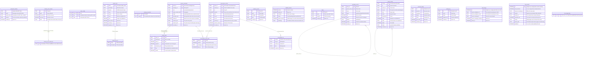

# Data model

A hosted workspace has one shared authority: its `OrchestratorAgent` Durable
Object. Nimbus runs over that object's `ctx.storage.sql` and owns the workspace
files and execution state. The workspace also keeps the roster, main's state,
shared ledgers and tool execution. No shadow VFS or file sync path runs between
agents.

Every non-main agent has an `AgentFacet` in a Worker Loader isolate, with its
own SQLite for conversations, turn and effect claims, and run events. Hired,
swarm and background agents use the same class and turn runner; their roster
rows remain in `workspace_actors` in the workspace database. A selected
scaffold row is handed to the facet before its turn, while the program's bytes
remain on the shared agent-state file plane. Export visits each retained
agent's database, including retired task agents. Only destruction wipes a
facet's storage.

Other Durable Objects in `wrangler.jsonc` keep databases of their own.
`UserDO` holds the per-user `user_*` and `device_*` tables and the owner's
`experience_library`; those belong to the user, not to a workspace.

Three stores sit outside actor SQLite:

- Browser auth: the `AUTH_KV` KV namespace.
- Sandbox `/workspace` backups: the `BACKUP_BUCKET` R2 bucket.
- Optional embedding recall: the `MEMORY_VECTORS` Vectorize index. It extends
  FTS5 and is never the source of truth.

`AUTH_KV` holds only expiring records, each with its own TTL: browser
sessions, one-time OAuth handoff state, and CLI browser-approval state. None of
it is a source of truth. A user's identity lives in their `UserDO`, keyed on a
userId derived from the verified email. If the namespace is emptied, every user
signs in again and nothing else is lost. The handoff record keeps the hash of a
binding cookie that the initiating browser holds, so a callback URL is useless
away from the browser that started that sign-in.

A session cookie's KV record is a projection. What the cookie stands for, and
whether it is still live, is one `user_browser_sessions` row in the user's own
`UserDO`. Sign-in writes that row once, and every cookie check reads it. KV can
take up to a minute to reach every colo in either direction, so it can answer
neither question. A copied cookie replayed at a lagging colo would outlive
logout by that window. The first request after a sign-in redirect would read as
signed out at a colo the write had not reached, and would start a sign-in that
loses the same race. The row answers both questions from every colo. Logout
deletes the row first. The KV delete that follows is cleanup, and a failed
cleanup never reports a completed revocation as failed.

A websocket that runs on a session keeps its hash and answers to the same row. Logout and a raised credential floor
close the sockets that named it, in every workspace (`closeRevokedSessionSockets`) and in the user's own `UserDO`,
where the roster's socket lives (`closeEndedRosterSockets`). A lapsed session announces nothing, so the roster asks the
row before each frame (`sendRosterFrame`) and closes a socket whose session has ended instead of sending to it.

When the store does not answer, the request gets a 503
(`packages/cf-backend/src/auth/session.ts`). It is never admitted, and it never
gets the 401 that would send a signed-in user to sign in again. A sign-out that
cannot reach the store keeps the cookie and offers a retry, because the cookie
is the only handle that can still revoke that session. A session whose row is
gone or lapsed is not signed in. A missing KV record alone is not a sign-out:
the row still says what the cookie stands for, and every path that ends a
session deletes the row first, so a missing record cannot revive a revoked
session. A record that no longer decodes is both a fault and a dead credential.
The Worker reports it once, clears it from the row and from KV, and answers as
not signed in (`discardCorruptSession` in `packages/cf-backend/src/auth/store.ts`).
The browser can then sign in again instead of staying behind a cookie it cannot
replace.

## Entity relationship

The core relational workspace tables, as the core schema initializers and the
agent-utils stores create them. Workspace files live in the Nimbus filesystem
described below. Most actor-scoped tables also carry `actor_id` as the first
primary-key column.

```mermaid
erDiagram
    workspace_identity {
        TEXT id "Stable UUID (NOT NULL)"
        TEXT name "Workspace name (NOT NULL)"
        TEXT owner_user_id "Ownership root (NOT NULL, default '')"
        TEXT mission "One-line summary, written by writeSoul"
        INTEGER created_at "Epoch ms"
    }
    workspace_actors {
        TEXT actor_id PK "Actor ID"
        TEXT parent_actor_id FK "Parent actor"
        TEXT name "Actor name"
        TEXT origin "system/user/agent/swarm/evolution"
        INTEGER tab "Has a chat tab"
        INTEGER input "Takes the owner's messages"
        TEXT lifetime "durable/task"
        INTEGER evolves "Feeds the evolution window"
        INTEGER created_at "Epoch ms"
    }
    actor_config {
        TEXT actor_id PK "Actor"
        TEXT key PK "Config key (model, reasoning effort, skills)"
        TEXT value "Config value (NOT NULL)"
    }
    memory_note_chunks {
        TEXT id PK "Chunk ID"
        TEXT path "Source file path"
        INTEGER start_line "Start line in source"
        INTEGER end_line "End line in source"
        TEXT hash "SHA-256 of the chunk's lines in the note"
    }
    memory_note_chunks_fts {
        TEXT text "Contentless FTS5 terms (BM25); the note holds the text"
    }
    memory_note_files {
        TEXT path PK "Note path"
        TEXT stamp "File identity when indexed; null until trusted"
    }
    crafted_tools {
        TEXT name PK "Tool name (snake_case)"
        TEXT description "What the tool does"
        TEXT params "JSON Schema for input"
        TEXT code "Async arrow function body"
        TEXT scope "local or shared"
        REAL score "EMA score (default 0.5)"
        INTEGER uses "Usage count (default 0)"
        INTEGER last_used_at "Epoch ms"
        INTEGER created_at "Epoch ms"
        INTEGER updated_at "Epoch ms"
    }
    crafted_tools_fts {
        TEXT name "FTS5 virtual table"
        TEXT description "FTS5 virtual table"
    }
    search_nodes {
        TEXT actor_id PK "Actor that owns the search"
        TEXT id PK "Node ID (nanoid)"
        TEXT parent_id FK "Parent node"
        TEXT root_id "The search run this node belongs to"
        TEXT task "Swarm task"
        TEXT action "Approach taken"
        TEXT observation "Result"
        INTEGER visits "Backprop count (default 0)"
        REAL value "Running mean score (default 0)"
        INTEGER depth "Tree depth"
        TEXT status "open/terminal/pruned/failed"
        INTEGER created_at "Epoch ms"
    }
    evolution_events {
        TEXT id PK "Event ID"
        TEXT type "Event type"
        TEXT message "Description"
        TEXT data "JSON payload"
        INTEGER created_at "Epoch ms"
    }
    scaffold_versions {
        INTEGER version PK "Version number"
        INTEGER written_at "Epoch ms"
        TEXT rationale "Why it was changed"
        TEXT status "current/pending/rolled_back/historical"
        INTEGER parent_version "DGM lineage, the version this branched from"
        TEXT pathology "The failure cell this version was written to fix"
    }
    fibers {
        TEXT id PK "Fiber ID"
        TEXT name "Fiber name (NOT NULL)"
        TEXT snapshot "JSON checkpoint"
        INTEGER created_at "Epoch ms"
    }
    session_messages {
        TEXT actor_id PK "Actor whose message this is"
        TEXT message_id PK "Message ID"
        TEXT role "user/assistant/system/tool"
        TEXT native_content_kind "string/parts"
        TEXT origin "input/output/edit/context_transform/render"
        TEXT envelope_json "Message fields other than role and content"
        INTEGER sealed_at "Epoch ms once the content is committed"
        TEXT content_json "The parts array, inline"
        TEXT content_path "The parts array in the file plane when large"
        INTEGER recorded_at "Epoch ms"
    }
    stream_parts {
        TEXT actor_id PK "Actor"
        TEXT message_id PK "Open message"
        INTEGER part_no PK "Part"
        INTEGER segment PK "Continuation row of a long part"
        TEXT descriptor_json "The part without its text"
        TEXT text "Accumulated text, extended in place"
        INTEGER ended "1 once the part's stream ended"
    }
    conversation_entries {
        TEXT actor_id PK "Actor whose conversation this is"
        TEXT session_id PK "Session ('default' is the chat)"
        TEXT id PK "Entry ID"
        INTEGER position UK "Place in the chat from 0; the chat is a list"
        TEXT role "user/assistant/system/tool"
        TEXT turn_id "Turn that wrote the entry"
        TEXT run_id "Run that wrote the entry"
        TEXT context_id "Working context the entry recorded"
        INTEGER context_revision "Revision of that context"
        INTEGER recorded_at "Epoch ms"
    }
    conversation_entry_parts {
        TEXT entry_id PK "Entry"
        INTEGER position PK "Order within the entry"
        TEXT message_id "Message whose part it shows"
        INTEGER part_no "Part of that message"
    }
    conversation_fts {
        TEXT content "Derived FTS5 transcript index"
        TEXT msg_id "Message ID"
        TEXT session_id "Session ID"
        TEXT role "Message role"
        INTEGER created_at "Epoch ms"
    }
    executor_output {
        TEXT id PK "Random hex ID"
        TEXT executor "Executor name"
        TEXT command "Command run"
        TEXT stdout "Standard output"
        TEXT stderr "Standard error"
        INTEGER exit_code "Exit code"
        INTEGER created_at "Epoch ms"
    }
    activity_log {
        TEXT id PK "Random hex ID"
        TEXT event "Event type"
        TEXT detail "Event details"
        INTEGER elapsed_ms "Duration (default 0)"
        INTEGER created_at "Epoch ms"
    }
    fork_lineage {
        INTEGER id PK "Single row, or empty when this is not a fork"
        TEXT source_workspace_id "The forked-from workspace's UUID"
        TEXT source_workspace_name "The forked-from workspace's name"
        TEXT source_message_id "Where the copy stopped"
        INTEGER source_message_created_at "Epoch ms"
        INTEGER forked_at "Epoch ms"
    }
    fork_transfer {
        INTEGER id PK "Single row, or empty when no fork is arriving"
        INTEGER head_declared "1 once a begin frame declared the fork"
        TEXT head_cut_message_id "Where the copy stops"
        TEXT mission "Read from the inherited SOUL.md bytes"
        TEXT transfer_id "The transfer these columns belong to"
        INTEGER expected_seq "The frame the receiver will accept next"
        TEXT stream "Rolling digest over the frames that arrived"
        TEXT import_path "The Nimbus import whose pages are still arriving"
        INTEGER published "1 once the commit published the fork"
    }
    fork_staged_files {
        TEXT path PK "SOUL.md, or an import this unpublished transfer opened"
    }

    workspace_actors ||--o{ workspace_actors : "parent_actor_id"
    memory_note_chunks ||--|| memory_note_chunks_fts : "contentless FTS5, one row per chunk"
    crafted_tools ||--|| crafted_tools_fts : "FTS5 sync triggers"
    session_messages ||--o{ stream_parts : "an open message's accumulating parts"
    conversation_entries ||--o{ conversation_entry_parts : "parts the entry shows"
    session_messages ||--o{ conversation_entry_parts : "message_id, part_no"
    conversation_entries ||--o{ conversation_fts : "local transcript index"
    search_nodes ||--o{ search_nodes : "parent_id"
```

## Agent identity (SOUL.md)

The identity document is `SOUL.md` in the workspace filesystem, on both
backends. `readSoul`, `writeSoul`, and `seedSoul` (`core/src/identity/soul.ts`)
are the accessors. The system prompt, the evolution engine, and the `setSoul`
RPC go through them. `writeSoul` also maintains `workspace_identity.mission`,
and a read-only listing reads the mission from that row. The owner may edit
SOUL.md. The agent never rewrites its own identity.

## The workspace filesystem

Both backends run the Nimbus workspace filesystem over their own SQLite. The
class is `SqliteVFS`, from `@nimbus-sh/core`. Nothing in this repository
implements a filesystem. Both backends build it with the same `createWorkspace`
(`core/src/vfs/nimbus-workspace.ts`, exported as `@kinu.run/core/workspace`).
On hosted, `cf-backend/src/workspace-host.ts` calls it over the orchestrator's
`ctx.storage.sql`, and `core/src/execution/nimbus.ts` maps the resulting
workspace box to Kinu's executor contract. On local, `cli-backend/src/runtime.ts`
imports it as `createWorkspaceFilesystem` and calls it over `bun:sqlite` in the
agent's own database (`~/.kinu/<name>/agent.db`). There it holds the agent's
state; the agent's own space is real files beside it and the project folder is
where it works (see "Local and cloud construction").

Nimbus owns those bytes and their tables. `core/src/conformance/manifest.ts`
declares the exact set; an addition means the dependency changed its storage
contract. At `@nimbus-sh/core` 0.14.0 the set is `vfs_state`, `vfs_inodes`,
`vfs_chunks`, `vfs_contents`, `vfs_content_chunks`, `vfs_inode_history`,
`vfs_gc_queue`, `vfs_jobs`, `vfs_snapshots`, `vfs_tombstones`,
`vfs_cold_trash`, the five `vfs_append_*_v2` tables, and
`nimbus_filesystem_identity`, `nimbus_filesystem_devices`,
`nimbus_storage_ledger`, `nimbus_storage_reservation` and
`nimbus_facet_storage`. `NimbusWorkspace.destroy()` drops the `vfs_*` tables
and keeps the `nimbus_*` ones. Kinu adds its own `kinu_workspace_generation`.
The manifest declares all of them present on every root (`cf-orchestrator`,
`cf-subordinate`, `cli`). On hosted, `@nimbus-sh/worker` 0.12.0 adds a
transform store in the workspace object, `nimbus_transform_results`,
`nimbus_transform_result_parts` and `nimbus_transform_store`, created by the
first hosted node launch that transforms a module, charged to the storage
ledger and bounded at 64 MiB.

Three properties follow:

- Content addressing: `vfs_inodes(path, content_id)` points at a
  `vfs_contents` row, whose `vfs_content_chunks` rows name `vfs_chunks` rows,
  unique by hash, so equal chunks are stored once; `vfs_gc_queue` collects
  what nothing names. A snapshot of the plane is one `vfs_snapshots` row that
  pins the history it names, whatever the tree's size; the Diffs baseline is
  one (`diffs:<actor>:<id>`).
- POSIX semantics: one filesystem, addressed the same way by
  `vfs.readFile('/etc/passwd')` and by `run "cat /etc/passwd"`. Relative paths
  resolve at the acting agent's home, its shell's working directory (main's is
  `/home/main`), and `..` resolves as POSIX resolves it, by Nimbus's namespace
  rule (`workspacePath`). Ownership is
  uid/gid/mode on inodes, so agent homes and private tmp trees remain enforced
  boundaries (`core/src/vfs/agent-home.ts`).
- Chunked blobs: `SqliteVFS` cuts file content into `vfs_chunks` rows of at
  most `CHUNK_SIZE` bytes, 65,536 as `@nimbus-sh/platform` declares it (one
  chunk up to that size, content-defined cuts above it). Merge-back
  sizes its write batches with the same constant, imported rather than
  restated (`core/src/strategy/merge-back.ts:60`).

### Workspace paths

A path is resolved once, as the acting agent's process names it, by Nimbus's
namespace rule (`normalizePath` in `@nimbus-sh/core/vfs/composite.js`):
relative names start at that agent's home, where its shell starts (`/home/main`
for main; a hired agent's or a node's own home otherwise, so its
`.kinu/tool-output` is its own), `.` and repeated separators collapse,
and `..` climbs as on Linux, so `../../tmp/x` is `/tmp/x`. What the path then
reaches is decided by what already governs it: uid and mode on the cloud
(the session user may write `/tmp`, as on any machine), and the approval gate
for a CLI path outside the bound directory. `/home/user` is Nimbus's link to
`/home/main`; the filesystem follows it. A slate's directory grant is judged
where its path lands, every link followed (`realpathAsync`).

From 2026-10-01 to 2026-10-02 (`3ce6a0d73`) a Kinu rule refused `..` above
`/home/main`, `/home/user` or `/slates` with `EACCES`. It was reversed because
filesystem semantics are Nimbus's: the refusal duplicated permissions and the
approval gate with a lexical check of its own, which a link defeats. The pin
is `cf-backend/tests/backends/workspace-paths.test.ts`: a path resolves as
POSIX resolves it on both backends.

`/home/user` remains only as `NIMBUS_WORKSPACE_ROOT`, a link to `/home/main`,
because Nimbus still produces these values with `HOME=/home/main` (measured
on 0.13.1; 0.14.0's runners still default to `/home/user`):

- `PATH=/usr/local/bin:/usr/bin:/bin:/home/user/.local/bin:/home/user/.gem/bin`
- `XDG_CONFIG_HOME=/home/user/.config`
- `XDG_DATA_HOME=/home/user/.local/share`
- `/etc/passwd`: `user:x:1000:1000:Nimbus User:/home/user:/bin/sh`

Delete the alias once Nimbus derives these from HOME. It is not a
stored-history compatibility period: current conversation payload paths
come from the actor's canonical artifact directory; archives carry native
inodes and relative transfer paths. Prompts render `WORKSPACE_ROOT`, while
their `/pc/<name>/home/user` examples name a machine's native home, not this
alias. Tests of Nimbus's live home link keep it; unrelated loopback and
memory fixtures and the scripted model name `/home/main`.

Every file plane implements Nimbus's `VFS`, imported directly from
`@nimbus-sh/core/vfs/vfs.js`, with `VfsStat`, `VfsDirent` and `VfsRevision`.
Reads and writes carry bytes; text callers use Nimbus's `readText` and
`writeText`. Directory listings carry dirents, with metadata when the plane
has it. `stat` returns null for an absent path, including an absent parent;
permission and transport failures still throw. An unavailable mount refuses
with `ENXIO`, rather than claiming a file is missing. Kinu retains only its
checkpoint write-report extension, not another filesystem interface. The
shell is Nimbus's `runtime-bash`. Memory indexing reads through the active
VFS on either backend, so `memory_note_chunks` never becomes a second authority.

One table named `vfs_files` still appears in the tree, in
`packages/cli/tests/export-import.test.ts`. The test creates it as a blob
fixture for the archive reader. No product path creates or reads it.

### Local and cloud construction

The owner's first local idea (m1290, 2026-09-15) was the cloud shape on a
laptop: a Nimbus workspace over `bun:sqlite` as the agent's whole world, with
the machine's working directory mounted at `/pc`. His later messages the same
day replaced it (m1326, m1328, m1329): the CLI is like oh-my-pi or pi, it runs
in the directory it was started in, and that machine is the workspace. The
Nimbus plane is the agent's own space for state, memory, slates and codemode.
The device runtime is a cloud concept; a local CLI registers no `device`
executor and needs no sandbox. m1705 (2026-09-24) asked which messages
overturned the single-SQLite local plane; these are they. On 2026-10-04 the
owner approved one story for both (design B): every workspace is its own space
plus the computer it works on, and locally everything is real files. The own
space is `~/.kinu/<workspace>/` (the directory `agent.db` is in), laid out as
the cloud tree (`home/<agent>`, `slates/`); before that a folder agent's
`/home/main` and `/slates` were the project folder itself.

Every local workspace works in the folder its ref records (`CLIRuntimeConfig.cwd` is required since 2026-10-04):
`kinu create` and `kinu import` record the folder they run in, and `resolveLocalAgent` refuses a workspace with no
folder, or one whose folder is gone; there is no adoption. Evals and fixtures bind a scratch folder.

| | Cloud (`cf-backend/src/runtime.ts`) | Local (`cli-backend/src/runtime.ts`) |
|---|---|---|
| Nimbus plane | `createWorkspace` over the Durable Object's `ctx.storage.sql` (`workspace-host.ts`) | `createWorkspace` over `agent.db`; holds agent state only, and runs no shell |
| `file` tool plane | the Nimbus plane | `localFilePlane` (`cli-backend/src/host-mount.ts`): every path is the machine's own; the own space's (`vfs://`, and core's `/home/main`, `/slates` and view paths) land in `~/.kinu/<workspace>/`, a relative one in the folder; past those two, writes keep the approval gate |
| Shell | Nimbus `runtime-bash` in the box (`nimbusSessionShell`) | the host shell rooted in the directory (`createHostShell`), behind the approval gate, with a shadow-git checkpoint at most once per turn before a command runs |
| Mounts on the file plane | `/pc`, `/sandbox`, `/skills`, `/shared` (Drive), `/context` | `/skills`, `/shared`, `/context`, `/agent`; `/shared` answers `ENXIO` without a Drive; `/pc` and `/sandbox` are native host paths, never device/container mounts |
| Mounts in the shell | the same table, through `mountedAuthority` | none: `/pc` in the host shell is the machine's own path |

File checkpoints have one engine, `core/src/checkpoints/engine.ts`. The CLI runs it (`cli-backend/src/checkpoints.ts`), and the device daemon carries a generated copy (`scripts/daemon-generated.ts`), so both take and restore snapshots by the same rules: no wall clock on git, one store operation at a time, a failed snapshot never blocks the mutation it precedes, and a write's workdir climbs from the entry itself and stops at the temp directory and the home folder. `cli-backend/tests/checkpoint-engine.test.ts` holds each rule on both hosts.

Both backends mount through one Kinu API: `withMountTable(base, mounts)`
(`core/src/vfs/mounts.ts`) gives the `file` tool its view.
`WorkspaceBundle.mountTable(plane, cred)` (`core/src/vfs/nimbus-workspace.ts`)
hands the same table to the shell, whose `MountedAuthority`
(`core/src/vfs/shell-mounts.ts`) extends Nimbus's `SqliteFilesystemAuthority`.
A mount is a `VfsMount`: a name, a `files()` read at every call, an absent
reason and an owner.

Nimbus's own `kernel.vfs.mount(path, provider)` is not used. Its
`MountProvider` (`substrate/lifo/kernel/vfs/types.d.ts` at `@nimbus-sh/core`
0.12.0) is synchronous: `readFile` returns bytes and `writeFile` returns
`void`. Every Kinu mount is a network hop (device tunnel, container, Mossaic
Drive) or a store read, so none can be a `MountProvider`. An async mount
contract in Nimbus would let Kinu hand the table to Nimbus and delete
`shell-mounts.ts`; no such contract exists at 0.12.0.

`agent-utils`'s old `SqliteFS` is gone: `agent-utils/src/vfs/` holds only the
`VFS` interface and path addressing (30 lines).

## MemoryStore (FTS5 search)

`@kinu.run/agent-utils` provides FTS5 full-text search over markdown files in
the workspace filesystem. The note is its text's only copy: the
`memory_note_chunks` table keeps each chunk's path, line range and SHA-256 hash,
and `memory_note_chunks_fts` is contentless (`content=''`,
`contentless_delete=1`), holding terms only. Both come from one DDL
(`initMemoryChunkTables`, which `MemoryStore.ensureSchema()` delegates to). Files
split into chunks with a line-aware sliding window (`DEFAULT_CHUNK_TARGET_CHARS`
1600, `DEFAULT_CHUNK_OVERLAP_CHARS` 320); the hash lets the next pass skip
unchanged chunks. Search is FTS5 MATCH with BM25 ranking, and each hit's snippet
is read from its note. `memory_note_files` stamps each indexed note with its
file identity: the backend's revision where its stat carries one, else inode,
size, mtime and ctime, git's racy-clean stat, so an edit that keeps its length
and its times (`touch -r`) still moves ctime. The cloud's SDK stat carries
ctime but no revision or inode (NIMBUS-ASKS #25). The stamp
is taken before the read and checked after; a note that changed in between is
read again, and one changed within two seconds of its stamp is kept unstamped,
so the next search reads it again. Before every search the notes under
`memory/` are listed and any whose stamp differs, or that has none (a shell
wrote it, edited it, or it came with an archive or fork), is re-chunked; a
stamped note that is gone, or is now a directory, link or FIFO, loses its
chunks unread. A read re-chunks a changed note too, and a hit whose lines no
longer hash is never served. An archive and a fork carry the
notes and no index: the target's first search builds it from them.
`sanitizeFtsQuery` removes operators and stop words. When the AND query
returns nothing, search falls back to OR-joined tokens.

## The canonical conversation store

Every actor's chat, root and hosted alike, on both backends, lives in one
relational store under `packages/core/src/session` (`SessionHistory`, built by
`createAgentStores` in `core/src/state/agent-stores.ts`). It has two layers:

- The messages: `session_messages` has one row per message the model read or
  produced (`role`, `origin`, `native_content_kind`, `envelope_json`). Its
  content is committed once as one parts array (`content_json`, or
  `content_path` plus digest in the actor's file plane above a size threshold)
  and `sealed_at` is stamped. A message inserted whole is sealed in its insert.
  A streamed answer accumulates in `stream_parts`, one row per open part
  segment, extended in place by windows of deltas, and seals once at the end of
  its step. The seal deletes the stream rows. A reader folds the stream rows of
  an open message and reads the content row of a sealed one.
- The conversation: `conversation_entries` is the public chat, a list (`id`,
  `position`, `role`, `turn_id`, `run_id`, `recorded_at`, and the working
  context the entry recorded), keyed by actor and session. `default` is the
  chat. `conversation_entry_parts` references the message parts each entry
  displays. An entry appends at the next position, so the newest position + 1
  is the chat's length, and a page is one range read by position. A walk-back
  deletes the entry it names and everything after it
  (`SessionHistory.revertTo`). A fork carries the chat up to the cut:
  `ForkTargetWriter` (`identity/fork-writer.ts`) stages it, then publishes it in
  one transaction.

The working context sits beside the chain. `actor_contexts`,
`context_revisions`, `context_memberships`, and `actor_context_selection`
record which messages the model reads at each revision, and
`context_proposals` holds edits staged against it. The owner or the actor reads
and edits them through the `/context` mount (`vfs/context-plane.ts`).

Every model request leaves evidence in `actor_requests`: one row for a turn's
admission, then one row per step. An admission's messages are the working
context revision it was admitted at. A step's messages are a revision of the
actor's `requests` context, which nobody selects and which is stored in the
same interval rows (`context_memberships`); `request_renders` names that
revision. So a step writes only the positions that changed since the previous
request. A message the step pipeline made or rewrote (a woven block, replayed
tool-call ids, cache markers) is one `render` row, named by the SHA-256 of its
stored bytes, however many requests carry it. `SessionRequests`
(`session/requests.ts`) owns this; a step without its list is an `io`
integrity error.

Readers answer from the entries: the chat pane's page walk
(`getChatHistoryPage` in `read-models/status.ts`, over `session/page.ts`),
`memory/conversation-search.ts` (`scroll`, `browse`, and the FTS index keyed
on entry rowid), the inherited context a spawned head receives
(`orchestrator/heads-support.ts`), the evolution joins, and the export. The
Agents SDK's `assistant_messages` is the SDK's own table, and Kinu neither
writes nor reads it. The `/get-messages` seed a reconnecting tab receives is
projected from the canonical entries (`cf-backend/src/actor-agent.ts`).
`gate:vendor-schema` (`scripts/vendor-schema.ts`) prepares every Kinu
statement over a vendor-created table against the installed vendor's DDL, so
the gate catches a bad read of a vendor table before runtime does.

## The rest of the schema

The ER diagram covers the shared actor substrate. Every other subsystem owns
its own DDL, all of it `IF NOT EXISTS`, all of it run from the same
`initWorkspaceSchema()` pass. The main groups:

| Subsystem | Tables | Owner |
|---|---|---|
| Events hub | `agent_log`, `reply_channels`, `triggers` | `core/src/events/hub/schema.ts` |
| Run-event log | `run_events` | `core/src/events/recorder.ts` |
| Turn ratings | `turn_ratings` | `core/src/evolution/ratings.ts` |
| Struggles and tool lessons | `turn_struggles`, `tool_lessons` | `core/src/evolution/struggles.ts` |
| Lessons | `lessons`, `pattern_extractions` | `core/src/evolution/lessons.ts` |
| Refinement | `refinement_requests` | `core/src/evolution/refinement.ts` |
| GEPA | `gepa_runs`, `gepa_candidates` | `core/src/evolution/gepa/persistence.ts` |
| Branching heads | `head_runs`, `head_journal`, `head_evidence`, `head_steps`, `head_merge_results` | `core/src/heads/schema.ts` |
| Swarm search | `search_nodes`, `mcts_search_runs` (durable checkpoints) | `core/src/mcts/schemas.ts`, `search-store.ts` |
| Alternate takes | `alternate_takes` (a settled `/branch` redirect) | `core/src/mcts/takes.ts` |
| Swarm leaderboard | `exploration_records` (cumulative across runs) | `core/src/strategy/records.ts` |
| Swarm node content | `swarm_node_records` (what a swarm re-entry reads) | `core/src/strategy/swarm-resume.ts` |
| Live trials | `artifact_trials`, `trial_turns` | `core/src/evolution/trials.ts` |
| Turn lifecycle | `actor_turn_claims` and the session tables above | `core/src/orchestrator/actor-claims.ts` |
| Once-only effects | `tool_effect_claims`, `effect_tombstones` | `core/src/tools/effect-claim.ts`, `core/src/identity/effect-tombstones.ts` |
| Facts | `agent_facts`, `agent_fact_history` | `core/src/memory/facts.ts` |
| Account memory (user object) | `agent_facts`, `agent_fact_history` under `ACCOUNT_FACTS_ACTOR`, `account_notes`, `account_memory_proposals` | `core/src/memory/account.ts`, `cf-backend/src/user/account-memory.ts` |
| Conversation search | `conversation_fts` (derived FTS5 index) | `core/src/memory/conversation-search.ts`, created by the store on first use |
| Background jobs | `background_jobs` | `core/src/jobs/store.ts` |
| Task list | `agent_tasks` (one plan per actor; note and plan link are columns) | `core/src/tools/task-store.ts` |
| Approvals | `deferred_approvals`, `device_consent_requests`, `instruction_approvals`, `workspace_proposals` | `core/src/safety/deferred-approval.ts`, `device-consent.ts`, `instruction-trust.ts`, `workspace-proposals.ts` |
| Plan review | `plan_reviews` | `core/src/plans/review.ts` |
| Curriculum | `proposed_tasks` | `core/src/curriculum/proposer.ts` |
| Imported experience | `imported_experience` (staged until a turn outcome settles it) | `core/src/experience/imports.ts` |
| Compaction | `compaction_state`, `compaction_archive` | `core/src/state/workspace-schema.ts` (the DDL lives in core because `@kinu.run/compaction` sits above it in the dependency graph) |
| Typed config | `actor_config` | `core/src/config/store.ts` |
| Evolved text (prompt sections, tool descriptions and field text) | `artifact_versions` | `core/src/evolution/artifacts.ts` |
| Slates | `slates`, `slate_versions`, `slate_publications` and the other `slate_*` tables | `core/src/state/workspace-schema.ts`, `core/src/slates/` |

These are created outside that pass, by the root that owns each:

| Subsystem | Tables | Owner |
|---|---|---|
| Subordinate roster | `actor_subordinates` (every actor that can hire) | `core/src/subordinates/roster.ts` |
| Orchestrator-local | `sleep_time_updates`, `turn_craft_usage` | `cf-backend/src/orchestrator.ts`, inline |
| Webhook ingress (cf only) | `webhook_rate_windows`, `webhook_replay_claims`, `webhook_secrets` | `core/src/events/ingress/webhook.ts` (`initWebhookIngressTables`), `rate-limit.ts`, `secrets.ts` |

Two tables are created lazily: `completed_turns` by the `EvolutionEngine`
constructor (`initCompletedTurnTable`), and `mission_budget` by
`MissionBudgetLedger` (`core/src/mission-budget.ts`).

Two durable retry outboxes are lazy too. `@nimbus-sh/fabric` creates them on
the first queue or drain: `outbox_peer` for the peer transport and
`outbox_email` for outbound mail. Their schema belongs to the library.
`core/src/events/outbox.ts` supplies the SQL handle and the alarm.

`core/src/conformance/manifest.ts` declares every table per root
(`cf-orchestrator`, `cf-subordinate`, `cli`) as wired, lazy, or absent with a
stated reason. The conformance suite compares that declaration with the real
`sqlite_master`. The manifest is the complete list; this page describes it.

## Schema initialization

`initWorkspaceSchema()` (`core/src/state/workspace-schema.ts`) is the one
answer to which tables a workspace has. Every workspace root calls it: the
orchestrator DO's constructor, `openWorkspaceCLI`, the local session
constructor, and `kinu create`. A local facet session calls only the actor
half, `initActorStateSchema()`. One list, because parallel lists drift
apart and each drift is a bug: a table created only by `kinu create` is
missing on a workspace opened any other way, and every read of it fails or
silently does nothing.

The pass runs in this order:

1. `initWorkspaceOwnershipTables` (`core/src/identity/schema.ts`):
   `workspace_identity`, `fork_lineage`, `fork_transfer`, and
   `fork_staged_files`. Then `initWorkspaceActorTable` (`workspace_actors`).
2. `initActorStateSchema`: `initActorTables` (the actor substrate plus
   `initSearchTables`, `initScaffoldTables`, and `initCraftedToolsTables`),
   then each subsystem's own `init*` from the tables above, ending with
   `initMemoryChunkTables`.
3. The slate tables.

Then each root adds what only it carries. The orchestrator DO also runs
`initWebhookIngressTables`,
`subordinateRoster.ensureSchema()`, and its inline turn tables. An in-memory
flag makes the whole call run once per activation. No persistent schema
version is tracked, because a cold activation always re-runs it.

Each table has exactly one owning module. A second definition of
`search_nodes` is how `code_language` went missing on a live workspace. A
second `scaffold_versions` is how `status` and `parent_version` did.

A table's `CREATE TABLE IF NOT EXISTS` is its genesis. No module carries a
column reconcile, a `CHECK`-widening rebuild, or a row backfill. This tree
deploys as a reset (docs/DEPLOYMENT.md, the migrations paragraph), so every
row it writes is under the DDL in the tree. `scripts/schema-drift.ts` holds
that DDL to `scripts/schema-genesis.lock.json` in both directions. A shipped
table whose shape must change has two fixes: a new table of its own for the
new columns, or another reset with a re-lock.
